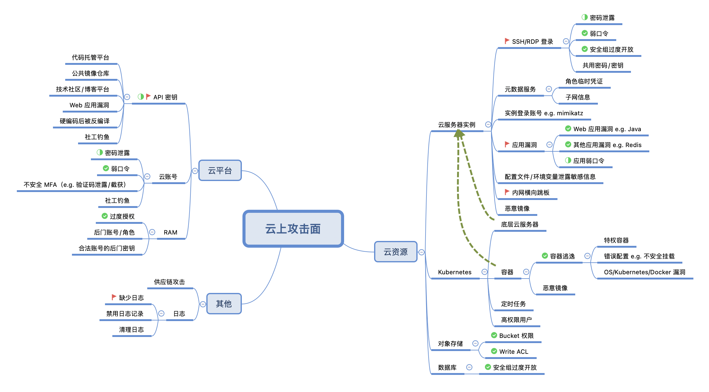
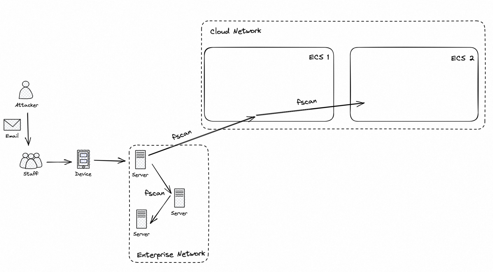

工作中一次分享的 Slide Notes。

<!--more-->

## 云计算的 11 类顶级威胁

1. 身份、凭据，访问和管理密钥、特权账号管理的不足
2. 不安全的接口和 API
3. 配置不当和变更控制的不足
4. 缺乏云安全架构和战略
5. 不安全的软件开发
6. 不安全的第三方资源
7. 系统漏洞
8. 云计算数据的意外泄露
9. 无服务器和容器化工作负载的配置不当和利用
10. 有组织的犯罪、黑客和 APT 攻击
11. 云存储数据泄露

Ref: [https://www.c-csa.cn/u_file/photo/20220803/587b51c84a.pdf](https://www.c-csa.cn/u_file/photo/20220803/587b51c84a.pdf)

### 特点

- 攻击面更广：云资源、云平台
- 攻击复杂度更高：虚拟化、容器化、Serverless、资源共享

## 云上攻击面概览

## 云上攻防矩阵

| 初始访问                     | 执行                        | 持久化                     | 权限提升                 | 防御绕过         | 窃取凭据                   | 探测       | 横向移动                       | 影响     |
| ---------------------------- | --------------------------- | -------------------------- | ------------------------ | ---------------- | -------------------------- | ---------- | ------------------------------ | -------- |
| 实例登录信息泄露             | 通过控制台登录实例执行      | 利用远控软件               | 通过访问管理提权         | 关闭安全监控服务 | 获取实例登录账号           | 云资产探测 | 使用实例账号爆破               | 数据窃取 |
| 网络钓鱼                     | 写入  userdata              | 在  userdata  中植入后门   | 利用应用程序提权         | 监控区域外攻击   | 元数据服务获取角色临时凭据 | 网络扫描   | 窃取凭据访问云服务             | 数据破坏 |
| 应用程序漏洞                 | 利用后门文件                | 导入后门镜像               | 创建高权限角色           | 禁用日志记录     | 用户敏感数据泄露           | 实例元数据 | 接管控制台后访问云资源         | 资源劫持 |
| 使用恶意镜像                 | 利用应用程序漏洞执行        | 给现有用户分配额外密钥     | 利用操作系统漏洞提权     | 清理日志         | 应用凭证泄露               |            | 内网扫描后利用内网主机应用漏洞 | 拒绝服务 |
| 前端直传功能获取对象存储凭据 | 利用  SSH/RDP  登录实例执行 | 建立辅助账号登录           | 利用特权容器提权         | 通过代理访问     | 云服务凭证泄露             |            | SSH/RDP  共用密码/密钥         | 加密勒索 |
| 实例元数据服务未授权访问     | 使用云  API  执行           | 在云函数中植入后门         | 利用错误容器配置提权     |                  |                            |            | 容器逃逸                       |          |
| 云平台账号非法登录           | 使用云厂商工具执行          | 通过容器逃逸向宿主机写文件 | 利用操作系统漏洞容器逃逸 |                  |                            |            | 窃取用户账号攻击其他应用       |          |
| 云平台主  API  密钥泄露      |                             | Kubernetes  定时任务       | 利用  Kubernetes  漏洞   |                  |                            |            |                                |          |
|                              |                             | 在对象存储中植入后门       | 利用  Docker  漏洞       |                  |                            |            |                                |          |
|                              |                             | 供应链攻击                 | 创建高权限用户           |                  |                            |            |                                |          |
|                              |                             |                            | 利用  Write ACL  提权    |                  |                            |            |                                |          |

## 初始访问

### 云平台主 API 密钥泄露

- 代码托管平台（GitHub、Gitee、...）
- 公共镜像仓库（DockerHub、...）
- 技术社区、博客平台（贴源代码时保留凭据）
- Web 应用漏洞（e.g. Springboot Actuator 信息泄露漏洞）
- 硬编码后被反编译（前端代码、jar、apk、小程序、...）
- 社工钓鱼

其他泄露方式类似：云平台账号密码、实例登录密码、…

### 其他方式

1. 访问公开的 Bucket（-> AK） -- 云平台配置检查、Bucket 权限配置
1. 访问实例本身（->实例元数据）-- 安全组白名单
   1. 登录凭证泄露 -- 更换登录凭证
   2. 登录弱口令 -- 口令修改、基线检查
   3. 恶意镜像 -- 检查镜像完整性、安全扫描
1. 访问 Web 应用（->实例）
   1. Web 应用漏洞 -- 漏洞修复、低权限用户运行
   2. 应用弱口令 -- 口令修改
1. 访问云平台（->其他云资源）
   1. 账号密码泄露 -- 更换密码
   2. 验证码泄露/截获 -- MFA

## 执行

### API 密钥

1. 使用云 API 执行
1. 接管控制台后，通过控制台执行
1. 利用云厂商工具
   1. 管理工具客户端：OSSBrowser、Alibaba Cloud Client、…
   2. 命令行工具：[aliyun-cli](https://github.com/aliyun/aliyun-cli)
   3. SDK：Python、Java、Go、…
   4. CloudShell
1. 使用 AK 利用工具，如 [cf](https://github.com/teamssix/cf)
   1. 云安全中心存在对应紧急告警
   2. 接管控制台创建 **crossfire** 用户

### 其他方式

1. 通过控制台登录实例执行
1. 写入 userdata 执行
1. 利用后门文件执行
1. 利用应用漏洞执行
1. SSH/RDP 登录实例后执行

> 注：userdata，或称之为实例自定义数据/实例用户数据，其中写入的内容会在实例启动时被执行：
> 

## 持久化

1. 利用远控软件
1. 写入 userdata
1. 导入后门镜像
1. 给现有用户分配额外密钥
1. 建立辅助账号（云平台账号、数据库账号、…）登录
1. 在云函数中植入后门
1. 在对象存储中植入后门
1. 通过容器逃逸向宿主机写文件
1. Kubernetes 定时任务
1. 供应链攻击

解决方法：检查上述项中是否存在后门

## 权限提升

1. 通过访问管理提权 -- 云平台配置检查
   1. 由于错误配置，接管的子账号自身具有修改访问控制策略的权限
1. 利用应用程序漏洞提权（e.g. 容器逃逸） -- 漏洞修复
1. 创建高权限角色 -- 云平台配置检查
1. 利用操作系统漏洞提权 -- 操作系统漏洞扫描、修复
1. 容器相关
   1. 利用特权容器提权 -- 避免使用特权容器
   2. 利用错误容器配置（e.g. 不安全挂载）提权 -- 检查容器配置
   3. 容器逃逸（利用 OS/Kubernetes/Docker 漏洞） -- 漏洞修复
   4. 创建高权限 Kubernetes 用户（类似 3）
1. 利用 Write ACL 提权（类似 1） -- 云平台配置检查

## 防御绕过

1. 关闭安全监控服务
1. 监控区域外攻击 -- 确保监控区域覆盖
1. 禁用日志记录
1. 清理日志 -- 日志投递/备份
1. 通过代理访问

## 窃取凭据

1. 获取实例登录账号（e.g. mimikatz 抓取 Windows 凭证）
1. 元数据服务获取角色临时凭据 -- 加固模式
1. 读取配置文件/环境变量中的敏感信息（应用凭证/云服务凭证）
1. 读取应用/数据库中的用户数据

### 通过实例元数据服务获取角色临时凭据

详见 [Terraform Goat 初探：通过 ECS 实例元数据服务获取 RAM 角色临时凭据](/posts/terraform-goat-metadata-sts)

## 探测

1. 调用云 API 进行资产探测（e.g. DescribeInstances）
1. 云上/云外网络扫描（e.g. fscan）
1. 实例元数据获取子网信息等 -- 加固模式

## 横向移动

1. 使用实例账号爆破（枚举资产名）
1. 利用 AK/STS Token 等凭据访问其他云资源 -- 最小特权
1. 接管控制台后访问其他云资源
1. 内网扫描后利用内网主机应用漏洞 -- 非关联业务间尽可能隔离
1. SSH/RDP 共用密码/密钥致横向移动 -- 避免共用
1. 容器逃逸 -- 容器正确配置、漏洞修复
1. 窃取用户账号攻击其他应用（e.g. 云外应用）

## 影响

1. 数据窃取
1. 数据破坏
1. 资源劫持（e.g. 利用 CPU 资源挖矿）
1. 加密勒索
1. 拒绝服务

## 实际客户案例

- 初始访问： 利用 Web 应用漏洞获取容器命令执行权限
- 执行：
  - 利用应用漏洞执行（反弹 shell）
  - 利用后门文件执行（下载牧云远控工具）
  - （获取 STS Token 后）利用 cf 工具执行
- 持久化：
  - 利用远控软件
  - 建立辅助账号 crossfire 登录
- 权限提升：尝试容器逃逸
- 防御绕过：无
  - 例：可以清除容器内的 Web 日志
- 窃取凭据：元数据服务获取角色临时凭据
- 探测：
  - 调用云 API
  - fscan 扫描 Pod 内其他容器
- 横向移动：利用 STS Token 访问其他云资源
- 影响：无（及时止血）

## 常见攻击入口/配置问题

根据过往经验，应急事件常常由以下配置问题引发：

- Web 应用漏洞
  - Java 应用漏洞
    - 主流 Java 框架：Shiro, Fastjson, Log4j, Jenkins, Spring Boot, Tomcat, Dubbo, Druid, Swagger...
    - RuoYi
    - XXL-Job
  - 其他应用漏洞
    - UEditor
    - 国产 OA
    - 文件上传漏洞
    - 业务逻辑漏洞
  - 应用后台弱口令
- AK 泄露
  - 闲置 AK 未被禁用
  - 使用主账号 AK
  - 组件信息泄露漏洞，如 [Spring Actuator](https://avd.aliyun.com/detail?id=AVD-2022-1039511)、[Nacos](https://avd.aliyun.com/search?q=Nacos) 等
- 重要端口对公网开放
  - SSH/RDP/Redis/Docker 最多
- 弱口令
  - SSH/RDP/Redis/Jenkins/SQLServer/应用后台管理员 弱口令最多
  - 其他服务包括 RDS、Oracle、VPN 账号、域用户等
  - 变体：多台服务器共用密码/密钥
- 缺少日志
  - WAF 日志
    - 无 WAF
    - 日志未开启
    - 域名未接入
    - 未开启源站保护（攻击者可不经过 WAF 直接访问源站）
    - 日志记录不完整，如未记录 POST Body
    - 日志容量不足导致过往日志被覆盖，影响排查
  - Web 访问日志
  - Redis 日志
