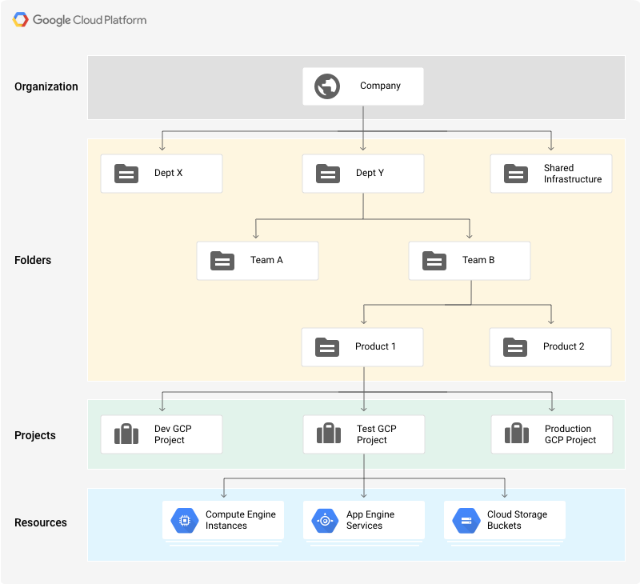
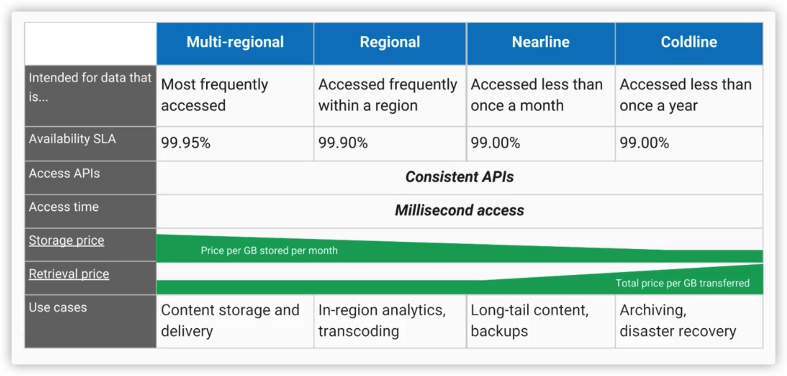
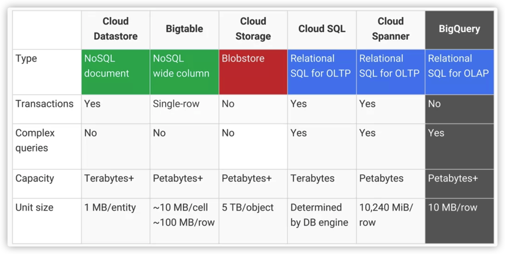
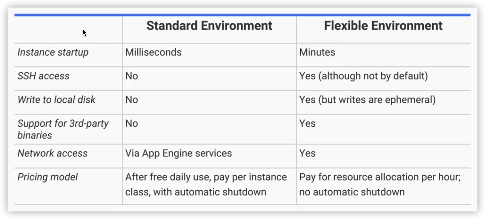
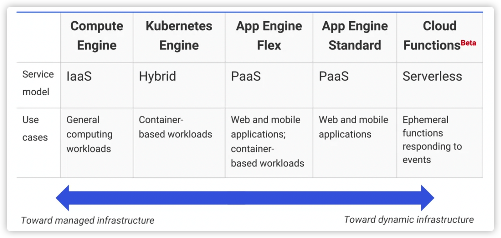
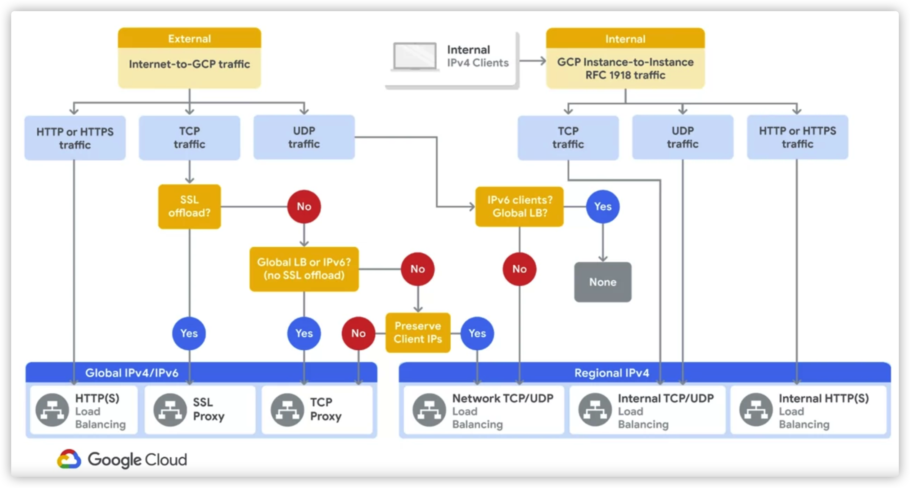

待更新。

<!--more-->

## 云计算是什么？

1. 可以在任何时间自助地获取计算资源，无需人工干预；
2. 可以在任何地点访问这些计算资源；
3. 云服务商拥有计算资源池，并从池中分配资源给用户；
4. 计算资源可以弹性收缩；
5. 按量计费，停止使用即停止收费。

## GCP 地域和区域

地域（Zone）是一块 GCP 资源的部署区，不过不一定是一个类似数据中心的单一的建筑。若干个地域组成了区域（Region），同一区域内的不同地域之间网络通信速度极快。可以认为，一个地域就是一个区域内的故障域。为了提高容灾性能，可以进行多地域部署。

更进一步，为了防止类似自然灾害等不可抗力造成的数据损失，还可以进行多区域部署（区域之间至少相隔 160 km）。

## GCP 资源层级树



每个 GCP 计算资源（Resource）属于且仅属于一个项目（Project）。若干个项目可以组成文件夹（Folder），而文件夹通过层级树结构（和文件系统类似）从属于一个组织（Organization）。创建文件夹和组织并不是必须的，但创建文件夹前需要先创建组织。

### Project 标识符

| 标识符         | 唯一性   | 标识符来源 | 可变性 |
| -------------- | -------- | ---------- | ------ |
| Project ID     | 全局唯一 | 用户可指定 | 不可变 |
| Project name   | 无需唯一 | 用户可指定 | 可变   |
| Project number | 全局唯一 | GCP 分配   | 不可变 |

## IAM 策略

IAM 策略规定了：

- 谁
- 对哪些资源
- 可以做什么

其中，“谁” 部分可以针对：

- Google 账号
- Google 群组
- 服务账号
- G Suite
- Cloud Identity Domain

“对哪些资源” 部分比较简单，就是上面提到的任何资源节点（Resource / Project / Folder / Organization, etc.）。

“可以做什么” 部分由 IAM 角色定义。 IAM 角色是一系列权限的集合，可以分为三种角色：

- Primitive Role 只能应用到整个 Project，分为 Owner / Editor / Viewer / Billing administrator 四个角色，所拥有的权限显而易见；
- Predefined Role 是 GCP 服务中预定义的一些角色，可以应用到 Resource / Project / Folder / Organization 层甚至是某个资源实例上，粒度更细。
- Custom Role 只能应用到 Project 或 Organization，由用户自定义，粒度较 Predefined Role 更细。

如果要授予权限给某个计算资源而不是一个用户，就需要针对该计算资源创建一个服务账号，将权限授予该服务账号。同时，服务账号本身也是一种 GCP 资源，因此 IAM 策略也可以应用到服务账号上，实现对服务账号本身的管理。

### 策略继承

IAM 策略可以应用到任何资源节点，并且会自顶向下继承。比较反直觉的是，当顶层策略和底层策略冲突时，两者中更宽松的策略会生效。

- 🌰 1️⃣
  - Project 层策略规定某用户对某资源拥有修改权限
  - Organization 层策略规定该用户对该资源仅拥有读取权限
  - 前者更宽松，因此生效
- 🌰 2️⃣
  - Project 层策略规定某用户对某资源拥有修改权限
  - Resource 层策略规定该用户对该资源仅拥有读取权限
  - 前者更宽松，因此生效

可以看到，发生冲突时，一个 IAM 策略是否生效与其所在层级无关，仅与其是否更为宽松有关。

## 云上虚拟机

### Virtual Private Cloud Network

VPC 用于在虚拟机（Compute Engine）之间构建网络，例如进行网段划分、防火墙设置、静态路由设置等。值得注意的是，VPC 是全局资源，是可以跨区域的，而 VPC 中创建的子网也可以跨地域。

类似物理网络，VPC 会维护一个路由表用于在虚拟机之间寻找路由，VPC 之间也可以互联。此外，VPC 还提供了分别针对区域内、外部流量的负载均衡、DNS 服务、CDN 服务等等。

### Compute Engine 实践

1. 在 Compute Engine 里创建新的 VM instance，命名为 my-vm-1，允许 HTTP 入站流量。
2. 由于 my-vm-1 在 `us-central1-a` 地域中，我们在 Cloud Shell 中查找同区域内有哪些地域：

```bash
gcloud compute zones list | grep us-central1
```

3. 随意选一个不同的地域，例如 `us-central1-b`，并修改当前地域：

```bash
gcloud config set compute/zone us-central1-b
```

4. 创建第二个虚拟机：

```bash
gcloud compute instances create "my-vm-2" \
--machine-type "n1-standard-1" \
--image-project "debian-cloud" \
--image-family "debian-10" \
--subnet "default"
```

5. 退出 Cloud Shell，SSH 到 my-vm-2，然后 ping 一下 my-vm-1，注意主机名：

```bash
ping my-vm-1.us-central1-a
```

6. 在 my-vm-2 上连接 my-vm-1：

```bash
ssh my-vm-1.us-central1-a
```

7. 在 my-vm-1 里上线一个网页并测试：

```bash
sudo apt-get install nginx-light -y
sudo vim /var/www/html/index.nginx-debian.html
curl http://localhost
```

8. 退出 SSH 回到 my-vm-2，访问 my-vm-1 上的网页：

```bash
curl http://my-vm-1.us-central1-a/
```

## 云上存储

### Cloud Storage

常见的对象存储，上传文件，返回一个唯一的 URL。上传的文件按桶（bucket）组织，一旦上传便不可修改（但可以更新），访问权限则由 Cloud IAM 或更细粒度的 ACL 来控制。



### Cloud Bigtable & Cloud Datastore

Cloud Bigtable 提供存储大量数据的 NoSQL 数据库服务，因为采用 key-value 对存储所以也可以当持久化的哈希表来用。可以通过开源的 HBase API 访问，因此也兼容 Apache Hadoop 生态。

Cloud Datastore 则是应用特化型的 NoSQL，区别主要在于对交易和类 SQL 查询的支持。当然，最重要的是有每日免费用量。

### Cloud SQL & Cloud Spanner

Cloud SQL 提供基于 MySQL 或 PostgreSQL 的 SQL 数据库服务，并配有冗余备份、容灾恢复等功能。而 Cloud Spanner 则可以认为是高配版的 Cloud SQL，在数据一致性和可用性方面都更优秀。

### 对比



BigQuery 主要用于数据处理而不是数据存储，会在下文介绍。

### Cloud Storage & Cloud SQL 实践

1. 在 Compute Engine 里创建新的 VM instance，命名为 blogpost，允许 HTTP 入站流量，并在启动脚本中安装服务器：

```bash
apt-get update
apt-get install apache2 php php-mysql -y
service apache2 restart
```

2. 在 Cloud Shell 中创建 Cloud Storage，注意 bucket 名称需要唯一，可以用 Project ID 来确保这一点：

```bash
gsutil mb -l US gs://$DEVSHELL_PROJECT_ID
```

3. 从另一个桶中复制一张图片到 Cloud Shell：

```bash
gsutil cp gs://cloud-training/gcpfci/my-excellent-blog.png my-excellent-blog.png
ls
```

4. 从 Cloud Shell 复制图片到新创建的桶：

```bash
gsutil cp my-excellent-blog.png gs://$DEVSHELL_PROJECT_ID/my-excellent-blog.png
```

5. 检查是否成功：

```bash
gsutil ls gs://$DEVSHELL_PROJECT_ID
```

6. 在控制台创建和 blogpost 同区域的 Cloud SQL，命名为 blog-db，并设置 root 密码；创建完毕后，新建一个用户，设置用户名和密码。
7. 接下来，要让我们的 blog-db 只能被 blogpost 访问。为此，先查看 blogpost 的公网 IP，然后在 blog-db 配置面板的 Connections 选项卡里新建一个 Authorized Network，并填入这个 IP。由于要求 CIDR 格式而我们只想要单个机器能访问，填入 `x.x.x.x/32` 即可。
8. 随后要让 blogpost 去使用 blog-db。SSH 到 blogpost，编写 `/var/www/html/index.php`：

```php+HTML
<html>
<head><title>Welcome to my excellent blog</title></head>
<body>
<h1>Welcome to my excellent blog</h1>
<?php
 $dbserver = "CLOUDSQLIP";
$dbuser = "blogdbuser";
$dbpassword = "DBPASSWORD";
// In a production blog, we would not store the MySQL
// password in the document root. Instead, we would store it in a
// configuration file elsewhere on the web server VM instance.
$conn = new mysqli($dbserver, $dbuser, $dbpassword);
if (mysqli_connect_error()) {
        echo ("Database connection failed:" . mysqli_connect_error());
} else {
        echo ("Database connection succeeded.");
}
?>
</body></html>
```

9. 重启 apache2，访问 blogpost 的公网 IP，检查数据库连接。
10. 接下来把之前那张图片加到网站上。在控制台 Storage -> Cloud Storage -> Browser 里找到图片，勾选 `Share publicly` 从而获得一个 URL（或者运行下面的命令）。随后在原来的 html 里插入图片即可。

```bash
gsutil acl ch -u allUsers:R gs://$DEVSHELL_PROJECT_ID/my-excellent-blog.png
```

11. 重复第 9 步。

## 云上容器

也就是 Google Kubernetes Engine，后面单独开篇博客写。

## 云上应用

在 Compute Engine 中，用户自己选择虚拟机作为运行应用的基础设施；到了 Kubernetes Engine，这个基础设施变成了容器。但如果我们只是想快速部署一个应用，根本不想关心基础设施呢？这就是 App Engine 的作用。

App Engine 提供了类似 NoSQL 数据库、负载均衡、日志记录、用户认证、自动伸缩等服务，用户只需要关心业务代码、以及如何在代码中调用这些服务。在 Standard 模式中，因为提供了免费日限额，只要应用流量不太大就相当于永久免费使用 App Engine 服务。

Standard 模式运行在沙箱中，因此存在一些限制：

- 不能向文件系统写文件，数据持久化必须通过数据库
- 任意网络请求最大超时时间为 60 秒
- 安装第三方软件也会受到限制

不过，Standard 模式只支持 Java、Python、PHP 和 Go 的 SDK，其他语言则需要使用 Flexible 模式。

Flexible 模式不受沙箱限制，因为这种模式实际上是在 Compute Engine 上运行用户自定义的容器。这会导致启动速度变慢，但应用对底层的访问更宽松，当然价格上也不存在免费额度了。



### App Engine 实践

1. 克隆示例应用：

```bash
git clone https://github.com/GoogleCloudPlatform/appengine-guestbook-python
cd appengine-guestbook-python
```

2. 在 `app.yaml` 中存储了应用的部署配置，可以先在本地运行起来测试下：

```bash
dev_appserver.py ./app.yaml
```

3. 用 Cloud Shell 的 Preview 功能查看应用。
4. 确认没有问题后进行部署：

```bash
gcloud app deploy ./index.yaml ./app.yaml
```

## 云上开发、部署与监控

### 云上开发

- Cloud Source Repositories，也就是 GCP 中的 Git Repositories，优势在于和 GCP Project 以及其他产品的融合
- Cloud Functions，也就是 GCP 中的云函数，这种方式目前可以说是对一个应用而言最高层面的抽象
- Cloud Endpoint，也就是 GCP 中用于维护 API 的服务



### 云上部署

- Deployment Manager 提供了声明式的方式来设定部署环境，有点像 Kubernetes deployment，也可以把设定文件放在 Cloud Source Repositories 里

### 云上监控

- Stackdriver 用于监控云上资源，没有发现什么有特色的地方？

### 云上部署与监控实践

1. 准备环境，下载 Deployment Manager 的模版：

```bash
export MY_ZONE=us-central1-a
gsutil cp gs://cloud-training/gcpfcoreinfra/mydeploy.yaml mydeploy.yaml
```

2. 替换模版中的字段：

```bash
sed -i -e "s/PROJECT_ID/$DEVSHELL_PROJECT_ID/" mydeploy.yaml
sed -i -e "s/ZONE/$MY_ZONE/" mydeploy.yaml
```

3. 最终模版大约是这样的：

```yaml
resources:
  - name: my-vm
    type: compute.v1.instance
    properties:
      zone: us-central1-a
      machineType: zones/us-central1-a/machineTypes/n1-standard-1
      metadata:
        items:
          - key: startup-script
            value: "apt-get update"
      disks:
        - deviceName: boot
          type: PERSISTENT
          boot: true
          autoDelete: true
          initializeParams:
            sourceImage: https://www.googleapis.com/compute/v1/projects/debian-cloud/global/images/debian-9-stretch-v20180806
      networkInterfaces:
        - network: https://www.googleapis.com/compute/v1/projects/qwiklabs-gcp-dcdf854d278b50cd/global/networks/default
          accessConfigs:
            - name: External NAT
              type: ONE_TO_ONE_NAT
```

4. 部署：

```bash
gcloud deployment-manager deployments create my-first-depl --config mydeploy.yaml
```

5. 查看已部署的 Compute Engine。
6. 编辑模版中的 startup script，更新为：

```yaml
value: "apt-get update; apt-get install nginx-light -y"
```

7. 执行更新：

```bash
gcloud deployment-manager deployments update my-first-depl --config mydeploy.yaml
```

8. 检查 Compute Engine 中新的 startup script。
9. 停止虚拟机，设置 Service account 为 `Compute Engine default service account` 并 `Allow full access to all Cloud APIs`。启动虚拟机。
10. SSH 到虚拟机，运行如下命令增加 CPU 负载：

```bash
dd if=/dev/urandom | gzip -9 >> /dev/null &
```

11. 控制台中为 Project 开启 Monitoring Workspace（自动），随后在虚拟机中安装 agent：

```bash
curl -sSO https://dl.google.com/cloudagents/install-monitoring-agent.sh
sudo bash install-monitoring-agent.sh
curl -sSO https://dl.google.com/cloudagents/install-logging-agent.sh
sudo bash install-logging-agent.sh
```

12. 控制台 Monitoring 面板中点击 Metrics Explorer -> Metric，选择虚拟机资源和 CPU 使用情况并查看图表。
13. 运行 `kill %1` 停止占用 CPU，再次查看图表。

## 云上数据处理

- Cloud Dataproc，用于在 GCP 上运行 Hadoop、Spark、Hive、Pig 等数据集群
- Cloud Dataflow，用于构建数据流水线，提供了资源自动伸缩的功能，相比 Cloud Dataproc 更灵活
- BigQuery，顾名思义，提供针对大量数据提供高速 SQL 查询服务
- Cloud Pub/Sub，提供可靠的、多对多的异步消息推送 / 拉取服务
- Cloud Datalab，也就是 GCP 中的 Jupyter Notebook，底层基础设施使用的是 BigQuery、Compute Engine 和 Cloud Storage
- Cloud ML，也就是在 GCP 上运行 TensorFlow，好处是可以利用 GCP 上的高性能计算资源

### BigQuery 实践

1. 在 BigQuery 中新建数据集 `logdata`，随后创建表 `accesslog`，数据源来自 Cloud Storage，URL 为 `gs://cloud-training/gcpfci/access_log.csv`。
2. 创建完成后，在表详情页面可以 Preview 一些数据。
3. 在控制台运行 query：

```sql
select int64_field_6 as hour, count(*) as hitcount from logdata.accesslog
group by hour
order by hour
```

4. 类似上一步的查询也可以用 `bq` 命令行工具完成：

```bash
bq query "select string_field_10 as request, count(*) as requestcount from logdata.accesslog group by request order by requestcount desc"
```

## Network 和 Subnetwork

Network 是跨 Region 的，拥有自己的 DNS。处于同一 Network 的虚拟机之间，即使处于不同 Region，也可以通过内网 IP 互相通信。同理，同一 Region 中的虚拟机，如果不处于同一 Network，就无法通过内网 IP 通信。

同理，Subnetwork 是跨 Zone 的。处于同一 Subnetwork 的虚拟机之间，即使处于不同 Zone，也可以通过内网 IP 通信。Subnetwork 实际上就是通常意义下的子网，也就是 RFC 1918。Subnetwork 只能扩展不能缩小。

### DNS

Network 内部的 DNS 是为了确保虚拟机内部 IP 变化时，对虚拟机的访问不受影响。这一点和 K8s 如出一辙。至于 IP 地址、路由，也和通常意义下的差不多。

### 防火墙

每个 VPC 实际上就是一个分布式防火墙，只不过出入控制是虚拟机级的。也就是说，不仅整个网络受到防火墙保护，每个虚拟机也是如此。这使得防火墙规则也可以针对每个虚拟机进行不同设置。

最后，保底规则是拒绝全部 Ingress 请求，允许全部 Egress 请求。防火墙规则也遵循上文提到的资源层级树层层继承。

### 多网卡

每个虚拟机在创建时可以指定多个网卡，从而接入多个不同的 Network。不过，Network 内部的 DNS 只能解析到 `nic0` 也就是第一个网卡，如果 `nic0` 并不对应该 Network，DNS 解析会失效。

### 多网络

Shared VPC 可以连接多个不同 Project 的计算资源，使得计算资源之间可以通过内网 IP 通信。类似地，VPC Network Peering 可以跨 Organiztion 连接计算资源，实现点对点的连接。两者最大的区别在于，网络管理是否是中心化的。

|                           | Shared VPC | VPC Network Peering |
| ------------------------- | ---------- | ------------------- |
| 跨 Organization           | ❎         | ✅                  |
| 连接同一 Project 内的资源 | ❎         | ✅                  |
| 网络管理模式              | 中心化     | 去中心化            |

## 负载均衡

负载均衡是基于虚拟机实例组的，类似于 K8s 里的一个 ReplicaSet，甚至也包含了自动伸缩、滚动更新、健康检查等功能。一个虚拟机实例组一般在同一 Region 内。

HTTP(S) 负载均衡器将用户请求发送至 HTTP(S) 代理，随后转发给 backend service，最终发送到不同 Region 的实例组。对于非 HTTP 请求，则可以使用 TCP 和 SSL 负载均衡器。如果需要发送 UDP 请求或者 TCP 和 SSL 负载均衡器不支持的请求，则可以使用适用范围更广的 Network 负载均衡器。最后，如果服务不需要对公网开放，则可以使用同样支持 TCP / UDP 请求，但速度更快、配置更简单的内网负载均衡器（基于 Andromeda）。

可以通过如下流程图来选择合适的负载均衡器：


