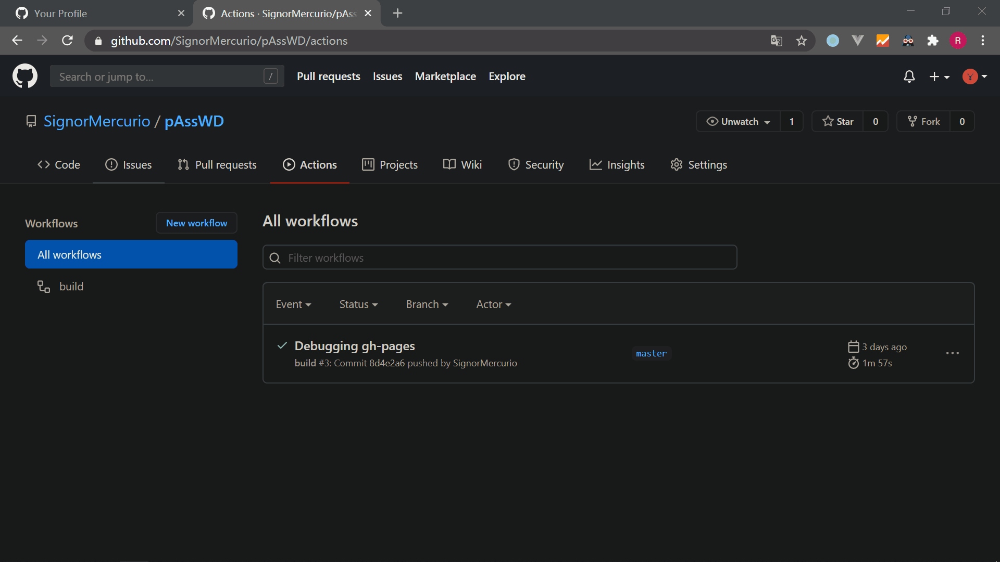

最近在搞 SDL，尝试了一下 CI/CD 。

<!--more-->

## 背景

在开发 pAssWD 的过程中，我发现每次开发到一个阶段，需要给别人展示效果的时候，总是需要经过几个不算太麻烦但是固定的步骤：

1. 运行 `npm run build`
2. 将服务器上原来的 `spa` 文件夹删除
3. 把 `dist/spa` 目录通过 SFTP 上传到服务器
4. 在 `spa` 目录下起一个 http 服务

这些步骤连可变的参数都没有，非常适合自动化。恰好最近实习时的 SDL 项目也需要我对 CI/CD 有所了解，于是我从 pAssWD 项目开始着手实施 CI/CD 流程。

## Github Actions

我听说了不少持续集成工具，如 Jenkins, Travis 等，但由于代码放在 GitHub 上，考虑到可以和 GitHub Pages 联动，我选择了 GitHub Actions 来实现。

GitHub Actions 非常友好的一点在于，可以直接把 GitHub 上其他开发者编写好的 actions 拿来用，并且 actions 用到的 workflow 文件是优雅的 yaml 格式，可以说对我这种新手来说非常容易入门。

首先创建 `.github/workflow/` 目录用来存放不同的 workflow 文件，比如我们新建一个 `build.yaml`：

```yaml
name: build

on:
  push:
    branches: [master]
  pull_request:
    branches: [master]
```

`name` 即该 workflow 的名称，`on` 表示什么时候触发 Actions，在上述例子中，只有对 `master` 分支进行 `push` 或者 PR 的时候才会触发 Actions。

```yaml
jobs:
  build-and-deploy:
    runs-on: ubuntu-latest

    steps:
      # Checks-out your repository under $GITHUB_WORKSPACE, so your job can access it
      - name: Checkout
        uses: actions/checkout@v2

      # Runs a single command using the runners shell
      - name: Build and Deploy
        uses: JamesIves/github-pages-deploy-action@master
        env:
          ACCESS_TOKEN: ${{secrets.ACCESS_TOKEN}}
          BRANCH: gh-pages
          FOLDER: dist/spa
          BUILD_SCRIPT: npm install && npm run build
```

接下来定义 `jobs`，这里我们只有一个 job 也就是 `build-and-deploy`。对于这个 job，我们首先分配一个 runner，即运行这些 Actions 的虚拟机。这些虚拟机是 GitHub 托管的，当然根据文档也可以使用自己的 runner。这里选择了最新的 ubuntu 系统。

然后定义要做的一系列步骤，每个步骤都可以有自己的 `name`。第一步一般先要 `checkout` 到自己的这个 repo 下，我们不用关心具体是怎么 checkout 的，因为有 `actions/checkout@v2` 帮我们管理了这些步骤。同样的，第二步我们在部署到 Pages 时同样无需关心细节，直接使用了一个部署到 Pages 的 action。

这里需要配置一些参数，首先是个人的 GitHub Token，在 `Settings->Developer Settings` 中可以生成。这是因为在我们用的这个 action 中需要调用 GitHub 的 API，因此需要一个认证 token。注意该 token 需要保密，因此放在项目的 `Settings->Secrets` 里。然后是要部署的分支、部署文件的目录、构建时要执行的命令等，都很容易理解。

至此，`build.yaml` 写完了，我们可以尝试 `push` 一下，然后在 Actions 页面就能看到已经自动运行的 `build` 流程了。



如果遇到了问题，也可以直接展开每一步来查看命令行的输出。

至此就实现了简单的持续部署，也就是 CD 流程。CI 流程类似，不过 pAssWD 的体量不大（我懒得写测试）就没有写测试，于是 CI 这里就没有演示了。

> 注：实际上，由于我部署到 GitHub Pages，而网站上已经有内容了（就是这个博客），因此实际上是部署到了 `http://blog_url/pAssWD` 下。为此需要修改 `package.json` 新增一个 `homepage` 字段。由于绑定了自己的域名还需要在根目录放一个 `CNAME` 文件，就像这个博客的 repo 一样。
