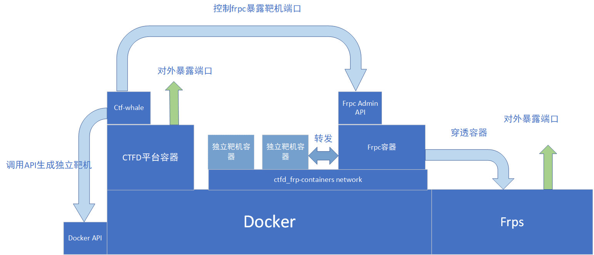

最近 H1ve 平台开源了，这是我在 GitHub 上见到的目前完成度最高的带 AWD 模式的平台。尽管如此依然遇到了不少 bug，经修复后现在的版本还算稳定。

<!--more-->

平台基于 CTFd，解题赛使用 CTFd-owl 插件，攻防赛使用 CTFd-Glowworm 插件。

## 技术架构



盗了张图，这里是 BUUCTF 的架构，与 H1ve 搭建的架构类似，仅仅是将 CTFd-Whale 替换成了 CTFd-Owl（前者使用 docker-swarm 而后者使用 docker-compose）。

## 操作步骤

首先是第一次运行需要 setup，随便设置一个管理员账号就行。随后添加用户，因为管理员用户比较特殊，在进行参赛、提交等操作时会出问题。接着在 config 的 time 里设置一个比赛开始时间，这一点十分重要，否则后续在 glowworm 里点击 `init competition` 会出错。

接下来开始添加题目。在此之前先要配置好插件。

### Owl

Docker Settings 里可以设置：

- flag 前缀
- Docker API，可以使用默认的 `unix://var/run/docker.sock`
- 最大容器数量，默认没有限制，不建议使用默认值
- 单个容器最大续期次数

FRP Settings 里可以设置：

- FRP 域名后缀，用于动态域名转发，如果直接使用 IP 的话就不需要填了
- FRP 服务器 IP，使用单个服务器一般填 `0.0.0.0`，但是试了一下也可以填域名
- FRP 最小 / 最大端口，记得防火墙开放相应端口
- FRP 配置模板

配置模板可以直接使用默认配置：

```toml
[common]
token = random_this
server_addr = frps
server_port = 80
admin_addr = 0.0.0.0
admin_port = 7400
```

### 解题赛添加题目

- 题目类型：`dynamic_check_docker`
- 部署方式：`single_docker_compose`
- 题目路径：相对于 `source` 目录的路径
- FRP 类型：IP 访问用 `DIRECT`，域名访问用 `http`
- FRP 端口：题目在 docker 中的内网端口，这里我使用的是 web 题 80，pwn 题 10000
- 题目名称
- 题目所属分类：web/pwn/misc/crypto/reverse/...
- 题目描述
- 题目初始分数
- 题目最低分数
- 达到最低分数所需的正确提交次数
- 最大尝试次数，0 为无限制
- 题目是否可见

题目创建后可以在题目详情页左侧查看正确提交、手动更新 flag、上传附件、设置标签、添加提示、设置前置解题要求等等。

### Glowworm

Competition Settings 里可以设置：

- Docker API，可以使用默认的 `unix://var/run/docker.sock`
- 服务器 IP，使用单个服务器一般填 `0.0.0.0`
- 容器 root 用户的密码
- 每轮时间（秒）
- 是否开启随机端口

### 攻防赛添加题目

- 题目类型：`ada_challenge`
- 题目路径：相对于 `ctfd_glowworm` 目录的路径
- 题目在 dockerhub 上的镜像名（这种方式会更方便一些）
- CPU 限制，默认 0.5
- 内存限制，默认 512M
- 容器端口：容器在 docker 中的内网端口
- 题目所属分类：web1/pwn1/web2/pwn2/...，不可重复
- 题目语言：`Django/PHP/Node/PWN`
- 题目描述
- 攻击分数
- checker 分数

添加完后，确保 config 的 time 里设置好了开始时间，随后进入插件的 Environments 页面点击 `init competition`，然后对每道题依次 `Build->Run->Check`。

### 题目模板

只有 web 和 pwn 需要部署靶机，pwn 题比较容易。参考 [BUUCTF 题目贡献指南](https://www.zhaoj.in/read-6259.html)，首先新建目录，把二进制文件放进去命名为 `pwn`，然后编写 `Dockerfile`：

```dockerfile
FROM glzjin/pwn_base_18
COPY pwn /pwn/pwn
```

其中 `glzjin/pwn_base_x` 代表 Ubuntu x.04，x 可以是 16/18/19/20。

然后编写 `docker-compose.yaml`：

```yaml
version: "2"
services:
  service:
    build: .
    image: pwn1
    ports:
      - 9999:10000
    volumes:
      - "$PWD/flag:/pwn/flag"
    tty: true
    networks:
      - net

networks:
  net:
    external:
      name: h1ve_frp_containers
```

如果修改了 `ports` 里的 `9999`，则需要对 H1ve 源码进行对应的修改，因为源码中直接将 9999 替换为随机的端口号。

web 的话就不能偷懒了，需要自己写 `Dockerfile`。随后编写 `docker-compose.yaml`，这里放一个官方的例子：

```yaml
version: "2"
services:
  # 基本环境
  service: # 容器名字
    # build 该置顶目录下的 dockerfile
    build: .
    # image 指定 build Dockerfile 生成镜像的名称
    image: 0akarma-file-upload
    ports:
      - 9999:80
    volumes:
      # 挂载的 Flag
      - "$PWD/flag:/var/www/html/include/flag:ro"
      - "$PWD/apache2.conf:/etc/apache2/apache2.conf"
    tty: true
    networks:
      - net

networks:
  # 配置 docker network
  net:
    external:
      name: h1ve_frp_containers
```

`ports` 这里和 pwn 题同理，`volumes` 下可以按需挂载需要的文件。

题目构建好后，就可以 Launch instance 测试一下了，第一次运行的话可能会比较慢。

## 坑点

### Redis

我没接触过 Redis 所以不太懂，但是在 MetasequoiaCTF 比赛过程中平台大约每 2 个多小时会崩一次，原因就在于 redis 达到了最大连接数。用 `redis-cli` 查看 `info clients` 发现连接数持续增长，到了默认的 `maxclients` 也就是 `10000` 的时候平台就没了。

我尝试设置 `config set timeout 600`，但是似乎不起作用，依然有些连接的 `idle` 时间超过 600。暂时的解决方案是：

```shell
$ ulimit -Sn 100000
$ redis-cli
127.0.0.1:6379> config set timeout 600
OK
127.0.0.1:6379> config set maxclients 100000
OK
```

这样以后貌似情况有所改观，当然也可能是我的错觉。。

### Freeze 功能

这个错误就比较低级了，设置好 Freeze 时间后计分板坏了。错误位于 `H1ve/CTFd/plugins/ctfd-matrix-scoreboard/__init__.py:56`：

```python
freeze = utils.get_config('freeze')
if freeze:
    freeze = CTFd.utils.unix_time_to_utc(freeze)
    if teamid != session.get('id'):
        basic_solves = basic_solves.filter(Solves.date < freeze)
basic_solves = basic_solves.all()
```

把 `CTFd.utils` 去掉就不会报错了，因为之前已经有：

```python
from CTFd.utils.dates import unix_time_to_utc
```
