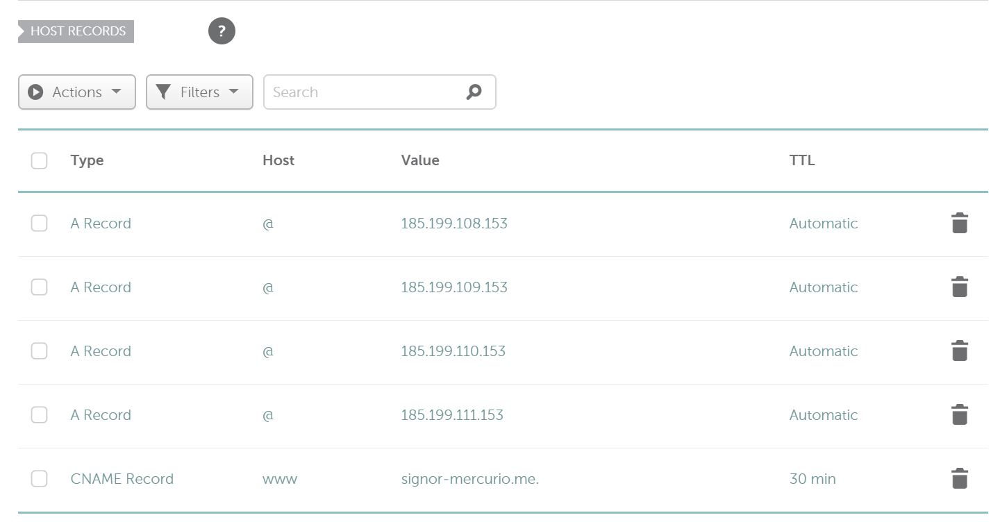

关于这个网站是如何诞生的。

<!--more-->

我的博客终于从 CSDN 迁移过来了，一些太简单 / 太难的文章留在了 CSDN，只保留了一些我认为有价值的。从期末考试前到现在，这个网站搭建的我很辛苦，主要还是因为相关经验不足。

接下来记录的是搭建博客过程中踩过的坑，也汇集了很多来自其它博客的智慧。

## GitHub Pages

是的，我采用了比较容易的方式，也就是把博客交给 GitHub 托管。GitHub 提供的 GitHub Pages 功能实在是很良心。创建一个 repo，本地仓库里把 HTML, CSS, JS 放上去就好了。

最初我并不了解 Hexo，所以手写了前端三件套。因为懒这个网站没有太大用处，放了几个按钮当作扩展收藏夹用。

## Hexo

Hexo 是基于 Node.js 的，所以首先需要到 [官网](https://nodejs.org/en/) 下载并安装，这样我们就拥有了非常好用的包管理工具 npm。随后，安装 hexo 只需要 `npm install -g hexo` 就搞定了。

在我们新建的用于存放网站文件的目录下 `hexo init`，就像 `git init` 一样，即可初始化网站目录。生成静态页面只需要 `hexo g`，实时调试使用 `hexo s` 后浏览器访问 `localhost:4000`，部署到 GitHub 只需要 `hexo d`。

说到部署，由于我之前已经配置过 Git，对 Git Bash 也比较熟悉，配置 SSH Key 之类的这里不详述。但我没想到，我以为很简单的部署环节，却标志着我踩坑之旅的开端。

## 部署

先 `npm install hexo-deployer-git --save` 装好插件。

就是不看教程也能猜到，部署相关的配置就在根目录 `_config.yml` 中的 `deploy` 字段里。它长这样：

```yaml
deploy:
  type: git
  repo:
  branch: master
```

也就是说把我的 repo 地址 `https://github.com/SignorMercurio/SignorMercurio.github.io.git` 填上去就好了。多亏 VS Code 提醒，我才发现 yml 的冒号后面必须要加空格。然而，当我 deploy 时，却得到了这样的错误信息：


大概是说发送 http 请求的时候出错了，我猜原因是采用 http 方式时，需要从标准输入读取 GitHub 用户名和密码信息，而在这里没能成功从标准输入中读取。

访问 GitHub 仓库一共就两种方式，http 不行我当然就试 SSH 了。把 repo 改成

```
git@github.com:SignorMercurio/SignorMercurio.github.io.git
```

就成功了。

访问网站，便可以看到 Hexo 的经典默认主题 Landscape。此时，我不禁回想起在服务器上配置完 Nginx 后看到那个欢迎页面时的心情。随后我在 Hexo 官网上换了一个喜欢的主题。

其实过程中还因为误装了垃圾插件 `hexo-baidu-url-submit` 导致奇怪的报错，网上查阅后果断卸了。

## 配置 RSS

我的主题还算良心，提供了配置 RSS 的方法。首先安装插件：`npm install hexo-generator-feed --save`，随后在根目录 `_config.yml` 中加入：

```yaml
Plugins:
  - hexo-generator-feed

feed:
  type: atom
  path: atom.xml
  limit: 20
```

也就好了，其实没什么坑点，我也不是很在意 RSS 订阅什么的，真的会有人用这个嘛？

## 配置 Mathjax

这次被我的主题坑了。

主题中带有 mathjax 选项，但是设置为 true 后却没用。后来知道要这样设置：

```yaml
mathjax:
  enable: true
  per_page: true
```

而且在每篇文章的 Front-matter 里都需要加入 `mathjax: true`，避免渲染没有用到公式的页面。

当我这样做了依然没有成效时，我就知道问题一定出在源头上了。

如果主题提供了 mathjax 支持，那么它要么是通过包含了相关文件实现的，要么是通过引用了外网上的相关文件实现的。一通乱翻后，我在主题文件夹的 `layout/_partial/mathjax.ejs` 中找到了罪魁祸首：

```js
<script type="text/javascript"src="http://cdn.mathjax.org/mathjax/latest/MathJax.js?config=TeX-AMS-MML_HTMLorMML">
```

这个 src 很明显就是提供 mathjax 支持的 js 文件了（上述第二种方式），但在 mathjax 官网上看了一眼，我发现 mathjax 现在已经换用了另一个 js 文件：

```js
<script type="text/javascript"src="https://cdnjs.cloudflare.com/ajax/libs/mathjax/2.7.1/MathJax.js?config=TeX-MML-AM_CHTML">
```

用新的地址替换掉旧的即可。

## 分享功能设置

主题自带的 share 太丑了，showshare 又存在一启用整个页面变白的奇怪 bug，于是只好用 baidushare，意外地发现还挺好看，而且和主题风格也一致（应该是主题已经改好的吧）。

结果这玩意儿在我后面换域名时给我带来了令人无语的麻烦。

## 网站访问计数

感谢 [不蒜子](http://ibruce.info/2015/04/04/busuanzi/) 的支持，网站访问计数的设置十分简单。在主题目录下的 `_config.yml` 中加入：

```yaml
visit_counter:
  on: true
  site_visit: 极客到访数
  page_visit: 本页阅读量
```

然后按照官网所述，在主题目录下的 `layout/_partial/footer.ejs ` 里引入 js 脚本：

```js
<script
  async
  src="//busuanzi.ibruce.info/busuanzi/2.3/busuanzi.pure.mini.js"
></script>
```

随后用主题内已有的代码就可以实现访问计数了。已有的代码其实也不过是条件判断 + 两个标签的安装而已。

## Gitment 搭建

这是最花时间的部分。虽然我很欣赏利用 issue 作为评论系统的想法和极简的设计理念，但是由于 Gitment 的 bug 和 feature 实在太多，导致我不知道在这上面踩了多少坑，我还是要吐槽一下 Gitment。搭建 Gitment 的时间可能超过了我搭建网站其它部分的时间之和。

众所周知，广受好评的多说挂了，畅言需要网站备案，disqus 需要魔法上网。虽然还有不少其它不错的评论系统可供使用，（我以为）Gitment 应该会是一个比较简单的解决方案。

于是跟着 Gitment 的文档，我开始动手：

```yaml
disqus:
  on: false
changyan:
  on: false
gitment:
  on: true
  githubID: SignorMercurio
  repo: SignorMercurio.github.io
  client_id:
  client_secret:
  lazy: true
```

关掉了主题的 `disqus` 和 `changyan` 支持，使用 `gitment`。[创建了一个 OAuth 应用](https://github.com/settings/applications/new) 后输入了 `client_id ` 和 `client_secret`。其实这个 repo 字段我就试了挺久，因为不知道要不要完整的 repo 名、带. git 的仓库访问地址还是只要仓库名；也不知道是要 http 访问还是 ssh 访问。文档里没写。如果 repo 没有写对就会出现 `Error: Not Found`。

这样以后基本的 Gitment 界面已经出现在了文章底部，显示需要登录才能评论。于是我点击登录，却发现跳回到了网站首页。这时，我注意到网址内容里多了一些错误信息，于是 F12 打开开发者工具查看问题。根据错误提示信息和开发者工具里的信息，我认为这是我在某处设置的一个叫做 `Callback URL` 的字段出了问题。回到之前注册 OAuth 应用，找到了 `Authorization callback URL` 这一字段，想必就是它了。设置为网站首页的网址即可（带 https）。

我以为分析完这个回调 URL 之后不会再遇上什么麻烦了，没想到登录后跳出了奇怪的对话框：`[object ProgressEvent]`，我完全不明白这是什么。在 [这个 Issue](https://github.com/imsun/gitment/issues/170) 里才找到原因：原作者服务器证书过期了…… 在 ejs 源码里换了其他人搭建的服务器，问题似乎是解决了。

最后，当我初始化评论时，有些文章成功了，有些却失败了。这不科学啊？

显然，这说明 Gitment 的评论初始化依赖于文章的某些属性。提示信息为 `Error: Validation Failed`，我不太明白要验证什么，于是翻了翻 Gitment 的 Issue，果然找到了许多解决方案：有改 Gitment 源文件里的 id 的（这个也有好几种方法），有改 permalink 和 md 文件名的，有在 md 文件的 Front-matter 里添加字段的，还有一些我不是很明白原理的办法。这些方法的思想都是要把 id 缩短为 50 个字符以内以通过验证。

先是改 id 改出了奇怪的错误后，我决定采用两者结合的办法。在主题的 `layout/_partial/comments/gitment.ejs` 里把 id 字段改成 `window.location.pathname`，原来默认是 `location.href`。这样用于标识文章的 id 就变成了 md 文件的路径。随后在根目录的 `_config.yml` 里将 `permalink` 字段改为 `post/:title/`，也就是说，每篇文章 `index.html` 放在 post 目录下以文章标题命名的目录里。

而这里的 “文章标题” 其实已经是文章对应的 md 文件的名字了。也就是说，这样做以后，只需要保证 md 文件的文件名不会太长即可，而这个文件名和文章实际的标题不需要保持一致。值得注意的是，由于编码转换的原因，特殊字符（比如空格）和中文到了网址里会变成多个字符，可能是因为这个原因（加上原来的 `permalink` 里还有日期）导致 id 超过了 50 个字符。

## Gitment 调整

在 [这个 Issue](https://github.com/imsun/gitment/issues/104) 里发现了汉化版本，遗憾的是，这个版本的样式和我的主题风格不太相符，于是我打算下载下来放在 js 和 css 文件夹里，直接通过相对路径来引用。这样我就可以自己修改 css 了。

因为我至今不懂的原因，直接引用那个网站上的 js 文件不会出现的中文乱码问题，在我用相对路径引用时突然出现了。由于 Gitment 汉化工作量不大，我干脆借助查找功能把乱码去掉，重新自己汉化了一遍。

最后是调整 css 样式，因为是黑色主题，我将 Gitment 的评论和预览底色也设置为黑色，文字设置为灰色和白色，就像现在这个样子，看上去好多了。

## CSS 调整与站内搜索

我对这个主题的一部分样式还不是太满意，于是又调整了主题的 css，主要是让列表内的代码和行内代码样式统一。随后，在主题的 `_config.yml` 内添加了站内搜索功能，根据文章名搜索文章：

```yaml
search:
  path: search.json
  field: post
```

## 更换域名

GitHub 十分良心地提供了 Student Pack，通过学生认证后就可以享受许多学生专有的福利，对于各种开发来说都十分方便。这里我用到了 Student Pack 中的 Namecheap 一年免费 .me 域名以及一年免费 Positive SSL 证书。下单后，需要对域名进行配置。


点击 MANAGE 后选择 Advanced DNS，添加 Host Record。受到网上教程的误导，我添加了错误的 Host Record 导致一段时间内我的域名无法正确解析，也影响到了下面升级到 https 的操作。最终，查看了 [官方帮助文档](https://www.namecheap.com/support/knowledgebase/article.aspx/9645/2208/how-do-i-link-my-domain-to-github-pages) 后，才得知 GitHub Pages 的 IP 地址已经更新了…… 最终配置如下：



然后在网站根目录下添加 `CNAME` 文件，就一行 `signormercurio.me`。

然而这个免费的 SSL 证书我却不太会用。查阅文档后，我发现这种 SSL 证书需要我在服务器端用 Nginx 生成 CSR，然后才会受到一个含有私钥和证书的压缩包，再把它部署到服务器上。然而，我的网站托管在 GitHub Pages 上，我根本不可能到服务器端操作！

这样一来，我觉得我的免费 SSL 证书应该是废了，真是浪费啊。看着网站左上角的 “不安全” 字样，我开始思考如何升级到 https。

## 升级 https

几经折腾，我发现我的 GitHub Pages 仓库的设置里，可以直接 Enforce HTTPS。在换域名之前就是 https，换了域名后 GitHub 当然也有办法设置 https 啊，那我之前干嘛去申请 SSL 证书？我早该想到这一点的。

然而我在 Namecheap 上的 Host Record，当时还是错的，于是没有办法升级。按照上文方法改对后，轻轻一勾，就享受到了来自伟大的 SSL/TLS 协议的保护。

但是这个时候，我的 baidushare 似乎不是很服气，直接罢工了。查了一下发现是因为 baidushare 不支持 https（拜托，都 2019 年了）。好在也有解决办法，来自 [这个 repo](https://github.com/hrwhisper/baiduShare)。

缺点就是每次如果需要 `hexo clean`，那么就必须在 `hexo g` 后先把 static 文件夹拖进 public 里，然后再 `hexo d`。不过也不算麻烦，因为并不是经常需要 `hexo clean`。

## 2019.4.1 更新

换了 Material X 主题，主要是因为 black-blue 代码显示的问题。又是一番折腾。

## 2019.5.16 更新

更新了的 Material X 主题中不再需要手动捣鼓：

- Mathjax
- 评论功能（用 Valine 代替，Gitment 毕竟已经不再维护了）
- 分享功能
- CSS 手动调整
- 站内搜索功能
- 升级 https 后分享功能调整
- 访问计数功能

这证明了使用一个处于积极维护中的主题是多么重要。

## 2020.2.25 更新

更新至 Volantis 主题，配置上变化不太大。

## 2021.10.16 更新

今天在修复过去的博客，正好看到了。

更新至 Icarus 主题（忘了什么时候的事了），配置非常方便省心。

## 2022.03.10 更新

博客框架迁移至 Hugo，更简洁更方便了，这篇文章也终于成为了历史。仔细回想，这个博客真正的核心功能需求只不过是：

- [x] 能够通过 Markdown 写作并方便地管理文章（Hugo）
- [x] 能够方便地更新站点、快速部署（Hugo + GitHub Pages）
- [x] HTTPS（GitHub Pages）
- [x] 文章、分类、标签（Hugo）及数目统计（Hugo + 自定义）
- [x] 搜索（algolia）
- [x] 代码一键复制（主题）
- [x] 渲染数学公式（KaTeX）
- [x] banner 图片（主题）
- [x] 灵活易用的 ToC（主题）
- [x] 可放大的图片、图片 caption（lightgallery.js）

次要需求则有：

- [x] 渲染 mermaid（Hugo）
- [x] 评论系统（Valine）
- [x] 深色模式（主题）
- [x] 移动端适配 （主题）
- [x] 图片懒加载（lazysizes）

其他功能并没有那么需要。
