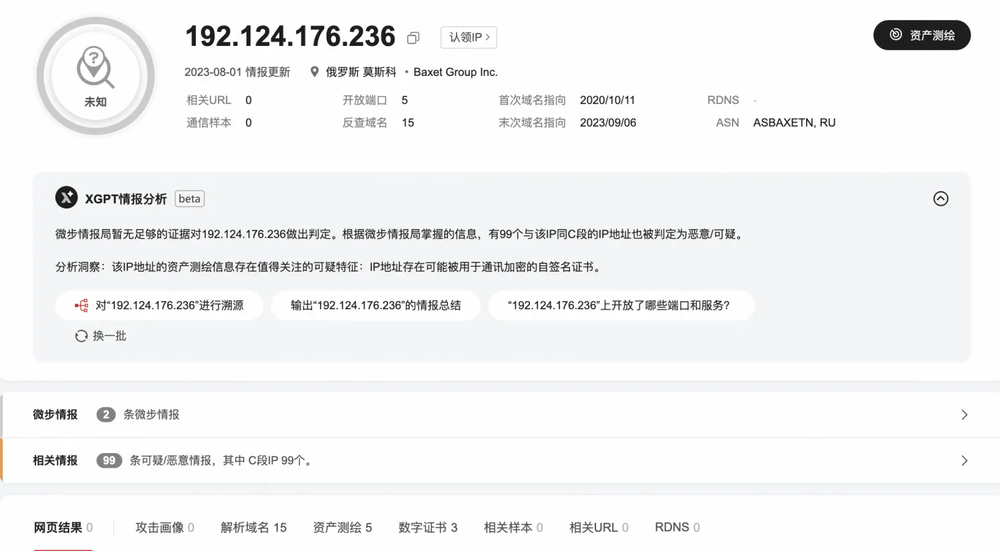
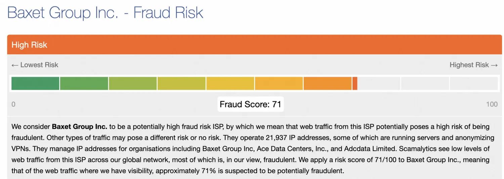
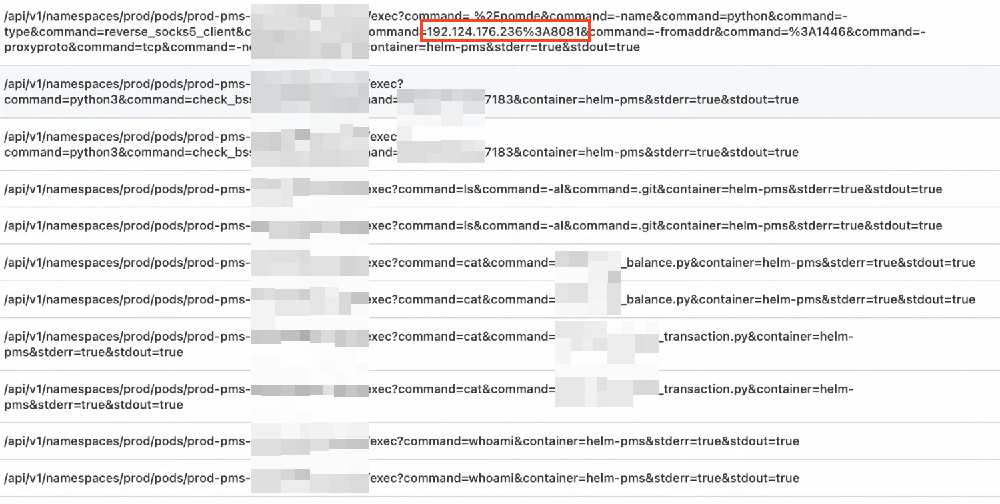
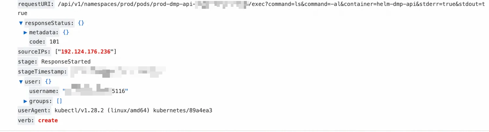
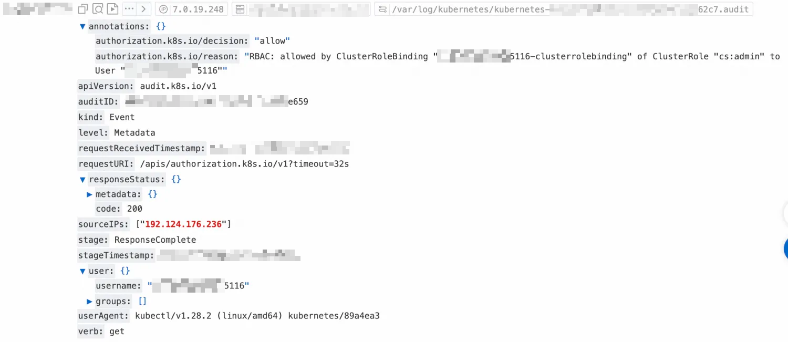
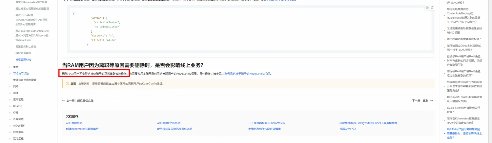
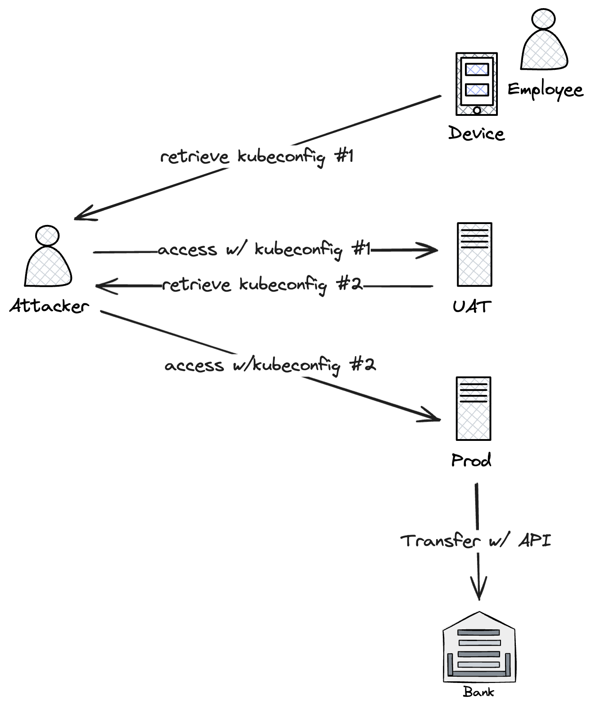

系统越复杂，需要关注的环节越多，也越容易出错。

<!--more-->

## 背景

12:38 收到客户反馈，昨日晚间一个境外异常 IP 访问了部署在云上托管 K8s 服务中的业务进行异常调用，导致约 200 万美元损失。相关对接同事与客户 CTO、应急溯源同学联系并协调时间会议沟通。

17:00 双方会议沟通事件细节，溯源同学请求并指导客户开通临时 RAM 子账号（具备操作审计、SLS 日志只读权限）用于溯源。

17:20 溯源同学登录 RAM 子账号开始溯源分析。

17:42 溯源同学给出初步排查结论。

## 排查过程与结论

根据客户提供的可疑 IP 进行威胁情报查询，可以确定为恶意 IP：

针对客户提供的时间段，检查操作审计记录，未发现对应时间段内来自对应 IP 的可疑操作，排除 RAM 子账号云凭证泄露的可能性。

随后检查 ACK 集群的审计日志，发现来自攻击 IP 的如下访问记录，可以确定该 IP 通过 `kubectl exec` 的方式进入了容器执行了恶意命令，被攻击的 Pod 为 `prod-dmp-api-[REDACTED]` 和 `prod-pms-[REDACTED]` 等，被攻击的容器为 `helm-dmp-api` 和 `helm-pms` 等：

根据日志详情，具体攻击方式是通过 kubectl 直接访问了**暴露在公网的 APIServer**，访问时利用了 `[REDACTED]5116` 这个用户（绑定了集群管理员权限）：

与客户确认后，确定了该用户对应的具体员工身份，判断为在职员工 kubeconfig 凭证泄露导致。针对该集群的首次攻击记录如下，可以发现该账号绑定了 ClusterRole `cs:admin` 即集群管理员权限：

进一步调查发现，在客户的其他几个集群中同样存在类似的攻击行为，涉及两个用户：`[REDACTED]8490`、`[REDACTED]1407`。与客户确认后，确定了这两个用户对应的具体员工身份。但客户反馈这两个员工均已离职，离职时删除了对应的 RAM 账号，这一结论也得到了 RAM 团队的证实。既然如此，攻击者为什么还能利用这两个 RAM 账号进行恶意命令执行呢？

经排查，发现这两个 RAM 账号对应的 ClusterRoleBinding 并没有删除，因此仍然绑定了 `cs:admin` 的角色，因此依然具备集群管理员权限：

原来在删除 RAM 账号时，并不会连带删除其在托管 K8s 集群中的 ClusterRoleBinding。也就是说，一旦在托管 K8s 集群中授予 RAM 用户 RBAC 权限，就必须通过 [吊销 Kubeconfig](https://help.aliyun.com/zh/ack/ack-managed-and-ack-dedicated/user-guide/revoke-a-kubeconfig-credential#9a2308406cdjl) 或手动删除 ClusterRoleBinding 的方法才能取消授权。

> 参考：[https://help.aliyun.com/zh/ack/ack-managed-and-ack-dedicated/user-guide/faq-about-authorization-management?spm=a2c4g.11186623.0.0.2d2b4a44ktnaJt#section-txv-4vm-fnp](https://help.aliyun.com/zh/ack/ack-managed-and-ack-dedicated/user-guide/faq-about-authorization-management?spm=a2c4g.11186623.0.0.2d2b4a44ktnaJt#section-txv-4vm-fnp)

这样设计的主要目的是为了避免集群中调用对应 ClusterRole 的服务受影响而中断。同时，删除 RAM 账号时也无法针对集群层面是否有对应的 ClusterRoleBinding 进行探测。

## 攻击链路梳理

最后，在这次事件中，对攻击者的攻击链路也进行了简单梳理：

1. 客户员工 8490、1407 生成能访问 UAT 环境的 kubeconfig #1 并保存在本地
2. 员工 8490、1407 离职，客户删除两名离职员工的 RAM 账号
3. 攻击者窃取员工 8490、1407 本地的 kubeconfig #1 登录到 UAT 环境
4. 攻击者在 UAT 环境发现在职员工 5116 的 kubeconfig #2 ，该 kubeconfig 可以访问生产环境
5. 攻击者利用 kubeconfig #2 登录生产环境
6. 攻击者利用业务容器执行恶意命令，进行转账操作
