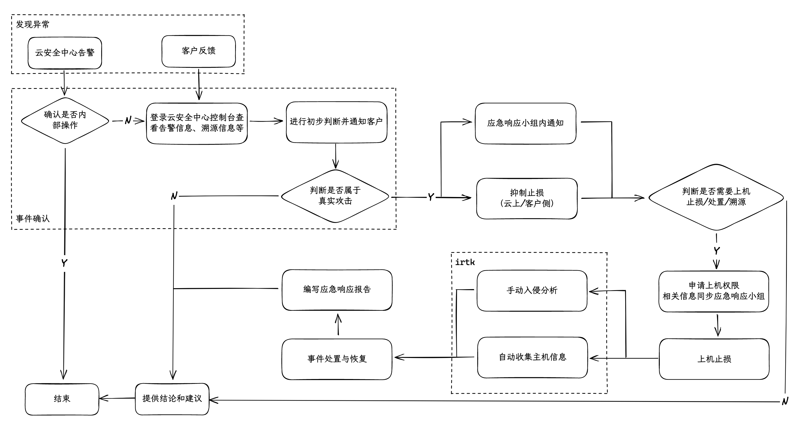

整理了详细的应急操作手册供团队参考，作为应急响应准备阶段的一环。内容已脱敏。

<!--more-->

## 整体流程

应急响应的 PDCERF 模型将应急响应流程分为 6 个阶段：准备（Preparation）、检测（Detection）、抑制（Containment）、根除（Eradication）、恢复（Recovery）、跟踪（Follow-up）。根据实际工作场景需要，我们对上述流程进行了一些调整：准备阶段融入到日常工作中，检测阶段细分为发现异常和事件确认两个流程，根除、恢复阶段合并为事件处理流程，并且在中间添加了入侵分析流程。



## 发现异常

### 主动发现：云产品告警

对云安全中心安全告警进行分析研判，判断告警为真实攻击触发的可能性：

1. 大概率为真实攻击：进入【抑制止损】阶段
2. 无法直接判断为真实攻击：进入【事件确认】阶段，与客户确认是否属于内部操作，如确认为内部操作，可与客户沟通并提供建议，或进行加白操作；否则继续参考【事件确认】阶段

> 关于精准防御：云安全中心对于高危行为会直接采取拦截措施。如下图，“已防御” 表明云安全中心精准防御功能已自动拦截对应进程，高危行为暂时没有执行成功。但需要持续关注后续告警，精准防御容易被绕过：
> 

### 被动发现：客户反馈

由于反馈来自客户，直接进入【事件确认】阶段，仍需确认事件是否为真实攻击。

## 事件确认

客户确认并非内部操作后，通过 SSO 登录客户云安全中心控制台查看告警详细信息。对于非管家客户，可以让客户创建一个 RAM 账号，常用权限包括：

- `AliyunYundunSASFullAccess` 管理云安全中心的权限（用于事件处置与病毒查杀）
- `AliyunYundunWAFv3ReadOnlyAccess` 只读访问 WAF 3.0 的权限
- `AliyunYundunWAFReadOnlyAccess` 只读访问 WAF 2.0 的权限
- `AliyunYundunCloudFirewallReadOnlyAccess` 只读访问云防火墙的权限
- `AliyunECSReadOnlyAccess` 只读访问 ECS 的权限
- `AliyunLogReadOnlyAccess` 只读访问日志服务的权限
- `AliyunActionTrailReadOnlyAccess` 只读访问操作审计的权限
- `AliyunECSWorkbenchFullAccess` 使用 ECS Workbench 登录主机的权限

对于部分告警，可以通过云安全中心“溯源”模块，以图形化方式查看攻击路径，部分（约 30%）情况下可以快速定位到入侵原因或获取额外信息：


通过分析告警详情，对告警风险等级进行初步判断，形成初步结论并通知客户。

- 如果不是真实攻击，可根据告警情况与客户沟通并提供建议，如确认为通用的产品误报建议通过服务单反馈至产品团队。
- 如果是真实攻击，启动应急响应并开始抑制止损流程。同时将已知信息同步至应急响应小组备用。**从这里开始，后续所有关键步骤均需截图+文字同步到应急响应小组，作为应急响应报告的参考材料。**
- 如果判断有困难，升级至应急响应小组协助判断。

## 抑制止损

在事件确认过程中，可以大致确定攻击者的入侵方式，根据入侵方式选择对应的止损方式。所有变更操作均需客户授权后执行。为避免在应急响应过程中操作不当造成二次灾害，同时避免关键证据丢失，强烈建议在抑制止损开始前为受影响主机创建快照或镜像进行备份。

止损方式如下，*斜体*表示可通过控制台/机器人代为操作、**加粗**表示需上机操作/客户侧操作：

- 攻击者通过互联网远程访问主机上的服务导致入侵
  - 如受影响主机可以下线且对业务影响较小，则进行*隔离主机*
  - 如能快速定位到攻击 IP，则进行 _IP 阻断_（安全组/WAF/CFW）
    - 对于反弹 shell 的情况，如能快速定位到外连 IP，同样建议阻断
    - 由于攻击 IP、外连 IP 可以轻易更换，仍需进行其他止损操作
  - 如受影响服务无需对公网开放，则配置白名单进行**暴露面收敛**
  - 如攻击方式是上传恶意文件且恶意文件会被服务解析执行，则考虑进行**目录权限限制**（如通过 htaccess 等方式禁止该目录下文件被执行）
  - 如攻击方式借助了主机上的后门用户，则进行**禁用用户**
  - 如受影响的接口/服务可以单独下线且对业务影响较小，则进行**接口/服务下线**
- 攻击者通过内网访问主机上的服务导致入侵
  - 如能通过云安全中心直接快速定位到攻击 IP，则考虑*隔离攻击 IP 对应的内网主机*
  - 如客户同意，建议对同网段内主机设置安全组进行*两两隔离*防止攻击者进一步横向移动
- 主机上存在恶意进程
  - 如受影响主机可以下线且对业务影响较小，则进行*隔离主机*
  - 如能快速定位到外连 IP，则进行 _IP 阻断_（安全组/WAF/CFW）
  - 大部分情况下需上机进行**进程/持久化后门清除**（提前执行【清理恢复】阶段），但注意保留相关样本供后续分析（快照镜像或手动上传）
  - 对于 Windows 主机可借助**杀毒软件**进行止血
- 云凭证泄露导致入侵
  - 如泄露的云凭证可以临时禁用且对业务影响较小，则**禁用/更换云凭证**
  - 无法禁用时，考虑为云凭证**配置调用白名单**、**权限收敛**
- 弱口令导致入侵：**口令替换**

随后判断是否需要上机进行溯源分析与清理恢复。如不需要，则进入【总结报告】阶段，同时仍需持续关注后续告警；如需要，则向客户申请上机权限，并将相关登录信息同步至应急响应小组备用。

### 连接受害主机

通常有如下几种方式连接受害主机：

- 通过公网/VPN 通道进行 SSH/RDP 直连
- 客户共享镜像到我方全息账号，在全息上启动 ECS 并通过公网 SSH/RDP 直连
- 客户通过工单授权，应急人员通过嫦娥平台 VNC 连接
- 客户提供堡垒机凭证，应急人员登录堡垒机后连接（例如 JumpServer、阿里云堡垒机等）
- 通过远程桌面软件（向日葵、ToDesk 等）远程到客户运维主机后连接

除嫦娥平台方式外，均建议使用无影云环境：【公共应急响应环境】或【公共应急响应环境-备用】进行操作。如果申请过程中客户需要管家侧提供白名单 IP，可以使用该无影云环境的 IP：\[数据删除\]。

> 为方便信息收集，对于 Linux 主机，建议申请 root 或同等权限用户登录权限；对于 Windows 主机，建议申请 Administrator 或同等权限用户登录权限。

## 溯源分析

溯源分析是一个复杂且极其依赖人员经验与耐心的过程，主要目的是通过确定攻击时间、攻击来源、攻击目标、攻击手段、攻击者行为等信息，拼凑和推导出攻击方式、攻击者意图、漏洞类型、攻击链路等，从而了解事件全貌，为后续的修复和加固提供关键信息。这里仅提供部分溯源分析的思路和方式。

### 入侵途径未知、主机批量排查、残留后门发现

对于入侵途径未知、主机批量排查、残留后门发现这三类常见场景，建议使用 SIREN 工具进行排查。

### 通过 Web 服务入侵

- 首先根据云安全中心告警进程链信息与文件路径信息判断大致语言和框架，确定排查范围
  - 例如，Java、Node.js、Python 等语言启动的应用程序命令行特征较明显
  - DNS 带外攻击：优先考虑 Java/Node.js 应用
  - 部分情况下可直接通过进程命令行定位到具体框架，例如 GitLab、XXL-Job 等
  - 部分情况下可直接获取应用工作目录，可能对后续日志排查有一定帮助
- 排查顺序：云安全中心 - WAF 日志（如无 WAF 则可查看 CFW 日志审计-流量日志） - 定位主机日志路径 - 主机 Web 日志 - 主机应用程序日志（仅辅助）
- WAF 日志排查语句格式参考
  - 列出所有拦截的情况：`final_action:block | SELECT host, COUNT (*) AS c GROUP BY host ORDER BY c DESC`
  - 列出针对某域名被拦截的访问记录：`host:example.com and final_action:block | SELECT real_client_ip, final_plugin, final_rule_id, request_path, COUNT(*) AS c GROUP BY real_client_ip, final_plugin, final_rule_id, request_path ORDER BY c DESC`
  - 列出所有比较重要的字段用于攻击分析：`host:example.com | SELECT time, real_client_ip, querystring, request_body, request_method, request_path, status`
  - 对 SLS 语法不熟悉可以使用内置的 Copilot 使用自然语言生成语句，如结果不符合预期建议在同一对话内多次尝试，从而触发智能诊断
    
- 定位 Web 日志路径
  - 尝试直接 `locate`相关的服务，例如 `locate nginx`
    - 如果没有 `locate` 命令，可以通过包管理器安装 `mlocate` 后运行 `updatedb`
  - 使用搜索引擎搜索相应服务/中间件的默认日志位置
    - Nginx 默认：`/var/log/nginx/access.log`
    - Apache 默认：`/var/log/httpd/access_log`, `/var/log/apache2/access.log`
    - 默认位置未找到时，考虑进入应用工作目录手动搜寻（e.g. /data/app）
  - 通过云安全中心-主机资产详情-资产指纹调查-Web 服务初步确定主机上运行的 Web 服务，有时可以定位到 Web 目录（其他资产指纹信息亦可以参考）
- 容器化 Web 服务
  - 通过 Web 服务名称推测容器名称，定位具体容器（或通过监听端口辅助定位）
  - 先 `docker exec -it <容器 ID> /bin/sh` 进入容器再尝试定位
  - 根据服务默认配置/告警信息/`docker inspect` 命令，定位容器内服务目录，进一步定位日志目录
  - 容器内无法定位到 Web 日志，可以尝试 `docker logs <容器 ID>` 检查容器本身日志，有较大概率包含 Web 日志或应用日志
  - `docker` 可替换为 `crictl`、`podman` 等，K8s 场景可能需要使用 `kubectl`
- Web 日志排查
  - 前置要求：熟悉 `head`/`tail`/`grep`/`find` 等命令用法、熟悉正则表达式
  - 根据云安全中心告警时间缩小排查范围，例如告警时间为 `2006-01-02 15:04:05`，则可尝试 `cat /path/to/access.log | grep 02/Jan/2006:15:04:` 缩小时间范围（时间格式与日志类型有关）；查询特定 IP `12.34.56.78` 的访问记录也可通过类似方式：`grep 12.34.56.78`（其他关键字同理）
  - 不确定服务器时区，则同时考虑 UTC+0、UTC+8 两种主要可能
  - 可疑请求识别
    - 与该应用已知漏洞涉及的请求路径一致
    - 在正常请求中突出
    - 含敏感操作 e.g. 方法调用、反序列化
    - 攻击特征 e.g. 目录穿越、目录遍历、特殊截断符
  - 0day 发现与分析：可疑请求识别 -> 在代码/应用日志中搜索关键字 -> 代码审计
- 无 Web 日志：检查应用日志，寻找异常特征 e.g. warn, error, fail, fatal, wrong, not permitted/allowed, forbidden, cannot, 5xx, exception, eval, "leetspeak"...
- 无法正向构建证据链的情况
  - 先确定应用框架、再确定漏洞（可用排除法）、从结论出发查找证据、Meet in the Middle
  - 通过漏洞复现产生相似日志，实现反向推理
- Webshell
  - 询问大模型获取代码解释、推测加密方式等
  - 通过 `stat webshell.php` 确定文件上传时间（其他恶意文件同理）
- 如存在弱口令问题，优先通知客户更改口令

### 云凭证异常调用

- 告警中可直接定位到 AccessKeyID
- 排查顺序：云安全中心 - ActionTrail - 云助手命令执行记录
- ActionTrail 排查顺序：AccessKey 审计（仅记录最后一次调用 Region/时间/IP） - 事件查询 - 高级查询（或直接查询对应跟踪的 SLS）
- 关注所有（包括已处理）异常 AK 调用告警
- 关注是否存在利用 AK 调用云助手执行命令的行为，对应 API：`ECS::InvokeCommand`、`ECS::CreateCommand`、`ECS::RunCommand` 等
- STS Token 泄露的情况优先关注其对应的 RAM 角色、以及该角色绑定的 ECS
- 如何判断是否调用成功
  - 先查看调用记录 JSON，如果 `errorCode` 字段不为空说明调用失败（常见：`AccessDenied`、`NoPermission`、`Forbidden`、`Forbidden.RAM`）
  - 如没有 `errorCode`，则检查被调用的凭证是否有对应产品的对应权限，如果没有则说明调用失败（典型案例：`ECS::DescribeInstances` 调用失败时不返回数据，但无任何错误信息）
  - 否则说明调用成功
- 云凭证批量泄露时，优先考虑存储凭证的服务（如 Nacos 等配置中心、Gitlab 等代码仓库）失陷的可能性

### 主机上存在恶意进程/文件

- 关注进程关联的文件、网络连接、其他进程，记录相关 IoC
- 优先保留一份恶意样本，必要时进行逆向分析
- 通过 `stat /path/to/malicious_file` 确定文件修改时间，大概率等于或接近落盘时间
- 使用 `find` 配合 `-newermt` 参数（Windows 上使用 Everything），查找关键时间段内主机上发生修改的文件
- 恶意脚本文件：询问大模型获取代码解释、恢复脚本等
- 恶意二进制文件：通过威胁情报判断文件类型、行为等信息；不便于下载文件并上传到威胁情报平台时，使用 SIREN 快速样本分析功能直接上传，或直接在威胁情报平台查询文件 MD5 值（获取 MD5：`md5sum /path/to/malicious_file`）
- 有 Redis 则优先排查 Redis 问题：定位到 Redis 配置文件（`redis.conf`），其中通常记录了 Redis 日志位置
- 留意进程隐藏与自启动的可能性

#### 恶意文件常见传播方式

- 钓鱼/捆绑软件
- SSH/RDP 弱口令
- SMB（端口：135-139,445）
- Redis
- Web 应用漏洞

#### 挖矿程序

- 表现：高 CPU 占用/高内存占用/大量进程/445 端口大量发包
- 根据 CPU 监控图表确定第一台被入侵的服务器

#### 远控木马

- 表现：可疑网络连接/数据泄露
- 优先排查进程中是否被注入内存木马、网络连接中是否存在可疑外连 IP、命令历史中是否存在从公网地址下载二进制文件/脚本文件的操作

#### 勒索病毒

- 表现：大量文件后缀被修改、出现勒索信文件
- 基于勒索信创建时间、原文件被修改时间排查日志，优先考虑敏感服务（RDP、SMB）相关日志
- 可尝试借助在线勒索解密工具识别和了解勒索病毒家族和攻击手段，通常较难成功解密
- 注意远程连接时避免挂载本地磁盘，以免本地数据被勒索

#### rootkit

- 表现：大量系统命令被篡改（修改时间异常）；高 CPU/内存占用，但 ps/top 显示无异常
- 常与挖矿程序一起出现，主要目的为隐藏挖矿程序
- 可利用 chkrootkit/rkhunter 检查，unhide 显示隐藏进程

#### 感染型病毒

● 表现：大量可执行文件产生感染型病毒告警，注册表项 `\HKEY_CLASSES_ROOT\exefile\shell\open\command` 被篡改
● 避免打开被感染的可执行文件，使用专项清理工具清理

### 其他排查方式 Cheatsheet

#### 弱口令

- 检查 SSH/RDP、FTP、数据库、MySQL、Redis、Tomcat、网站后台管理员等账户是否设置了简单的口令，尤其注意对公网开放的服务
- 解决方法：以管理员权限登录系统或应用程序后台，修改为更复杂的口令

#### 可疑用户

- 查看用户最后登录信息：`lastlog`
- 查看用户错误登录信息：`lastb`
- 查看用户所有登录信息：`last`
- 检查所有非默认用户：`cat /etc/passwd | awk -F: '$3 >= 1000 && $3 != 65534 && $1 != "nobody" {print $0}'`
- 检查所有特权用户：`cat /etc/passwd | grep -vE '^root|^#|^(\+:\*)?:0:0:::' | awk -F: '{if($3==0) print $1}'`
- 检查当前登录用户：`who`
- 检查可登录用户：`cat /etc/passwd | grep -vE 'nologin$|false$'`
- 检查登录 IP：`grep -i 'accepted' /var/log/secure* /var/log/auth.* 2>/dev/null | grep -oE '[0-9]+\.[0-9]+\.[0-9]+\.[0-9]+' | sort | uniq`
- 检查新增用户：`grep -i 'new user' /var/log/secure* /var/log/auth.* 2>/dev/null | awk -F '[=,]' '{print $1,$2}' | awk '{print $1,$2,$3,$9}'`
- 检查 sudoers 用户：`cat /etc/sudoers | grep -vE '^#' | sed -e '/^$/d' | grep ALL=`
- 解决方法：使用 `usermod -L username` 禁用用户或 `userdel -r username` 删除用户

#### SSH 信息

- 检查 SSH 暴力破解情况（前 25）：`grep -i 'authentication failure' /var/log/secure* /var/log/auth.* | awk '{print $14}' | awk -F '=' '{print $2}' | grep -E '[0-9]+\.[0-9]+\.[0-9]+\.[0-9]+' | sort | uniq -c | sort -nr | head -n 25`
- 检查最近成功登录情况：`last`
- 检查 SSH 配置文件是否存在异常：`cat ~/.ssh/config`
- 检查 SSH 公钥文件是否存在异常公钥：`cat ~/.ssh/authorized_keys`
- 检查 SSHD 配置文件是否存在异常：`cat /etc/ssh/sshd_config`
- 检查是否存在 SSH 软链接后门：`ps -ef | grep -E '\s+\-oport=[0-9]+'`
- 检查 inetd、xinetd 配置文件是否存在异常：`cat /etc/inetd.conf /etc/xinetd.conf`
- 解决方法：删除或注释掉异常项所在行

#### 进程

- 检查 CPU 占用 top 15 进程：`ps aux | awk '{print $1"\t"$2"\t"$3"\t"$4"\t"$9"\t"$10"\t"$11}' | grep -v ^'USER' | sort -rn -k3 | head -15 | column -t`
- 检查内存占用 top 15 进程 `ps aux | awk '{print $1"\t"$2"\t"$3"\t"$4"\t"$9"\t"$10"\t"$11}' | grep -v ^'USER' | sort -rn -k4 | head -15 | column -t`
- 通过 `ps aux`检查进程列表，查看是否存在可疑进程，例如 `bash -i` 反弹 shell 或 `xxx.sh`脚本执行等
- 定位到可疑 PID 后，可以通过查看 `/proc/<PID>`下的文件来获取进一步信息：
  - `cat /proc/1234/cmdline` 查看 PID 为 1234 的进程的命令行信息
  - `ls -l /proc/1234/exe` 查看 PID 为 1234 的进程的可执行文件
  - `ls -l /proc/1234/cwd` 查看 PID 为 1234 的进程的工作目录
  - `cat /proc/1234/environ` 查看 PID 为 1234 的进程的环境变量信息
- 解决方法：`kill 1234` 或 `kill -9 1234` 清除进程，并清除进程对应的文件

#### 网络连接

- 检查监听的 TCP 端口：`netstat -plnt | grep -E 'tcp.*'`
- 检查已建立的网络连接：`netstat -plant | grep ESTABLISHED`，常见状态：
  - `LISTEN` 正在监听
  - `ESTABLISHED` 已建立连接
  - `TIME_WAIT` 已关闭连接，等待被动关闭端
  - `SYN_SENT` 已发送 SYN，持续时间长表示无法连通
- 检查是否存在异常的 DNS 服务器：`grep -oE '[0-9]+\.[0-9]+\.[0-9]+\.[0-9]+' </etc/resolv.conf`
- 检查 hosts 文件是否存在异常解析：`cat /etc/hosts`
- 使用 `ifconfig` 或 `ip` 获取网络状态信息
- 解决方法：可以先通过安全组或云防火墙阻断对应的网络连接；通过 `netstat` 命令定位到可疑网络连接对应的进程 PID，随后通过 `kill` 命令清除进程，最后清除进程对应的文件

#### 计划任务

- 检查当前用户计划任务：`crontab -l`
- 列出所有计划任务文件：`ls -halt /etc/cron.*/*`、`ls -halt /etc/cron* /var/spool/cron/*`，随后逐项检查
- 解决方法：删除或注释掉异常项所在行

#### 可疑文件

- 检查目录下所有文件（包括隐藏、链接文件）、显示可读的文件大小且按修改时间由新到旧排序：`ls -halt`
- 了解常用命令：`chmod` `chattr` `chown` `grep` `find` `tar`
- 检查临时文件目录下是否存在可疑文件：`ls -halt /tmp /var/tmp /dev/shm`
- 检查文件时间属性：`stat filename`
  - atime（access time）：读取/运行文件会更新
  - mtime（modify time）：修改文件内容会更新
  - ctime（change time）：修改文件内容/权限会更新
- 检查 1 天内被修改的文件，可以将 `-mtime`换为 `-ctime`：

```bash
find /etc /bin /lib /sbin /dev /root/ /home /tmp /var /usr ! -path "/var/log*" ! -path "/var/spool/exim4*" ! -path "/var/backups*" -mtime -1 -type f | grep -vE '\.log|cache|vim|/share/|/lib/|.zsh|.gem|\.git|LICENSE|README|/_\w+\.\w+|\blogs\b|elasticsearch|nohup|i18n|/usr/local/aegis|/usr/local/lib64/python' | xargs -i{} ls -halt {}
```

- 检查大于 200M 的文件：

```bash
find / ! -path "/proc/*" ! -path "/sys/*" ! -path "/run/*" ! -path "/boot/*" -size +200M -exec ls -halt {} + 2>/dev/null | grep -E '\.gif|\.jpeg|\.jpg|\.png|\.zip|\.tar.gz|\.tgz|\.7z|\.log|\.xz|\.rar|\.bak|\.old|\.sql|\.1|\.txt|\.tar|\.db|/\w+$' | grep -vE 'ib_logfile|ibd|mysql-bin|mysql-slow|ibdata1'
```

- 检查命令历史是否存在异常命令：`history`、`cat /root/.bash_history`（`history -c` 不会清除该文件）
- 敏感文件位置
  - `/etc/rc.d/init.d` 存放应用的启动管理服务
  - `/etc/rc.local`、`/etc/rc.d/rc[0-6].d` 存放自启动程序
  - `/tmp` 权限较宽松，容易被上传文件且目录下文件有可执行权限
  - `/etc/profile`、`/etc/environment`、`~/.bashrc`、`~/.bash_profile` 等：登录后自启动（`~/.zshrc`、`~/.zprofile` 等同理）
  - `~` 用户 home 目录
  - `~/.ssh` 存放用户 SSH 配置和密钥对，容易被窃取私钥/写入公钥
  - `/etc/passwd` 用户信息
  - `/etc/shadow` 用户登录密码信息
  - `/etc/hosts` 存放系统 DNS 解析信息
  - `/etc/ld.so.preload` 加载的动态链接库，正常情况下该文件不应存在
  - 日志
    - `/var/log/secure`、`/var/log/auth.log` 存放 SSH 登陆日志
    - `/var/log/dmesg` 存放系统启动日志、`/var/log/messages` 存放系统报错日志
    - `/var/log/cron` 存放计划任务日志
    - `/var/log/yum.log` 存放 yum 软件包安装日志
- 解决方法：删除可疑文件，在进程列表中检查是否有关联的进程并一并清除

#### 环境变量

- 检查环境变量：`env`
- 检查 profile 文件中是否存在异常命令，如 `export` 异常环境变量等：`cat /root/.bashrc`、`cat /root/.bash_profile`、`cat /etc/profile`、`cat /etc/environment`
- 检查 `LD_PRELOAD` 等环境变量：

```bash
echo -e "LD_PRELOAD=$LD_PRELOAD\nLD_ELF_PRELOAD=$LD_ELF_PRELOAD\nLD_AOUT_PRELOAD=$LD_AOUT_PRELOAD\nPROMPT_COMMAND=$PROMPT_COMMAND\nLD_LIBRARY_PATH=$LD_LIBRARY_PATH"
```

- 检查 `/etc/ld.so.preload` 文件是否存在异常的动态链接库：`cat /etc/ld.so.preload`
- 检查别名中是否有异常：`alias | grep -v 'git'`
- 解决方法：删除或注释掉异常项所在行

#### 服务与启动项

- 检查用户自定义启动项：`chkconfig --list | grep ':on|启用'`\
- 检查运行中的服务：

```bash
systemctl list-units --type=service --state=running --no-pager | grep running | awk '{print $1}' | grep -vE 'aegis|aliyun|assistdaemon|atd|auditd|chronyd|crond|dbus|getty|gssproxy|network|polkit|postfix|rpcbind|rsyslog|sshd|systemd|tuned|firewalld|selinux|networkmanager|dnsmasq|avahi-daemon|cups|acpid'
```

- 检查最近添加的服务：`ls -halt /etc/systemd/system/*.service | ag -v 'dbus-org'`
- 检查 initd 启动项：`ls -halt /etc/rc.d/init.d`，随后逐项检查
- 检查自启动目录：`ls -halt /etc/rc.d/rc[0-6].d`，随后逐项检查
- 检查 `/etc/rc.local` 中是否存在异常启动项：`cat /etc/rc.local`
- 解决方法：删除或注释掉异常项所在行；`chkconfig servicename off`-关闭服务 `servicename`；`systemctl disable servicename`-关闭服务 `servicename`

#### rootkit

- 通过 chkrootkit 等工具自动化检查 rootkit
- 检查系统命令是否被篡改（修改时间异常）：`stat /bin/ps`、`stat /bin/ls`、`stat /bin/netstat`、`stat /usr/sbin/sshd`、`stat /usr/sbin/crond`
- 解决方法：可能需要重装系统或恢复未感染的快照

#### Windows

- 系统日志位置：`C:\Windows\System32\winevt\Logs`，建议复制到新建文件夹以避免权限问题
- 使用 `netstat` 配合 ProcessExplorer 查找进程，ProcessExplorer 建议开启 Start Time 列
- 使用 Everything 查找文件
  - 指定修改日期：`dm: 2023/07/26`
- 使用 LogParser 分析日志（更推荐使用 Hayabusa）
  - 重要日志
    - `Microsoft-Windows-TerminalServices-RDPClient%4Operational`本机 RDP 登录其他主机日志
    - `Microsoft-Windows-TerminalServices-RemoteConnectionManager%4Operational`其他主机 RDP 登录本机日志
    - `Security`安全相关事件日志，主要关注：
      - 4624-登录成功
      - 4625-登录失败
      - 1102-日志清除
      - 4720-新用户创建
  - RDP 成功登录记录：`LogParser.exe -i:EVT -o:DATAGRID "SELECT TimeGenerated,EXTRACT_TOKEN(Strings,8,'|')as LoginType,EXTRACT_TOKEN(Strings,18,'|')as LoginIP,EXTRACT_TOKEN(Strings,5,'|')as Username FROM Security.evtx where EventID=4624 and EXTRACT_TOKEN(Strings,8,'|')='10'"`（SMB 登录将 10 改为 3，下同）
  - RDP 失败登录记录：`LogParser.exe -i:EVT -o:DATAGRID "SELECT TimeGenerated,EXTRACT_TOKEN(Strings,10,'|')as LoginType,EXTRACT_TOKEN(Strings,19,'|')as LoginIP,EXTRACT_TOKEN(Strings,5,'|')as Username FROM Security.evtx where EventID=4625 and EXTRACT_TOKEN(Strings,10,'|')='10'"`
  - 通过 Remote Connection Manager 日志查询 RDP 登录成功 IP：`LogParser.exe -i:EVT -o:DATAGRID "SELECT TimeGenerated,EventID,EXTRACT_TOKEN(Strings,2,'|') as LoginIP FROM Microsoft-Windows-TerminalServices-RemoteConnectionManager%4Operational.evtx where EventID=1149"`
  - 指定时间段安全日志：`LogParser.exe -i:EVT -o:DATAGRID "SELECT * FROM Security.evtx where TimeGenerated>'2023-07-26 10:00:00' and TimeGenerated<'2023-07-26 18:00:00'"`
- 排查 SQLServer 执行的 SQL 命令历史：

```sql
SELECT TOP 1000
QS.creation_time,
SUBSTRING(ST.text,(QS.statement_start_offset/2)+1,
((CASE QS.statement_end_offset WHEN -1 THEN DATALENGTH(st.text)
ELSE QS.statement_end_offset END - QS.statement_start_offset)/2) + 1
) AS statement_text,
ST.text,
FROM
sys.dm_exec_query_stats QS
CROSS APPLY
sys.dm_exec_sql_text(QS.sql_handle) ST
WHERE
QS.creation_time BETWEEN '2023-12-29 14:00:00' AND '2023-12-29 16:00:00'
ORDER BY
QS.creation_time DESC
```

- 常见隐蔽攻击手段
  - 开机启动项、服务
  - DLL 注入系统关键进程（如 svchost）
  - WMI 无文件攻击

### 进展同步

由于溯源分析可能耗时较久，处理期间每天下班前需在客户群内与接口人同步进展，内容包括当前分析进展与后续分析计划，参考话术：

> 和您同步下当前分析进展：
> 1、xxx
> 2、xxx
>
> 下一步我们计划通过以下方式继续分析：
> 1、xxx
> 2、xxx

另外，处理期间每天上班后同样需要在客户群内与接口人简单同步进展与计划，参考话术：

> 目前我们已经分析了 xxx，发现存在 xxx 的情况。计划今天会对 xxx 进行排查，有进展会及时在群里同步。

## 清理恢复

这一步骤可以在溯源分析前进行，主要清除系统中的恶意进程、文件、持久化后门、Web 页面等，恢复被篡改的数据与配置，并恢复业务正常运行。

需要注意，如果在原主机上操作，由于涉及系统层面变更，这一过程需要由**客户授权后进行**；若过程中对业务产生较大影响，可以使用快照进行回滚。

为避免遗漏，建议在应急响应报告“事件处理”版块中，列举已清除的威胁对象信息，例如：

```
应急响应团队在主机上发现的全部威胁对象如下：
1. 恶意文件 /path/to/malicious_file
2. 恶意网络连接 127.0.0.1:54721 -> 100.100.100.100:80
3. 恶意进程 bash -c 'id'
4. 恶意计划任务，位于 /var/spool/cron/root 文件中
5. 恶意 SSH 公钥文件，位于 /root/.ssh/authorized_keys
目前已全部清除。
```

### Tips

- 清除一般的顽固恶意文件的方法：`rm -rf` 删除文件、`touch` 占用文件名、`chattr +i` 加锁
- 恶意文件无法被 root 用户删除，通常 lsattr /path/to/malicious_file 可以发现设置了 ia 两项属性中的至少一项，可以尝试 chattr -ia /path/to/malicious_file
- `chattr -ia` 无效，建议 `stat /bin/chattr` 检查程序是否被篡改
  - 如 `chattr` 本身被篡改，则需从 busybox 下载正常的 `chattr`（假设下载到 `~/chattr`），随后运行：`~/chattr -ia /bin/chattr && rm /bin/chattr && mv ~/chattr /bin/chattr` 进行恢复
- 进程 kill 后自启动：可能存在守护进程，需要优先定位守护进程并清除后，再清除原进程

## 总结报告

应急响应完成后，根据之前在应急响应小组内同步的关键步骤信息编写应急响应报告，并提交审核。审核通过后生成 PDF 文件并发送至客户群，并解答客户的相关疑问。最后，请参考 \[数据删除\] 完成事件闭环。

报告编写原则：

- 确保所有正文/标题部分字体样式、大小统一
- 涉及多台主机或多起事件时，使用小标题分隔使层次更清晰
- 所有 IP、URL 均使用安全书写方式，避免误点击/误加载问题，例如 192.168.1[.]1, http://example[.]com 等
- 如果图片中信息较多，建议使用红色方框、箭头等方式对重点信息进行标注
- 展示代码建议使用图片或从 VSCode 等编辑器直接粘贴，不建议展示大段无任何标注的代码
- 事件结论部分，首先用一句话总结事件性质与攻击路径，后续部分做到尽可能简单、清晰
- 文档编辑完成后更新目录

### 入侵路径

建议通过 Google Nano Banana Pro 绘制入侵路径示意图，可以基于事件结论改写适当的 prompt。

### ATT&CK 矩阵

请在 \[数据删除\] 中复制 Sheet1，使用浅红色高亮攻击者使用的技术。

## 附录

### 辅助溯源与分析工具

- 综合工具
  - irtk（可结合 Scout 机器人使用）
  - 应急响应机器人：@ 机器人发送 help 获取使用帮助，包含以下功能且持续更新中：
    - 查询 IP 内部数据库信息及威胁情报
    - 查询指定 UID 是否有 STS 授权
    - 调查 AK 调用记录
    - 隔离/取消隔离指定主机
    - 云助手执行主机命令
    - 主机创建快照（所有磁盘）
    - 主机安全组封禁指定 IP/取消封禁所有 IP
    - WAF/CFW 一键封禁 IP
    - 快速拉取受害主机信息
  - [GScan](https://github.com/grayddq/GScan)：比较老，但提供了一键排查的方式可以作为参考
  - [lynis](https://cisofy.com/lynis/)：偏向基线检查，建议在较难排查到问题时以及入侵原因分析时使用
  - [火绒/火绒剑](https://www.huorong.cn)：Windows 下杀毒软件/系统综合分析工具
- 恶意文件排查
  - [chkrootkit](https://www.chkrootkit.org/download/)：扫描 rootkit，需要 `make sense` 编译
    - 需要 `gcc`、`glibc-static` 依赖
    - 简化输出结果技巧：`grep -v "not"`
  - [rkhunter](https://rkhunter.sourceforge.net)：扫描 rootkit，但运行较慢且需要手动确认继续排查流程
  - [upx](https://upx.github.io)：解压脱壳二进制文件，注意包管理器安装的版本较老
  - [busybox](https://busybox.net/downloads/binaries/)：系统命令程序被篡改时，可以通过 busybox 运行系统命令，或从 busybox 下载单独的程序文件
  - [河马 Webshell](https://www.shellpub.com/)：支持 Linux/Windows/在线查杀 Webshell，注意误报率较高
  - [Everything](https://www.voidtools.com/zh-cn/)：Windows 下文件搜索
  - [D 盾](http://www.d99net.net)：Windows 下 Web 目录 Webshell 排查
  - [BeyondCompare](https://www.scootersoftware.com/index.php)：Windows 下文件对比
- 进程排查
  - [htop](https://htop.dev/)：更好用一点的 top
  - [unhide](http://www.unhide-forensics.info/)：显示隐藏进程，需要 `epel-release` 依赖（有时需要 `yum reinstall -y epel-release`）
  - [ProcessExplorer](https://learn.microsoft.com/en-us/sysinternals/downloads/process-explorer)：Windows 下显示详细进程信息
  - [Autoruns](https://learn.microsoft.com/en-us/sysinternals/downloads/autoruns)：Windows 下检查启动项、注册表等系统关键位置
- 流量分析
  - [tcpdump](https://www.tcpdump.org)
  - [Wireshark](https://www.wireshark.org)
- 逆向分析
  - [IDA](https://hex-rays.com/ida-free/)：反编译二进制文件
  - [jd-gui](http://java-decompiler.github.io)：反编译 jar 包
  - [dex2jar](https://github.com/pxb1988/dex2jar)：反编译 apk 包，配合 jd-gui 使用
- 其他
  - 子域名爆破工具：subfinder, gobuster, etc.
  - 漏洞扫描工具：团队内部漏扫器, xpoc, etc.
  - 日志分析工具：LogParser, Hayabusa, Timesketch, etc.
  - 暗链检测工具：Libra, Hawkeye, etc.
  - 其他攻击模拟工具：各类 Webshell, fscan, cf, etc.
- 威胁情报
  - 通常尝试 2-3 个即可
  - [VirusTotal](https://www.virustotal.com/gui/home/upload)
  - [微步在线云沙箱](https://s.threatbook.com)
  - [微步在线 X 情报社区](https://x.threatbook.com)
  - [Hybrid Analysis](https://hybrid-analysis.com)
  - [奇安信威胁情报中心](https://ti.qianxin.com)
  - [360 威胁情报中心](https://ti.360.net/#/homepage)
  - [360 沙箱云](https://ata.360.net)
  - [NTI - 威胁情报中心](https://ti.nsfocus.com)
  - [腾讯哈勃分析系统](https://habo.qq.com)
  - 威胁情报无结果时，Google 可能有奇效（如查询文件 MD5 等）
- 编码解码：[CyberChef](https://gchq.github.io/CyberChef/) 足矣
- 勒索解密
  - 仅供尝试使用，主要用于识别和了解勒索病毒家族和攻击手段，通常较难成功解密
  - [安全卫士勒索病毒专题:文件恢复*安全卫士离线救灾版*文档卫士](https://lesuobingdu.360.cn)
  - [勒索病毒搜索](https://lesuobingdu.qianxin.com)
  - [勒索病毒拦截|文件恢复\_文档守护者保护文档安全 - 腾讯电脑管家](https://guanjia.qq.com/pr/ls/)
  - [腾讯哈勃分析系统](https://habo.qq.com/tool/index)
  - [VenusEye 勒索病毒搜索引擎](https://lesuo.venuseye.com.cn)
  - [No Ransom: Free ransomware file decryption tools by Kaspersky](https://noransom.kaspersky.com)
  - [主页面 | The No More Ransom Project](https://www.nomoreransom.org/zh/index.html)
  - [GitHub - jiansiting/Decryption-Tools: Decryption-Tools](https://github.com/jiansiting/Decryption-Tools)
  - [SecBooks/【工具文章】tools/勒索病毒识别、解密工具汇总（附部分工具下载地址）.md at main · SexyBeast233/SecBooks](https://github.com/SexyBeast233/SecBooks/blob/main/%E3%80%90%E5%B7%A5%E5%85%B7%E6%96%87%E7%AB%A0%E3%80%91tools/%E5%8B%92%E7%B4%A2%E7%97%85%E6%AF%92%E8%AF%86%E5%88%AB%E3%80%81%E8%A7%A3%E5%AF%86%E5%B7%A5%E5%85%B7%E6%B1%87%E6%80%BB%EF%BC%88%E9%99%84%E9%83%A8%E5%88%86%E5%B7%A5%E5%85%B7%E4%B8%8B%E8%BD%BD%E5%9C%B0%E5%9D%80%EF%BC%89.md)
