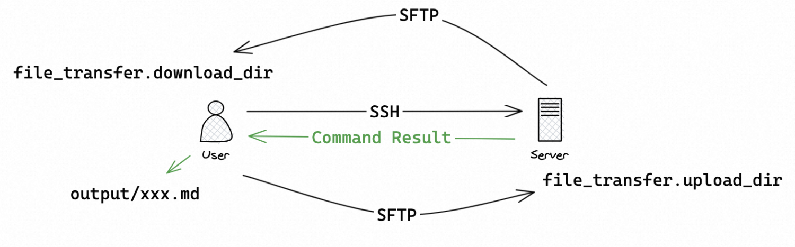
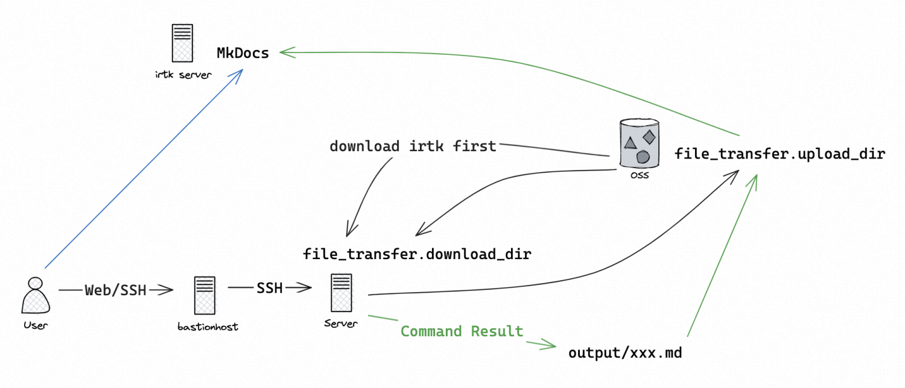
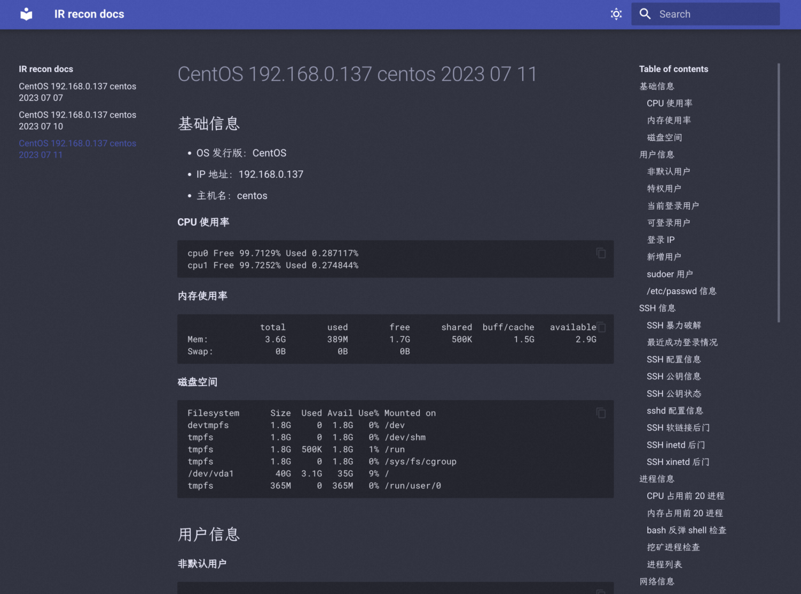

快速、全面、自动化地收集 Linux 主机关键安全信息。

<!-- more -->

## 目录结构

```bash
.
├── config.py         # 配置模块
├── config.yaml       # 配置文件
├── downloads         # 存放从远程下载的文件
│   └── access.log    # 样例文件，可删除
├── main.py           # 主程序，python3 main.py
├── oss.py            # OSS 模块
├── output            # 存放输出的结果
│   └── xxx.md        # 样例输出结果，可删除
├── recon             # 信息收集模块
│   ├── basic.py
│   ├── cron.py
│   ├── env.py
│   ├── files.py
│   ├── __init__.py
│   ├── log.py
│   ├── network.py
│   ├── process.py
│   ├── recon.py
│   ├── rootkit.py
│   ├── service.py
│   ├── ssh.py
│   └── users.py
├── requirements.txt  # 存放 Python 依赖信息，pip install -r requirements.txt
├── server.py         # 配合钉钉机器人使用的服务器程序，nohup python3 server.py &
├── ti.py             # 威胁情报模块
├── util.py           # 工具函数模块
└── yuque.py          # 语雀模块，已废弃
```

## 配置文件

由于文件中包含敏感信息，请务必确保该文件安全性。

```yaml
mode: remote # 运行模式：local/remote

ssh_info: # SSH 相关配置
  host: x.x.x.x # SSH 主机
  port: 22 # SSH 端口
  username: root # SSH 用户名
  password: "xxx" # SSH 密码
  pkey: "/path/to/id_rsa" # SSH 私钥

file_transfer: # 文件传输相关配置
  upload_dir: /tmp/irtk_upload # 远程上传路径
  download_dir: ./downloads # 本地下载路径

recon: # 信息收集项开关配置
  users: true
  ssh: true
  process: true
  network: true
  cron: true
  log: true
  files: true
  env: true
  service: true
  rootkit: true

process: # 进程信息收集相关配置
  cpu_top: 20 # 收集 CPU 占用前 x 的进程
  mem_top: 20 # 收集内存占用前 x 的进程

log: # 日志信息收集相关配置
  custom_log_path: /var/log/yum.log # 自定义收集的日志路径

files: # 文件信息收集相关配置
  verbose: false # 是否进行部分较为耗时的操作，时间过长时可关闭
  mtime: 1 # 查找过去 x 天内被修改的文件
  ctime: 1 # 查找过去 x 天内被修改的文件
  large_files_threshold: 200M # 大文件阈值

ti: # 威胁情报相关配置
  ak: xxx # 威胁情报 API Key

mkdocs: # MkDocs 相关配置
  enabled: false # 是否输出结果到 MkDocs，local 模式下无效
  endpoint: http://x.x.x.x:8000 # MkDocs 服务地址
  path: /root/mkdocs/docs # 本地 MkDocs 文档目录

oss: # OSS 相关配置
  endpoint: https://oss-cn-hongkong.aliyuncs.com # OSS endpoint
  bucket: ir-transfer-station # OSS bucket
  ak: xxx # OSS AccessKeyId
  sk: xxx # OSS AccessKey Secret
```

## 运行模式

### 远程模式

1. 在本地通过 `python3 main.py` 运行远程模式：



注意此时 `mkdocs.enabled` 需要设为 `false`。

> 在本地运行远程模式的方式即将废弃，届时正常情况下无需将 `mkdocs.enabled` 设为 `false`。

2. 通过 Scout 机器人以 ChatOps 方式运行远程模式：


注意此时不支持交互式 shell、文件上传下载等额外功能。

### 本地模式

对于堡垒机后的目标主机，首先从公网服务器下载 irtk（通过 curl、wget 等），并设置为本地模式，随后即可运行 `python3 main.py` 与公网 OSS 交互上传/下载文件：



此时，输出结果将自动上传至 OSS。随后在 irtk server 上将输出结果下载到 MkDocs 文档目录即可。

## 数据展示

输出的 Markdown 可使用任何 Markdown 阅读器/编辑器打开，同时也提供 MkDocs 站点方便阅读和查阅输出结果：



建议使用右上角搜索框对信息进行检索。

## 文件传输

- 输入本地文件路径时，可以使用绝对路径，也可以使用相对路径
- 输入远程文件路径时，只能使用绝对路径
- 注意 OSS 路径与文件系统路径的区别
- 允许传输整个目录，传输时会自动打包为 `.tar.gz` 文件（不支持从 OSS 下载整个目录）

Roadmap

- [x] 信息收集
  - [x] 基础信息
  - [x] 用户
  - [x] SSH
  - [x] 进程
  - [x] 网络
  - [x] 计划任务
  - [x] Web 日志/自定义日志
  - [x] 文件
  - [x] 环境变量
  - [x] 服务
  - [x] Rootkit
- [x] 数据展示
  - [x] Markdown 文件
  - [x] 语雀文档（已废弃）
  - [x] MkDocs 展示
  - [x] SLS 投递（通过上传 OSS 实现）
- [x] 使用配置文件
  - [x] SSH 信息、敏感数据（如 AK）
  - [x] 信息收集项开关
  - [x] 自定义信息收集选项
  - [x] 运行模式（local/remote）
- [x] 生成交互式 shell
- [x] 文件上传/下载
  - [x] 目录自动打包上传/下载
  - [x] local 模式下使用公网 OSS 中转文件
- [x] PID 快速查询进程
- [x] 快速威胁情报
  - [x] 文件
  - [x] 哈希值
  - [x] IP
  - [x] 域名
- [x] 一键痕迹清除
- [ ] 图形化界面
