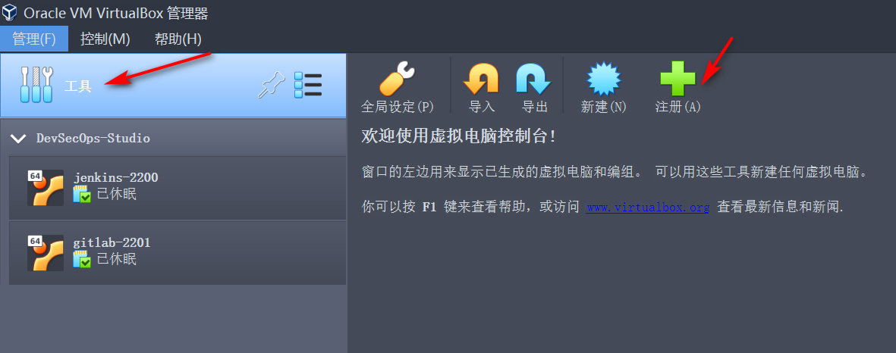
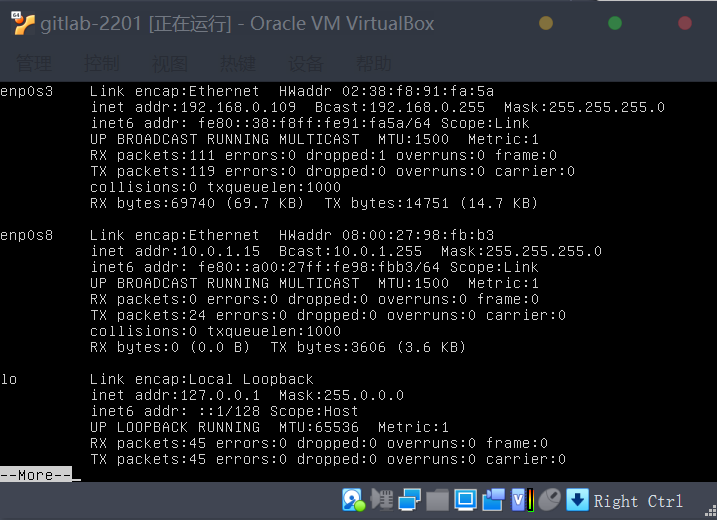
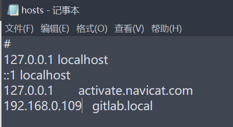
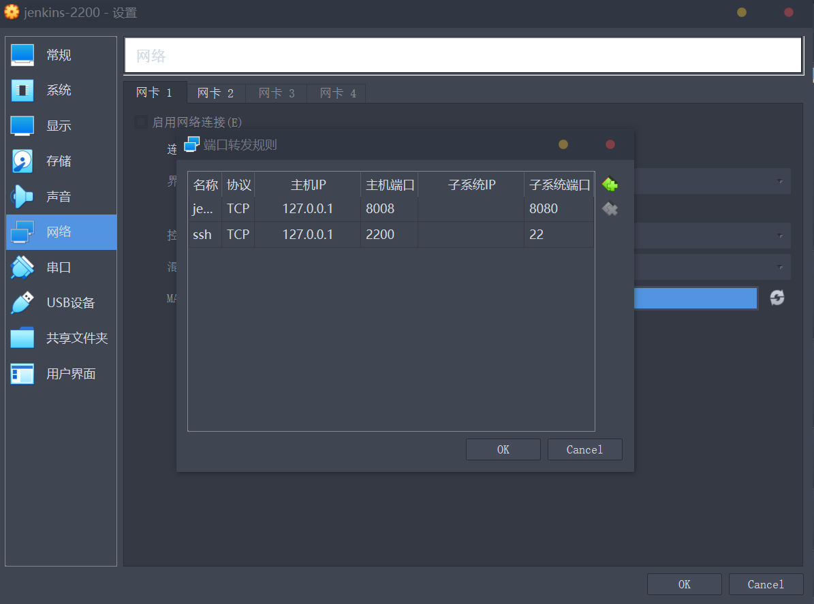
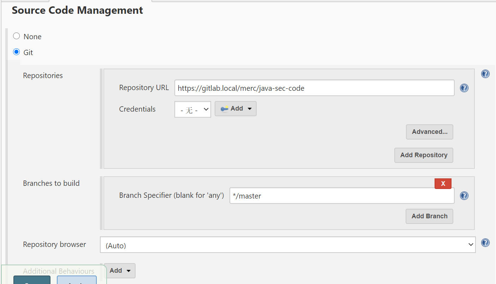
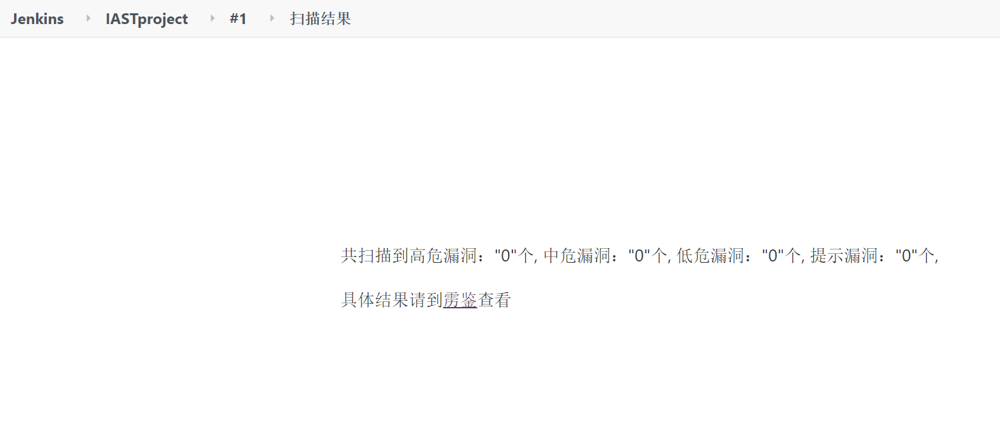
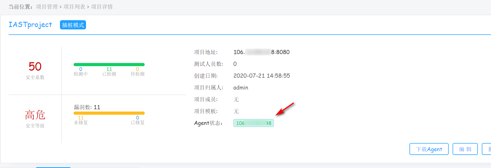
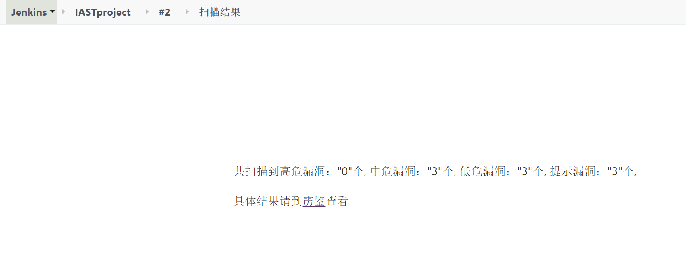

工作中写的一份指南文档。由于用的是测试环境，并没有需要脱敏的地方。

<!--more-->

## 环境准备

之前 XXX（同事名）已经按照 [DevSecOps Studio](https://github.com/hysnsec/DevSecOps-Studio) 中的说明搭建好了 DevSecOps 的基本环境，可以从他那里拷贝一份。由于我们演示时只需要用到 GitLab 和 Jenkins 两个虚拟机，其它的可以不用拷贝。大小在 11G 左右。

拷贝完成后，目录结构大致如下：


这里的 `2200` , `2201` 是配置端口转发后，两个虚拟机的 ssh 服务在本机上的对应端口，可以不用更改。

### 创建虚拟机

> 这一部分的操作对 GitLab 和 Jenkins 都需要做。

在创建虚拟机前需要先修改 `.vbox` 文件的配置，用文本编辑器打开 `.vbox` 文件，搜索 `\Users\neoo\gitool\`，替换为你电脑上存放 `DevSecOps-Studio` 的目录（绝对路径）。例如我的电脑上是：


> 实际上，只需要保证文件 `ubuntu-xenial-16.04-cloudimg-console.log` 和 `gitlab-2201` 文件夹处于同一目录下。

随后打开 VirtualBox ，点击 `工具 -> 注册` 并选择对应的 `.vbox` 文件，即可导入两个虚拟机：



### 配置虚拟机 ssh（可选）

> 这一部分的操作不是必需的。

进入虚拟机设置界面，点击 `网络 -> 高级 -> 端口转发` ，就可以将虚拟机的 ssh 端口映射到本机。正常情况下，此时已经映射到了 `2200/2201` 端口。


接下来，需要启动虚拟机，用 `vagrant/vagrant` 登录，并运行：

```bash
sudo vim /etc/ssh/sshd_config
```

将 52 行改为：

```
PasswordAuthentication yes
```

最后运行：

```bash
sudo service sshd restart
```

这样就可以通过本机的 ssh 客户端连接虚拟机了：


### 网络配置

默认情况下，Jenkins 和 GitLab 都采用 NAT 模式，此时我们本机是无法 ping 通虚拟机的。为了后续操作方便，我们可以将 GitLab 设置为桥接模式，即在 `网络 -> 连接方式` 中选择桥接网卡。

此时再启动 GitLab，用 `vagrant/vagrant` 登录，并运行 `ifconfig | more` ，可以看到桥接模式下的 IP 地址，这个地址对我们本机而言是可达的。



如图所示，GitLab 虚拟机的 IP 为 192.168.0.109。

> 桥接模式下就不需要端口转发了。此时 ssh 连接的目标也变成 `192.168.0.109:22`。

由于 GitLab 的服务运行在 443 端口，此时直接访问 https://192.168.0.109 是可以看到 GitLab 界面的。当然，也有可能是如下界面：


这种情况下一般只需要多等待一会儿就好了。

之所以采用桥接模式，是为了配合解析 GitLab 内置的域名 `gitlab.local`。现在只需要修改本机 hosts 文件，让 `gitlab.local` 解析到 `192.168.0.109` 即可。



访问 `https://gitlab.local`，应该能得到正常的 GitLab 登录页面了。

> 默认情况下 Jenkins 虚拟机应该能够解析 `gitlab.local` 域名，如果后面设置 Jenkins 时遇到域名解析问题，请检查 Jenkins 虚拟机的 `/etc/hosts` 文件。

> 如果需要信任 GitLab 的自签名证书，可以先 `cd /etc/gitlab && sudo mv ssl/* ./`，然后将 `gitlab.local.crt` 通过 SFTP 下载到本机并导入到受信任的根证书颁发机构里。

## GitLab 配置

注册账号、登录、创建新的公开 repo。在本地准备一个 Java Web 应用，我使用的是 [java-sec-code](https://github.com/JoyChou93/java-sec-code) 这个项目。

> 如果使用其它项目，请确保可以在 Java 6/7/8 中的至少一个运行环境上运行。原因：
> 

随后删除原项目目录下 `.git` 目录（如果你对 git 比较熟悉也可以不删除），运行（项目名需自行替换）：

```bash
cd java-sec-code
git init
git remote add origin https://GitLab.local/merc/java-sec-code.git
git add .
git commit -m "Initial commit"
git push -u origin master
```

即可将项目推送到 GitLab 上。期间遇到的问题请参考 [Git 文档](https://git-scm.com/doc)。

## Jenkins 配置

首先配置端口转发，将虚拟机 8080 端口映射到本机的任意未占用端口，如 8008：



然后访问 http://localhost:8008/ ，即可看到 Jenkins 页面。

接下来，按照 **雳鉴 IAST 第三方插件帮助文档** 一步步配置 Jenkins。需要注意的几点：

1. **雳鉴中提供的 Jenkins 插件可能存在兼容性问题，请务必使用修改后的 `IAST.hpi` 文件代替**。

2. 第二步中 `IAST 服务器地址 ` 请填写公网雳鉴地址，即 `http://47.100.14.22:81/`。

3. 第三步结束后，先如图配置好 repo 地址（项目名需自行替换）：

   

4. 第四步中 `被测站点地址` 即部署 Java Web 应用的服务器地址，形式一般是 `ip:port`。

5. 在第五步前，请先在服务器上部署好 Java Web 应用并运行，**防止雳鉴中项目创建失败**。例如我的应用是基于 Springboot 的，只需要运行 `java -jar java-sec-code-1.0.0.jar` 即可。

在构建完成后，预期结果是在雳鉴中创建了新的项目。但是扫描结果中是没有漏洞的，因为还没有进行插桩：



## 进行插桩扫描

进入新创建的项目详情页面下载 agent，然后 SFTP 传到服务器上。根据 **雳鉴 IAST 插桩 agent 帮助文档**来部署 agent。例如对于我的 Springboot 应用，只需要运行：

```bash
java -javaagent:./iast_agent.jar -jar java-sec-code-1.0.0.jar
```

待项目启动后，通过浏览器访问 Java Web 应用，即可在项目详情页面看到已经启动的 agent 了。



> 插桩扫描是基于流量的，因此只有发送请求后才能检测到 agent。

接下来对要测试的功能点发送请求即可进行扫描。例如对于存在 SSRF 漏洞的功能点发起请求：


在雳鉴界面中可以看到：


这时回到 Jenkins 再次进行构建，就可以得到正确的扫描结果了：



## 附录

- 内网（仅主机网络下） IP：
  - Jenkins：`10.0.1.11`
  - GitLab： `10.0.1.15`
- 相关目录：
  - Jenkins：`/var/lib/jenkins`，项目目录位于 `jobs` 下
  - GitLab：`/etc/gitlab`，配置文件为 `gitlab.rb`
- 在 Jenkins 中删除一个项目后，重新创建新项目前建议运行 `rm -rf /var/lib/jenkins/jobs/jobs`
