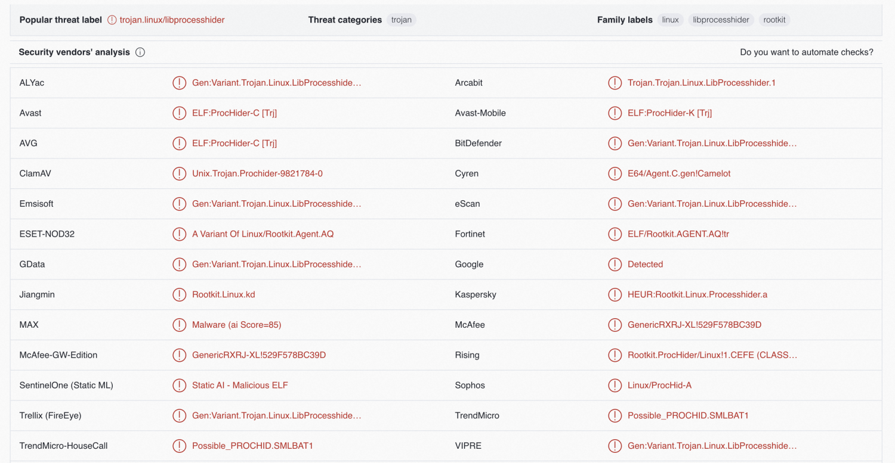
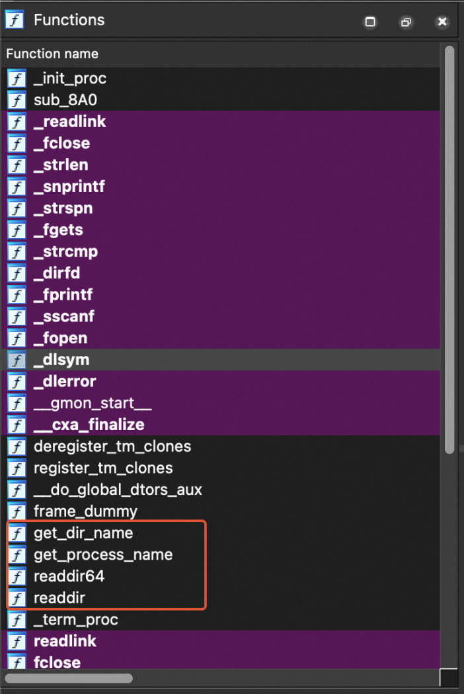
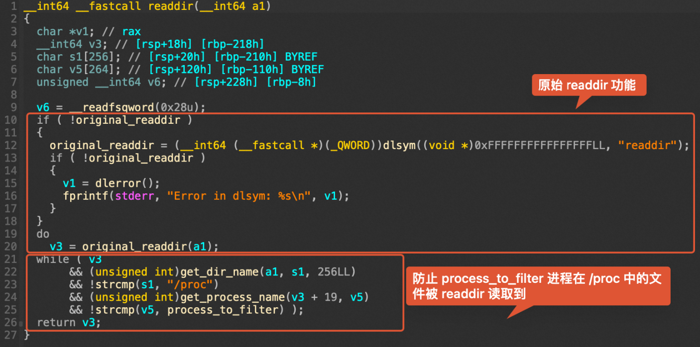
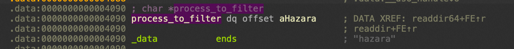
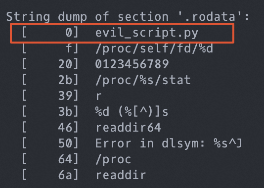

项目地址：https://github.com/gianlucaborello/libprocesshider

<!--more-->

libprocesshider 是一个开源的、非常简洁的 C 程序，编译成 .so 动态链接库并被加载后可以用于隐藏指定的进程，在 ps、lsof 等工具下都无法列出该进程。

## 典型场景

通常 libprocesshider 与挖矿程序一起使用，攻击者在植入挖矿程序后加载动态链接库隐藏挖矿进程。应急响应排查时表现为 CPU 占用极高，但找不到高占用的进程。

但由于 libprocesshider 仅仅隐藏进程，与矿池通信的网络连接并不会被隐藏，此时可以通过排查可疑网络连接发现异常。

## 利用方式

1. 修改 processhider.c 中的 `process_to_filter` 变量值为想要隐藏的进程名：

```c
/*
 * Every process with this name will be excluded
 */
static const char* process_to_filter = "evil_script.py";
```

2. 编译成动态链接库：

```bash
$ make
gcc -Wall -fPIC -shared -o libprocesshider.so processhider.c -ldl
$ sudo mv libprocesshider.so /usr/local/lib/
```

3. 添加该文件路径到全局动态链接文件中：

```bash
$ echo /usr/local/lib/libprocesshider.so >> /etc/ld.so.preload
```

另一种方法是在 profile 文件中添加 `export LD_PRELOAD=/usr/local/lib/libprocesshider.so`。

4. 使用 ps 和 lsof 测试，发现无法找到对应进程：

```bash
$ ps aux
USER PID %CPU %MEM VSZ RSS TTY STAT START TIME COMMAND
...

$ lsof -ni
COMMAND PID USER FD TYPE DEVICE SIZE/OFF NODE NAME
...
```

## 利用原理

Linux 下存在 `/etc/ld.so.preload` 文件或 `LD_PRELOAD` 环境变量时，其中写入的动态链接库会优先于默认的 `/lib` 和 `/usr/lib` 目录下的动态链接库被加载，因此可以利用这一特性覆盖 glibc 中的函数。根据源码可以发现 libprocesshider 覆盖了 glibc 的 `readdir` 和 `readdir64` 函数，而 ps、lsof 等查看进程列表的工具使用了这两个函数，因此当遍历到的进程名为 `process_to_filter` 变量的值时，会被直接跳过：

```c
if(get_dir_name(dirp, dir_name, sizeof(dir_name)) &&        \
    strcmp(dir_name, "/proc") == 0 &&                       \
    get_process_name(dir->d_name, process_name) &&          \
    strcmp(process_name, process_to_filter) == 0) {         \
    continue;                                               \
}
```

## 文件分析

实际攻击中，动态链接库的文件名不一定是 `libprocesshider.so`，我们无法直接发现一个动态链接库属于 libprocesshider。可以考虑使用以下几种方法：

1. 将文件或文件哈希上传到威胁情报平台，通常很容易检出：



2. 通过 IDA 等静态分析工具对文件进行逆向，容易发现一些特征，例如在 Functions 部分内部的有效函数很少，通常只有 `get_dir_name`、`get_process_name`、`readdir64`、`readdir` 四个：



另外对 `readdir` 自身进行分析也可以发现同样的逻辑：



双击 `process_to_filter` 可以发现其字符串值：



3. 可以通过 irtk 中的 `lph.sh` 检查文件的 .rodata 段，如果存在形如 `/proc/self/fd/%d`、`/proc/%s/stat`、`%d (%[^)]s`、`readdir64`、`readdir` 等字符串则基本可以确定属于 libprocesshider，此时第一个字符串即被隐藏的进程：



另外，工具箱中的 unhide 也可以找出被隐藏的进程，只需运行 `unhide proc` 即可。

## 清除过程

1. 删除动态链接库文件本身
2. 阻止加载恶意动态链接库
   1. 如果是通过修改 `/etc/ld.so.preload` 加载的，则删除 `/etc/ld.so.preload` 中加载该链接库的那一行（如果是仅有的一行，可以直接删除 `/etc/ld.so.preload` 文件本身）。通常客户系统中默认不存在 `/etc/ld.so.preload`，如果存在则大概率是攻击者添加的
   2. 如果是修改 `LD_PRELOAD` 环境变量加载的，需要检查各类 profile 文件（`/etc/profile`、`~/.bash_profile`、`~/.bashrc`、`~/.zshrc`、`~/.zprofile`、`~/.profile` 等）并删除对应的环境变量设置语句
   3. 实际应急响应中建议两种方式都排查一下
3. 清除动态链接库隐藏的进程
4. 检查系统中残留的后门，重点检查计划任务和网络连接
