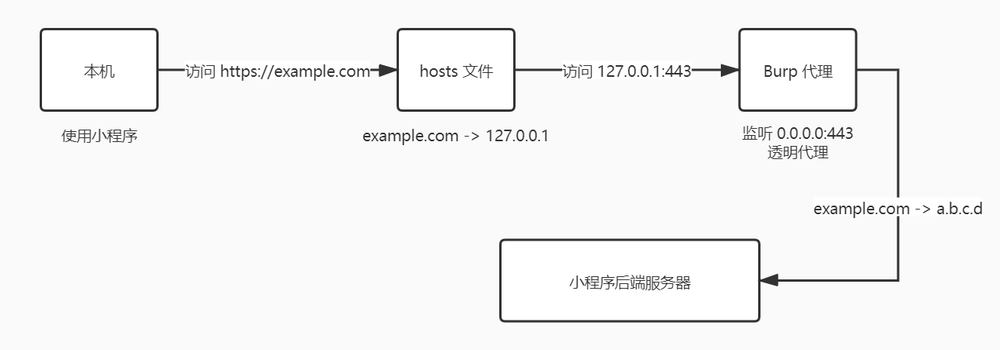

以 Burpsuite 为例。

<!--more-->

## 背景

之前针对某打卡系统写了每天自动打卡的脚本，今天一觉醒来发现后端更新导致脚本失效了，改脚本的同时把之前搜到的抓微信小程序包的方法记录下来备用。

## 步骤

### 获取小程序后端域名

进入小程序后点右上角 `···` -> 点击小程序名 -> 继续右上角 `···` -> `更多资料` 即可看到域名。假设为 `example.com`。

### 解析后端真实 IP

直接 `ping` 就行，别的办法如 DNS 查询也行。假设得到 IP 为 `a.b.c.d`。

### 修改 Burpsuite 配置

1. `Proxy -> Options -> Proxy Listeners` 将代理服务器设置为监听所有网卡（`All Interfaces`），端口 443，并开启透明代理（`Support invisible proxying`）。
2. `Project Options -> Connections -> Hostname Resolution ` 中手动设置域名解析，将 `example.com` 解析到 `a.b.c.d`。

### 修改本机 Hosts 文件

编辑 `C:\Windows\System32\drivers\etc\hosts` （Linux 下为 `/etc/hosts`），添加一行：

```
127.0.0.1 example.com
```

最后在电脑上打开微信小程序并用 Burpsuite 抓包。

## 原理


