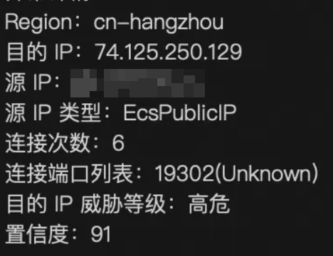
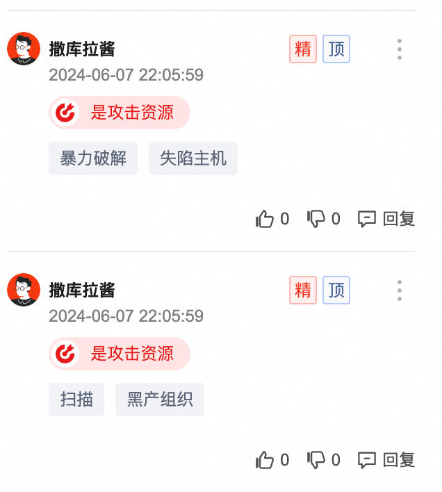
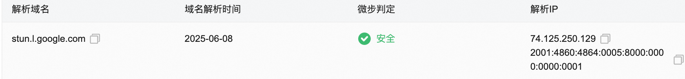

什么，情报是假的？

<!--more-->

## 事件背景

多个客户云防火墙出现主动外连风险 IP 事件，且外连 IP 相同（均为 74.125.25\[.\]129）：

## 初步排查

### 外部威胁情报

微步威胁情报显示为恶意：

且存在社区打标：

可以注意到大部分相关情报均显示外连端口为 19302，与告警详情一致。

但 RDNS 显示，该 IP 对应域名为 stun.l.google.com：

检索发现该域名为 Google STUN 服务器地址。

### 内部威胁情报

阿里云威胁情报平台显示该 IP 与 Mirai 有关，但活跃时间非常新：

RDNS 显示，最新活跃的域名解析依然是 Google STUN 服务器。

综合上述信息，推测事件原因：Mirai 恶意软件近期活跃，合法基础设施 IP 被恶意软件滥用导致误标记。

## 验证推测

根据 [what is STUN stun.l.google.com:19302 used for](https://stackoverflow.com/questions/20067739/what-is-stun-stun-l-google-com19302-used-for)，可以发现 Google STUN 服务器使用 UDP/19302 端口，与上述情报信息、告警详情一致。STUN 服务通常为 WebRTC 类服务需要调用以实现点对点通信，同时任何需要实现 NAT 穿透的服务（例如 VPN、组网工具 Tailscale、恶意软件 Mirai 等）。

由于该 IP 大概率为基础设施 IP，可以尝试直接在互联网上搜索相关信息。在以下 GitHub Discussion 中可以确定该 IP 为 Google STUN 服务器：[Network Connectivity/Firewall Logs (142.250.70.206 and 74.125.250.129)...](https://github.com/blakeblackshear/frigate/discussions/16955)。

由于需要产品侧进一步确认，提交内部产品工单转至威胁情报团队后，确认为误报。

## 后续处理

- [x] 已通过内部产品工单反馈至威胁情报侧，相关 IP 已从风险 IP 库中删除，次日更新生效
- [x] 由于威胁情报按天更新，需要临时抑制云防火墙-主动外连风险 IP 告警中目的 IP 命中 74.125.25[.]129 的告警
- [x] 由于历史威胁情报（微步/阿里云等）误标记情况多次出现，在 IoC 收集表中添加“反向威胁情报”将相关 IP 标记为安全
- [x] 后续同类事件（多客户外连同一风险 IP）建议优先考虑威胁情报误标记可能性，并直接与威胁情报团队确认
