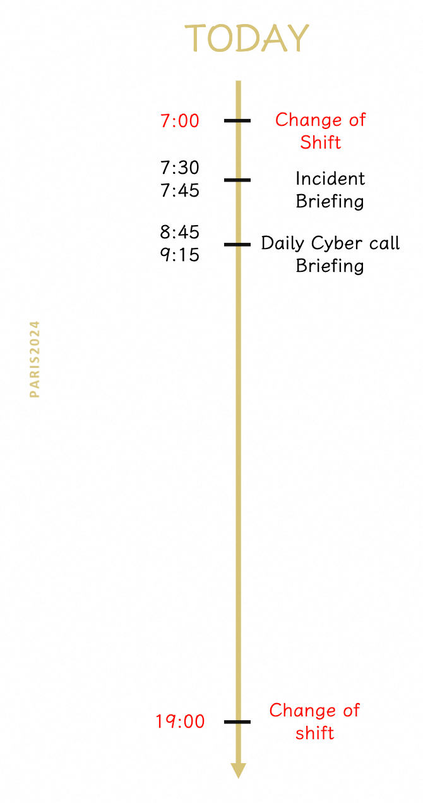
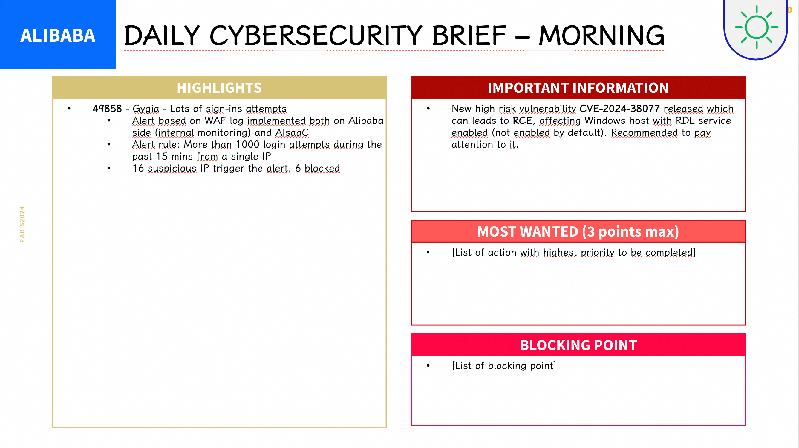
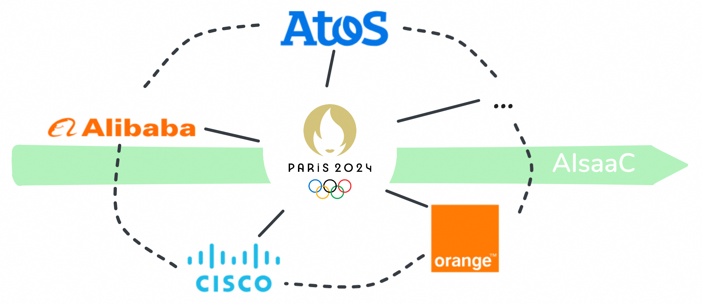
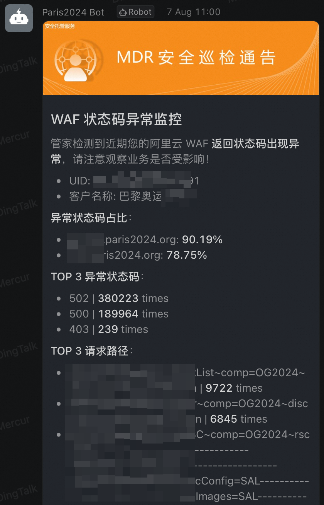
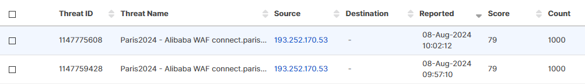

与世界各地的人们共筑防线。

<!--more-->

2024 年巴黎奥运会已经圆满落幕，赛事的成功不仅归功于运动员的精彩表现和观众的热情参与，也离不开强有力的安全保障措施。在当今数字化和互联化的背景下，奥运会面临的安全挑战不再局限于传统的物理威胁，网络空间的安全保障已成为赛事安全的重要组成部分。伴随着全球日益复杂的政治形势与逐步升级的网络威胁，如何保护赛事期间的大量数字基础设施、敏感数据和通信系统免受攻击，成为了奥运安保工作的重中之重。

为应对这些网络安全威胁，巴黎奥运会期间，法国组建了专门的网络安全运营中心（Cyber Security Operations Center，CSOC）。CSOC 专注于网络空间的防御，通过整合多方资源，利用先进的技术和实时情报，打造了一道高效的网络安全防线。它不仅持续监控赛事相关的网络流量，及时检测并应对潜在威胁，还在整个赛事过程中进行了多次模拟演练与应急响应，确保了赛事的数字基础设施能够在高强度的使用下稳健运行。

本篇文章将回顾 CSOC 在巴黎奥运会中的关键作用，探讨其如何通过高度协同的网络安全防御体系，成功应对复杂的网络威胁，为赛事的顺利进行保驾护航。这一经验不仅为未来的国际赛事提供了借鉴，也为全球网络安全防护的协作模式提供了新的思路。

## CSOC 是什么

CSOC（Cyber Security Operations Center，网络安全运营中心）是巴黎奥运会期间专门成立的网络安全指挥和协调中心，负责监控、检测和应对可能影响赛事的各种网络威胁。CSOC 集合了法国政府、国际奥委会以及多个技术合作伙伴的资源，旨在建立一个全面、实时且高度协同的网络安全防御体系。其核心功能包括网络流量监控、威胁情报分析、事件响应和应急预案执行，确保赛事相关的数字基础设施和敏感信息在全程安全可控。

在这个体系中，阿里云安全团队承担了 Cyber Security Duty Manager（网络安全值守经理）的重要角色。该角色的主要职责是对阿里云侧的各类安全事件进行实时监控、分析和响应，通过成熟的自动化安全运营工具与相关经验，持续关注赛事期间的网络流量和系统行为，确保潜在威胁能够被迅速识别和有效处理。此外，阿里云安全团队还负责对云上关键资源进行安全评估与优化，为赛事的数字化服务提供了强有力的安全保障。通过协同其他 CSOC 成员，阿里云团队为整个安全体系的高效运作贡献了关键力量，确保了巴黎奥运会在复杂的网络环境中实现了“零重大安全事故”的目标。

## CSOC 协作方式

巴黎奥运会涉及的系统、产品与服务众多，因此 CSOC 内不仅包括 Paris 2024（奥组委）相关角色，还汇集了多个供应商。为确保各方能够高效协作与顺畅沟通，从赛事演练阶段起，CSOC 就制定并完善了一整套协作机制。这些机制帮助各方在实际运行中实现了无缝对接，确保了整个网络安全体系的高效运作与及时响应。

首先是 Briefing 机制：在每一次值班开始后不久，CSOC 内会以现场 + 远程同步会议的形式，对包括安全事件在内的任何安全相关问题进行沟通：

在此过程中，每个供应商需要准备简单的 Presentation 说明需要关注的事件、重要信息、当前需求以及卡点，便于在会议上提出并与其他各方沟通：

同时，由于 CSOC 的团队规模较小且相对集中，除了主要采用的当面沟通方式外，大部分问题的沟通都通过 Webex、Teams 等即时通讯软件进行，而非依赖传统的电子邮件形式。这种方式不仅提高了沟通效率，也更符合安全问题处理的时效性要求。

那么，没有了电子邮件的记录，如何对安全事件进行管理和跟踪呢？CSOC 采用了 AIsaaC 平台（CSOC 监控响应平台）的工单来解决该问题。小到单个可疑 IP 调查、大到真实网络攻击事件，均会以至少一条 AIsaaC 工单的形式记录并分配到指定的组进行跟进，这样做确保了每一项问题都能够得到有效闭环处理。

## 典型案例

### DDoS 攻击/CC 攻击事件

在某次 DDoS 攻击事件中，云安全团队收到 DDoS 相关巡检告警后，通过现场沟通与 Webex 消息多种方式迅速通知 CSOC 各方。由 Atos 提交 AIsaaC 工单后，Eviden 侧询问相关攻击流量情况与 IP 访问情况。云安全团队通过 DDoS 产品控制台事件信息及 WAF 日志排查反馈结论，并导出了相关的 WAF 原始日志供 Eviden 进一步分析。最后根据安全团队建议，对相关 IP 完成了封禁。

尽管该次攻击事件未造成显著影响，协作过程中发现了 AIsaaC 相关监控覆盖不完全的问题，需要云安全团队监控能力作为补齐。同时，部分需要对云产品较为熟悉的操作（例如编写 SLS 语句满足特定安全产品日志查询需求），需要云安全团队执行协助排查。

### Web 扫描事件与产品后台告警

奥运级别的赛事必然面临海量的 Web 扫描，如何从中提取真正存在潜在威胁的扫描事件？为此，安全团队结合以往的客户服务经验，制定了一套针对多种云安全产品的告警逻辑和阈值，旨在平衡误报和漏报的风险。基于巴黎奥运的具体业务需求，这套逻辑和阈值进行了进一步调整，以形成适用于巴黎奥运的告警系统。当告警产生时，安全团队通过 Briefing 会议或现场沟通（取决于告警风险等级）将其同步给 CSOC，以便评估是否需要采取封禁措施，最大程度确保告警准确性。

除了安全团队设定的告警之外，产品后台针对部分明显异常情况也存在告警机制。例如在本届赛事期间，WAF 产生了多次 API 调用大量报错告警以及响应成功率下跌告警。安全团队收到相关通知后，第一时间现场与 Paris 2024 方沟通以快速确定需要对接的相关方（例如 API 调用者），随后与产品、业务方协同确定问题根因并推动问题解决。

### 来自 CSOC 的安全事件

此外，也存在阿里云侧无法直接监控到的事件，此时由 CSOC 同步至阿里云，安全团队根据云产品相关日志进行协助排查。在某次 Azure 账号密码泄露事件中，微软将相关账号信息同步至 CSOC 后，安全团队排查云上各租户是否存在类似账号，并成功发现 1 项预生产环境中相关的 RAM 账号。随后，Paris 2024 将该信息同步至 IAM 团队对该 RAM 账号进行密码重置。

类似地，某次 Eviden 通过 Cisco 相关工具监测到针对云上 61616 端口的批量扫描后，同步阿里云侧协助排查。安全团队根据历史经验、威胁情报以及流量情况判断该事件为针对 ActiveMQ 服务的漏洞探测，随后与 Atos 沟通确定了云上所有运行 ActiveMQ 服务的主机，并在云上检查相关端口公网开放情况。最终并未发现公网暴露的 ActiveMQ 服务，确定风险可控。

### 提前闭环的安全事件

在某次值班过程中，收到云防火墙巡检告警，出现出方向流量超限。安全团队登录控制台分析日志后，确定相关流量与一个 Crowdstrike 域名有关。在安全团队同步该事件前，Crowdstrike 侧在 Briefing 会议上先提到了正在进行中的 Agent 安装事项，安全团队判断两者极有可能相关。因此，安全团队与 Crowdstrike 侧针对该事件进行了现场沟通，最终确定了上述猜想并完成事件闭环。之后，多个租户再次出现了相关的云安全中心告警，在证据完整的情况下，安全团队得以快速完成相关事件闭环。

### 多重监控纵深防御

在赛事后期，CSOC 发现某系统出现单 IP 高频访问应用登录接口的情况，并组织各供应商联合排查，最终确认为攻击事件并封禁相关 IP。为后续能检测到同类事件，安全团队与 Eviden 合作，在安全团队内部以及 AIsaaC 侧均设置针对单 IP 高频访问登录接口的监控告警机制，互为 backup。由安全团队编写 WAF 日志查询分析语句以及相关说明后，由 Eviden 设置对应的 AIsaaC 规则，成功产生告警：

## 总结

2024 年巴黎奥运会的成功，不仅是运动员的卓越表现和观众的热情参与的结果，还得益于网络安全保障的坚实基础。CSOC 通过先进的协同防御体系，成功应对了复杂的网络威胁，确保了赛事数字基础设施和敏感信息的安全。在此过程中，阿里云安全团队在提供实时的安全监控和响应分析的同时，还通过高效、严谨的协作机制提供全方面的技术支持，为网络安全防护贡献了关键力量。此次经验不仅为未来国际赛事的安全保障提供了新模式，也为全球网络安全防护的协作机制树立了成功典范。
