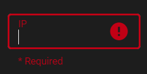
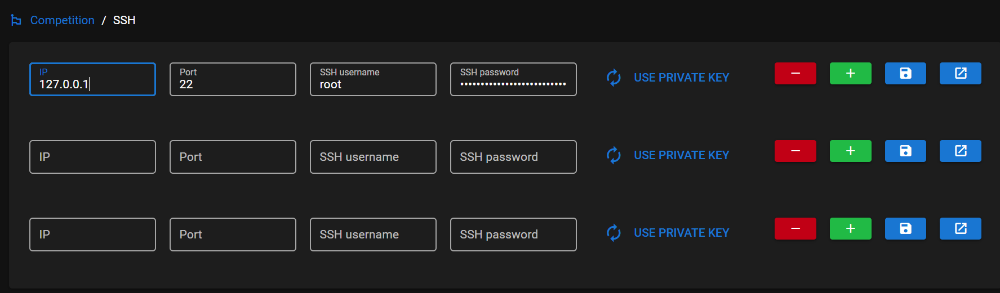
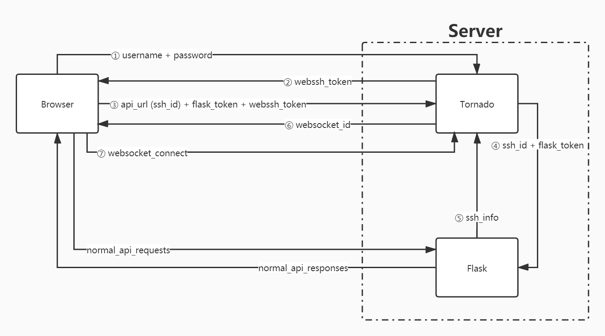
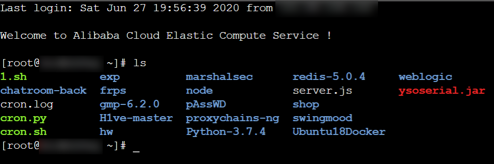
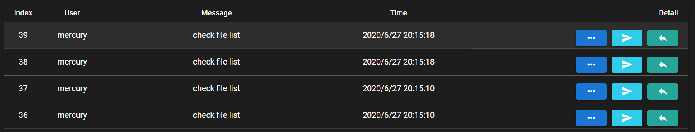

Platform for Attacking Swiftly & Smoothly With Defending

<!--more-->

## pAssWD 简介

我和两位研究生学长在打了几次 AWD 比赛后，深深体会到了经验和工具对这种比赛模式的巨大帮助。前者只能靠多参加比赛来积累，后者却是可以自己逐步收集的。为了在 AWD 比赛中发挥地更加出色，我们开始搭建自己的 AWD 框架，我给它起了个有趣的名字：pAssWD (_Platform for Attacking Swiftly & Smoothly With Defending_)。

我们相信，这一框架将改善我们的 AWD 比赛体验。

## 开始开发

项目基于我们已经收集到的一些 python 脚本。考虑到兼容性问题，统一版本为 Python 2.7。为了增加灵活性和可移植性，我们采用前后端分离开发。这样我不仅可以做 web 端，还可以构建跨平台的 Electron 桌面端。最终分工为两位学长负责后端开发，我负责前端开发。

## 技术架构

- 前端
  - Quasar Framework (Vue.js)
- 后端
  - Flask (Python)
  - Tornado (Python)

## 需求

通过交流确定了一些尚不成熟的需求，这里仅包含核心功能：

- 登录与认证
- 配置比赛信息和靶机信息
- 文件上传与共享
- 实时读取并显示系统日志与靶机日志
- 备份 web 目录
- 解压本地备份文件并查杀后门
- 根据后门生成混淆 payload
- 根据攻击日志生成 payload
- 自动化攻击
- 区分不同语言文件
- java 流量记录

## 开发初期

### Login

首先是登录功能（注册比较简单），后端采用 HTTP Basic Auth 配合 jwt 进行认证。因此我使用 axios 模块 `config` 中的 `auth` 这个字段来设置 Basic Auth 内容。那么登录时的代码就类似：

```js
this.$axios.get("token", {
  auth: {
    username: this.username,
    password: sha256(this.password),
  },
});
```

这里对密码进行了哈希后发送，方便直接存储到数据库，同时避免明文传输。

随后会收到一个 jwt，我需要做的就是将该 jwt 进行 base64 后，拼接到 `Basic` 后面并填入 HTTP 请求头 `Authorization` 中。考虑到之后的所有请求都需要这一步，我将该过程放在了请求拦截器中：

```js
// http basic auth
Vue.prototype.$token = () => {
  let state = JSON.parse(sessionStorage.getItem("store"));
  if (state) {
    let info = state.userInfo;
    if (info) {
      return "Basic" + Base64.encode(info.token + ":");
    }
    return "";
  }
};

Vue.prototype.$axios.interceptors.request.use(
  config => {
    config.headers.Authorization = Vue.prototype.$token();
    return config;
  },
  err => {
    Promise.reject(err);
  }
);
```

这里维护登录状态的方式一如既往，将 `store` 整个存入 `sessionStorage`，页面刷新时取回。

完成了请求拦截器的设置，就可以保证登录后发出的请求都带有认证 token 了。

> 顺带一提，注册功能虽然实现了，但是并没有在 UI 中直接开放。我们认为实际使用中该功能没有必要，因此仅仅用来调试。

### Settings

这个部分技术上其实没有太多突破，主要时间花在沟通上了。最初没有考虑不同比赛的问题，因此 Settings 页面直接放了靶机设置。但是引入不同比赛后，每个比赛都有自己的靶机，因此分出了一个 Competition 页面用来对比赛进行详细设置，包括设置靶机。

首先遇到的问题是，由于设置了表单验证，在填写 ssh 信息时如果空着会触发提示，就像这样：



然而文本框内部右侧多出来的警告图标会导致文本框的长度被改变，从而改变同一行内其它元素的位置。我的解决方案是设置小于原宽度的 `max-width`，使得文本框长度固定。

---

然后需要对靶机信息进行增删改查，界面大概是这样的：



这里的问题在于当点击保存后，有可能向数据库插入所有数据，即使其中有一部分已经存在。因此后端多发送了一个 `id` 字段，前端点击保存发送数据时，如果某条数据没有 `id`，说明不在数据库中，是新增的数据；否则就是已有数据，正在进行修改。

类似的问题出现在删除上。点击加号后界面上会多出一行靶机信息，但还没有持久化到数据库里。如果这时候点击删除，那么是不需要和后端交互的。然而如果是对数据库中已存在的数据点击删除，则需要发送请求了。怎么区分这两种情况呢？答案是一样的，借助上面提到的 `id` 字段。

---

接下来花了很长时间做浏览器端的 ssh，经过一段时间的选型最终决定后端采用基于 tornado 的 webssh，前端采用 xterm.js 来进行交互，协议是 websocket。连接 webssh 的过程比较复杂，因此我画了一张图来让自己理解：



在这个部分上我们花了如此多的时间，以至于最后看到这个界面时，我们都长舒了一口气：



本来还以为要用别的办法来连接 ssh 了。这都要感谢 webssh 项目支持通过 api 方式登录。

> webssh 的速度比我想象的快。

最后在这个部分又花了些时间讨论 ssh 页面加侧边栏和 “一键” 系列功能的事情，不过后来移动到别的板块了。

### Sharing

这里就是文件上传、下载、获取文件列表的功能，没有什么难度。不过在把脚本上传到靶机时，耗时比较长，因此添加了 loading 的标识来改善用户体验。

在这一阶段的开发中我们开始通过 `api_doc.md` 来沟通，大体上就是一个 api 列表和 todolist 的结合：

```markdown
- auth.py:

  - [x] /api/users/reg
    - methods=['POST']
    - recv: `{username,password}`
    - return: `{data:{username}}`
  - [x] /api/users/<int:id>
    - methods=['GET']
    - recv: `id`
    - return: `{data:{username}}`
  - [x] /api/token
    - methods=['GET']
    - recv: Basic Auth (`username,password`) or (`"username":token,"password":any`)
    - return: `{data:{token,username,duration}}`
  - [x] /api/resource
    - methods=['GET']
    - recv: Basic Auth
    - return: `{data:"Hello, %s!"% username}`
```

选择这种方式是因为 flask 的 swagger 插件需要重构代码……

---

在这个部分，第一次出现需要获取当前比赛的所有靶机信息的需求。后来我将这个功能封装成了一个异步函数：

```js
// get current gameboxes
Vue.prototype.$getTargets = async function () {
  let curComp = await this.$axios.get("get_current_game").then(res => {
    if (res) {
      return res.data.data;
    }
  });

  if (!curComp) return [];
  return this.$axios.get(`get_ssh/game/${curComp}`).then(res => {
    if (res) {
      return res.data.data;
    }
  });
};
```

顺便学了下 `async/await` 用法。之前对 `await` 有些误解，实际上这里的 `await` 仅仅保证 `curComp` 在后续使用时已经接收到了 `Promise` 对象 `resolve` 的值，异步调用依然是异步调用。

### Backing up

这个部分基本都是后端的活。不过目前，查杀后门和 web 应用识别两个功能虽然已经测试成功，但是还没有想好对应的 UI 怎么做。

### Logging

这是花费时间最长的部分，主要是由于中间一段时间我和后端同学空闲时间总是错开、以及引入 SSE 后后端出了很多错误。

日志记录分为两个部分，pAssWD 系统的日志以及每个靶机自己的日志。靶机日志又分为 web 日志和 attack 日志，后者是前者的真子集，仅包含了被认为是恶意攻击的日志。这里首先需要新日志的消息提醒，最初想通过 websocket 来做，后来采用了更轻量级的 SSE。

前端进行消息提醒的逻辑很简单：登录时建立 SSE 连接，收到新日志时，Vuex 维护的 logs 变量就 + 1。这会导致 Logging 侧边栏出现红点，而当点进 Logging 页面后红点就会消失。

之后就是在 Logging 页面通过 API 获取日志列表。其中 `message`，`param`，`data` 三项由于各种原因（长度过长、格式变化太多），我选择在每条日志的最后让用户点击按钮自行查看 json 格式的数据。如图：



中间出现了一些沟通上的问题，大多围绕数据格式、数据获取方式等问题。主要是因为我不熟悉后端的实现、后端也不熟悉前端的一些原理导致的。

最后就是如何让用户不刷新页面也能接收新日志的问题了。目前和后端讨论下来，虽然后端已经给出了一种解决方案，暂时还是将该功能的开发延后到开发中期。

日志这一块还有一些问题没有解决，将在后续和实时接收日志功能一起解决。解决这些问题需要的时间，估计不少于我们在 webssh 问题上花费的。

## 开发中期

2020 年 6 月 27 日，pAssWD v0.1.0 发布，标志着开发初期的结束。目前 pAssWD 已经可以在 AWD 赛事中起到一定作用了。同一天又发布了 v0.1.1，修复了由于代码优化导致的 bug。

中期开始写 CHANGELOG，学习了像 SemVer, badges 以及 GitHub commit message 的 Angular 规范等等。大约在 v0.3.0 发布前学习了 [利用 GitHub Actions 进行持续部署](https://signormercurio.github.io/post/GitHubActionsCD/)，感觉开发流程确实有必要引入自动化。
