在有限的条件和碎片化的信息中识别关键线索。

<!--more-->

> 本文共计约 11000 字，完整阅读大约需要 40-70 分钟。

## 前言

应急响应是网络安全工作中极具挑战性的环节。与渗透测试或安全加固不同，应急响应往往在时间紧迫、信息不完整的条件下展开，要求安全人员在有限的线索中快速定位问题根源、还原攻击路径并制定修复方案。

然而，许多应急响应相关的学习资料侧重于罗列检查命令和排查项，却较少涉及实际场景中的分析思路——面对海量日志从何入手？关键证据缺失时如何推进？多台主机同时告警意味着什么？这些问题往往需要在实战中不断积累才能形成有效的方法论。

本文试图通过六个真实案例，从不同角度呈现应急响应过程中的分析逻辑与实用技巧。这些案例涵盖了 Web 攻击溯源、主机入侵排查、供应链安全及云环境风险等多个领域，既有证据充分的常规场景，也有需要逆向推理的复杂情况。每个案例都将重点阐述分析过程中的决策依据和思维方式，而非仅仅展示最终结论。

希望这些案例能够帮助读者在面对类似问题时，具备更清晰的分析框架和更灵活的应对思路。

## 常规 Web 攻击事件

在这一案例中，我们将介绍：

- Web 攻击事件中，如何确定需要排查的对象和日志源
- Web 攻击事件中最为常用的 Web 日志定位与分析方法

---

在多数 Web 攻击事件中，我们在主机上观察到云安全中心告警后会与客户确认主机上运行的服务、从而确定被攻击的具体网站/域名。不过在这个案例中，客户完全不了解受害主机上的业务情况，因此我们需要先确定排查的对象。

### 确定排查对象与日志源

云安全中心的 Webshell 告警是我们的入手点：

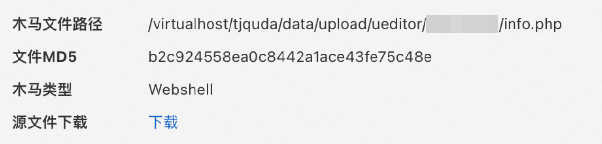

从告警详情的文件路径中，我们可以推测出：

1. 这台 ECS 使用了虚拟主机的方式同时运行了多个网站
2. 攻击者利用了文件上传漏洞将恶意文件上传至正常的上传目录（`/data/upload`）
3. 漏洞可能与 UEditor 组件相关

由于多个网站的存在，我们可以想到，无论是排查 WAF 日志还是主机侧日志，我们都需要先确定被攻击的具体网站。我们先从域名入手，通过 RDNS 反查 ECS 公网 IP 对应的域名：

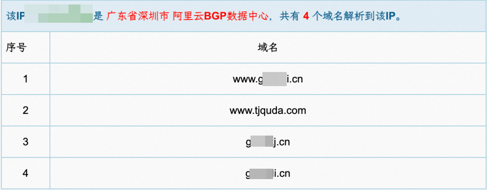

从文件路径不难推测，被攻击的网站对应的是 tjquda 这个域名。在一些其他案例中，ECS 实例名称、容器（镜像）名称也可以成为我们推测依据的一部分。确定域名后，下一步就是确定排查的日志源。如果受影响域名同时满足**接入 WAF、WAF 开启全量日志、配置源站保护**三个条件，那么就可以先排查 WAF 日志。前两项可以在 WAF 控制台直接看到，第三项可以通过直接访问源站地址来检查。

遗憾的是，这个案例中我们直接访问 ECS 公网 IP 返回了正常的网页，说明源站保护未正确配置，此时可以认为 WAF 形同虚设了，排查 WAF 日志可能没有太大意义。因此我们需要主机侧 Web 日志的支持。

### 定位 Web 日志

但要定位到主机侧 Web 日志并不总是那么容易，通常有以下几种思路：

1. 从告警详情中的文件（如 Webshell）路径或进程命令行（如 Java 进程命令行参数）中提取 Web 服务工作目录
2. 先尝试定位到主机上提供 Web 服务的具体进程： 1. 检查主机进程列表，根据告警详情定位具体的进程 2. 检查主机网络连接列表，根据告警详情以及监听端口定位具体的进程
   如果进程是一个直接对外提供服务的程序（例如命令行以 java、node 开头），通过查询 `/proc` 目录等方式定位其工作目录；如果进程是一个 Web 中间件（如 Nginx、Apache 等），检查该中间件的默认日志目录。如果默认日志目录没有找到，检查该中间件的安装目录（通过 `which`、`locate`、`find` 或者先试试默认安装目录）、找到配置文件，从配置文件中直接获取日志位置（或者发现根本没有日志）。
3. 直接通过 `find` 根据最后修改时间定位 `.log` 结尾的文件，可能遗漏无后缀的日志文件
4. 如果 Web 服务在容器内，优先尝试 `docker logs` 或 `crictl logs` 这类命令，不少容器会将 Web 日志打印到标准输出，成为容器日志

> 对于容器内运行的服务，我们首先需要定位到具体的容器。通常我们可以根据告警中的信息提取一些潜在的关键字，并与主机上的容器名称比对，但有时可能会需要从告警的进程链中直接提取容器 ID。

如果上述尝试均以失败告终，那么主机上存在 Web 日志的可能性就比较渺茫了。不过在过程中我们往往有机会发现一些应用自己记录的日志。多数时候这些日志并没有 Web 日志来得有用，但的确也有一些场景下应用日志起到了令人惊喜的作用。

例如，在某 Java Web 应用命令执行事件中，我们在应用日志中发现了以下记录：

```bash
2024-05-27 18:35:07.076 [http-nio-10.0.78.51-3089-exec-1084] ERROR datart.server.config.WebExceptionHandler : Syntax error in SQL statement "SELECT * FROM  ( <[*]#ASSIGN EX=""freemarker.template.utility.ObjectConstructor""?NEW()>  SELECT '${ex(""javax.script.ScriptEngineManager"").getEngineByExtension(""js"").eval(""new java.util.Scanner(java.la""+""ng.Runtime.getRuntime().exec(\""ifconfig\"").getInputStream()).useDelimiter(\""\\\\A\"").next()"")}' )  AS `DATART_VTABLE` LIMIT 1000 OFFSET 0"; expected "identifier"; SQL statement:SELECT * FROM  ( <#assign ex="freemarker.template.utility.ObjectConstructor"?new()>  select '${ex("javax.script.ScriptEngineManager").getEngineByExtension("js").eval("new java.util.Scanner(java.la"+"ng.Runtime.getRuntime().exec(\"ifconfig\").getInputStream()).useDelimiter(\"\\\\A\").next()")}' )  AS `DATART_VTABLE` LIMIT 1000 OFFSET 0 [42001-200]org.h2.jdbc.JdbcSQLSyntaxErrorException: Syntax error in SQL statement "SELECT * FROM  ( <[*]#ASSIGN EX=""freemarker.template.utility.ObjectConstructor""?NEW()>  SELECT '${ex(""javax.script.ScriptEngineManager"").getEngineByExtension(""js"").eval(""new java.util.Scanner(java.la""+""ng.Runtime.getRuntime().exec(\""ifconfig\"").getInputStream()).useDelimiter(\""\\\\A\"").next()"")}' )  AS `DATART_VTABLE` LIMIT 1000 OFFSET 0"; expected "identifier"; SQL statement:
```

这条记录告诉我们，datart 服务中的 Freemarker 模版注入漏洞被攻击者利用，且业务疑似在 SQL 语句中使用了 Freemarker 模版。基于这一背景知识，我们很快就能在实际业务中找到这样的业务逻辑：


而当我们复现漏洞后再次查看应用日志时，可以发现非常关键的错误堆栈信息：


最后，我们基于堆栈信息逐步分析调用链，结合代码审计确定了这一 0-day 漏洞在代码中实际产生的位置。

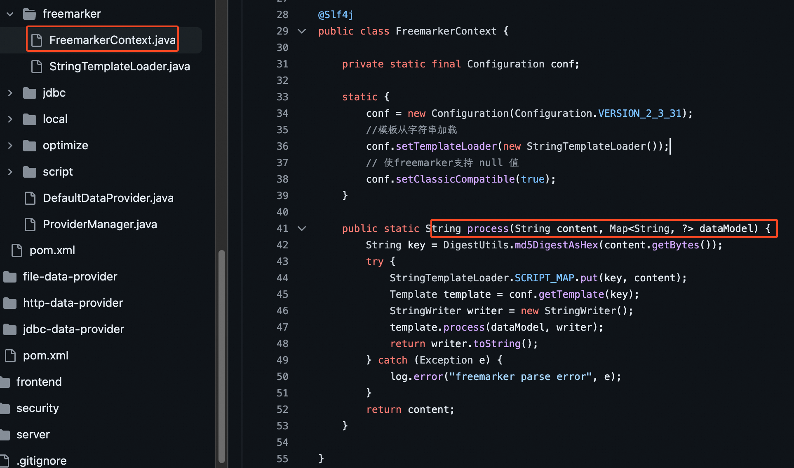

所以，如果我们一通翻箱倒柜只找到了应用日志，也不用灰心，或许其中就潜藏着极为关键的证据。

### 分析 Web 日志

在这个案例中，我们通过第 2 种方法找到了 Nginx 日志，并通过在日志中查找告警触发时间的字符串找到了相关的可疑 Web 请求，根据请求特征确定了具体漏洞。同时，我们根据日志中记录的攻击 IP，获取了同一攻击者发起的所有请求、以及针对同客户其他 UID 的攻击行为。许多其他 Web 攻击事件未必会如此顺利，但**基于告警时间过滤日志**的思路是类似的，这一思路也可以用在应用日志、WAF 日志乃至任何日志的分析上。

#### WAF 日志

如果我们运气比较好，客户受影响域名已经接入了 WAF 并开启了日志，那么我们可以自由组合以下常用的方法来辅助排查：

- 域名过滤，通常都需要设置来缩小排查范围
- 使用 SLS 查询界面左侧快捷视图，直接展开关键的索引字段如 `request_path`/`status`/`request_length` 等查看**分布特征**
- 关键词过滤，例如对于已知攻击者登录了管理员账户的场景，全文搜索 `login`、`admin` 等关键字
- 状态码过滤，也许我们只想关注那些返回 200 的请求，或者我们已知攻击请求会导致服务端返回 5xx，只需关注 5xx 请求
- 源 IP 过滤，适用于已知攻击 IP 需要回溯攻击行为的场景
- 请求特征过滤，如 `request_method: POST and request_length > 1000`
- 信息聚合分析，如 `| SELECT request_path, COUNT(*) cnt GROUP BY request_path ORDER BY cnt DESC`

#### 时区

时间信息在应急响应溯源中的重要性不言而喻。然而，实战中常常被忽略的一个点恰恰是时间的一个重要属性：时区。

日志中的时区会受到应用配置、服务器默认时区等影响，因此未必和云产品默认的 UTC+8 时区一致，在进行时间比对时需要注意。好在大部分日志中都会在时间部分明确标注时区信息，以 Nginx 日志为例，UTC+8 时区的时间会以 `+0800` 结尾：

```bash
[02/Jan/2006:15:04:05 +0800]
```

许多服务器的默认时区是 UTC+0，因此在日志中会显示为 `+0000` 或 `+00:00`。同时，以 ISO 8601 标准显示的时间也是 UTC+0 的，如 `2006-01-02T15:04:05Z`。

#### 攻击源

日志记录的局限性在于记录者之眼：如果应用看到的请求来源是前面的反向代理，那么应用记录的日志中的攻击源 IP 也会是反向代理的 IP，但这并不是真实的攻击者 IP。此时我们必须回到【定位日志】部分再找到反向代理的日志，并基于时间（理想情况下是基于请求 ID，如果有的话）比对出关键请求，获取反向代理日志中记录的攻击源 IP。

> 理想情况下，反向代理应将真实请求 IP 在自定义 HTTP Header 中传递给后端应用，从而避免这个问题。但由于我们已经不得不登录主机排查日志了，可以认为这种配置良好的情况在这个场景下是不存在的。

#### 关键请求

即使精确到秒，在告警触发的时间也可能有许多正常的、与攻击无关的请求。多数时间我们能通过请求的特征定位到可疑的请求，例如长度特别长、包含 `upload`/`execute`/`invoke` 等关键字、匹配已知漏洞利用请求特征、甚至是不符合常规业务逻辑等。但也有一些时候，攻击请求隐藏在一大堆正常请求中间，难以直接通过明显的特征来识别。

根据去重后的请求 URL 逐个了解其对应的业务逻辑，当然是一种有效的兜底方法。有时这种方法甚至会需要我们对几个最终留下的接口进行代码审计以发现利用点，这也不是不能接受。但由于攻击请求往往不止出现一次，我们有一种看似笨拙实则高效的方式来大幅缩小排查范围，甚至直接定位到关键请求。

思路并不复杂：只需从日志中过滤出**每次**告警触发时间附近的所有请求，并取交集。不在交集中的请求必定与告警触发无关，而触发告警的请求则留在了交集中。因此告警触发次数越多，越容易缩小排查范围。下面我们以一个典型的案例来具体说明这一思路如何实施。

某客户云安全中心产生了可疑的进程行为序列告警，在这类告警中每个进程行为都会有一个对应的进程启动时间：


从进程链中可以看到，攻击手法是典型的 Java Web 应用命令执行，那么理论上每次命令执行都需要一次 Web 请求，因此在以下时间点应该均能找到至少一次攻击请求：

- 18:18:12
- 18:23:44
- 18:31:01
- 18:36:15
- 18:36:25
- 18:48:27

以下是我们排查这六个时间段内 WAF 日志的结果：

- 18:18:11 ~ 18:18:13

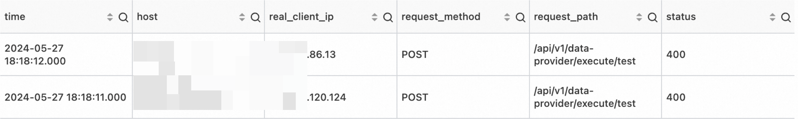

- 18:23:43 ~ 18:23:45

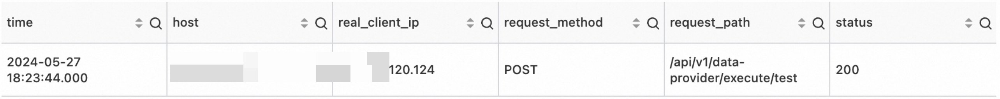

- 18:31:00 ~ 18:31:02

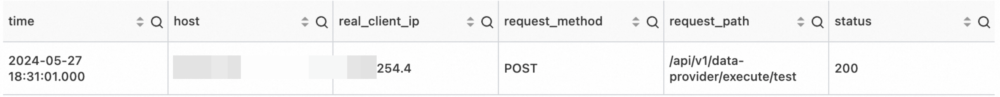

- 18:36:14 ~ 18:36:16

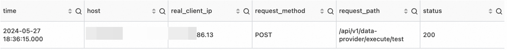

- 18:36:24 ~ 18:36:26

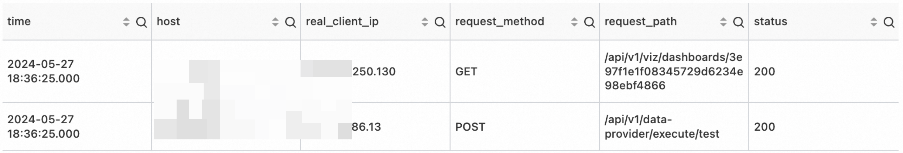

- 18:48:25 ~ 18:48:27


从上述日志可以发现，攻击者利用的接口为 `POST /api/v1/data-provider/execute/test`（该接口需登录后调用，客户前期反馈存在账号密码泄露情况），攻击 IP 为 \[REDACTED\].86.13、\[REDACTED\].120.124 和 \[REDACTED\].254.4。

#### 基于会话反向匹配

我们都知道，获取攻击者 IP 后可以以 IP 作为查询条件反查攻击者所有访问记录。从这些访问记录中，我们可以尝试分析出属于攻击者的共同特征，如特殊的 User-Agent 等，但这些特征并不总是存在。不过，如果服务器在 Cookie 中设置了类似会话 ID 的项，那么可以利用会话 ID 的唯一性反向匹配出所有与攻击请求关联的请求。以 WAF 为例，WAF 会设置 `acw_tc` 作为会话标识，那么我们可以用如下语句查询 WAF 日志：

```sql
real_client_ip: '<攻击 IP>' | SELECT DISTINCT regexp_extract(http_cookie, 'acw_tc=([^;]+)', 1) AS acw_tc
```

再以获取到的所有 `acw_tc` 的值作为 `http_cookie` 字段的查询条件即可。类似的字段还有 `aliyungf_tc`、`PHPSESSID`、`JSESSIONID` 等。

## 缺少证据的 Web 攻击事件

在这部分案例中，我们将介绍：

- 缺少 Web 日志的情况下，如何对应用日志及主机侧其他关键信息进行分析
- 无法正向构建证据链的情况下，如何收集信息猜测结论，反向查找证据

---

客户主机被上传了 Webshell，但无 WAF 日志、同时主机上也无 Web 日志。通常来说，无 Web 日志意味着无法找到直接的日志证据，这对于我们主机侧信息收集的细致程度提出了更高的要求。此时有必要检查任何可能相关的其他类型日志、配置文件、缓存文件、特殊目录等。

### 初步排查

我们首先检查应用日志，依靠关键词搜索发现了启动 `/bin/sh` 的尝试：


以及异常的请求路径 `/s1ystem.ico`：

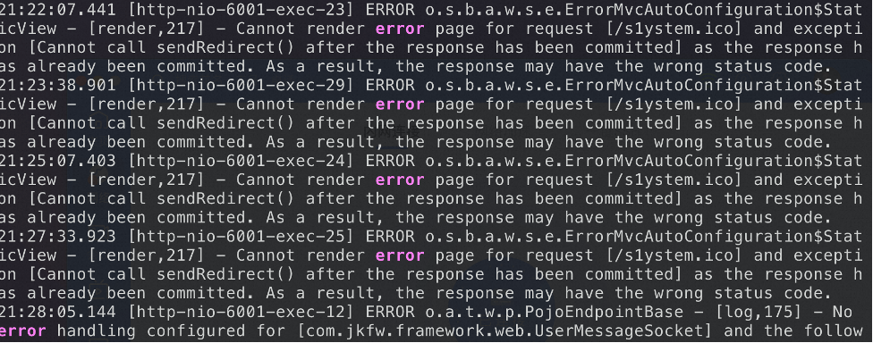

可以参考的关键词诸如：warn, error, fail, fatal, wrong, not permitted/allowed, forbidden, cannot, 5xx（状态码）, exception, eval, "leetspeak"（[一种特殊的单词拼写方式](https://en.wikipedia.org/wiki/Leet)）

随后我们检查了主机上的各种文件，在 `/root/nohup.out` 文件中发现了 `ruoyi-admin.jar` 相关信息，并在主机上找到了该 jar 包，可以推测该服务使用了 RuoYi 框架。

但是到这里为止，我们已经收集了所有能收集到的信息，尽管得知了大概率与攻击事件相关的请求路径，却依然无法确认具体漏洞。当正向证据链构建无法实现时，我们不妨基于已知信息大胆**猜测**结论，并反向查找支撑结论的证据。

### 反向推理

通过查询 RuoYi 框架历史漏洞，并根据漏洞利用针对的请求路径进行逐一排除，猜测利用的漏洞可能与 Shiro 有关。随后在 `nohup.out` 中查找 `rememberMe` 关键字获得大量结果，且时间与告警时间吻合：

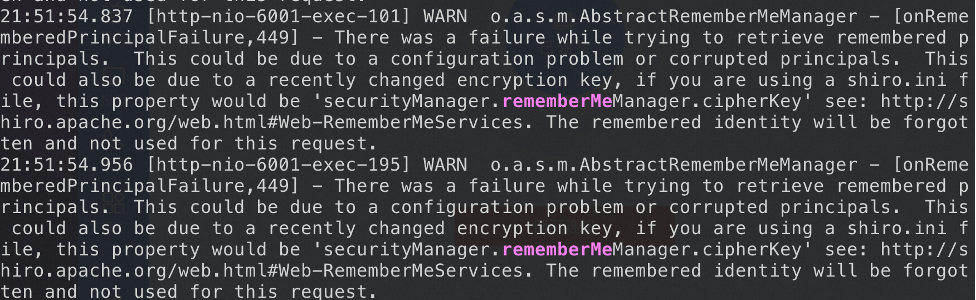

根据上述日志中的报错信息 `securityManager.rememberMeManager.cipherKey` 以及 [RuoYi 历史漏洞情报](https://doc.ruoyi.vip/ruoyi/document/kslj.html#%E5%8E%86%E5%8F%B2%E6%BC%8F%E6%B4%9E)，推测利用的漏洞为 RuoYi <= v4.3.0 Apache Shiro 默认密钥致命令执行漏洞。进一步溯源后，我们通过反编译 jar 包、云安全中心漏洞扫描结果、漏洞复现产生类似日志等方式，确认了这一结论。

不难发现，反向推理大致遵循以下过程：

1. 基于主机侧文件与进程信息，推测服务使用的应用框架
2. 基于主机侧留存的日志文件，确定攻击手法大致分类、漏洞大致类型、可能的请求特征等信息
3. 通过搜索引擎获取步骤 1 中应用框架的历史漏洞，基于步骤 2 中的信息逐一排除，通常可以将可能的漏洞范围缩小至 3 项以内
4. 对于剩余的漏洞，如果云安全中心支持扫描该漏洞，可以查询漏洞扫描结果；如果存在公开 PoC，可以**在客户授权后**尝试进行漏洞复现，并检查是否产生了类似的现象/告警/日志
5. 同时，还存在利用 0-day 漏洞或业务逻辑漏洞的可能，此时通常需要反编译后代码审计确定具体漏洞

## 主机批量感染挖矿程序事件

在这一案例中，我们将介绍：

- 当大量云主机批量产生同类型告警时，除了内网横向外，我们应考虑的另一种可能性
- 一种常用的进程隐藏机制的原理和对抗方案
- 如果我们能获取恶意脚本内容，如何快速进行清理恢复

---

接到应急响应需求时，云安全中心已经有大量主机感染了挖矿程序：


一个很自然的想法是，攻击者攻陷某台主机后，在内网进行了横向移动，并将挖矿程序扩散至其他主机。如果是这样，那么我们的思路就是找到第一台感染挖矿程序的主机（也就是时间上疑似与本次事件相关的第一个告警），并查明它是如何被入侵的。

### 云助手命令日志

即使没有这样的思路，在实际开始溯源前尽可能遍历所有相关告警也是非常有必要的，许多情况下告警详情中潜藏着非常关键的信息。在这个案例里，我们回溯告警时发现了一条**云助手异常命令**的告警：


通过查阅阿里云 OpenAPI 文档，我们得知调用 CreateCommand 可以在云助手中创建一条命令，不难推测这条反弹 Shell 命令已经在主机上执行了。那么如何验证这一推测呢？

在 ECS 控制台-运维与监控-云助手-命令执行结果中，我们可以看到所有**通过云助手下发执行的命令日志**，并且这些日志是无法在控制台上删除的：


分析日志可以确定，攻击者实际入侵方式是通过泄露的 AK 调用云助手，在多台主机上执行恶意命令。

> 建议提前熟悉 [云助手安装目录文件说明](https://help.aliyun.com/zh/ecs/user-guide/overview-10?spm=a2c4g.11186623.help-menu-25365.d_0_7_0_0.6e431171OtxIdp&scm=20140722.H_64601._.OR_help-T_cn~zh-V_1#4a16b1a8886u5)，以快速识别同类命令执行攻击特征。

### libprocesshider 处置方案

后续主机侧排查中，我们通过一个没有进程信息的可疑网络连接发现存在进程隐藏行为，随后通过 [chkrootkit](https://www.chkrootkit.org) 工具确定 `/etc/ld.so.preload` 加载了恶意动态链接库。通过将动态链接库文件上传至沙箱，确定该文件属于 libprocesshider 变体。[libprocesshider](https://github.com/gianlucaborello/libprocesshider) 是一个开源的、非常简洁的 C 程序，编译成 .so 动态链接库并被加载后可以用于隐藏指定的进程，在 ps、lsof 等工具下都无法列出该进程。

#### 典型场景

通常 libprocesshider 与挖矿程序一起使用，攻击者在植入挖矿程序后加载动态链接库隐藏挖矿进程。应急响应排查时表现为 CPU 占用极高，但找不到高占用的进程。

但由于 libprocesshider 仅仅隐藏进程，与矿池通信的网络连接并不会被隐藏，此时可以通过排查可疑网络连接发现异常。

#### 利用方式

1. 修改 processhider.c 中的 `process_to_filter` 变量值为想要隐藏的进程名：

```c
/*
 * Every process with this name will be excluded
 */
static const char* process_to_filter = "evil_script.py";
```

2. 编译成动态链接库：

```bash
$ make
gcc -Wall -fPIC -shared -o libprocesshider.so processhider.c -ldl
$ sudo mv libprocesshider.so /usr/local/lib/
```

3. 添加该文件路径到全局动态链接文件中：

```bash
$ echo /usr/local/lib/libprocesshider.so >> /etc/ld.so.preload
```

另一种方法是在 profile 文件中添加 `export LD_PRELOAD=/usr/local/lib/libprocesshider.so`。

4. 使用 ps 和 lsof 测试，发现无法找到对应进程：

```bash
$ ps aux
USER PID %CPU %MEM VSZ RSS TTY STAT START TIME COMMAND
...

$ lsof -ni
COMMAND PID USER FD TYPE DEVICE SIZE/OFF NODE NAME
...
```

#### 利用原理

Linux 下存在 `/etc/ld.so.preload` 文件或 `LD_PRELOAD` 环境变量时，其中写入的动态链接库会优先于默认的 `/lib` 和 `/usr/lib` 目录下的动态链接库被加载，因此可以利用这一特性覆盖 glibc 中的函数。根据源码可以发现 libprocesshider 覆盖了 glibc 的 `readdir` 和 `readdir64` 函数，而 ps、lsof 等查看进程列表的工具使用了这两个函数，因此当遍历到的进程名为 `process_to_filter` 变量的值时，会被直接跳过：

```c
if(get_dir_name(dirp, dir_name, sizeof(dir_name)) &&        \
    strcmp(dir_name, "/proc") == 0 &&                       \
    get_process_name(dir->d_name, process_name) &&          \
    strcmp(process_name, process_to_filter) == 0) {         \
    continue;                                               \
}
```

#### 文件分析

实际攻击中，动态链接库的文件名不一定是 `libprocesshider.so`，我们无法直接发现一个动态链接库属于 libprocesshider。可以考虑使用以下几种方法：

1. 将文件或文件哈希上传到威胁情报平台，通常很容易检出：

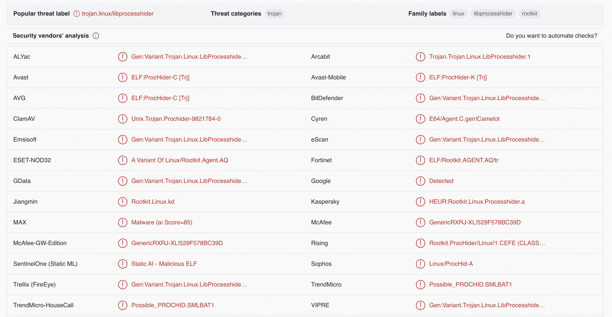

2. 通过 IDA 等静态分析工具对文件进行逆向，容易发现一些特征，例如在 Functions 部分内部的有效函数很少，通常只有 `get_dir_name`、`get_process_name`、`readdir64`、`readdir` 四个：


另外对 `readdir` 自身进行分析也可以发现同样的逻辑：

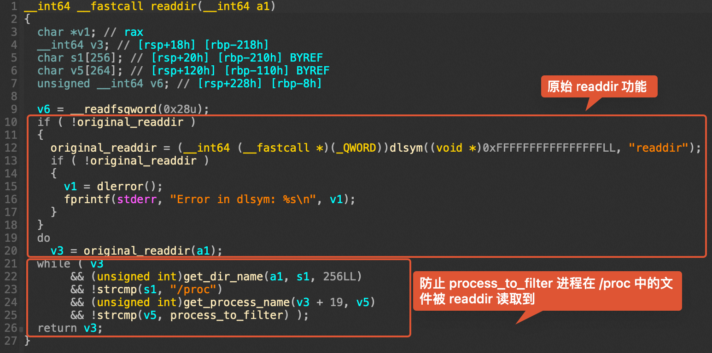

双击 `process_to_filter` 可以发现其字符串值：


3. 可以直接检查文件的 .rodata 段，如果存在形如 `/proc/self/fd/%d`、`/proc/%s/stat`、`%d (%[^)]s`、`readdir64`、`readdir` 等字符串则基本可以确定属于 libprocesshider，此时第一个字符串即被隐藏的进程：


另外，[unhide](https://manpages.ubuntu.com/manpages/jammy/man8/unhide.8.html) 工具也可以找出被隐藏的进程，最简单的方式是直接运行 `unhide proc`。

#### 清除过程

1. 删除动态链接库文件本身
2. 阻止加载恶意动态链接库
   1. 如果是通过修改 `/etc/ld.so.preload` 加载的，则删除 `/etc/ld.so.preload` 中加载该链接库的那一行（如果是仅有的一行，可以直接删除 `/etc/ld.so.preload` 文件本身）。通常客户系统中默认不存在 `/etc/ld.so.preload`，如果存在则大概率是攻击者添加的
   2. 如果是修改 `LD_PRELOAD` 环境变量加载的，需要检查各类 profile 文件（`/etc/profile`、`~/.bash_profile`、`~/.bashrc`、`~/.zshrc`、`~/.zprofile`、`~/.profile` 等）并删除对应的环境变量设置语句
   3. 实际应急响应中建议两种方式都排查一下
3. 清除动态链接库隐藏的进程
4. 检查系统中残留的后门，重点检查计划任务和网络连接

### 恶意脚本清理恢复

最后，在主机侧排查时发现了攻击者植入的恶意脚本文件，以其中一个为例：


为了实施清理恢复，我们当时参照脚本内容手动编写了恢复脚本：


实际上，如今我们可以借助 AI Coding 工具，要求根据恶意代码实现清理恢复脚本（或解释恶意代码含义），通常可以达到较高准确率。但依然建议对生成的脚本内容进行审计后，在已备份的主机环境或镜像环境中运行。

## 主机系统命令替换事件

在这一案例中，我们将介绍：

- 一种常见的系统命令替换手法及恢复方式
- 在无日志参考的情况下，如何在不同进程之间建立关联
- 一种不太常见的持久化方式，以及如何通过系统软件包校验进行检测

---

客户发现服务器空载时 CPU 占用率较高，这通常是被隐藏的挖矿程序导致的，最常见的两种隐藏方式就是动态链接库劫持或命令替换。我们登录主机确认动态链接库正常后，通过 `rpm -V` 很快验证了第二种可能性：


这里最简单的恢复方法就是重新安装 procps-ng 软件包，但安装失败了，错误提示和 `rename` 相关：

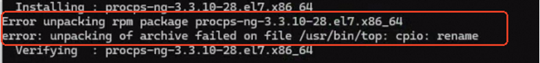

推测可能 `top` 等命令文件被添加了不可变属性，导致无法被重命名或删除。尝试使用 `chattr` 和 `lsattr` 命令查看和修改文件属性，均未成功：


### 命令恢复

查看命令输出，这里 `chattr` 的命令输出是 `vmlinux1` 开头，而 `lsattr` 干脆消失了，说明攻击者预想到我们会通过这两个命令来恢复其他系统命令，因此对这两个命令也进行了篡改：

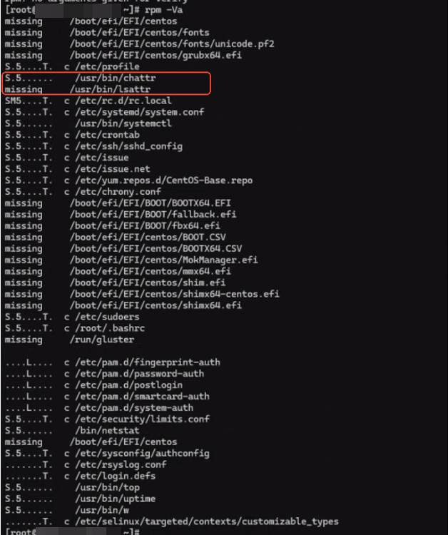

此时我们也无法删除和重新安装 `chattr` 本身，因为它也被添加了不可变属性。因此，我们下载 `busybox`，使用未被篡改的 `chattr` 来修改主机上的 `chattr` 文件属性：

```bash
$ ./busybox chattr -ai /usr/bin/chattr
$ ./busybox lsattr /usr/bin/chattr
-------------------- /usr/bin/chattr
$ rm -f /usr/bin/chattr
$ yum reinstall e2fsprogs
```

之后再用正常的 `chattr` 去除其他命令文件的不可变属性，并重新安装即可。

### 进程关联

针对挖矿程序进行样本分析和一系列排查后，我们发现主机上没有日志能够说明挖矿程序的植入途径。正当我们无望地翻找恶意进程的 `/proc` 目录企图从中挖掘出一些额外信息时，我们在 `fd` 中发现了另一个进程 `250303` 的 fd：

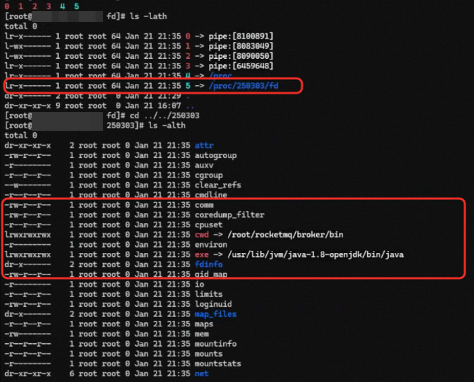

从进程 `cwd` 不难发现，这是一个 RocketMQ 进程，我们成功关联了恶意进程与正常业务进程，大幅缩小了排查范围。尽管主机上依然没有对溯源有帮助的 RocketMQ 日志，但我们后续根据 RocketMQ 版本基本确定了利用的具体漏洞。

另一种极其常用的方式是，对于我们怀疑由 systemd 启动的进程，可以直接 `systemctl status <pid>` 来查看启动该进程的 systemd 服务以及日志，随后可以用 `journalctl -u <service_name>` 进一步查看日志。有时，我们也能在服务的 `CGroup` 字段中看到其他关联的进程，对于溯源非常有帮助：

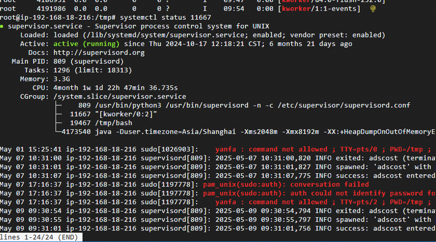

### 额外收获

执行 `rpm -Va`（CentOS）或 `dpkg -V`（Debian）可以帮助我们校验系统软件包的完整性，因此我们在应对系统命令替换这类事件时常常会用到。但在接下来这个案例中，这一命令为我们带来了额外的收获。

我们通过检查被进程锁定的文件，发现系统进程 `systemd-logind` 被进程注入了：


我们尝试了重启进程、清除恶意服务、排查隐藏进程、排查用户态/内核态 rootkit，均一无所获，进程注入依旧存在。最终，我们通过 `rpm -Va` 发现 python2.7 的 `os.py` 有被修改过，且修改时间为近期：

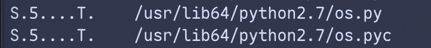

检查文件内容，发现在初始化函数中使用 CDLL 加载了可疑文件：


使用 sysdig 抓取日志，发现 Python 监控脚本的确打开了该文件：


最终经过分析，确认该文件即导致进程注入的罪魁祸首。

## 供应链攻击致命令执行事件

在这一案例中，我们将介绍：

- 一种利用应急人员思维定式的防御规避手法
- 时间信息在恶意文件排查方面的作用
- 如何合理利用（广义的）威胁情报协助溯源

---

客户主机上出现恶意命令执行，我们在云安全中心进程启动日志中，发现恶意命令均通过 crond 执行：

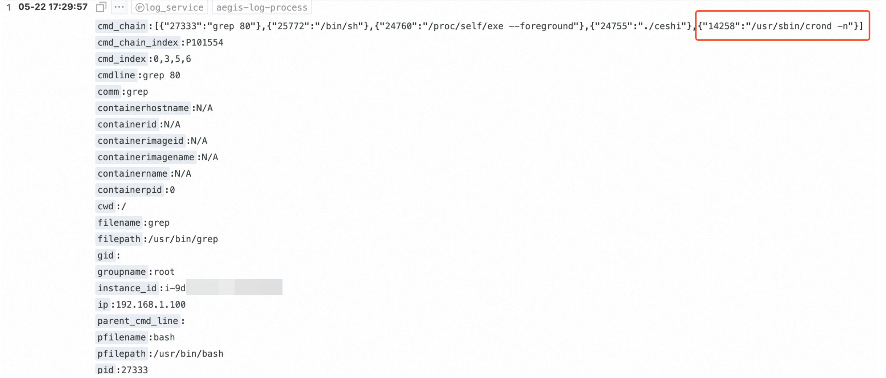

我们自然会认为是攻击者写入了恶意计划任务，但在检查了所有计划任务之后都没有发现异常。因此猜想，有没有可能 `/usr/sbin/crond -n` 本身就是伪装为 crond 的恶意进程，而非通过计划任务执行命令呢？验证这个猜想比较容易，通过 `stat /usr/sbin/crond` 我们发现其最近改动时间（ctime）与告警时间相近。

> Linux 下文件存在三个时间属性：
>
> - 访问时间 atime：最近一次访问文件的时间，如读取文件内容、运行文件均会改变 atime
> - 更改时间 mtime：最近一次文件内容被修改的时间，ls -l 显示的就是 mtime
> - 改动时间 ctime：最近一次文件状态改变的时间，文件写入、权限变更等均会改变 ctime
>
> Windows 下文件也存在三个时间属性：
>
> - 创建时间：文件首次出现在硬盘上的时间
> - 修改时间：最近一次文件内容被修改的时间
> - 访问时间：最近一次文件状态改变的时间

### 威胁情报查询

然而，通过威胁情报检测该 `crond` 文件却未发现异常。尽管有可能是文件做了免杀，我们依然尝试多查询了几个威胁情报平台，最终在 VirusTotal 的社区中发现了一个名为 oneinstack trojan 的 Graph：


为什么这个信息会引起我们的注意？因为在登录主机后我们在 root 目录下看到了 oneinstack 这个关键字，**留下了在当时看来无关紧要的印象**：


我们从 Graph 中了解到文件的别名 `cr` 以及加载的动态链接库，其中有一个 `/lib64/libaudit.so.2` 并不是常见的动态链接库名称。逆向分析后，发现该文件加载 `/lib64/libaudit.so.2` 的方式存在异常：


### 广义威胁情报查询

而在主机 root 目录下我们的确发现了 oneinstack 相关文件，据此可以推测本次事件与上面提到的 oneinstack trojan 存在关联。由于威胁情报平台信息有限，我们转向最大的威胁情报源：互联网搜索引擎，实施进一步调查。Google 一下 oneinstack trojan 就可以发现的确存在 [oneinstack 官网安装包被挂马事件](https://github.com/oneinstack/oneinstack/issues/487)，从 http://mirrors.linuxeye[.]com/oneinstack-full.tar.gz 上下载的 oneinstack 安装包是已被替换的版本，其中 `oneinstack/include/openssl.h` 的第 137 行被植入恶意代码。

我们检查主机上对应的文件，可以发现恶意代码，证明本次事件的确与 oneinstack 官网安装包被挂马事件有关：


**基于告警时间过滤日志**的思路在这个案例里用在了 `/var/log/messages` 上，我们借此确定了攻击者执行的全部行为。类似地，我们还可以**基于已知恶意文件时间全盘搜索恶意文件**，确保主机上残留的恶意文件被全部清除。

## AK 泄露后被深度利用事件

在这一案例中，我们将介绍：

- 高权限 AK 泄露后，攻击者可能执行的一系列有效利用方式
- 如何基于 Actiontrail 对 AK 调用记录进行分析，以及相关的局限性
- 如何使用云安全中心溯源模块检查攻击者行为

---

我们的分析从一个明显属于恶意行为的告警开始，却发现该告警被手动加白了，并且备注了误报：


负责告警处置的同学因此认为客户自己先在控制台上处置了告警，这一告警可以作为误报完成闭环了。不过后续出现的一系列告警导致应急响应小组介入，我们很快就发现事有蹊跷。

### 控制台接管

在该告警之后，出现了多项 AK 异常调用类型的告警，源 IP 均相同且均被手动忽略。与客户确认并非客户自己执行的操作后，我们判断这些告警加白和忽略的动作均为**攻击者执行**，用于将云安全中心告警从默认的“未处理”列表中隐藏。

根据告警中的 RAM 用户名 crossfire 及 AccessKey ID，可以直接确定攻击者使用 cf 工具对泄露的主账号 AK 进行了利用。通过 Actiontrail 检查 crossfire 用户的 API 调用记录，可以验证我们上面的判断：

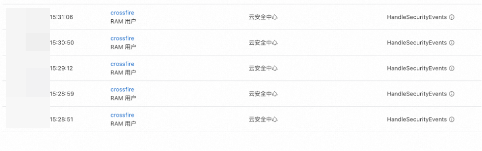

由于攻击者获取了主账号 AK，不会存在权限不足的问题，因此无论是创建后门 RAM 用户、处置安全告警、还是最传统的在 ECS 上通过云助手执行命令均可以成功执行。这里略过我们对攻击者通过云助手执行的命令细节的分析，只给出我们观察到的两个重要现象：

1. 攻击者对于 Web 服务目录进行了大量翻找，这在一般的云助手命令执行事件中并不常见
2. 最初的云安全中心告警中的恶意文件 `java8` 并不是通过云助手命令执行植入的

### 恶意文件溯源

为了查清 `java8` 是如何植入的，我们登录主机排查。由于告警详情中父进程为 `/sbin/agetty`，因此攻击者已经登录了主机并启动终端（而非通过云助手间接执行命令）。对于主机登录记录进行排查，发现 14:39 存在非正常登录记录：


我们根据 tty 定位到了对应终端下运行的进程，又通过 PID 关联到了 `login -- root` 的进程：

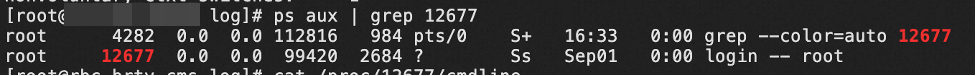

同时主机未开放 SSH 等远程登录端口，结合 tty1 登录、无登录 IP 的特征，我们判断攻击者是通过 VNC 登录了主机 root 账号，随后手动执行命令下载 `java8` 恶意文件。

随后，主机上出现新的**发现后门（Webshell）文件**告警，Webshell 路径为 `/mnt/cms-tomcat-8.5.75/webapps/cms/update_bak.jsp`。我们通过 Web 日志很快发现了访问该 Webshell 的唯一 IP，而通过检查该 IP 的所有访问记录，发现攻击者下载了一个名称比较复杂的 sql 文件，尝试窃取数据：


攻击者仅用单次请求即命中该文件，可以推测与上面 AK 列举 Web 目录的操作有关。但我们依然不知道 Webshell 是如何上传的，因为日志中只有访问记录没有上传记录。

### 云安全中心溯源模块

检查主机命令历史无果后，我们尝试检查云安全中心告警的溯源模块：


可以发现，父进程依然为 `login -- root` 进程，通过 bash 终端启动 wget 下载了 Webshell 并放到了 Web 目录下。因此依然是通过 VNC 登录后命令执行植入，而非通过 Web 服务上传，可以认为是攻击者通过 Tomcat 服务器解析 JSP 文件的能力实现的一种类持久化行为。

我们可以总结，对于攻击者**执行多条命令**的情况，如果我们想了解攻击者具体执行了哪些命令、以及命令进程之间的归属关系，那么进程启动日志以及告警溯源模块都是不错的参考源。从中获取到的恶意进程启动时间信息，也可以用于查询和比对 WAF 日志。

### Actiontrail 分析

梳理攻击者调用的所有云 API 时，我们总结了一些使用 Actiontrail 的注意事项：

1. **AccessKey 审计**功能可以快速查看一个 AK 调用过的 API 所涉及的云产品，但只记录：
   1. 按云产品划分的最后一次 API 调用时间，覆盖所有类型事件（管控事件+数据事件）
   2. 按 API 划分的最后一次调用的事件详情，仅覆盖管控事件
2. **事件查询**功能可以查看 API 调用记录的完整列表，但仅覆盖 90 天内的管控事件
3. **高级查询**功能需要客户提前创建跟踪以投递审计数据，从而覆盖 90 天之前的数据，可以选择分别投递管控事件（无地域）、数据事件（分地域）；投递到 SLS 时可以应对更复杂的查询需求，如查询同一攻击者所有调用记录、梳理 AK 白名单等
4. 对于部分 API（例如 ECS 的 `DescribeInstances`），无 errorCode 不等于成功调用并获取了数据，权限不足的情况下会直接返回空数据。因此有 errorCode 的情况可以认为调用失败，但无 errorCode 的情况需要结合对应 AK 实际权限来比对
5. 事件查询中操作者名称是大小写敏感的，这可能会导致一些迷惑现象。例如，在角色的操作事件 Tab 下可能会无法查询到任何事件，即使该角色在选定条件下实际是有操作事件的：


这是因为在事件查询中，该角色对应的操作者名称实际为 `aliyunserviceroleforecsworkbench`，与原本的角色名大小写不匹配。

### 其他利用方式

除了创建后门 RAM 用户、登录控制台、处置安全告警、通过云助手控制 ECS 之外，我们也在其他几次事件中观察到了不少更新颖的利用方式。例如这个案例中，攻击者删除了 ECS 快照、修改了 ECS root 密码（通过 `ModifyInstanceAttribute`）并批量重启、还修改了 ECS VNC 密码：

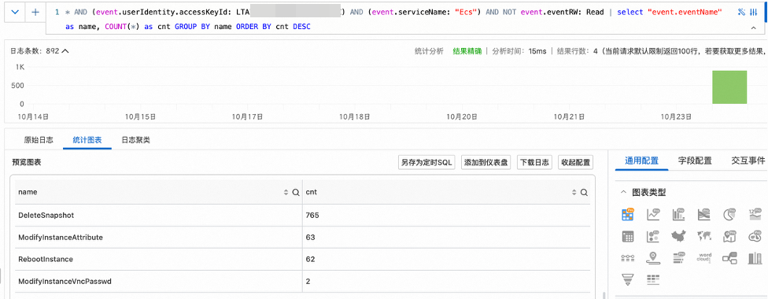

我们判断，攻击者获取 AK 后先修改 VNC 密码进行登录尝试，随后通过 API 批量修改主机 root 密码并通过重启主机使修改生效，最后删除快照避免恢复。在对应主机上也找到了符合 VNC 登录特征的记录：


另一个案例则更加复杂。客户受影响资产为 ACK 节点，但事件发生后已释放。由于资源释放后对应的安全告警会从云安全中心控制台上消失，我们不得不通过安全告警日志来查询告警详情。根据告警详情中恶意文件落盘时间，定位到了对应的恶意下载进程启动日志：

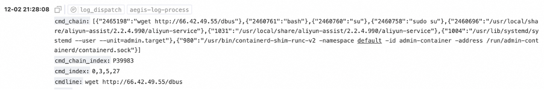

这个进程链令人迷惑的点在于，我们知道攻击者切换为 root 后通过 bash 执行了 wget 命令下载恶意文件，但不知道为什么前面还会有一系列云助手相关进程、以及 `admin-container` 等未知的容器。继续在日志中搜索，发现了一条客户自己执行的排查命令，进程链特征与恶意命令完全相同：


那么只需要和客户确认当时上机排查的方式，就可以得知攻击者执行恶意命令的方式了。最终确定攻击者是通过控制台 Workbench 免密登录主机执行命令的。这告诉我们：

1. 攻击者能够登录控制台，并且具备调用 `StartTerminalSession` 的权限（敏感权限）
2. 必定存在同一个实体在较短的时间内先调用 `ConsoleSignin`，然后调用 `StartTerminalSession` 的操作审计记录

这就让我们之后的操作审计排查非常简单直接了。而当我们发现这个实体是 `AliyunCASDefaultRole` 这个阿里云默认的、原本不应具备调用 `StartTerminalSession` 权限的 RAM 角色时，也就可以确定：必定存在 `UpdateRole` 或 `AttachPolicyToRole` 这两个 API 的调用记录，且资源对象是 `AliyunCASDefaultRole`。继续通过操作审计溯源很容易就定位到了泄露的 AK。可以看到，泄露的 AK 只要具备 RAM 的部分写操作 API 权限，就可以作为一种**权限提升**的手段。

## 总结

通过以上六个案例的分析，我们可以归纳出应急响应工作中一些值得关注的要点：

**关于证据收集**：日志是应急响应的核心依据，但现实中常常面临日志缺失、覆盖或被篡改的情况。此时需要灵活调整思路，从应用日志、进程信息、文件时间戳、系统软件包校验等多个维度构建证据链。当正向分析受阻时，尝试先形成假设再反向验证，往往能打开新的突破口。

**关于攻击识别**：攻击手法在不断演进。进程隐藏、命令替换、非常规持久化、供应链投毒等技术都可能出现在实际事件中。保持对新型攻击手法的关注，避免陷入固定的排查模式，是准确识别威胁的前提。

**关于云环境安全**：随着业务上云，AK 泄露等新型风险日益突出。高权限凭据一旦泄露，攻击者可在短时间内完成资源控制、数据窃取甚至进一步渗透。熟悉云平台的审计能力和安全工具，能够显著提升此类事件的响应效率。

**关于分析思维**：应急响应不是机械地执行检查清单，而是一个持续推理的过程。面对同一现象，不同的上下文可能指向截然不同的结论。保持开放的思维，善用威胁情报等外部资源，在碎片化信息中识别关键线索，是提升响应能力的核心所在。

应急响应能力的提升没有捷径，唯有通过持续学习和实战积累，才能在面对真实威胁时做到从容应对。
