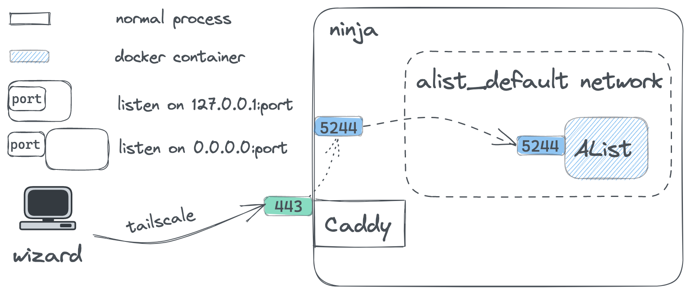
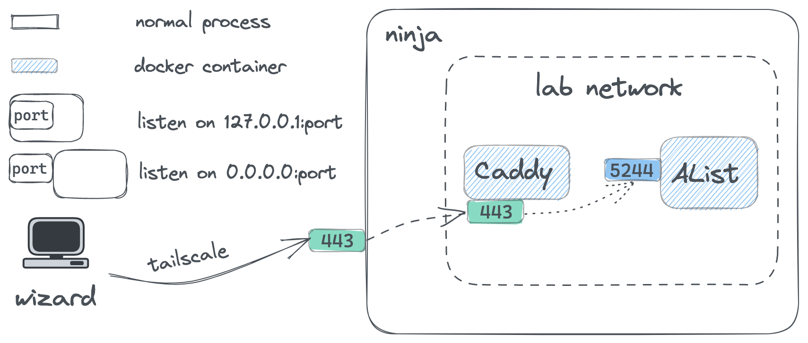
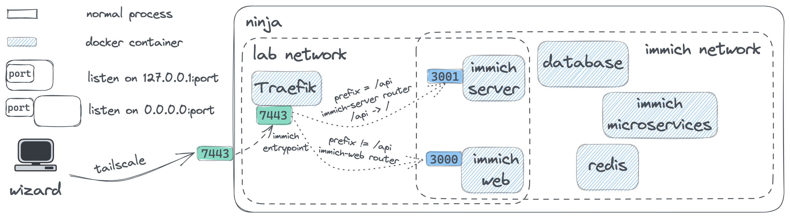

最近几天在搭建 Homelab 上花费了不少精力，因此想要一边试错一边记录下这个过程。

<!--more-->

## 背景

最近新购入了一台迷你主机，一半是因为需要一个本地的 x86 架构的环境作为 M1 的补充，一半是因为需要一个长时间运行的 Windows 环境跑一些仅支持 Windows 平台、且对性能有一定要求的服务。为满足后者需求，采用了 Windows 作为物理机系统，用 VirtualBox 启动 Ubuntu 虚拟机以获得 Linux 环境。

最初接触到 selfhosted service 是因为迷你主机的硬盘空间比较大，放着不用也比较浪费，于是产生了搭建一个私有网盘用来存放和备份文件的想法，可以帮忙减轻手机及笔记本硬盘的压力。随后渐渐发掘了越来越多有趣的 selfhosted service，便开始逐一部署，打造自己的 Homelab。

|          | OS                  | 主机名  |
| -------- | ------------------- | ------- |
| 笔记本   | macOS Monterey      | wizard  |
| 迷你主机 | Windows 11          | samurai |
| 虚拟机   | Ubuntu Server 22.04 | ninja   |

## 准备工作

### 网络互通

首先需要做好设备之间的网络互通。尽管大部分时间里 wizard 和 samurai 都在同一局域网内，我们仍希望设备之间能够跨局域网通信。这一点可以通过 Tailscale 轻松实现。同时，在设备间传输文件也是十分常见的需求，偷懒起见可以直接利用 Tailscale 各平台客户端内置的 Taildrop。

需要注意的是，使用 Taildrop 传输文件的设备必须归属于同一 User，因此这些设备上不能打 ACL Tag。不过，User 在 ACL Rules 里面本身也能起到和 Tag 类似的作用。

值得一提的是，对于只有命令行的 Linux 设备，我们既可以选择复制 `tailscale up` 返回的链接到其他设备的浏览器里登录，也可以直接使用 Auth Key 在命令行里自动完成登录。通过 Auth Key 加入的设备还可以自动加 Tag，对于批量操作会很有用。

在将 samurai 和 ninja 都加入到 wizard 所在的网络后，我们就可以连接这两台设备了。对于 samurai，使用 Parsec 连接相比原生 RDP 要快很多。虽然有概率遇到一些问题，但通过官方 FAQ 能很快解决。对于 ninja，用 SSH 连接即可：

```
Host ninja
  HostName ninja
  User merc
  IdentityFile ~/.ssh/ninja
```

得益于 Tailscale 的 MagicDNS，`HostName` 部分也只需要填写主机名本身。

> 相关资料：
>
> 1. [Use Taildrop](https://tailscale.com/kb/1106/taildrop/)
> 1. [Use auth keys](https://tailscale.com/kb/1085/auth-keys/)
> 1. [Mouse and Keyboard Isn't Working Correctly When Connected](https://support.parsec.app/hc/en-us/articles/115002623892-Mouse-and-Keyboard-Isn-t-Working-Correctly-When-Connected)

### 初始化与备份

samurai 的初始化没有太多可提的，可以运行一个 Clash 同时给自己和 ninja 使用（主要是给自己，因为 ninja 使用 wizard 上的代理也很方便），随后用系统还原备份。ninja 则可以使用 `dotfiles` 仓库自动初始化，并利用 VirtualBox 的系统快照功能备份。

### 定时休眠/唤醒

由于暂时没有需要 24 小时不停机的服务，为了避免无谓的功耗可以在 samurai 上设置定时休眠与唤醒。休眠同样会影响到 ninja 上的服务，但在唤醒后就会自动恢复。

1. 在“计算机管理”-“系统工具”-“任务计划程序”中选择“创建任务”
2. 输入任务名称，选择“不管用户是否登录都要运行“和“使用最高权限运行”
3. 在“触发器”选项卡中新建一个触发器，根据触发周期填写
4. 在“操作”选项卡中新建一个操作，选择“启动程序”，程序为 `shutdown.exe`，参数为 `-h`，表示休眠
5. 点击“确定”创建任务
6. 重复上述步骤，注意修改触发周期为希望的唤醒时间、修改操作中的程序为 `cmd.exe` 且无需参数（其他程序亦可），并在“条件”中勾选“唤醒计算机运行此任务”
7. 如果后续需要修改或者临时禁用，可以在“任务计划程序”下的“任务计划程序库”中找到这两个任务。

接下来逐一记录所部署的服务。

## 私有网盘 - AList

私有网盘的解决方案非常多，选择 AList 主要是因为其界面美观、功能丰富同时足够简单、且能挂载公共的网盘服务作为目录。主要用于文件备份和简单的文件管理。

### 直接部署

最初采用了直接在虚拟机上部署的办法：

```shell
$ curl -fsSL "https://alist.nn.ci/v3.sh" | bash -s install $HOME/alist
```

这种方法非常方便，暴露的地址类似 http://ninja:5244，可以用 systemd 管理服务。在挂载了本地存储之后，发现 PDF 文件无法预览且文件无法打包下载。两者皆是因为需要 HTTPS 及 CORS 支持。本地存储不存在 CORS 问题，因此只需要开启 HTTPS 即可。

### 内网 HTTPS

由于服务在内网中且不打算开启公网访问，我们无法将正常域名解析到服务器上随后用 Let's Encrypt 等方式获取证书，而使用自签名证书又极不方便，因此可以开启 Tailscale 内置的 HTTPS 支持，能够给组网中的每个设备都分配一个域名及相应的证书，形如 `ninja.tailnet-48a5.ts.net`。

这是我目前使用的方案。遗憾的是，这一方案目前还不支持子域名，所以如果要在一台机器上部署多个标准 HTTPS 服务只能采用子目录的形式。但根据之后的经验，并不是所有应用都对子目录的形式有比较好的支持。因此，目前 HTTPS 服务大多数都部署在非标准端口，通过统一的 Dashboard 服务来简化访问。

回到正题，AList 提供了配置文件可以直接开启 HTTPS：

```json
{
  "force": false,
  "address": "0.0.0.0",
  "port": 5244,
  "site_url": "",
  "cdn": "",
  "jwt_secret": "******",
  "token_expires_in": 48,
  "database": {
    "type": "sqlite3",
    "host": "",
    "port": 0,
    "user": "",
    "password": "",
    "name": "",
    "db_file": "data/data.db",
    "table_prefix": "x_",
    "ssl_mode": ""
  },
  "scheme": {
    "https": false,
    "cert_file": "",
    "key_file": ""
  },
  "temp_dir": "data/temp",
  "bleve_dir": "data/bleve",
  "log": {
    "enable": true,
    "name": "data/log/log.log",
    "max_size": 10,
    "max_backups": 5,
    "max_age": 28,
    "compress": false
  },
  "max_connections": 0
}
```

只需要设置 `scheme` 字段就可以启动 HTTPS 服务器，但需要注意设置 `site_url` 为网站实际的 URL，如 https://ninja.tailnet-48a5.ts.net:5244。

### 修改运行权限

到这里就可以正常使用 AList 了，但容易发现在 AList 界面中创建的文件、甚至包括 AList 自身的配置文件都属于 root 用户，在 Linux 的 shell 里需要 `sudo` 或 `chown` 才能访问和修改。这是 AList 默认以 root 权限运行导致的。

为了修改其运行权限，我们可以在 systemd 中创建一个用户的 service，但为了更强的隔离性和可维护性，使用 Docker 部署而不是裸机部署是更好的做法。而为了方便管理 Docker 容器以及其相应的启动参数、环境变量、Volume 和 Network 等信息，我们选择采用 Docker Compose 来持久化容器配置。

### Docker Compose 部署

此时编写的 Docker Compose 文件如下，使用了 `PUID` 和 `PGID` 环境变量让 AList 以当前用户 `1000:1000` 的身份运行，`UMASK` 控制其操作的文件权限为 `755`。同时将容器的 5244 端口映射到宿主机的 443 端口，只需要访问 https://ninja.tailnet-48a5.ts.net 即可。

```yaml
version: "3"

services:
  alist:
    image: xhofe/alist:latest
    container_name: alist
    restart: always
    environment:
      - PUID=1000
      - PGID=1000
      - UMASK=022
    volumes:
      - $PWD/data:/opt/alist/data
      - $HOME/files:/opt/alist/files
    ports:
    	- 443:5244
```

### 备份

- 在管理界面自带配置备份功能，生成的 JSON 文件上传到云端保存

- 文件备份则借助 VirtualBox 的系统快照以及加密上传到云盘实现，其中部分常用文件通过下文提到的 Syncthing 在多设备间同步
- 所有 docker compose 文件放在同一目录 `compose` 内统一上传到云端保存，下文服务同理

### 已知问题

- 移动设备上不能同时选择多个文件上传
- 移动设备上使用火狐浏览器上传文件会覆盖掉整个所处的目录

### 同类服务

- [Cloudreve](https://cloudreve.org)
- [Seafile](https://www.seafile.com/home/)
- [Pydio](https://pydio.com)
- [ownCloud](https://owncloud.com)

> 相关资料：
>
> 1. [AList 官方文档](https://alist.nn.ci/zh/)
> 1. [Enabling HTTPS](https://tailscale.com/kb/1153/enabling-https/)

## 反向代理 - Caddy v2

完成 AList 部署后，我发现在同一台设备上可能还需要部署其他服务，此时使用反向代理会极大地方便我们统一管理不同服务。由于传统的 Nginx、Apache 配置语法比较繁杂，我更倾向于使用一些新的反向代理软件。在调研过程中，发现 Traefik 的文档以及冗长的 yaml 语法都感觉不是太友好，而 Nginx Proxy Manager 虽然配置非常简单，但只支持子域名和子路径两种形式，要想使用非标准端口号则仍需要手写 Nginx 配置文件，退化为了 Nginx。最终，Caddy 清晰简洁的语法吸引了我。

### 直接部署

最初同样采用了在虚拟机上直接部署的方法：

```shell
$ sudo apt install -y debian-keyring debian-archive-keyring apt-transport-https
$ curl -1sLf 'https://dl.cloudsmith.io/public/caddy/stable/gpg.key' | sudo gpg --dearmor -o /usr/share/keyrings/caddy-stable-archive-keyring.gpg
$ curl -1sLf 'https://dl.cloudsmith.io/public/caddy/stable/debian.deb.txt' | sudo tee /etc/apt/sources.list.d/caddy-stable.list
$ sudo apt update
$ sudo apt install caddy
```

我们可以直接在命令行中运行 `caddy [command] [args]`，提供的 `run`、`start`、`stop`、`reload` 等命令体感上比 systemd 更好用。

### 配置文件

以反向代理 Alist 服务为例，我们先将 AList 的端口映射到 `127.0.0.1:5244`，并关闭 AList 内置的 HTTPS 支持，因为此时暴露服务和 HTTPS 都将交给反向代理完成：

```yml
version: "3"

services:
  alist:
    # ...
    ports:
    	- 127.0.0.1:5244:5244
```

Caddy 的语法极为简洁，如果使用 Caddyfile，实现反向代理只需要短短三行：

```
ninja.tailnet-48a5.ts.net

reverse_proxy localhost:5244
```

随后，我们使用 Tailscale 的证书实现 HTTPS 支持：

```
ninja.tailnet-48a5.ts.net {
	tls /etc/caddy/certs/ninja.tailnet-48a5.ts.net.crt /etc/caddy/certs/ninja.tailnet-48a5.ts.net.key
	reverse_proxy localhost:5244
}
```

> Caddy 实际上可以自动申请证书，但由于上文提到的内网部署的原因没有使用这一特性。

由于其他服务也需要使用这一 TLS 配置，可以将其封装为 snippet：

```
(tls) {
	tls /etc/caddy/certs/ninja.tailnet-48a5.ts.net.crt /etc/caddy/certs/ninja.tailnet-48a5.ts.net.key
}

ninja.tailnet-48a5.ts.net {
	import tls
	reverse_proxy localhost:5244
}
```

此时的架构如下图：



可以看到，流量从 ninja 的 443 端口进入后被反向代理到 `127.0.0.1:5244`，随后通过端口映射被转发到容器的 5244 端口。这样做能行得通，但也意味着每增加一个服务，宿主机 ninja 上除了 Caddy 监听的端口外就需要多监听至少一个端口，尽管是本地监听。这样多占用一个端口仅仅是为了让宿主机上的普通进程 Caddy 能访问容器开放的端口，没有任何实际的好处。

### Docker Compose 部署

因此，我们希望容器端口只暴露在容器网络内部而不影响宿主机，同时需要让反向代理能够访问到这些端口。那么，只需要让反向代理也容器化，并和服务容器的网络打通就可以了。简单起见，我们可以直接将 Caddy 容器加入 AList 所在的网络中。

首先修改 AList 的 `docker-compose.yml`，使其加入 `lab` 网络：

```yml
version: "3"

services:
  alist:
    image: xhofe/alist:latest
    container_name: alist
    restart: always
    environment:
      - PUID=1000
      - PGID=1000
      - UMASK=022
    volumes:
      - $PWD/data:/opt/alist/data
      - $HOME/files:/opt/alist/files

networks:
  default:
    external: true
    name: lab
```

在此之前，我们已经 `docker create network lab` 了。注意此时不再需要映射端口。然后创建 Caddy 容器：

```yml
version: "3"

services:
  caddy:
    image: caddy:latest
    container_name: caddy
    restart: always
    volumes:
      - $PWD/Caddyfile:/etc/caddy/Caddyfile
      - $HOME/certs:/etc/caddy/certs:ro
      - caddy_data:/data
      - caddy_config:/config
    ports:
    	- 443:443

networks:
  default:
    external: true
    name: lab

volumes:
  caddy_data:
  caddy_config:
```

我们并没有将挂载的 `Caddyfile` 也设为只读，因为有时可以利用 `caddy fmt --overwrite` 来格式化 `Caddyfile`。

最后修改反向代理的上游服务，由于 Caddy 容器与 AList 容器在同一网络内，可以通过 service 名称来互相访问：

```
ninja.tailnet-48a5.ts.net {
	import tls
	reverse_proxy alist:5244
}
```

重载 Caddy:

```shell
$ docker exec -w /etc/caddy caddy caddy reload
```

这时的架构图就变成了：



### 备份

- 将 `Caddyfile` 放在 `compose/caddy` 目录下一同备份
- 如有必要，可以备份 Docker Volume

### 已知问题

- 有时会因为缓存导致 `caddy reload` 的更新不及时，可以用 `caddy stop && caddy start` 解决

### 同类服务

- [Nginx](https://www.nginx.com)
- [Apache](https://httpd.apache.org)
- [Nginx Proxy Manager](https://nginxproxymanager.com)
- [Traefik](https://traefik.io/traefik/)（见下文）
- [Envoy](https://www.envoyproxy.io)
- [HAProxy](https://www.haproxy.org)

> 相关资料：
>
> 1. [Caddy v2 官方文档](https://caddyserver.com/docs/)
> 1. [Best Practice: Use a Docker network](https://nginxproxymanager.com/advanced-config/#best-practice-use-a-docker-network)

## 密码管理 - Vaultwarden

Vaultwarden 相比 Bitwarden 官方镜像占用资源更少，并且支持大部分 Bitwarden API，对我而言足够了。主要用作密码库，同时存储了一些密码之外的敏感信息，配合 Bitwarden 浏览器扩展使用。

### Docker Compose 部署

部署过程非常丝滑，没有遇到任何问题：

```yml
version: "3"

services:
  vaultwarden:
    image: vaultwarden/server:latest
    container_name: vaultwarden
    restart: always
    volumes:
      - vaultwarden:/data

networks:
  default:
    external: true
    name: lab

volumes:
  vaultwarden:
```

从这里开始，对于不怎么修改的挂载目录会尽量使用 单独的 Docker Volume 挂载。

### 反向代理

对外暴露的端口可以任意修改，下文服务同理。

```
ninja.tailnet-48a5.ts.net:8443 {
	import tls
	reverse_proxy vaultwarden:80
}
```

### 备份

- “工具”-“导出密码库”-“.json(Encrypted)”，选择加密是因为要上传云端
- 如有必要，可以备份 Docker Volume

### 同类服务

- [Bitwarden](https://bitwarden.com)
- [Enpass](https://www.enpass.io)
- [KeePass](https://keepass.info)

> 相关资料：
>
> 1. [Vaultwarden Wiki](https://github.com/dani-garcia/vaultwarden/wiki)

## Docker 管理 - Portainer

使用 Portainer 的 GUI 界面可以更方便地批量管理 Docker 镜像、容器、Volume、Network 等资源。

### Docker Compose 部署

我们可以将 `/var/run/docker.sock` 设为只读挂载，这不会影响容器对 Docker Socket 的读写操作，所以几乎所有情况下我们都应该这么做。但需要注意，由于 `/var/run/docker.sock` 属于 root 用户，挂载后的容器等于拥有了 root 权限，会引入一定安全风险。

```yml
version: "3"

services:
  portainer:
    image: portainer/portainer-ce:latest
    container_name: portainer
    restart: always
    volumes:
      - /var/run/docker.sock:/var/run/docker.sock:ro
      - portainer:/data
      
networks:
  default:
    external: true
    name: lab
    
volumes:
  portainer:
```

### 备份

- “Settings”-“Backup Portainer” 可以备份配置文件，同样建议开启密码保护
- 如有必要，可以备份 Docker Volume

### 同类服务

- [Yacht](https://yacht.sh)

> 相关资料：
>
> 1. [Portainer 官方文档](https://docs.portainer.io)
> 1. [Does binding the docker socket in read-only mode affect how Traefik works?](https://www.reddit.com/r/Traefik/comments/g46lhh/does_binding_the_docker_socket_in_readonly_mode/)
> 1. [What is the Docker security risk of /var/run/docker.sock?](https://stackoverflow.com/questions/40844197/what-is-the-docker-security-risk-of-var-run-docker-sock)

## 服务存活状态监控 - Uptime Kuma

Uptime Kuma 是 Uptime Robot 的私有部署替代品，用来监控我在公网和内网部署的各种服务的存活状态并自动告警。

### Docker Compose 部署

```yml
version: "3"

services:
  uptime-kuma:
    image: louislam/uptime-kuma:latest
    container_name: uptime-kuma
    restart: always
    volumes:
      - uptime-kuma:/app/data

networks:
  default:
    external: true
    name: lab

volumes:
  uptime-kuma:
```

Uptime Kuma 提供了 Telegram Bot 自动告警的功能，但 ninja 位于墙内无法直接访问 Telegram API。除了网络层代理外，另一个简单的方法是利用 Cloudflare Workers 反向代理 Telegram API。

### Cloudflare Workers 反代 Telegram API

这种方法需要有一个托管在 Cloudflare 的域名，并解析一条 A 记录到 `2.2.2.2`，可以使用子域名。接着在账户下的 Workers 中创建一个”HTTP 路由器“，并进行快速编辑：

```js
const whitelist = ["/bot1111111111:"];
const tg_host = "api.telegram.org";

addEventListener('fetch', event => {
    event.respondWith(handleRequest(event.request))
})

function validate(path) {
    for (var i = 0; i < whitelist.length; i++) {
        if (path.startsWith(whitelist[i]))
            return true;
    }
    return false;
}

async function handleRequest(request) {
    var u = new URL(request.url);
    u.host = tg_host;
    if (!validate(u.pathname))
        return new Response('Unauthorized', {
            status: 403
        });
    var req = new Request(u, {
        method: request.method,
        headers: request.headers,
        body: request.body
    });
    const result = await fetch(req);
    return result;
}
```

注意将白名单中的数字替换为自己的 Telegram Bot Token 中的数字部分，然后就可以部署了。

随后在域名下的 Workers 中添加 HTTP 路由，使用刚才解析的子域名作为路由，如 `tg.example.org/*`，并使用刚才创建的服务和 production 环境。此时我们就可以通过访问 `tg.example.org` 从而访问到 `api.telegram.org` 了。

最后将 Uptime Kuma 容器中对 `api.telegram.org` 的请求地址替换为 `tg.example.org`：

```shell
$ docker exec -it uptime-kuma /bin/sh
$ sed -i 's/api.telegram.org/tg.example.org/g' /app/src/components/notifications/Telegram.vue
$ sed -i 's/api.telegram.org/tg.example.org/g' /app/server/notification-providers/telegram.js
```

重启容器后生效。

### 备份

- “设置”-“备份”中可以进行配置备份
- 如有必要，可以备份 Docker Volume

### 同类服务

- [Healthchecks](https://healthchecks.io)

- [Statping-ng](https://statping-ng.github.io/features.html)

> 相关资料：
>
> 1. [Uptime Kuma Wiki](https://github.com/louislam/uptime-kuma/wiki)
>
> 1. [搭建uptime-kuma及Ward服务监控面板](https://www.eula.club/blogs/%E6%90%AD%E5%BB%BAuptime-kuma%E5%8F%8AWard%E6%9C%8D%E5%8A%A1%E7%9B%91%E6%8E%A7%E9%9D%A2%E6%9D%BF.html)

## 文件多设备同步 - Syncthing

Syncthing 可以在多个设备之间同步文件。因为部分常用文件经常需要在多个设备上都使用且保持最新状态，目前主要用于对常用文件的备份，作为私有网盘的补充。

### Docker Compose 部署

这里需要注意的设置主要是运行的用户权限，以及是否给 Syncthing 赋予修改文件 owner 的权限。由于是用作私有网盘的补充，这里仅挂载了 AList 本地存储的根目录，实际上任何挂载到 `/var/syncthing` 下的文件都能被同步。

```yml
version: "3"

services:
  syncthing:
    image: syncthing/syncthing:latest
    container_name: syncthing
    hostname: ninja
    restart: always
    environment:
      - PUID=1000
      - PGID=1000
      - PCAP=cap_chown,cap_fowner+ep
    volumes:
      - $HOME/files:/var/syncthing

networks:
  default:
    external: true
    name: lab
```

### 反向代理

由于 Syncthing 会检查 `Host` Header，在使用反向代理时需要设置 `Host` 和上游服务相同：

```yml
ninja.tailnet-48a5.ts.net:5443 {
	import tls
	reverse_proxy syncthing:8384 {
		header_up host {upstream_hostport}
	}
}
```

### 备份

- 配置备份：`$HOME/files/config`（容器内路径：`/var/syncthing/config`）
- 实际上，Syncthing 所同步的目录的列表不需要额外备份，因为 Syncthing 通常运行在多个设备上，因此可以从其他设备恢复同步的目录列表

### 同类服务

- [Resilio Sync](https://www.resilio.com)

> 相关资料：
>
> 1. [Syncthing 官方文档](https://docs.syncthing.net)

## 私有 Git 仓库 - Gitea

为了存放不便公开的代码以及部分旧代码，可以用 Gitea 建立一个私有的 Git 仓库以实现对这些代码进行版本控制的需求。

### Docker Compose 部署

这里使用 `1` 这个 tag 来指定稳定版镜像，然后直接暴露宿主机 `2222` 端口作为 SSH 端口，不经过反向代理。需要注意 `SSH_PORT` 是在 clone 链接中显示的端口（也就是宿主机暴露的 SSH 端口），而 `SSH_LISTEN_PORT` 才是容器监听的 SSH 端口。

```yml
version: "3"

services:
  gitea:
    image: gitea/gitea:1
    container_name: gitea
    restart: always
    environment:
      - DOMAIN=ninja.tailnet-48a5.ts.net
      - SSH_DOMAIN=ninja.tailnet-48a5.ts.net
      - SSH_PORT=2222
      - SSH_LISTEN_PORT=22
      - DISABLE_REGISTRATION=true
    volumes:
      - gitea:/data
      - /etc/timezone:/etc/timezone:ro
      - /etc/localtime:/etc/localtime:ro
    ports:
      - 2222:22

networks:
  default:
    external: true
    name: lab

volumes:
  gitea:
```

### SSH 配置

Gitea 安装完成后，一个正常的 SSH clone URL 类似 `ssh://git@ninja.tailnet-48a5.ts.net:2222/<user>/<repo>.git`，如果要用命令行 clone 的话还需要 `-i` 指定私钥，我们可以通过 SSH Config 简化这一步。

生成密钥对和添加公钥的方法和 GitHub 一致，用户也同样是 `git`，需要注意的是正确设置 `HostName` 和 `Port`：

```
Host gitea
  HostName ninja.tailnet-48a5.ts.net
  Port 2222
  User git
  IdentityFile ~/.ssh/gitea
```

配置完成后，只需要使用 `ssh://gitea/<user>/<repo>.git` 这样的 URL 即可。

### 备份

- 在容器中执行 `su git` -> `./gitea dump`
- 目前恢复较为复杂，详见 [备份与恢复](https://docs.gitea.io/zh-cn/backup-and-restore/)

### 同类服务

- [Gitlab](https://about.gitlab.com)
- [Gogs](https://gogs.io)

> 相关资料：
>
> 1. [Gitea 官方文档](https://docs.gitea.io/zh-cn/)

## Homelab 仪表盘 - Homepage

由于已经部署了许多服务且采用了 URL 不太友好的非标准端口号方式，我们可以自建一个服务导航面板 Homepage，同时简单监控机器资源及服务状态。

### Docker Compose 部署

Homepage 的配置文件中可以直接引用 [Dashboard Icons](https://github.com/walkxcode/dashboard-icons) 的图标，但部署的部分服务的图标没有适配，因此挂载了 `/app/public/icons` 补充图标：

```yml
version: "3"

services:
  homepage:
    image: ghcr.io/benphelps/homepage:latest
    container_name: homepage
    restart: always
    volumes:
      - $PWD/config:/app/config:ro
      - $PWD/icons:/app/public/icons:ro
      - /var/run/docker.sock:/var/run/docker.sock：ro
      
networks:
  default:
    external: true
    name: lab
```

### 图标显示问题

搭建并配置完成后，在笔记本上访问由于可以开启 Tailscale + 梯子两个 VPN，并没有什么问题；但在移动设备上由于同一时间只能开启一个 VPN，通过 Tailscale 访问时出现了大量图标无法显示的问题，这是因为 `cdn.jsdelivr.net` 被墙了。解决方法也很简单，将这些图标文件也放到本地的 `icons` 目录。

### 跨域访问 Portainer API

Homepage 提供了 Portainer 相关的 Widgets，在 Portainer 界面生成 Access Token 贴到配置中即可使用。但在实际使用中发现会遇到跨域问题，我们可以通过反向代理给 Portainer 服务添加 `Access-Control` 系列 Headers 来解决。

在 Caddy v2 中，我们可以 CORS 相关功能封装为 snippet：

```
(cors) {
	@origin{args.0} header Origin {args.0}
	header @origin{args.0} Access-Control-Allow-Origin "{args.0}"
	header @origin{args.0} Access-Control-Allow-Headers "content-type, x-requested-with, x-api-key"
	header Access-Control-Allow-Methods "POST, GET, OPTIONS"
	header @origin{args.0} Vary Origin
	@options {
		method OPTIONS
	}
	respond @options 204
}
```

这里的 `Access-Control-Allow-Headers` 可以根据需要添加，例如 `x-api-key`。而 `{args.0}` 表示该 snippet 的第一个参数，在这里是我们想要允许的 Origin，可以这样使用：

```yml
(cors-allow-homepage) {
	import cors https://ninja.tailnet-48a5.ts.net:6443
}

ninja.tailnet-48a5.ts.net:9443 {
	import tls
	import cors-allow-homepage
	reverse_proxy portainer:9000
}

ninja.tailnet-48a5.ts.net:6443 {
	import tls
	reverse_proxy homepage:3000
}
```

### 备份

- 配置备份：在 `compose` 备份中完成

### 同类服务

- [Homer](https://github.com/bastienwirtz/homer)
- [Heimdall](https://heimdall.site)
- [Dashy](https://dashy.to)

> 相关资料：
>
> 1. [Homepage 官方文档](https://gethomepage.dev/en/installation/)

## 代码编辑 - Code Server

可在浏览器中访问的 VSCode，可以在 iPad 等设备上替代 Remote-SSH 方案。

### Docker Compose 部署

一开始因为想要全部服务容器化，也用容器来部署：

```yml
version: "3"

services:
  code-server:
    image: codercom/code-server:latest
    container_name: code-server
    restart: always
    user: 1000:1000
    volumes:
      - $HOME/.config:/home/coder/.config
      - $HOME:/home/coder
      
networks:
  default:
    external: true
    name: lab
```

但很快就发现容器内使用宿主机上的程序和环境（例如 zsh、Go、Node、Python）会很麻烦，等于还要重新初始化一遍。因此唯独这个服务进行了直接部署。

### 直接部署

```shell
$ curl -fsSL https://code-server.dev/install.sh | sh
```

之后就可以通过 systemd 来管理了。但由于此时使用的是主机网络而非容器网络 `lab`，Caddy 无法直接访问到 Code Server 服务。借此机会，我尝试了使用容器反向代理 Traefik 替换 Caddy 反代之前的所有服务，随后让 Caddy 运行在 Host Network 上单独反代 Code Server。最后的 Caddyfile 如下：

```
(tls) {
	tls /etc/caddy/certs/ninja.tailnet-48a5.ts.net.crt /etc/caddy/certs/ninja.tailnet-48a5.ts.net.key
}

# code-server
ninja.tailnet-48a5.ts.net:1337 {
	import tls
	reverse_proxy 127.0.0.1:8080
}
```

### 已知问题

- 无法使用官方插件市场，因此没有 Remote 系列插件（其他常用插件基本可用）

### 备份

- 唯一需要备份的 `settings.json` 通常会有一份在我们本地，可以考虑放一份在云端

### 同类服务

- [OpenVSCode Server](https://github.com/gitpod-io/openvscode-server)
- [VS Code Server](https://code.visualstudio.com/blogs/2022/07/07/vscode-server)

> 相关资料：
>
> 1. [Code Server 官方文档](https://coder.com/docs/code-server/latest)

## 容器反向代理 - Traefik v2

Traefik 是专为容器设计的反向代理，主要通过 Docker Compose 文件中的 `labels` 进行配置。

### Docker Compose 部署

暴露需要暴露的端口，并挂载证书、静态配置文件、动态配置文件、Docker Socket：

```yml
version: "3"

services:
  traefik:
    image: traefik:v2.9
    container_name: traefik
    restart: always
    volumes:
      - $HOME/certs:/etc/certs:ro
      - $PWD/traefik.yml:/etc/traefik/traefik.yml:ro
      - $PWD/certs-traefik.yml:/etc/traefik/dynamic/certs-traefik.yml:ro
      - /var/run/docker.sock:/var/run/docker.sock:ro 
    ports:
      - 8081:8080
      - 443:443
      - 3443:3443
      - 4443:4443
      - 5443:5443
      - 6443:6443
      - 7443:7443
      - 8443:8443
      - 9443:9443

networks:
  default:
    external: true
    name: lab
```

其中静态配置如下：

```yml
global:
  sendAnonymousUsage: false

log:
  filePath: /data/traefik.log
  level: WARN

accessLog:
  filePath: /data/access.log
  bufferingSize: 100
  filters:
    statusCodes:
      - "400-499"
      - "500-599"
      
api:
  insecure: true

providers:
  docker:
    endpoint: "unix:///var/run/docker.sock"
    exposedByDefault: false
    network: lab
  file:
    directory: /etc/traefik/dynamic

entryPoints:
  alist:
    address: :443
    http:
      tls: true
  # ...
```

- 首先是一些常规的日志设置，并允许通过 HTTP 访问 Dashboard
- 我们不需要自动暴露每一个 Docker 容器，因此设置 `exposedByDefault： false`
- 我们显式声明了使用 `lab` 网络，是因为如果一个容器处于多个网络中，Traefik 无法知道要转发到它的哪个网卡上（下文设置的 Immich 服务提供了一个很好的例子）
- 然后利用 File Provider 加载挂载的动态配置文件
- 最后为每个服务创建对应的 Entrypoints 并默认开启 TLS。

如果修改了静态配置，需要重启 Traefik 容器才能生效；动态配置部分，File Provider 用来配置了证书：

```yml
tls:
  certificates:
    - certFile: /etc/certs/ninja.tailnet-48a5.ts.net.crt
      keyFile: /etc/certs/ninja.tailnet-48a5.ts.net.key
```

Docker Provider 的动态配置都在各个 Docker Compose 文件中，对其进行修改不需要重启 Traefik 容器，但需要重启对应的服务容器。

### 反向代理服务

设置完成后，就可以对之前那些服务的 Docker Compose 文件添加 `labels` 来实现反代了，依然以 AList 为例，其他服务同理：

```yml
version: "3"

services:
  alist:
    # ...
    labels:
      - traefik.enable=true
      - traefik.http.routers.alist.rule=Host(`ninja.tailnet-48a5.ts.net`)
      - traefik.http.routers.alist.entrypoints=alist
      - traefik.http.services.alist.loadbalancer.server.port=5244
# ...
```

其中 `traefik.http.services.<service_name>.loadbalancer.server.port` 会告诉 Traefik 上游服务的端口。如果服务本身只开放了一个端口，那么可以不用设置 ，但为了格式统一这里都进行了显式设置。

### 反向代理 Traefik Dashboard

之前是通过 HTTP 8081 端口访问的 Traefik Dashboard，而我们希望通过 Traefik 反代将这个服务也升级到 HTTPS。方法和其他服务是类似的，不过需要注意 `service` 为 `api@internal`（在 Dashboard 中可以看到）、不再暴露 HTTP 端口、暴露新的 HTTPS 端口：

```yml
version: "3"

services:
  traefik:
    # ...
    ports:
      - 443:443
      - 2443:2443
      - 3443:3443
      - 4443:4443
      - 5443:5443
      - 6443:6443
      - 7443:7443
      - 8443:8443
      - 9443:9443
    labels:
      - traefik.enable=true
      - traefik.http.routers.traefik.rule=Host(`ninja.tailnet-48a5.ts.net`)
      - traefik.http.routers.traefik.entrypoints=traefik
      - traefik.http.routers.traefik.service=api@internal
# ...
```

### 备份

- 配置备份：动态配置和静态配置的 YAML 文件，都在 `compose` 备份中完成

### 同类服务

- 见上文 [Caddy v2 - 同类服务](#同类服务-1) 部分。

> 相关资料：
>
> 1. [Traefik 官方文档](https://doc.traefik.io/traefik/)
> 1. [Use Your Own Certificates with Traefik](https://medium.com/@clintcolding/use-your-own-certificates-with-traefik-a31d785a6441)

## 照片管理 - Immich

Immich 主要用于同步手机照片以及方便在各个客户端浏览，作为私有网盘在照片方面的补充。

### Docker Compose 部署

使用了官方提供的 `docker-compose.yml`，去掉了 AI 相关的服务：

```yml
version: "3"

services:
  immich-server:
    image: altran1502/immich-server:release
    entrypoint: ["/bin/sh", "./start-server.sh"]
    volumes:
      - ${UPLOAD_LOCATION}:/usr/src/app/upload
    env_file:
      - .env
    environment:
      - NODE_ENV=production
    depends_on:
      - redis
      - database
    restart: always

  immich-microservices:
    image: altran1502/immich-server:release
    entrypoint: ["/bin/sh", "./start-microservices.sh"]
    volumes:
      - ${UPLOAD_LOCATION}:/usr/src/app/upload
    env_file:
      - .env
    environment:
      - NODE_ENV=production
    depends_on:
      - redis
      - database
    restart: always

  immich-web:
    image: altran1502/immich-web:release
    entrypoint: ["/bin/sh", "./entrypoint.sh"]
    env_file:
      - .env
    environment:
      # Rename these values for svelte public interface
      - PUBLIC_IMMICH_SERVER_URL=${IMMICH_SERVER_URL}
    restart: always

  redis:
    container_name: immich_redis
    image: redis:6.2
    restart: always

  database:
    container_name: immich_postgres
    image: postgres:14
    env_file:
      - .env
    environment:
      POSTGRES_PASSWORD: ${DB_PASSWORD}
      POSTGRES_USER: ${DB_USERNAME}
      POSTGRES_DB: ${DB_DATABASE_NAME}
      PG_DATA: /var/lib/postgresql/data
    volumes:
      - pgdata:/var/lib/postgresql/data
    restart: always

  immich-proxy:
    container_name: immich_proxy
    image: altran1502/immich-proxy:release
    environment:
      # Make sure these values get passed through from the env file
      - IMMICH_SERVER_URL
      - IMMICH_WEB_URL
    logging:
      driver: none
    depends_on:
      - immich-server
    restart: always

networks:
  default:
    external: true
    name: lab
    
volumes:
  pgdata:
```

其中 `immich-web` 为前端，`immich-server` 为后端，与 `database` 和 `redis` 交互；`immich-microservices` 负责执行批量任务（如果有 AI 服务则会通过“识别”类任务与 AI 服务交互）；`immich-proxy` 负责暴露 `immich-web` 和 `immich-server` 两个服务。

### 用反向代理替代 `immich-proxy`

因为我们已经使用了反向代理，所以 `immich-proxy` 这个 nginx 容器就显得比较多余了，我们希望直接用 Traefik 替代它。

经过研究可以发现 `immich-proxy` 做的事情本质上就是：

1. 将 `/api` 的请求发送到 `immich-server:3001`，并重写路径为 `/`
2. 将 `/` 的请求发送到 `immich-web:3000`

用 Caddyfile 表示这个过程，就是：

```
ninja.tailnet-48a5.ts.net:7443 {
    handle_path /api/* {
        reverse_proxy immich-server:3001
    }
    handle {
        reverse_proxy immich-web:3000
    }
}
```

而用 Traefik 实现则需要修改 Docker Compose 文件，首先注释掉 `immich-proxy` 服务，对于 `immich-server`，我们匹配路径前缀 `/api`，然后创建 `strip-api` 的中间件将 `/api` 重写为 `/`，最后转发到上游 `immich-server:3001`：

```yml
services:
  immich-server:
    # ...
    labels:
      - traefik.enable=true
      - traefik.http.routers.immich-server.rule=Host(`ninja.tailnet-48a5.ts.net`) && PathPrefix(`/api`)
      - traefik.http.routers.immich-server.middlewares=strip-api
      - traefik.http.middlewares.strip-api.stripprefix.prefixes=/api
      - traefik.http.routers.immich-server.entrypoints=immich
      - traefik.http.services.immich-server.loadbalancer.server.port=3001
```

对于 `immich-web`，注意需要使用一个新的 Router `immich-web`，但最终的 Entrypoints 还是使用 `immich`，也就是我们最终访问的 `:7443` URL。其他设置和常规服务相同，转发到上游 `immich-web:3000`：

```yml
services:
	# ...
  immich-web:
    image: altran1502/immich-web:release
    entrypoint: ["/bin/sh", "./entrypoint.sh"]
    env_file:
      - .env
    environment:
      # Rename these values for svelte public interface
      - PUBLIC_IMMICH_SERVER_URL=${IMMICH_SERVER_URL}
    restart: always
    labels:
      - traefik.enable=true
      - traefik.http.routers.immich-web.rule=Host(`ninja.tailnet-48a5.ts.net`)
      - traefik.http.routers.immich-web.entrypoints=immich
      - traefik.http.services.immich-web.loadbalancer.server.port=3000
```

### 使用独立容器网络

Immich 服务涉及的容器比较多，比较好的做法是统一放在一个独立的容器网络内：

```yml
networks:
  default:
    external: true
    name: immich
```

但同时，根据上面的配置不难发现 `immich-server` 和 `immich-web` 两个容器需要和 Traefik 容器互通，也就是要加入 `lab` 网络，因此可以这样设置：

```yml
version: "3"
services:
  immich-server:
    image: altran1502/immich-server:release
    entrypoint: ["/bin/sh", "./start-server.sh"]
    networks:
      - lab
      - default
    # ...
    
  immich-web:
    image: altran1502/immich-web:release
    entrypoint: ["/bin/sh", "./entrypoint.sh"]
    networks:
      - lab
      - default
    # ...

networks:
  default:
    external: true
    name: immich
  lab:
    external: true
    name: lab
# ... 
```

如果在上面 Traefik 的静态配置中没有指定 `provider.docker.network` 为 `lab`，那么 Traefik 就有可能将流量转发到 `immich-server` 和 `immich-web` 在 `immich` 网络上的网卡上，显然不可能成功。

配置完成后的 Immich 服务架构图：



### 已知问题

- 按时间线浏览时可能会出现中间较大一片空白的问题，刷新后消失

### 备份

- 部署配置备份：主要是 `.env` 文件，在 `compose` 备份中完成
- 目前 Immich 应用配置十分简单，无需备份
- 照片备份：我们可以设置 `${UPLOAD_LOCATION}` 使得照片文件同样位于 AList 本地存储根目录下，这样就能在 AList 文件备份中完成

### 同类服务

- [PhotoPrism](https://photoprism.app)
- [Photoview](https://photoview.github.io)

> 相关资料：
>
> 1. [Immich 官方文档](https://immich.app/docs/overview/introduction)
> 1. [Immich Issue #765](https://github.com/immich-app/immich/issues/765)
> 1. [Immich Discussions#437](https://github.com/immich-app/immich/discussions/437)

## 监控与日志分析 - Prometheus+Grafana+Loki

为了能对系统状态以及容器状态进行更细粒度的监控和分析，我们可以使用 Prometheus+Grafana+Loki 生态，方便数据可视化和日志集中分析。

### Docker Compose 部署

首先部署 Prometheus，同时使用 Node Exporter 输出系统状态信息，用 cAdvisor 输出容器状态信息，注意后两者都需要挂载一些特殊目录才能正常获取数据。

```yaml
version: "3"

services:
  prometheus:
    image: prom/prometheus:latest
    container_name: prometheus
    restart: always
    networks:
      - lab
      - monitoring
    volumes:
      - $PWD/prometheus.yml:/etc/prometheus/prometheus.yml:ro
      - prometheus_data:/prometheus
    command:
      - --config.file=/etc/prometheus/prometheus.yml
      - --storage.tsdb.path=/prometheus
      - --web.console.libraries=/etc/prometheus/console_libraries
      - --web.console.templates=/etc/prometheus/consoles
      - --web.enable-lifecycle
    labels:
      - traefik.enable=true
      - traefik.http.routers.prometheus.rule=Host(`ninja.tailnet-48a5.ts.net`)
      - traefik.http.routers.prometheus.entrypoints=prometheus
      - traefik.http.services.prometheus.loadbalancer.server.port=9090

  node-exporter:
    image: prom/node-exporter:latest
    container_name: node-exporter
    restart: always
    networks:
      - monitoring
    volumes:
      - /proc:/host/proc:ro
      - /sys:/host/sys:ro
      - /:/rootfs:ro
    command:
      - --path.procfs=/host/proc
      - --path.rootfs=/rootfs
      - --path.sysfs=/host/sys
      - --collector.filesystem.mount-points-exclude=^/(sys|proc|dev|host|etc)($$|/)

  cadvisor:
    image: gcr.io/cadvisor/cadvisor:latest
    container_name: cadvisor
    restart: always
    networks:
      - monitoring
    volumes:
      - /:/rootfs:ro
      - /var/run:/var/run:ro
      - /sys:/sys:ro
      - /var/lib/docker/:/var/lib/docker:ro

networks:
  monitoring:
  lab:
    external: true
    
volumes:
  prometheus_data:
```

这里的 `gcr.io/cadvisor/cadvisor` 由于镜像仓库在国内被墙，可以使用国内镜像下载后用 `docker tag` 修改一下镜像标签。和之前类似，我们依然给这三个服务设立一个单独的网络 `monitoring` ，并暴露 `prometheus` 服务本体到 `lab` 网络。实际上，由于后面会使用 Grafana 查看 Prometheus 的数据，不暴露 `prometheus` 服务也是可以的。

挂载的 Prometheus 配置文件中，我们可以采集 Prometheus 自身、Node Exporter 以及 cAdvisor 三个服务的数据：

```yaml
global:
  scrape_interval: 1m

scrape_configs:
  - job_name: "prometheus"
    static_configs:
    - targets: ["localhost:9090"]

  - job_name: "node"
    static_configs:
    - targets: ["node-exporter:9100"]
  
  - job_name: "cadvisor"
    static_configs:
    - targets: ["cadvisor:8080"]
```

注意 Docker Compose 中使用 `prometheus_data` 持久化了 Prometheus 的数据，使得容器重启不会丢数据，也更方便后续备份。这一点对于 Grafana 也同理：

```yaml
version: "3"

services:
  grafana:
    image: grafana/grafana-oss:latest
    container_name: grafana
    restart: always
    networks:
      - lab
      - loki
    volumes:
      - grafana_data:/var/lib/grafana
    labels:
      - traefik.enable=true
      - traefik.http.routers.grafana.rule=Host(`ninja.tailnet-48a5.ts.net`)
      - traefik.http.routers.grafana.entrypoints=grafana
      - traefik.http.services.grafana.loadbalancer.server.port=3000

  loki:
    image: grafana/loki:latest
    container_name: loki
    restart: always
    networks:
      - loki
    volumes:
      - $PWD/loki-config.yml:/etc/loki/config.yml:ro
    command: -config.file=/etc/loki/config.yml
    healthcheck:
      test: [ "CMD-SHELL", "wget --no-verbose --tries=1 --spider <http://localhost:3100/ready> || exit 1" ]
      interval: 10s
      timeout: 5s
      retries: 5

  promtail:
    image: grafana/promtail:latest
    container_name: promtail
    restart: always
    networks:
      - loki
    volumes:
      - $PWD/promtail-config.yml:/etc/promtail/config.yml:ro
      - /var/run/docker.sock:/var/run/docker.sock:ro
    command: -config.file=/etc/promtail/config.yml

networks:
  loki:
  lab:
    external: true

volumes:
  grafana_data:
```

Promtail 会负责收集容器的日志并发送给 Loki，Loki 可以对日志进行分析和查询并通过 Grafana 展示出来。Grafana 同时也可以展示 Prometheus 各个 metrics 的查询结果，或是更直观地通过 Dashboard 来展示重要的 metrics 绘制成的图表。

这里挂载的两个配置文件需要在官网提供的配置文件上根据自己的需求进行修改，例如 Loki 的配置中我们额外设置了 `limits_config` 来解决启动后关于时间戳和流限速的报错：

```yaml
auth_enabled: false

server:
  http_listen_port: 3100
  grpc_listen_port: 9096

common:
  path_prefix: /tmp/loki
  storage:
    filesystem:
      chunks_directory: /tmp/loki/chunks
      rules_directory: /tmp/loki/rules
  replication_factor: 1
  ring:
    instance_addr: 127.0.0.1
    kvstore:
      store: inmemory

query_range:
  results_cache:
    cache:
      embedded_cache:
        enabled: true
        max_size_mb: 100

schema_config:
  configs:
    - from: 2020-10-24
      store: boltdb-shipper
      object_store: filesystem
      schema: v11
      index:
        prefix: index_
        period: 24h

limits_config:
  reject_old_samples: false
  per_stream_rate_limit: 5M

# ...
analytics:
  reporting_enabled: false
```

Promtail 的配置如下，需要确保能与 Loki API 通信且能访问 Docker Socket（因为我们主要收集容器化服务的日志），并重命名一些我们需要的 label 来简化查询：

```yaml
server:
  http_listen_port: 9080
  grpc_listen_port: 0

positions:
  filename: /tmp/positions.yaml

clients:
  - url: <http://loki:3100/loki/api/v1/push>

scrape_configs:
- job_name: container_scrape
  docker_sd_configs:
    - host: unix:///var/run/docker.sock
      refresh_interval: 5s
  relabel_configs:
    - source_labels: ['__meta_docker_container_name']
      regex: '/(.*)'
      target_label: 'container'
```

之后就是配置 Grafana Dashboard 了。由于这一生态功能非常强大，其配置和查询语法也异常复杂，超出了本文讨论的范围。

### 备份

- 配置文件备份：在 `compose` 备份中完成
- 如有必要，可以备份 Docker Volume

### 同类服务

- [Glances](https://nicolargo.github.io/glances/)
- [Netdata](https://www.netdata.cloud/)
- [ELK Stack](https://www.elastic.co/cn/what-is/elk-stack)

> 相关资料：
>
> 1. [Prometheus 官方文档](https://prometheus.io/)
> 2. [vegasbrianc/prometheus](https://github.com/vegasbrianc/prometheus)
> 3. [Grafana 官方文档](https://grafana.com/docs/grafana/latest/)
> 4. [Loki Issues#1923](https://github.com/grafana/loki/issues/1923)
> 5. [Loki/Promtail : parsing timestamp that are too old](https://community.grafana.com/t/loki-promtail-parsing-timestamp-that-are-too-old/41934)
> 6. [Loki 官方文档](https://grafana.com/docs/loki/latest/)

## 备份 Docker Volume

我们以 Uptime Kuma 为例来介绍如何方便地备份和恢复 Docker Volume。根据 [官方文档中的说明](https://docs.docker.com/storage/volumes/#back-up-restore-or-migrate-data-volumes) 我们可以启动一个临时的容器、挂载要备份的 Volume、挂载当前目录到 `/backup`，最后打包 Volume 对应的目录到 `/backup` ：

```bash
$ docker run --rm --volumes-from <container_name> -v $(pwd):/backup alpine tar zcvf /backup/backup.tar.gz <volume_mount_dir>
```

在 Uptime Kuma 这个例子里就是：

```bash
$ docker run --rm --volumes-from uptime-kuma -v $(pwd):/backup alpine tar zcvf /backup/backup.tar.gz /app/data
```

恢复也是类似的，假设我们的新容器是 `uptime-kuma-ng`，同样挂载了一个 Volume 到 `/app/data`。此时可以启动一个临时容器、挂载 `uptime-kuma-ng` 的 Volume、挂载当前目录到 `/backup`，再将当前目录下的备份包 `backup.tar.gz` 解压到 `/app/data` 下就可以了：

```bash
$ docker run --rm --volumes-from uptime-kuma-ng -v $(pwd):/backup alpine /bin/sh -c "cd /app/data && tar zxvf /backup/backup.tar.gz --strip 1"
```

## Homelab 目前已知问题

- 由于只能内网访问，几乎没有考虑安全性
- 移动设备访问服务需要开启 Tailscale 的 VPN，与梯子的 VPN 冲突，目前只能手动切换
- URL 中存在非标准端口号，不够友好
- 备份方案依然存在较大风险，尚未遵循 3-2-1 原则，部分文件没有异地备份

## Why not ...?

- 影音、BT 下载相关软件：习惯在线播放，没有需求
- [Paperless-ngx](https://docs.paperless-ngx.com)：文档管理，适合配合打印机扫描功能使用、或需要在大量英文文献中快速查找内容时使用（如科研场景），暂时没有这两类需求；采用标签而不是传统目录结构管理文献，不太习惯，且会导致迁移困难
- [CyberChef](https://github.com/gchq/CyberChef)：编码解码工具箱，由于在线版本同样是纯前端交互，不必担心隐私、负载或是账号问题；更新比较频繁，私有部署需要及时同步，不太方便
- [Duplicati](https://www.duplicati.com)：备份工具，和 AList + Syncthing 方案功能重叠了；有可能提供更好的备份方案，之后优化备份时再考虑
- [PhotoPrism](https://photoprism.app)：照片管理，功能远超我的需求，对服务器负载影响可能较大，可被 Immich 替代
- [Adguard Home](https://adguard.com/en/adguard-home/overview.html)：DNS 级广告过滤，适合家用（能控制路由器、设备较多）；需要较复杂的过滤规则、DNS 设置，暂时没有精力研究；可能出现误杀情况；可能略微增加延迟
- [Gotify](https://gotify.net)：推送通知，需要安装手机应用，不够方便；不如 Telegram Bot
- [Authentik](https://goauthentik.io)/[Authelia](https://www.authelia.com)：SSO，由于目前部署的应用中只有少部分能集成，且内网中部署收益不大，暂不部署

## 总结

部署私有服务是一件很有意思的事，但如果没有采用合理的手段进行维护，后续对各类服务的管理会很痛苦。前几天阅读了一篇 [Selfhosting lessons learned from over the years...](https://www.reddit.com/r/selfhosted/comments/lu0t3l/selfhosting_lessons_learned_from_over_the_years/)，其中的经验也的确是我在部署过程中有切身体会的：

1. 简化配置：复杂的各类设置和 hack 技巧可能的确有用，但在几个月后进行维护的时候一定会让人头疼。复杂的设置往往需要高质量的文档，而简单的设置只需要一些简单的注释和链接就足够了。
2. 没必要用企业硬件：老旧 CPU和功耗使得这一选项不太明智，不如购买更新、更低功耗的主机。
3. 记录笔记、文档、在配置文件中写注释：不用多说，给未来的自己提供方便。
4. 网上的教程良莠不一：在中文互联网上这种情况更为突出，最好的方法是阅读官方文档，教程只能作为参考使用，甚至很有可能已经过时了。
5. 尽可能把所有服务放在防火墙/VPN后面：将服务暴露在公网不仅需要我们进行详尽的安全配置，还需要及时更新服务、了解 0-day 漏洞等等，非常耗费精力。
6. 反向代理很有用：在上文已经介绍了，反向代理能极大方便我们部署和管理多个服务，以及处理那些和证书相关的麻烦事。
7. 搭建服务是为了有用而不是好玩：许多服务搭建起来可能就是吃灰，但服务搭建的越多维护成本就越高，应尽量精简服务，留下那些真正有用的。
8. 备份：建立完备的备份方案，最好能在 Homelab 之外的地方（设备/物理位置）也有备份，主要备份的内容有配置文件、数据库、笔记和文档、系统快照等。

掌控自己的数据，自然需要付出相应的精力和成本。

