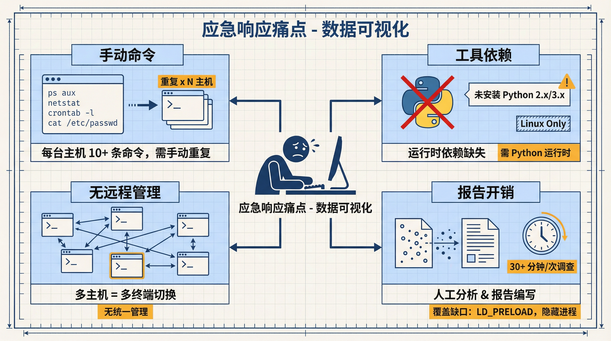
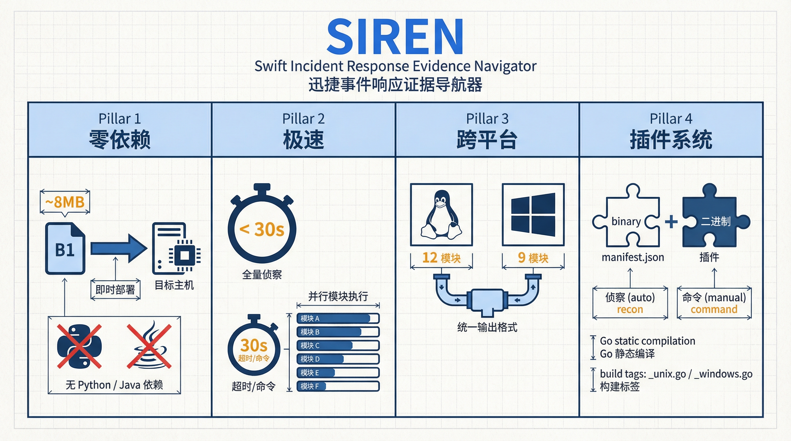
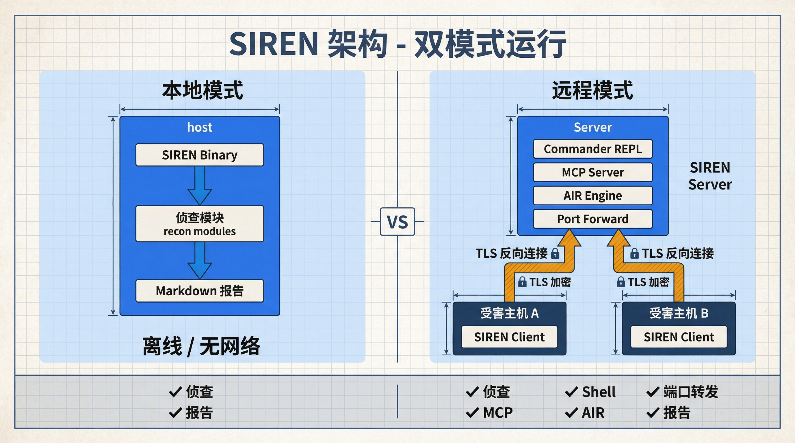
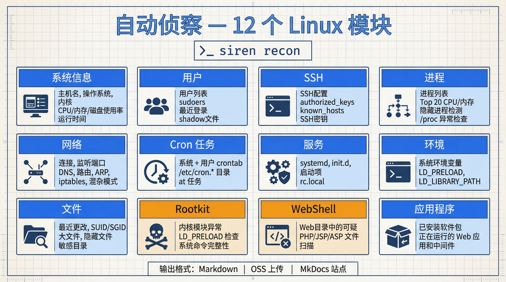
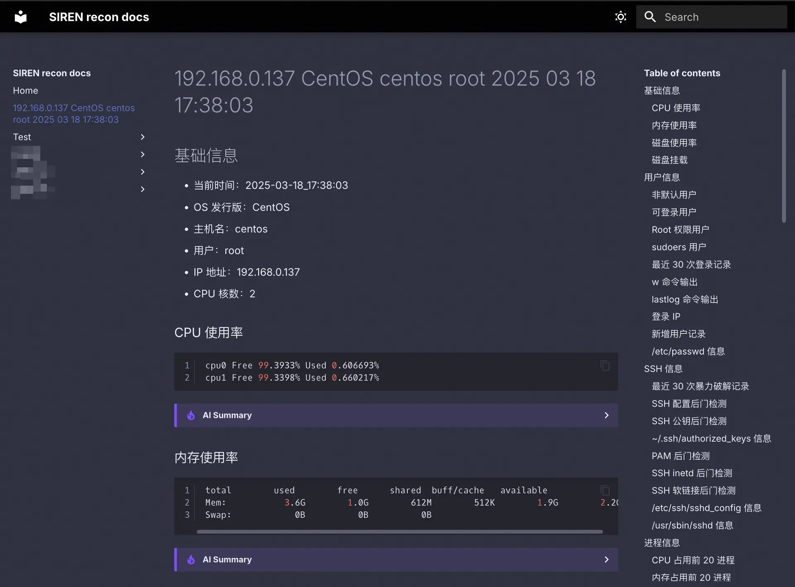
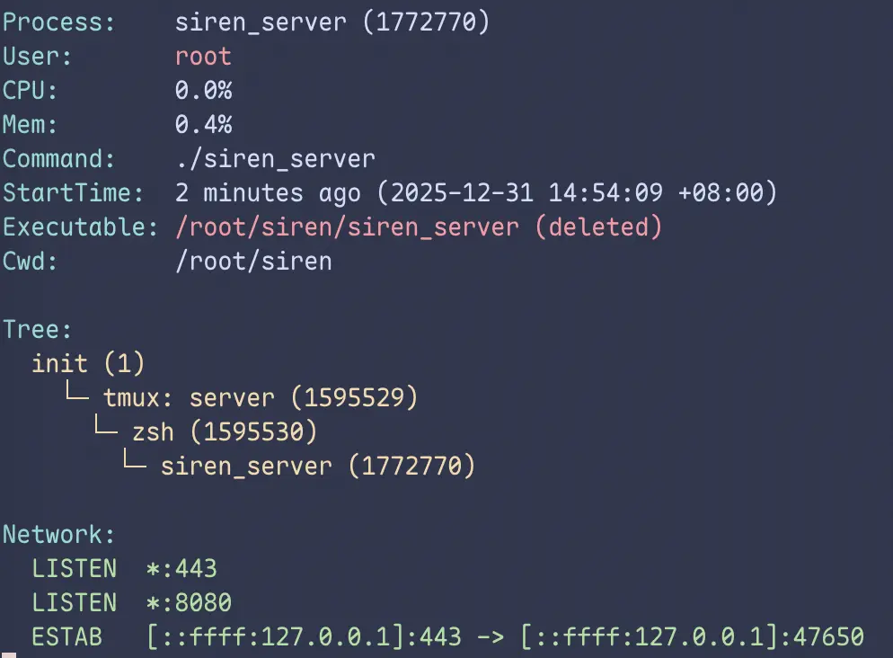
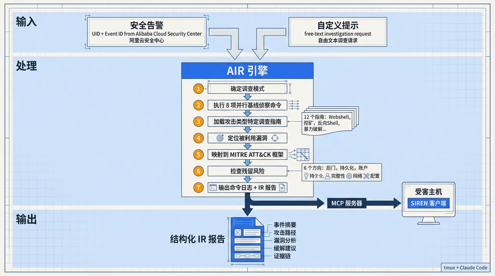
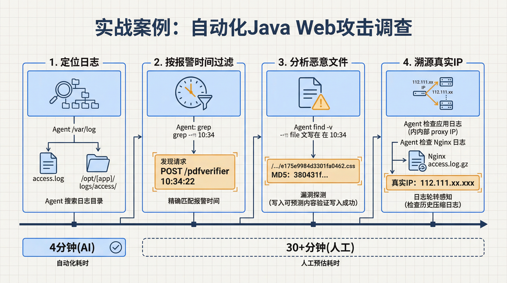
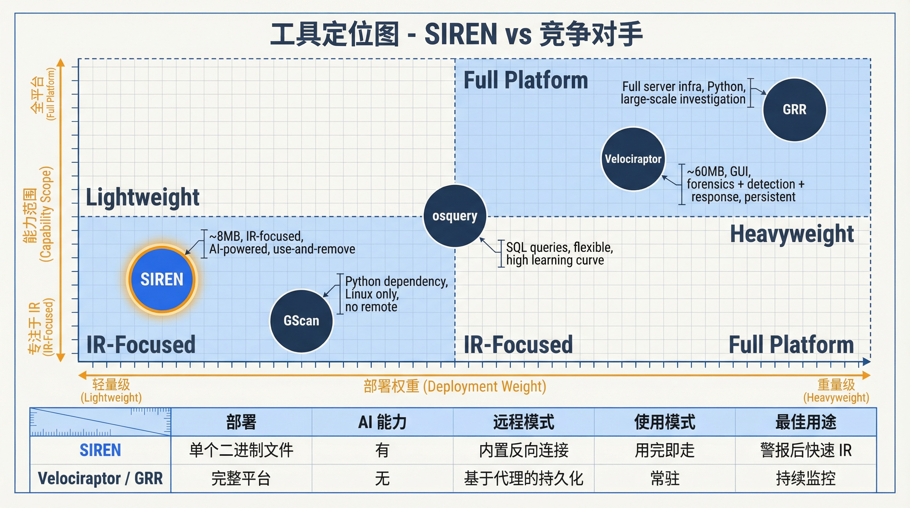

SIREN，一把专为应急响应打造的瑞士军刀。

<!--more-->

## 一、为什么要造 SIREN

应急响应中有一个现实问题：大部分客户的云安全产品接入情况和日志开通情况都不太理想，WAF 没开全量日志、云安全中心没接全、SLS 没投递……很多时候我们不得不登录受害主机，靠系统命令去拿排查所需的信息。

登录主机后，我们通常需要手动执行数十条命令来排查进程、网络连接、计划任务、用户、文件等——`ps aux`、`netstat -tlnp`、`crontab -l`、`cat /etc/passwd`……每台主机重复一遍。这个过程效率不高，也容易因个人排查习惯差异而遗漏检查项，例如 LD_PRELOAD 检查或隐藏进程检测，而这些恰恰是攻击者常用的隐藏手段。

此前我们在实际应急中使用过 [GScan](https://github.com/grayddq/GScan)，一个基于 Python 的入侵检测工具。GScan 的信息收集项较为全面，但在实战中暴露了一些问题：不少生产服务器上未安装 Python 运行时环境或版本不兼容，导致工具无法直接使用；仅支持 Linux（且主要针对 CentOS），Windows 主机需要另行处理；执行速度较慢，误报率也偏高。

排查多台受害主机时还缺少统一的远程管理能力，响应人员需要在多个终端之间来回切换。而信息收集完成后，从原始数据中梳理攻击链、编写应急报告，这部分工作完全依赖个人经验和手工操作，耗时长且质量参差不齐。

还有一个不容忽视的问题是上机环境本身。客户提供的排查环境五花八门：有的主机不能连外网、有的只能通过体验极差的 VNC 登录、有的藏在层层防火墙后面开个端口要走半天流程、有的客户直接让我们用向日葵之类的远程桌面工具连接。在这些环境下做排查，效率和体验都很受影响。



SIREN（**S**wift **I**ncident **R**esponse **E**vidence **N**avigator）就是为了解决这些问题而开发的。最初，我们将 GScan 的信息收集项用 Go 重写，去掉运行时依赖、加快执行速度、降低误报、补上 Windows 支持。后来加入了 C/S 架构的远程模式，让客户端反向外连到我们的控制端（是的，原理上和远控木马没什么区别），这样无论客户提供的网络环境多复杂，只要受害主机能出网，我们就能拿到一个全交互式 Shell 进行排查。在此基础上又逐步加入了 MCP 集成和 AI 驱动的自动化分析，形成了目前的版本。

## 二、设计上的几个选择



### 零依赖

Go 静态编译，产出一个约 8MB 的二进制文件，传输到目标主机后即可直接运行，无需 Python、Java 或任何系统库。在应急场景下，我们无法预知目标主机上的软件环境，零依赖的特性可以避免部署阶段的意外。

### 速度

大部分情况下，全量信息收集可在数十秒内完成。每条系统命令设有 30 秒超时控制（可通过配置文件调整），避免单条命令挂起导致整个流程阻塞。

### 跨平台

通过 Go 的 build tags 做平台隔离，`_unix.go` 和 `_windows.go` 各自包含对应平台的实现。Linux 提供 12 个收集模块，Windows 提供 9 个，输出格式统一。

### 插件机制

插件系统允许以独立二进制的形式扩展功能，无需修改核心代码。插件由一个可执行文件和 `manifest.json` 组成，可以使用任意语言开发。分为两种类型：`recon` 类型在信息收集时自动执行，`command` 类型按需手动调用。

## 三、两种工作模式

### 本地模式

直接在受害主机上运行 SIREN 客户端，所有数据采集在本地完成，输出 Markdown 报告。主要覆盖受害主机完全无法连接互联网的场景，此时无法使用远程模式，只能将二进制文件拷贝到主机上直接运行。

### 远程模式

SIREN 的远程模式采用 C/S 架构，客户端反向外连到服务端。服务端提供一个交互式 REPL（Commander），支持自动补全、历史记录和分类帮助，在一个终端中即可管理所有已连接的客户端。远程模式在本地模式基础上增加了远程 Shell、端口转发、AI 驱动应急响应、MCP 集成等能力，是推荐的使用方式。



## 四、功能介绍

### 4.1 自动化信息收集

这是 SIREN 最基本的功能，一条命令即可完成受害主机上所有关键安全信息的采集：

```bash
# 本地模式
./siren recon

# 远程模式
>>> recon <Client ID>
```

Linux 平台的收集模块如下：

| 模块 | 采集内容 |
|------|---------|
| 基础信息 | 主机名、OS、内核、CPU/内存/磁盘使用率、uptime |
| 用户 | 用户列表、可登录用户、sudoers、近期登录、shadow 文件 |
| SSH | SSH 配置、authorized_keys、known_hosts、SSH 密钥 |
| 进程 | 进程列表、CPU/内存 Top 20、隐藏进程检测、/proc 异常检查 |
| 网络 | 网络连接、监听端口、DNS、路由表、ARP、iptables、网卡混杂模式 |
| 计划任务 | crontab（系统级 + 用户级）、/etc/cron.* 目录、at 任务 |
| 服务 | systemd、init.d、自启项、rc.local |
| 环境变量 | 系统环境变量、LD_PRELOAD、LD_LIBRARY_PATH 等 |
| 文件 | 近期变更文件、SUID/SGID、大文件、隐藏文件、敏感目录 |
| Rootkit | 内核模块异常检测、LD_PRELOAD 检查、系统命令完整性 |
| Webshell | Web 目录可疑文件扫描（PHP/JSP/ASP） |
| 应用 | 已安装包、运行中的 Web 应用和中间件 |



Windows 平台也提供了对应的收集模块（基础信息、用户、进程、网络、计划任务、环境变量、文件、Webshell、应用），覆盖了 Windows 环境下的核心排查项。

所有模块可以通过 YAML 配置文件单独开关。收集结果以 Markdown 格式输出，支持本地保存、上传至 OSS，以及通过 MkDocs 站点在线浏览和检索。



#### 噪音过滤

为了让收集结果直接聚焦于异常项，SIREN 在配置中维护了大量白名单和黑名单规则：

- IP、用户、PAM 模块白名单
- 进程、计划任务、服务白名单
- 300+ 个已知安全内核模块白名单，约 50 个恶意模块黑名单
- Webshell 特征函数匹配（PHP/JSP）
- 挖矿程序检测规则
- Python pip 恶意包黑名单

这些规则可以通过配置文件自由调整。在实际使用中，合理配置规则可以显著减少人工筛选的工作量。

### 4.2 远程 Shell 与命令执行

远程模式下提供两种操作方式。

交互式 Shell 通过 tmux 启动全功能终端会话，支持 vim、top 等交互式命令，使用体验与 SSH 登录基本一致。Shell 会话走独立的 TLS 连接，不影响主控通道：

```bash
>>> shell <Client ID>
```

单条命令执行适合快速获取信息：

```bash
>>> run 0 whoami
root
>>> run 0 uname -a
Linux victim 5.15.0-91-generic #101-Ubuntu SMP x86_64 GNU/Linux
```

### 4.3 端口转发

通过 TLS 加密通道将受害主机内网服务映射到控制主机，用于访问仅监听 localhost 的管理后台、连接内网数据库等场景：

```bash
# 将受害主机 localhost:8000 映射到控制主机 8080 端口
>>> forward <Client ID> 8080:localhost:8000

# 转发到受害主机内网的其他主机
>>> forward <Client ID> 8080:192.168.1.10:3306
```

### 4.4 进程分析

对 Linux 进程进行深度分析，支持按 PID、端口或进程名查询。输出包括进程树、网络连接、容器检测、关联服务、CPU/内存指标和僵尸进程检测：

```bash
>>> info <Client ID> 1234
>>> info <Client ID> -p 8080
>>> info <Client ID> -n nginx
```



### 4.5 文件上传与威胁情报

将日志、样本等文件上传至 OSS 进行证据留存：

```bash
>>> upload <Client ID> /var/log/auth.log
```

将可疑文件上传至威胁情报平台（微步在线）进行分析，返回哈希和分析链接：

```bash
>>> ti <Client ID> /tmp/suspicious_binary
```

### 4.6 AccessKey 调查

通过 SOAR 平台查询 AccessKey 的调用历史（调用时间、操作类型、源 IP 等），生成结构化报告，用于评估泄露影响范围：

```bash
>>> ak <Alibaba Cloud UID> <AccessKey ID>
```

### 4.7 MCP 集成

服务端内置了 [MCP](https://modelcontextprotocol.io/)（Model Context Protocol）服务器，提供以下工具：

| 工具 | 描述 |
|------|------|
| `ls` | 列出已连接的客户端 |
| `run` | 在指定客户端上执行命令，支持并发 |
| `get_alarm_detail` | 通过 SOAR 获取安全告警详情 |

AI 助手通过 `ls` 获取客户端列表后，可以通过 `run` 在目标机器上执行排查命令。`run` 内置命令黑名单机制，通过正则表达式拦截 `rm`、`kill`、`shutdown` 等危险操作，防止 AI 误操作破坏受害主机环境。

在任意 MCP 客户端（如 Claude Desktop、Cursor 等）中添加以下配置即可接入：

```json
{
  "siren": {
    "type": "http",
    "url": "http://<SIREN Server IP>:8080/mcp"
  }
}
```

SIREN 选择通过 MCP 提供各类能力，主要有两个原因。一是 MCP 提供的是结构化的工具调用，AI 拿到的是明确的输入输出，可靠性更高。二是安全性：在应急场景下，我们需要确保 AI 不会在受害主机上执行危险操作，MCP 的 `run` 工具可以在服务端强制执行命令黑名单，而 Skill 中的约束本质上是建议性的，AI 仍然可以绕过。

### 4.8 Agentic 应急响应（AIR）

AIR 让 AI Agent 自动完成应急响应的完整流程：获取告警详情、在受害主机上执行排查命令、生成应急报告，中间不需要人工介入。

有两种使用方式。当有明确的阿里云安全中心告警时，提供 UID 和事件 ID：

```bash
>>> air <Client ID> <Alibaba Cloud UID> <Security Center Event ID>
```

也可以直接提供自定义 Prompt 执行通用排查：

```bash
>>> air 0 检查是否存在后门或恶意进程
>>> air 0 分析最近 24 小时内的异常登录行为
>>> air 0 排查 Webshell 并生成报告
```

执行后，服务端通过 tmux 启动新面板，运行配置好的大模型 CLI（如 Claude Code）。AI Agent 通过 MCP 调用 SIREN 的工具自动完成排查，最后输出结构化的应急报告。

#### 配套应急响应 Skill

为了让 AI 的排查过程更加系统化，SIREN 配套了一套 Claude Code Skill，实现了七步工作流：

1. 确定调查模式（告警驱动或自由调查）
2. 并行执行 8 组基线侦察命令
3. 根据告警类型加载对应的调查指南进行深度分析
4. 定位被利用的漏洞
5. 使用 MITRE ATT&CK 框架映射攻击路径
6. 从后门、持久化、账户、完整性、网络、配置六个方向检查遗留风险
7. 输出命令执行日志和应急响应报告

Skill 内置了 12 份调查指南，覆盖 Webshell、挖矿、反弹 Shell、暴力破解、异常登录、提权、数据泄露、勒索软件、RCE、SQL 注入、持久化等常见攻击类型，以及 6 份技术手法参考（日志分析、反向推理、云环境调查、进程文件关联、对抗技术、威胁情报）。AI 在排查过程中会根据告警特征动态加载相应的指南。



### 4.9 插件系统

> 插件系统目前还处于早期开发阶段，功能和接口可能会有变化。

以目前常用的两个插件为例：

- chkrootkit（recon 类型）：基于 chkrootkit 的 Rootkit 检测，在信息收集时自动执行
- jdump（command 类型）：Java 堆内存转储，用于 Java 应用取证

插件管理命令：

```bash
siren plugins install <name>
siren plugins uninstall <name>
siren plugins toggle <name>
siren plugins update <name>
```

开发自定义插件只需一个可执行文件和 `manifest.json`，支持 Linux、Windows 平台。

### 4.10 痕迹清除

排查完成后，可以清除 SIREN 在受害主机上的痕迹：

```bash
# 远程模式
>>> clean <Client ID>

# 本地模式
./siren clean
```

清除内容包括环境变量（OSS/TI/SOAR 凭证）、配置文件和可执行文件。Shell 会话期间 `HISTFILE` 设为 `/dev/null`，不留命令历史。

## 五、实战：一次 Java Web 应用命令执行事件的自动化溯源

以下是我们使用 Claude Code + SIREN MCP 处理的一个真实案例。在这个案例中，我们将展示 AI Agent 如何在无人工干预的情况下完成从日志定位到攻击路径还原的完整溯源过程。

### 事件背景

某客户的 Java Web 应用服务器产生了云安全中心告警，告警显示应用进程写入了一个可疑的 CSS 文件。客户未部署 WAF，因此没有云上 Web 日志可供查询，需要上机排查。

按照传统的溯源思路，我们需要从告警详情中提取关键信息，推测应用日志路径，上机定位 Web 日志，根据告警时间排查日志，再结合应用框架已知漏洞确定攻击入口点。这个流程极度依赖人员经验，耗时也较长。这次我们决定用 SIREN 的 MCP 集成让 Claude Code 来完成这一过程。

### 排查过程



我们在 Claude Code 中给出了排查指令，只提供了告警的基本信息：

```
> On client 0, there used to be a java application with jar file
  /opt/[redacted]/privapp.jar. At 2025-07-23 10:34:22, this application
  wrote a css file which triggered a security alert. Look for the related
  web access logs and help me figure out the attack path.
```

Agent 通过 SIREN MCP 连接到受害主机后，开始自主排查。

#### 定位日志

Agent 首先在 `/var/log` 下搜索 access 相关的日志文件，找到了 Nginx 日志。随后检查了 Java 应用的安装目录和日志目录结构：

```bash
⏺ mcp__siren__run (client_id: "0", command: "find /var/log -name \"*access*\"
                   -type f 2>/dev/null | head -20")
  ⎿  /var/log/nginx/access.log
     /var/log/nginx/access.log-20250721.gz
     /var/log/nginx/access.log-20250722.gz
     ...

⏺ mcp__siren__run (client_id: "0", command: "ls -la /opt/[redacted]/logs/access/app/
                    | head -20")
  ⎿  total 396
     drwxrwxr-x 2 [redacted] [redacted]   4096 Jul 24 02:21 .
     -rw-rw-r-- 1 [redacted] [redacted]  38771 Jul 24 02:21 access2025-07-23.log
     ...
```

#### 基于告警时间定位可疑请求

Agent 在应用访问日志中按告警时间 10:34 过滤，立即发现了一条 `POST /pdfverifier` 请求，时间与告警精确吻合：

```bash
⏺ mcp__siren__run (client_id: "0", command: "grep \"10:34:\"
                   /opt/[redacted]/logs/access/app/access2025-07-23.log")
  ⎿  10.26.xxx.xxx - - [23/Jul/2025:10:34:22 +0800] "POST /pdfverifier" 302 1
     "Mozilla/5.0 (Macintosh; Intel Mac OS X 10_15_7) ..."
```

#### 排查恶意文件

Agent 用 `find` 在应用目录下搜索告警时间窗口内新创建的 CSS 文件，定位到了告警中的可疑文件，并检查了文件内容：

```bash
⏺ mcp__siren__run (client_id: "0", command: "find /opt/[redacted] -name \"*.css\"
                   -newermt \"2025-07-23 10:30:00\" ! -newermt \"2025-07-23
                   10:40:00\" -ls 2>/dev/null")
  ⎿  1441924  4 -rw-rw-r-- 1 [redacted] [redacted] 32 Jul 23 10:34
     /opt/[redacted]/resources/css/e175e9984d3301fa0462.css

⏺ mcp__siren__run (client_id: "0", command: "cat
                   /opt/[redacted]/resources/css/e175e9984d3301fa0462.css")
  ⎿  380431f250d6b2dcaf3352c448e86b2b
```

文件内容只有一个 32 位的 MD5 哈希值，是典型的漏洞探测行为——攻击者写入一个可预测的内容来验证文件是否成功落盘。

#### 从 Nginx 日志中获取真实攻击 IP

应用日志中记录的请求源 IP 是内网代理地址。Agent 意识到需要去 Nginx 日志中获取真实的攻击 IP，但在当前日志文件中没有搜到结果。它随后自动去查了轮转后的 gz 压缩日志：

```bash
⏺ mcp__siren__run (client_id: "0", command: "zcat
                   /var/log/nginx/access.log-20250724.gz | grep
                   \"23/Jul/2025:10:34\"")
  ⎿  100.121.xxx.xxx - - [23/Jul/2025:10:34:22 +0800] "POST /pdfverifier
     HTTP/1.1" 302 0 "-" "Mozilla/5.0 ..." "112.111.xx.xxx"
```

Nginx 日志中最后一个字段记录了真实的客户端 IP。Agent 随后以该 IP 为条件反查了所有访问记录，梳理出攻击者的完整访问行为。

#### 检查应用日志

Agent 还检查了 Java 应用的 console 日志，搜索与 `pdfverifier` 和可疑文件名相关的记录，排查是否存在其他关联的异常行为。

### 排查结论

Agent 在约 4 分钟内完成了整个排查过程，输出了以下结论：

- 攻击者通过 `POST /pdfverifier` 接口写入了伪装为 CSS 文件的恶意文件，疑似文件上传漏洞或路径穿越
- 确定了攻击源 IP 和攻击时间
- 排查了同一攻击者在日志中的所有访问记录
- 排查了主机上的恶意文件残留情况

我们后续根据 Agent 输出的结论和 `/pdfverifier` 接口信息，在漏洞情报中确认了该 Java 应用存在已知的文件上传漏洞。

### 几点观察

这个案例有几个值得注意的地方。

首先，Agent 的排查思路和我们人工排查的逻辑是一致的：先找日志、按时间过滤、定位可疑请求、反查攻击 IP 的所有行为、排查文件残留。不需要给它写复杂的 Prompt，只需要告诉它告警的基本信息。

其次，Agent 在遇到问题时会自行调整。比如它一开始在当前的 Nginx 日志中没有搜到结果（因为日志已经轮转），随后自动去查了 gz 压缩的历史日志。应用日志中记录的是内网代理 IP 而非真实攻击 IP，它也能意识到需要去 Nginx 日志中获取。

当然，Agent 的排查也不是完美的，中间有几次命令超时或搜索范围过大导致失败，但它能自行缩小范围重试。最终 4 分钟完成的溯源，如果手动来做可能需要 30 分钟以上。

## 六、与同类工具对比

### vs GScan

[GScan](https://github.com/grayddq/GScan) 是 SIREN 在功能设计上的参考来源。使用 GScan 过程中遇到的问题直接推动了 SIREN 的开发。

|  | SIREN | GScan |
|--|-------|-------|
| 系统支持 | Linux、Windows | 仅 Linux (CentOS) |
| 依赖 | 无 | Python 2.x/3.x |
| 速度 | 数十秒 | 较慢 |
| 误报率 | 低（规则过滤） | 较高 |
| 离线可用 | 是 | 否 |
| AI 分析 | 是 | 否 |
| 远程模式 | 是 | 否 |

### vs osquery

[osquery](https://osquery.io) 通过类 SQL 语法查询系统信息，灵活性很高，但所有查询需要手动编写，在应急场景下上手门槛较高。同时 osquery 的安全相关收集项不够全面，部分信息仍需通过系统命令获取。

|  | SIREN | osquery |
|--|-------|---------|
| 使用方式 | 一键执行 | 编写 SQL 查询 |
| 上手门槛 | 低 | 高 |
| 自动化 | 开箱即用 | 需自行编排 |
| 安全项覆盖 | 覆盖核心项 | 需补充 |
| 远程管理 | 内置 | 需配合 Fleet 等平台 |

osquery 更适合深度定制化的持续监控场景，SIREN 专注于应急响应中的快速排查。

### vs Velociraptor

[Velociraptor](https://docs.velociraptor.app) 是功能全面的终端安全运维平台，覆盖数字取证、应急响应、威胁检测，有 GUI 界面和丰富的 Artifact 生态。两者的定位存在明显差异：Velociraptor 适合长期部署持续运行，SIREN 适合短期使用快速排查。

|  | SIREN | Velociraptor |
|--|-------|-------------|
| 定位 | 快速排查工具 | 终端安全平台 |
| 覆盖 | 应急响应 | 取证 + 响应 + 检测 |
| 界面 | CLI | GUI |
| 运行方式 | 用完即撤 | 持续运行 |
| 资源占用 | 约 8MB | 约 60MB，~100M 内存 |

### vs GRR

[GRR](https://github.com/google/grr) 是 Google 开源的 C/S 架构调查响应平台，Python 编写。与 Velociraptor 类似，定位为大规模持续性调查平台，部署和维护成本较高。

|  | SIREN | GRR |
|--|-------|-----|
| 语言 | Go | Python |
| 部署 | 单个二进制 | 完整 Server 基础设施 |
| 场景 | 快速响应 | 大规模调查 |
| AI 能力 | 有 | 无 |
| 维护成本 | 低 | 高 |

### 如何选择



SIREN 的定位是轻量级的应急响应专项工具，专注于接到告警后快速完成排查这一场景。如果需要持续运行的终端安全运维平台，Velociraptor 或 GRR 更为合适。两类工具解决的问题不同，可以共存。

## 七、开始使用

关于 SIREN 的部署安装、配置说明和详细使用步骤，请参考 [SIREN 官方文档](https://sirendocs.up.railway.app)。

关于 SIREN 的最新功能、开发进展和问题修复进展，请参考 [SIREN 更新日志](#)。

## 八、总结

SIREN 最初只是为了替代手工排查，我们将 GScan 的信息收集项用 Go 重写，去掉了运行时依赖，补上了 Windows 支持，降低了误报率。后来在实际应急工作中，逐步加入了远程模式、MCP 集成和 AI 驱动的自动化分析，形成了目前从信息收集到自动化溯源的完整工具链。

一个约 8MB 的二进制文件传到目标主机即可运行，一条命令完成十余个维度的安全信息采集，配合规则过滤掉大部分噪音。远程模式下客户端反向外连，无论客户提供的网络环境多复杂，我们都能拿到全交互式 Shell 进行排查。在此基础上，MCP 集成让 AI Agent 可以自动完成从告警获取到报告生成的完整流程，前面实战案例中 Agent 在 4 分钟内完成了手动可能需要半小时以上的溯源。

与 Velociraptor、GRR 等终端安全平台相比，SIREN 的定位更窄，只做接到告警后的快速排查，用完即撤，不需要长期部署。目前插件系统、检测规则和 AI 分析能力仍在持续迭代中，项目文档和工具本身均已开放，欢迎大家试用反馈。
