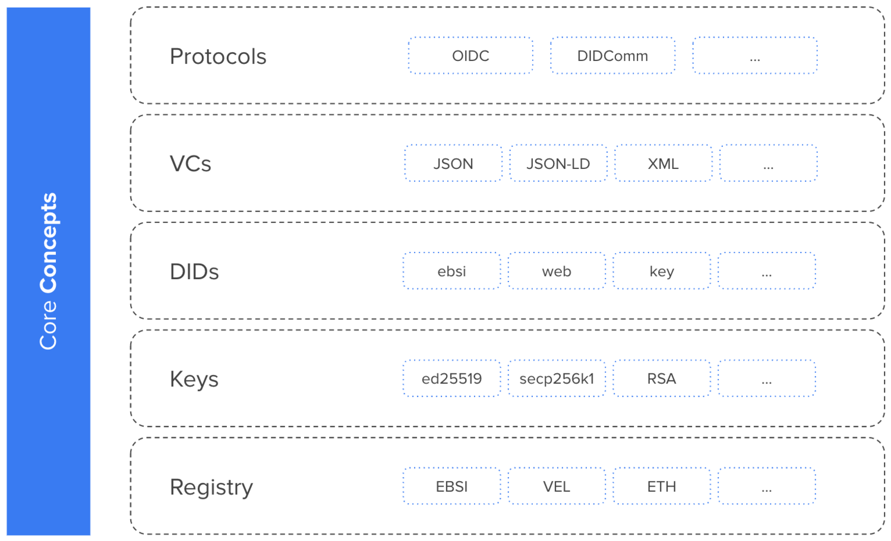

更安全方便地管理、分享和验证身份信息。

<!--more-->

自主身份（Self-Sovereign Identity）是一种以用户为中心的数字身份机制，允许用户和组织完全控制他们的身份信息。因此，SSI 能让任何人可靠地分享和证明其身份，同时不牺牲隐私。

## 基本原理

SSI 能让我们像在现实中用纸质文件和卡片一样建立自己的数字身份，并且任何人都能可靠地在线上或者线下验证这些身份。这样一来，SSI 就能在去中心化的生态系统中让用户交换身份信息。在这类系统中存在三类角色：

- 签发者 Issuers - 签发数字身份给个人或组织（Holders）的一方，是 SSI 系统中的数据源
- 持有者 Holders - 从不同 Issuers 处接收包含自身身份信息的数字身份的个人或组织。通过聚合和存储这些数字身份，Holders 能构建出一套完整的并完全由自己控制的数字身份
- 验证者 Verifiers - 需要验证上述数字身份从而提供产品和服务的一方

一般来说，个人或组织在一次交互中只会担任其中一个角色，但担任多个角色的情况也十分常见。比如 Issuer 和 Verifier 经常是重合的。

## 技术概念

首先需要了解一些核心概念：

- Registries - 提供共享的、可信的特定信息，可以认为是可信数据源
- 密钥 - 通过密码学控制和处理数字身份信息，例如加密和认证
- Decentralized Identifiers（DIDs）- 通过将密钥对应到唯一的标识符来建立一套公钥基础设施
- Verifiable Credentials（VCs）- 包含数字身份的“证件”，可以方便地分享和验证，同时保护隐私。需要注意，出于隐私和合规性原因，它们不会被存储在区块链上
- Protocols - 不同主体间交换 VC 的协议
- Wallets - 用于存储密钥和 VC，让我们能通过简单易用的应用程序来管理和分享数字身份

SSI 的这些核心概念构成了整个技术栈：


技术栈中的每个模块都可以采用不同的技术来实现，于是会诞生不同类型的 SSI 系统。因此，在构建 SSI 系统时，技术和服务选型是需要考虑的重要问题。



完整的身份认证过程则如下图所示，Issuers 首先创建身份信息并签名，随后签发给 Holders。Holders 负责管理这些身份信息，并向 Verifiers 出示合适的身份信息。Verifiers 对其进行验证，通过后提供服务。整个过程依赖于可信的 Registry，并且均涉及对 DID 的读写。


## 技术细节

密钥比较容易理解，这里不再作介绍。

### Registries

SSI 系统中的所有参与者都可以信任 Registries，因此 Registries 是分布式公钥基础设施 DPKI 的基础，也是所有可信数据的来源。我们可以使用不同技术来实现 Registries，例如：

- 区块链或 L1：通常我们利用其不可篡改性来防止参与者修改身份信息数据，如今使用的较多的是带权限控制的区块链（例如可以指定特定的组拥有写权限），比如 Ethereum Quorum
- L2：L2 网络位于区块链上层并能聚合数据，从而更好地解决传统区块链的可扩展性和成本问题，其中和数字身份相关的实现有 Bitcoin 的 ION 和 Ethereum 的 Element 等
- 其他分布式账本技术（DLTs）：例如 IPFS，但在数字身份领域作用有限
- DNS：尽管不完全是分布式的，DNS 因为成熟和普及也常被用作 Registries

值得注意，实现 SSI 并不一定需要实现 Registries，但实现 Registries 能更好地融合其它基于 DPKI 和可信 Registries 的服务。

### Decentralized Identifiers (DIDs)

DID 是 W3C 标准化的一种唯一标识符，用于构建 DPKI 使得参与者能发现彼此，并认证、加密、签名和验证数据。

DID 存在多种不同实现，也各有优劣。许多实现依赖于 Registries，例如 did:ebsi 依赖 EBSI、did:web 依赖 DNS，但一些新的实现并不需要 Registries 因为其分发机制基于 peer-to-peer 的交互，例如 did:key。

举个例子，`did:ebsi:2A9RkiYZJsBHT1nSB3HZAwYMNfgM7Psveyodxrr8KgFvGD5y` 会被解析为如下 DID document：

```json
{
    "@context": [
        "https://w3id.org/did/v1"
    ],
    "authentication": [
        "did:ebsi:2A9RkiYZJsBHT1nSB3HZAwYMNfgM7Psveyodxrr8KgFvGD5y#1a7514b2d58141c3982021a6323b99bf"
    ],
    "id": "did:ebsi:2A9RkiYZJsBHT1nSB3HZAwYMNfgM7Psveyodxrr8KgFvGD5y",
    "verificationMethod": [{
        "controller": "did:ebsi:2A9RkiYZJsBHT1nSB3HZAwYMNfgM7Psveyodxrr8KgFvGD5y",
        "id": "did:ebsi:2A9RkiYZJsBHT1nSB3HZAwYMNfgM7Psveyodxrr8KgFvGD5y#1a7514b2d58141c3982021a6323b99bf",
        "publicKeyJwk": {
            "alg": "EdDSA",
            "crv": "Ed25519",
            "kid": "1a7514b2d58141c3982021a6323b99bf",
            "kty": "OKP",
            "use": "sig",
            "x": "tqJADByHRU3YxswewQD4wQYXU9tB43j3PfjofsYEvqs"
        },
        "type": "Ed25519VerificationKey2018"
    }]
}
```

### Verifiable Credentials (VCs)

实际的身份数据就存储在 VC 和 VP 中。VC 由 Issuers 签发，通常至少包含：

- Issuer 的 DID
- 接收者（Holder）的 DID
- VC 的有效性相关信息
- 接收者的属性，如名字、年龄、地址等
- Issuer 的签名和其他信息

一个典型的 VC 长这样：

```json
{
  "@context": [
    "https://www.w3.org/2018/credentials/v1",
    "https://essif.europa.eu/schemas/v-a/2020/v1",
    "https://essif.europa.eu/schemas/eidas/2020/v1"
  ],
  "id": "education#higherEducation#3fea53a4-0432-4910-ac9c-69ah8da3c37f",
  "type": [
    "VerifiableCredential",
    "VerifiableAttestation"
  ],
  "issuer": "did:ebsi:2757945549477fc571663bee12042873fe555b674bd294a3",
  "issuanceDate": "2019-06-22T14:11:44Z",
  "validFrom": "2019-06-22T14:11:44Z",
  "credentialSubject": {
    "id": "id111"
  },
  "credentialStatus": {
    "id": "https://essif.europa.eu/status/identity#verifiableID#1dee355d-0432-4910-ac9c-70d89e8d674e",
    "type": "CredentialStatusList2020"
  },
  "credentialSchema": {
    "id": "https://essif.europa.eu/tsr-vid/verifiableid1.json",
    "type": "JsonSchemaValidator2018"
  },
  "evidence": [
    {
      "id": "https://essif.europa.eu/tsr-va/evidence/f2aeec97-fc0d-42bf-8ca7-0548192d5678",
      "type": [
        "DocumentVerification"
      ],
      "verifier": "did:ebsi:2962fb784df61baa267c8132497539f8c674b37c1244a7a",
      "evidenceDocument": "Passport",
      "subjectPresence": "Physical",
      "documentPresence": "Physical"
    }
  ],
  "proof": {
    "type": "EidasSeal2021",
    "created": "2019-06-22T14:11:44Z",
    "proofPurpose": "assertionMethod",
    "verificationMethod": "did:ebsi:2757945549477fc571663bee12042873fe555b674bd294a3#2368332668",
    "jws": "HG21J4fdlnBvBA+y6D...amP7O="
  }
}
```

### Verifiable Presentations (VPs)

VP 则由 Holders 创建和签名，包含了来自一个或多个 VC 的身份信息，用于出示给 Verifier。VP 通常至少包含

- VC 或者 VC 的一部分（例如部分个人属性）
- 接收者（Holders）的签名

一个典型的 VP 长这样：

```json
{
  "@context": [
    "https://www.w3.org/2018/credentials/v1"
  ],
  "type": [
    "VerifiableCredential",
    "VerifiablePresentation"
  ],
  "verifiableCredential": [
    {
      "@context": [
        "https://www.w3.org/2018/credentials/v1",
        "https://essif.europa.eu/schemas/vc/2020/v1"
      ],
      "credentialSubject": {
        "id": "did:ebsi:00000004321",
        "naturalPerson": {
          "did": "did:example:00001111"
        }
      },
      "id": "did:ebsi-eth:00000001/credentials/1872",
      "issuanceDate": "2020-08-24T14:13:44Z",
      "issuer": "did:ebsi:000001234",
      "proof": {
        "created": "2020-08-24T14:13:44Z",
        "jws": "eyJhbGciOiJSUzI1NiIsImI2NCI6ZmFsc2UsImNyaXQiOlsiYjY0Il19.",
        "proofPurpose": "assertionMethod",
        "type": "EcdsaSecp256k1Signature2019",
        "verificationMethod": "did:ebsi-eth:000001234#key-1"
      },
      "type": [
        "VerifiableCredential",
        "VerifiableAuthorization"
      ]
    },
    {
      "@context": [
        "https://www.w3.org/2018/credentials/v1",
        "https://w3id.org/citizenship/v1"
      ],
      "credentialSubject": {
        "birthDate": "1958-08-17",
        "givenName": "JOHN",
        "id": "did:example:123",
        "type": [
          "PermanentResident",
          "Person"
        ]
      },
      "issuer": "did:example:456",
      "proof": {
        "created": "2020-04-22T10:37:22Z",
        "jws": "eyJjcml0IjpbImI2NCJdLCJiNjQiOmZhbHNlLCJhbGciOiJFZERTQSJ9..BhWew0x-txcroGjgdtK-yBCqoetg9DD9SgV4245TmXJi-PmqFzux6Cwaph0r-mbqzlE17yLebjfqbRT275U1AA",
        "proofPurpose": "assertionMethod",
        "type": "Ed25519Signature2018",
        "verificationMethod": "did:example:456#key-1"
      },
      "type": [
        "VerifiableCredential",
        "PermanentResidentCard"
      ]
    }
  ]
}
```

### Protocols

VC 和 VP 的传输需要一个安全的协议，通常参与者间的通信建立在双向认证的加密信道上。最常用的 SSI 数据交换协议包括：

- OIDC4SSI / SIOP：认证授权协议 OpenID Connect 的扩展
- DIDComm：Decentralized Identity Foundation（DIF）专为 SSI 设计的新协议
- Credential Handler API：将用户的身份信息连接到 web 应用的浏览器扩展

## 技术实践

以 walt.id 的 SSI Kit 为例，首先构建 SSI Kit（需要 JDK 16+，并会安装 Gradle 7）：

```shell
$ ./ssikit.sh build
$ alias ssikit=./ssikit.sh
```

> 或直接使用 docker 镜像：
>
> ```shell
> $ alias ssikit=docker run -itv $(pwd)/data:/app/data waltid/ssikit
> ```

接下来，以较复杂的与 EBSI/ESSIF 生态结合的完整流程为例，这里需要使用 `did:ebsi` 并遵循 `ESSIF Onboarding` -> `EBSI Auth API` -> `ESSIF DID Registration` 工作流。而相对简单的 `did:key` 和 `did:web` 的流程类似，且步骤更少。

### 1. Issuer

首先生成密钥，注意 `did:ebsi` 要求使用 ECDSA Secp256k1 密钥 ：

```shell
$ ssikit key gen -a Secp256k1
# f99c22970c5a430e85bf55120918acfa
```

使用密钥生成 DID：

```shell
$ ssikit did create -m ebsi -k f99c22970c5a430e85bf55120918acfa
# did:ebsi:z25xkb9bFMYnCp4rGegG7a3E
$ ISSUER_DID=did:ebsi:z25xkb9bFMYnCp4rGegG7a3E
```

将从 https://app.preprod.ebsi.eu/users-onboarding 获得的 token 贴到 `issuer/data/bearer-token.txt` 中，随后注册 Issuer 的 DID 到 EBSI ledger 上：

```shell
$ ssikit essif onboard --did $ISSUER_DID issuer/data/bearer-token.txt
$ ssikit essif auth-api --did $ISSUER_DID
$ ssikit essif did register --did $ISSUER_DID
```

验证是否能从 EBSI ledger 上获取并解析 DID：

```shell
$ ssikit did resolve --did $ISSUER_DID
```

### 2. Holder

与 Issuer 类似：

```shell
$ ssikit key gen -a Secp256k1
# aa7c8338bd284ed0ab0db613c8656425
$ ssikit did create -m ebsi -k aa7c8338bd284ed0ab0db613c8656425
# did:ebsi:zn8bsd3Q51ZzjmHzb41BcQp
$ HOLDER_DID=did:ebsi:zn8bsd3Q51ZzjmHzb41BcQp
$ ssikit essif onboard --did $HOLDER_DID holder/data/bearer-token.txt
$ ssikit essif auth-api --did $HOLDER_DID
$ ssikit essif did register --did $HOLDER_DID
$ ssikit did resolve --did $HOLDER_DID
```

### 3. Issuer

用学位证明模版 VerifiableDiploma 签发两个证明（VC）：

```shell
$ ssikit vc issue -i $ISSUER_DID -s $HOLDER_DID -t VerifiableDiploma --interactive issuer/data/bachelor.json
$ ssikit vc issue -i $ISSUER_DID -s $HOLDER_DID -t VerifiableDiploma --interactive issuer/data/master.json
```

发送给 Holder：

```shell
$ cp issuer/data/*.json holder/data
```

注意这里使用 `cp` 来模拟发送操作，实际应用中往往需要额外的 Data Exchange Protocols 来安全传输 VC 和 VP。

### 4. Holder

用两个 VC 生成 VP：

```shell
$ ssikit vc present --holder-did $HOLDER_DID holder/data/bachelor.json holder/data/master.json
```

发送给 Verifier：

```shell
$ cp data/vc/presented/vp-1657865675707.json verifier/data
```

### 5. Verifier

验证 VC 和 VP，这里需要验证：

- Issuer 和 Holder 的 DID（从 EBSI ledger 获取）
- VP 中每个 VC 的签名
- VP 自身的签名

```shell
$ ssikit vc verify -p TrustedIssuerDidPolicy -p TrustedSubjectDidPolicy -p JsonSchemaPolicy -p SignaturePolicy verifier/data/vp-1657865675707.json
```

需要注意的是，`-p` 参数设置的验证规则顺序很重要。在上述命令中，Verifier 会先检查 Issuer 和 Holder 的 DID，只有验证通过后两者的公钥才会被导入，随后才能用 `SignaturePolicy` 检查签名。

## 使用场景

SSI 技术在身份认证相关领域有着广泛的用途，例如：

- IAM，可替代注册-登录流程，用于认证已知的用户和参与者
- 身份证明与验证，和 IAM 相对，用于认证未知的用户和参与者
- 风险与合规性检查，即检查身份信息以外的其他背景信息
- 数字身份，可替代传统的纸质身份文件/证件，更容易管理、分享和验证且更难伪造
- 关联身份的钱包应用

## 参考资料

1. [SSI | Basics](https://docs.walt.id/v/ssikit/ssi-kit/what-is-ssi/ssi-or-basics)
1. [Technologies & Concepts](https://docs.walt.id/v/ssikit/ssi-kit/what-is-ssi/technologies-and-concepts)
1. [Decentralized Identifiers (DIDs) v1.0](https://www.w3.org/TR/did-core/)
1. [Verifiable Credentials Data Model v1.1](https://www.w3.org/TR/vc-data-model/)
1. [Build end-to-end use cases](https://docs.walt.id/v/ssikit/usage-examples/usage-examples/build-end-to-end-use-cases)
1. [Use cases](https://docs.walt.id/v/ssikit/ssi-kit/ssi-kit/use-cases)
