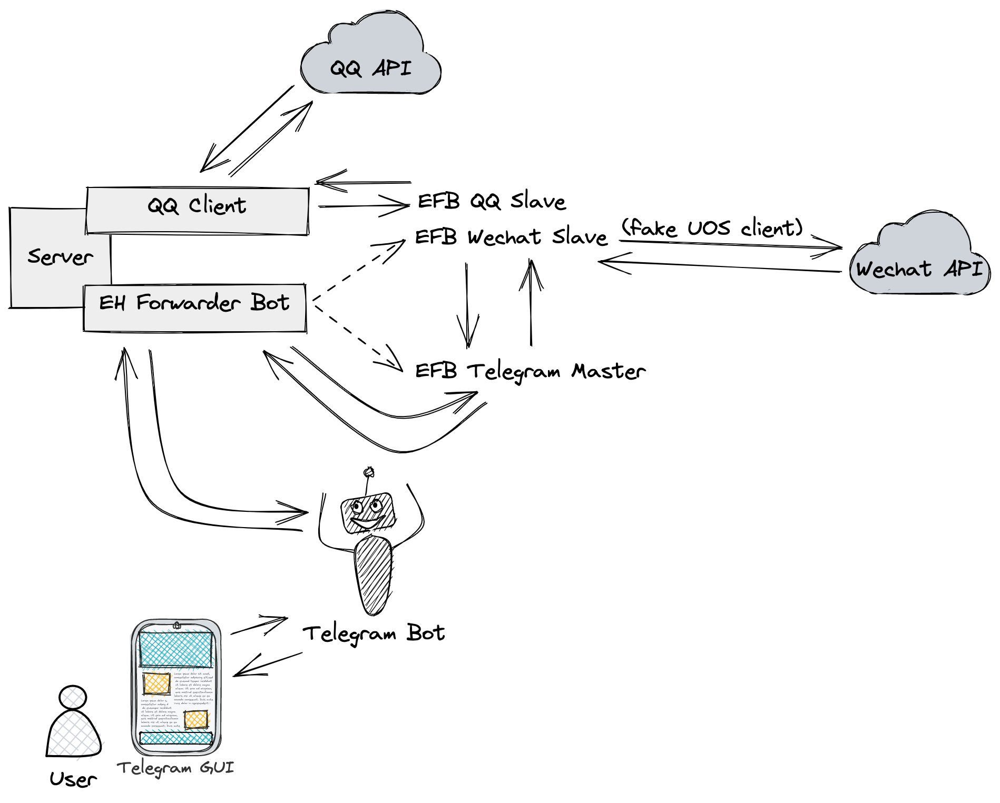

和毒瘤软件说再见。

<!--more-->

## 动机

为什么要用 Telegram 收发微信和 QQ 消息？不仅是因为 Telegram bot 好玩而这恰好可以作为一次实践机会，还有如下几点原因：

- 可以减少受到此类毒瘤软件的毒害
- 可以在 PC 上卸载微信和 QQ 客户端，在手机上卸载 QQ 客户端并大幅减少打开微信的频率；同时微信也不再需要常驻后台
- 天下苦微信久矣。但相比完全不使用微信，这种方式能给自己和他人带来更少麻烦
- 在 Telegram 上获得更好的使用体验
- 对消息的管理更便捷，例如可以将多个微信群的消息转发到同一个 Telegram 群组中（随后可以选择静音群组）
- 将所有消息聚合至同一软件，减少切换，方便管理和查看

## 背景

早期大部分微信用户可以顺畅地登录和使用微信网页版，因此以 [itchat](https://itchat.readthedocs.io/zh/latest/) 为代表的一系列利用微信 Web API 实现个人账号自动化的框架十分火热。但好景不长，微信很快限制了绝大部分用户登录网页版的能力，致使 Web API 近乎等同于失效。

随后开发者发现 UOS 版的微信是微信网页版套了 Electron 的壳，因此使用 UOS 版微信作为 UA 可以绕过这一限制。然而这一举措随着 UOS 微信无法登录再次失效。遭受同样命运的还有利用文件传输助手登录网页版微信的办法。但近期出于未知原因，UOS 版微信登录突然恢复了，使得网页版微信再次成为可能。

此外，还存在多种利用 Windows hook 的方式，如 [可爱猫](http://www.keaimao.com/dev/guide/#%E8%BD%AF%E4%BB%B6%E7%AE%80%E4%BB%8B) 等。但利用此类框架收发消息需要 Windows VPS，成本较高。

QQ 也曾出现过类似的大规模封禁 QQ 机器人的事件，但相比微信更开放的生态催生了诸如 [mirai](https://github.com/mamoe/mirai)、[go-cqhttp](https://github.com/Mrs4s/go-cqhttp) 这样的优秀自动化框架，能让我们轻松许多。

## 原理

调研初期，预期的目标仅仅是尽可能减少对微信客户端的依赖。而经过调研，目前最为成熟（且免费）的方案是使用 ehForwarderBot 将消息转发至 Telegram。 其原理大致如图：



可以看到，我们首先需要一个 Telegram Bot 作为前端，并在自己的服务器上启动 EH Forwarder Bot 作为后端。根据配置文件它会启动 Telegram Master 用于和 EH Forwarder Bot 直接通信，而 Telegram Master 则会和两个 Slave 通信。Wechat Slave 利用 UOS 版请求头与微信 API 交互，而 QQ Slave 则通过另外启动的 QQ 客户端来访问 QQ 的 API。这里的 QQ 客户端当然不是我们平时使用的桌面版 GUI 客户端，而是类似 mirai、go-cqhttp 这样的交互框架。这个例子里我们使用更轻量的 go-cqhttp。

## 实现

### 环境

- 能够同时访问微信、QQ、Telegram 的 API 的服务器（如果不能访问 Telegram API 则需要在服务器上额外配置代理或使用境外服务器反代）
- Python 3.6+
- 可正常使用的 Telegram 账号

### 版本信息

- [ehForwarderBot](https://github.com/ehForwarderBot/ehForwarderBot) v2.1.1
- [efb-telegram-master](https://github.com/ehForwarderBot/efb-telegram-master) v2.3.0
- [efb-wechat-slave](https://github.com/ehForwarderBot/efb-wechat-slave) v2.0.7
- [efb-qq-slave](https://github.com/ehForwarderBot/efb-qq-slave) v2.0.1
- [go-cqhttp](https://github.com/Mrs4s/go-cqhttp) v1.0.0-rc3
- [efb-qq-plugin-go-cqhttp](https://github.com/ehForwarderBot/efb-qq-plugin-go-cqhttp) @master

### 参考步骤

#### 安装

手动安装并不复杂，但使用自动脚本更简单，注意这一自动脚本仅仅设置微信转发：

```shell
$ wget https://raw.githubusercontent.com/hookjk100/efb-install/main/install.sh -O install.sh && chmod +x install.sh && bash install.sh
```

这一脚本最重要的是会自动设置守护进程，免去许多麻烦。随后 patch 一下 efb-wechat-slave 并安装剩余依赖：

```shell
$ pip3 uninstall efb-wechat-slave
$ pip3 install git+https://github.com/ehForwarderBot/efb-wechat-slave
$ pip3 install efb-qq-slave
$ wget https://github.com/Mrs4s/go-cqhttp/releases/download/v1.0.0-rc3/go-cqhttp_1.0.0-rc3_linux_amd64.deb
$ dpkg -i go-cqhttp_1.0.0-rc3_linux_amd64.deb
$ pip install git+https://github.com/XYenon/efb-qq-plugin-go-cqhttp
```

#### 设置 Telegram Bot

安装时不妨先去 Telegram 找 @BotFather 创建自己的 Bot，并记得 `/setprivacy` 为 `Disable` 来让 Bot 也能收取非 `/` 开头的消息。最后 `/setcommand`：

```
/link
     将一个远端会话与一个空 Telegram 群组绑定。
     通过附加正则表达式来筛选结果。
/chat
     生成一个会话头以开始会话。
     通过附加正则表达式来筛选结果。
/extra
     列出所有由从端提供的附加功能。
/unlink_all
     断开该会话中的所有远程会话。
/info
     显示该 Telegram 会话的相关信息。
/react [emoji]
     使用 emoji 对一条消息进行回应，或者列出所有组员做出过的回应。
/update_info
     更新被绑定 Telegram 群组的详情信息。
     只对被单独绑定且 Bot 为管理员的群组有效。
/rm
     从远端会话中移除被引用回复的消息。
/help
     显示本帮助信息。
```

这里比较重要的是 `/link` 命令和 `/chat` 命令。前者可以将来自同一联系人的消息分流到同一个 Telegram Group 或 Channel 中，后者则能新发起一个对话。利用 `/update_info` ，甚至可以将原群组的名称、头像和成员列表同步过来。

#### 设置 Telegram Master

保存 Bot 的 token，并写入 Telegram Master 的配置 `~/.ehforwarderbot/profiles/default/blueset.telegram/config.yaml`：

```yaml
token: "your bot token"
admins:
  - your Telegram ID
```

`admins` 决定了哪些用户能管理 Bot，即利用 Bot 收发消息，这里的 Telegram ID 可以通过现有的许多 ID Bot 获得。

#### 设置 EH Forwarder Bot

然后修改 `~/.ehforwarderbot/profiles/default/config.yaml`，即 EH Forwarder Bot 本身的配置：

```yaml
# ===================================
# EH Forwarder Bot Configuration File
# ===================================
#
# This file determines what modules, including master channel, slave channels,
# and middlewares, are enabled in this profile.
#
#
# Master Channel
# --------------
# Exactly one instance of a master channel is required for a profile.
# Fill in the module ID and instance ID (if needed) below.

master_channel: blueset.telegram

# Slave Channels
# --------------
#
# At least one slave channel is required for a profile.
# Fill in the module ID and instance ID (if needed) of each slave channel
# to be enabled below.

slave_channels:
  - blueset.wechat
  - milkice.qq

# Middlewares
# -----------
# Middlewares are not required to run an EFB profile. If you are not
# going to use any middleware in this profile, you can safely remove
# this section. Otherwise, please list down the module ID and instance
# ID of each middleware to be enabled below.
middlewares: []

flags:
  message_muted_on_slave: silent
```

有兴趣的话还可以添加中间件。

#### 设置 Wechat Slave

类似地，可以配置 Wechat Slave 的 `~/.ehforwarderbot/profiles/default/blueset.wechat/config.yaml`，这里仅仅是我的配置：

```yaml
flags:
  max_quote_length: 60
  delete_on_edit: true
```

至此，微信转发已经配置完毕。

#### 设置 QQ Slave

同理配置 QQ Slave 的 `~/.ehforwarderbot/profiles/default/milkice.qq/config.yaml`：

```yaml
Client: GoCQHttp
GoCQHttp:
  type: HTTP
  access_token: your token
  api_root: http://127.0.0.1:5700/
  host: 127.0.0.1
  port: 8000
```

#### 设置并运行 go-cqhttp

随后，就可以运行 `go-cqhttp` 作为我们的 QQ 客户端了，首次运行会在同目录生成配置文件，需要修改的包括：

```yaml
account: # 账号相关
  uin: 123456789 # QQ账号
  password: "" # 密码为空时使用扫码登录

message:
  # 上报数据类型
  # 可选: string,array
  post-format: array
  # 为Reply附加更多信息
  extra-reply-data: true

# 默认中间件锚点
default-middlewares: &default # 访问密钥, 强烈推荐在公网的服务器设置
  access-token: "your token"

# 连接服务列表
servers:
  # 添加方式，同一连接方式可添加多个，具体配置说明请查看文档
  #- http: # http 通信
  #- ws:   # 正向 Websocket
  #- ws-reverse: # 反向 Websocket
  #- pprof: #性能分析服务器

  - http: # HTTP 通信设置
      address: 127.0.0.1:5700 # HTTP监听地址
      long-polling:   # 长轮询拓展
        enabled: true        # 是否开启
        max-queue-size: 2000 # 消息队列大小，0 表示不限制队列大小，谨慎使用
      post: # 反向HTTP POST地址列表
        - url: "http://127.0.0.1:8000"
          secret: ""
```

修改后，重启 `go-cqhttp`。由于 `go-cqhttp` 是单个二进制文件，我们可以编写一个脚本来管理服务（假设配置目录位于 `~/go-cqhttp`）：

```shell
#!/usr/bin/env bash

CONFIG_DIR=~/go-cqhttp

case "$1" in
    start)
        echo "Starting go-cqhttp..."
        go-cqhttp -c $CONFIG_DIR/config.yml -d
        ;;
    stop)
        echo "Stopping go-cqhttp..."
        kill $(cat $CONFIG_DIR/go-cqhttp.pid)
        ;;
    status)
        netstat -nplt | grep go-cqhttp
        if [ $? -ne 0 ]
        then
            echo "inactive"
        fi
        ;;
    restart)
        echo "Stopping go-cqhttp..."
        kill $(cat $CONFIG_DIR/go-cqhttp.pid)
        echo "Starting go-cqhttp..."
        go-cqhttp -c $CONFIG_DIR/config.yml -d
        ;;
    *)
        echo "Usage: $0 start|stop|status|restart"
        exit 1
        ;;
esac
```

#### 运行 EH Forwarder Bot

此时，终于可以启动 `ehforwarderbot` 并登录，最后就能在 Telegram bot 中收到相应的信息。经测试，部分情况下甚至会比客户端更快收到消息。

我们可以用 `journalctl` 查看 efb 日志：`journalctl -f -u efb.service`。绝大部分问题可以通过查看日志/重启进程/（删除 `device.json` 后）重新登录解决。

#### 使用事件过滤器

有时我们并不关心诸如有人加群/退群之类的消息，此时可以使用 go-cqhttp 提供的事件过滤器。首先在配置文件中开启 `middlewares.filter`：

```yaml
- http: # HTTP 通信设置
      address: 127.0.0.1:5700 # HTTP监听地址
      timeout: 5      # 反向 HTTP 超时时间, 单位秒，<5 时将被忽略
      long-polling:   # 长轮询拓展
        enabled: true        # 是否开启
        max-queue-size: 2000 # 消息队列大小，0 表示不限制队列大小，谨慎使用
      middlewares:
        <<: *default # 引用默认中间件
        filter: filter.json
      post:           # 反向HTTP POST地址列表
        - url: 'http://127.0.0.1:8000'
          secret: ''
```

随后编写 `filter.json` 文件：

```json
{
    ".not": {
        ".or": [
            {
                "notice_type": "group_increase"
            },
            {
                "notice_type": "group_decrease"
            }
        ]
    }
}
```

如果需要过滤更多类型的消息，可以参考 [go-cqhttp 事件过滤器文档](https://docs.go-cqhttp.org/guide/eventfilter.html#%E7%A4%BA%E4%BE%8B)。

## 结果

经过这番折腾，基本达到了预期目标。目前使用下来非常稳定，且一次登录后不需要再重复登录。即使因为修改配置需要重启 EFB，也依然不需要额外的操作。

然而更好的体验同样伴随着一定代价：

- 手机上代理需要常驻开启
- 除纯文字消息外的消息都会或多或少受到影响，更不用提更高级的功能了，因此不能在移动端完全脱离微信（基础聊天功能影响不大，如图片、视频、语音等）
- 其他可能存在的未知问题

对于此类社交工具的轻度使用者，我认为这是可以接受的。

## 附录：利用 Telegram 整合其他信息

### Slack 消息

可以借助自动化平台 [Make](https://www.make.com/) 自建 Scenario 实现，不过免费版限额比较少，仅适合用于消息不多的群组/频道。经测试，通知较为及时、交互体验良好且调试十分方便。

Make 没有官方 Telegram Bot，但也只需要用上文的方法自建一个，随后提供 token 即可。

### GitHub 通知

如果只需要关注单个仓库的通知，那么选择很多，比如 [@GitHubBot](https://t.me/GitHubBot)，还有相应的 GitHub Actions Workflow。但如果需要接收所有的通知并转发到 Telegram，目前仅发现通过 [IFTTT](https://ifttt.com) 自建 Applet 可以支持，不过免费版同样限制只能使用 5 个 Applet，且每小时轮询一次，通知延时比较大。

目前发现的最佳解决方案还是 [Gitify](https://www.gitify.io) 和 [Neat](https://neat.run) 这类菜单栏 GitHub 通知软件。

### Gmail 邮件

有官方 Telegram Bot [@GmailBot](https://t.me/GmailBot)。

### RSS 订阅

利用 [RSSHub](https://docs.rsshub.app) 生成订阅源，随后可以通过 [@RSStT_Bot](https://t.me/RSStT_Bot) 接收消息。这两个服务都可以自建以获得更好的体验。

## 参考资料

1. [UOS Patch, itchat can work just like before](https://github.com/littlecodersh/ItChat/pull/935)
1. [微信网页版恢复了](https://hostloc.com/thread-946732-1-2.html)
1. [重磅：使用 UOS 微信桌面版协议登录，wechaty 免费版 web 协议重放荣光](https://wechaty.js.org/2021/04/13/wechaty-uos-web/)
1. [安装并使用 EFB：在 Telegram 收发微信消息](https://blog.1a23.com/2017/01/09/EFB-How-to-Send-and-Receive-Messages-from-WeChat-on-Telegram-zh-CN/)
1. [安装并使用 EFB：在 Telegram 收发 QQ 消息](https://milkice.me/2018/09/17/efb-how-to-send-and-receive-messages-from-qq-on-telegram/)
1. [efb-qq-plugin-go-cqhttp Issue#19](https://github.com/ehForwarderBot/efb-qq-plugin-go-cqhttp/issues/19)