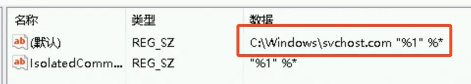

常常在受害 Windows 主机上发现的一种病毒。

<!--more-->

## 背景

Neshta 感染型病毒（`Virus/Win32.Neshta`）会在 `%SystemRoot%` 目录下释放 `svchost.com` 文件（与系统程序 `svchost.exe` 混淆），并通过添加注册表使所有 exe 文件执行时都会先执行这个文件。病毒执行时会用恶意代码覆盖原 exe 文件的部分数据，这部分数据会被异或加密，随后解密以保证原文件的正常执行。同时该病毒还存在系统信息收集、外联远程服务器等行为。

病毒原理及样本详见：[Win32.Neshta.41472感染型木马记录以及修复分析及其核心加密算法](https://www.52pojie.cn/thread-1524342-1-1.html)

对于云上主机，感染这一类型病毒时，可以优先考虑使用快照恢复；无法使用快照恢复时，可以尝试使用下面的方法进行恢复，但需要注意清理工具可能导致相关 exe 文件内容被清空或无法正常运行，使用前需要确保存在有效的回滚措施。

## 清理步骤
1. 运行 regedit 打开注册表编辑器，导航到 `\HKEY_CLASSES_ROOT\exefile\shell\open\command`，可以发现默认值被改为 `C:\Windows\svchost.com "%1" %*`：

将其恢复为原本的值 `"%1" %*`。

2. 删除文件 `C:\Windows\svchost.com`，随后不要手动打开任何被感染的 exe 文件，打开可能导致该病毒重新生成
3. 运行清理工具，注意观察结果，修复失败的 exe 文件需要手动替换为原始 exe 文件
4. 检查 `\HKEY_CLASSES_ROOT\exefile\shell\open\command` 的值是否依然为 `"%1" %*`，如果不是则需要从头开始
5. 检查 `C:\Windows\svchost.com` 是否仍存在，如果存在则需要从头开始
6. 检查修复的 exe 文件是否正常运行

## 清理工具

- 吾爱破解的 [Win32.Neshta.41472感染型木马记录以及修复分析及其核心加密算法](https://www.52pojie.cn/thread-1524342-1-1.html) 中提供了一个用户自制的清理工具
- 奇安信也提供了类似的 [专杀工具](https://www.qianxin.com/other/qaxvirusremoval)
